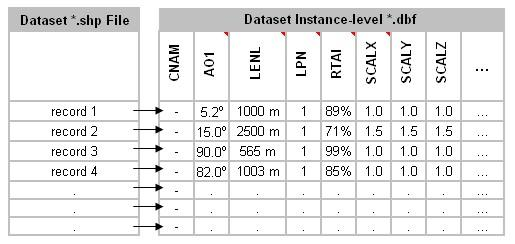
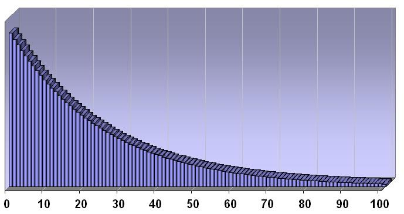
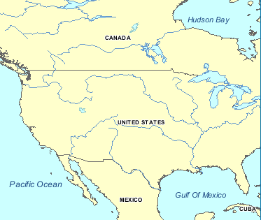

:figure-caption: Figure 5-
:figure-num: 0

[[CDBDatasets]]
== CDB Datasets

This chapter provides the description of the content of datsets in a CDB data store, except OpenFlight and RCS models that are covered in separate documents (Volumes 5 and 6 of this standard). Chapter 5 also provides the Component Selectors necessary to complete the file names associated with all CDB datasets

[[ControlledVocabulariesandMetadataDatasetsusedbyCDB]]
=== Controlled Vocabularies and Metadata Datasets used by CDB

This clause provides details on the requirements and guidance for the various global and local metadata files that can be used in a CDB data store. As mentioned above, controlled vocabularies are agreements on how to define the concepts and relationships (also referred to as “terms”) used to describe and represent an area of concern. Controlled vocabularis define the structure, naming hierarchies, default values, allowable values, and status of terms used globally in a CDB data store.

Currently, the majority of CDB controlled vocabularies, enumerations, and metadata files are formatted using eXtended Markup Language (XML) files and their XML schemas can be found in the \CDB\Metadata\Schema\ folder delivered with the CDB standard. The exceptions are the global and local geospatial metadata files which may be XML schema, JSON, JSON schema, or some other internationally recognized coding.

[[GlobalMetadata]]
==== Global Metadata

Global metadata is data, such as version, that is global to an entire CDB data store instance. Individual file sets, tiles, and other resources in a CDB data store may also have metadata. These resources are termed “local” metadata (see 5.1.2 below). The majority of the files stored in the \CDB\Metadata\Schema\ folder are global metadata and controlled vocabularies and as such are relevant to the entire CDB data store. The file name for global metadata (including geospatial and temporal elements) is “Global_Metadata” and is stored in the metadata schema folder.

==== Local Metadata

Local refers to metadata specific to a given dataset within a CDB data store. This level of metadata is the minimum core for geospatial datasets regardless of the specific geospatial subject (i.e., vector, raster (imagery) and sensor). Metadata at this level is designed to assist in discovery, retrieval and semantic description of the data. Dataset level metadata is typically stored at the model or tile level. For example, while all tiles for a given layer may have the same metadata, discovery and indexing is facilitated by having the metadata stored at the tile level. For example, if there is a buildings layer in the CDB data store, each tile for this layer could include metadata specific to the buildings layer. Any tiled data as specified in CDB Clause 3.6.1 could have metadata provided at the tile level. All the current rules for defining the tile structure and naming conventions are the same as for previous version of the CDB standard/specification. The only change is that if there is metadata at the dataset tile level than an additional file of metadata shall be stored in appropriate directory/folder. Please see the examples in Section 3.0.

For example, Clause 3.6.3.1.1 provides an example of the name of an elevation file in a given tile. The example from that section is:

The primary elevation data corresponding to this coordinate will be found in the file named:

```
    S06E045_D001_S001_T001_L02_U3_R0.tif”
```

If there are metadata for the elevation dataset, then perhaps this example is expanded to:

“The primary elevation data and geospatial metadata corresponding to this coordinate will be found in the file named:

```
    S06E045_D001_S001_T001_L02_U3_R0.tif

    S06E045_D001_S001_T001_L02_U3_R0_mtd.xml
```

The associated metadata file is specified by using a “_mtd” addition to the base file name and then followed by the <.ext> file type designation which in the above case is “.xml”. Another example for a ShapeFile might be:

If ShapeFiles are being used, this approach results in the following file names:

```
    N62W162_D100_S001_T001_L07_U38_R102.shp

    N62W162_D100_S001_T001_L07_U38_R102.shx

    N62W162_D100_S001_T001_L07_U38_R102.dbf

    N62W162_D100_S001_T001_L07_U38_R102.dbt

    N62W162_D100_S001_T001_L07_U38_R102_mtd.xml
```

include::requirements/requirements_class012.adoc[]

The table below lists all metadata files that are allowed and defined by the CDB standard. Note that a dataset code and component selectors are assigned to each metadata file even though these codes do not participate in the construction of their file names. Dataset codes are assigned to metadata datasets for consistency with all other CDB Datasets.

[#table_ComponentSelectorsforCDBControlledVocabulariesandMetadataDatasets*,reftext='{table-caption} {counter:table-num}']
*Table 5-1: Component Selectors for CDB Controlled Vocabularies and Metadata Datasets*
[cols=",,",]
|===============================================================
|*CS1* |*CS2* |*File Name*
|Dataset 700, Metadata | |
|001 |- |Lights.xml
|002 |- |Model_Components.xml
|003 |- |Materials.xml
|004 |- |Defaults.xml
|005 |- |Specification_Version.xml (Deprecated)
|006 |- |Version.xml
|007 |- |CDB_Attributes.xml
|008 |- |Geomatics_Attributes.xml (optional and vendor supplied)
|009 |- |Vendor_Attributes.xml (optional and vendor supplied)
|010 |- |Configuration.xml
|011 | |Global_Metadata
|Dataset 701, Client-Specific Metadata | |
|- |- |Lights_xxx.xml
|===============================================================

For client-specific metadata, the standard only reserves one dataset code but no component selector. The mechanism is kept for backward compatibility with previous versions of the CDB standard. However, its use is strongly discouraged because it defeats the very intent of the CDB, which is to promote correlation between client devices by having a single source of data.

[[LightDataHierarchyControlledVocabulary]]
==== Light Data Hierarchy Controlled Vocabulary

The light name hierarchy for a CDB compliant data store is described in detail within the table found in Volume 2 OGC CDB Core Model and Physical Structure Annexes - Annex J - of this standard. For run-time access of this data, clients need to retrieve such information. To this end, the Lights Hierarchy Definition metadata is stored in an XML file in the metadata CDB directory as described in Section 3.1.1, Metadata Directories. The name of the file is “*Lights.xml.*”

The XML file provides a description of the entire naming hierarchy, including the hierarchical relationship of the levels with respect to each other and the position of each light type within this hierarchy. In addition to the name of each light type, the “*Lights.xml*” file contains a unique code with each light type.

In the case of light features (Airport Features - Lights and Environmental Lights tiled datasets), the light type code provides a storage-efficient means to attribute each light, since only the code is used to attribute light features. Data processing tools are required to map the light type name string provided by the modeler into a light type code.

NOTE: In the case of light features that are part of OpenFlight models, the light type name string provided by the modeler is used “as-is” within the model to attribute each of the light features.

Client-devices are required to internally build and initialize a table of light properties and characteristics for their respective use. This table could be indexed at runtime using the light type code. The table can be built at CDB data store load time and should match the device’s inherent capabilities and level-of-fidelity; this flexibility can be achieved because the “*Lights.xml*” file communicates the lights naming hierarchy to the client-devices.

The client-devices are required by the CDB standard to ensure that properties and characteristics of lower-tier names in the light point hierarchy inherit the properties and characteristics of the higher-tier names in the light name hierarchy. This feature allows modelers to add new light names to the light name hierarchy and be assured that the new light names will immediately inherit all of the properties and characteristics of the parent names even if the simulator vendor does not update any of the client-devices.

The light type code can range from *0 to 9,999*. The light type codes are used by the Airport Features - Lights and Environmental Lights tiled datasets of the CDB. It is up to the CDB creation tools to ensure that the light type code does in fact correspond to the light type name assigned by the modeler.

Below is a small sample of the CDB light name hierarchy in XML format.

```
<Lights>
  <Light type="Light" code="0">
    <Description>
      All Purpose Generic light
    </Description>
    <Light type="Platform" code="1">
      <Description>
        Platform light
      </Description>
      <Light type="Air" code="2">
        <Description>
          Aircraft light
        </Description>
        <Light type="Aircraft_Helos" code="3">
          <Description>
            Light for Aircraft and Helicopters
          </Description>
          <Light type="Anti-collision" code="4">
            <Description>
              Anti collision light – normally red flashing
            </Description>
            <Light type="Bottom_Light" code="5">
              <Description>
                Anti-collision found on bottom of the fuselage
              </Description>
              <Light type="NVG_Bottom_Light" code="6">
                <Description>
                  Anti-collision found on bottom of fuselage in NVG mode
                </Description>
              </Light>
            </Light>
          </Light>
      ... other light definitions of type Platform-Air-Aircraft_Helos
        </Light>
    ... other light definitions of type Platform-Air
      </Light>
  ... other light definitions of type Platform
    </Light>
  </Light>
</Lights>

```

Note that light code numbering need not be consecutive. Light codes have a one-to-one association with light types; consequently, the light codes are unique among all light types.

[[ClientSpecificLightsDefinitionMetadata]]
===== Client Specific Lights Definition Metadata

Client-devices use the light type code as an index to lookup the client-specific properties and characteristics of each light type. This approach is client-device independent because the (device-specific) client’s rendering parameters are local to its implementation. As a result, modelers need not bother setting or even understanding the many parameters specific to each light type and to each client-device type.

The CDB standard also offers a complementary approach to modifying the appearance of lights. This approach provides basic control over light intensity, color, lobe width and aspect, frequency and duty cycle to client devices. The approach also permits a modeler to add new light types to the CDB light hierarchy.

_Example:_

As an example, we will create a client-specific lights definition metadata file for a hypothetical client-device. The information would be held in the Lights_xxx.xml metadata file corresponding to the client-device for which lights are to be tuned. There can be one file per client-device and the file for each client-device is optional. The file is not required if the modeler does not wish to adjust the basic characteristics of one or more light types for the associated client-device, or he/she doesn’t require new light types to be added to the CDB light hierarchy. The metadata file would be loaded by the client-device whose name matches the “xxx” character string of the Lights_xxx.xml file. As for the Lights, the file would be located at the top of the CDB storage hierarchy in directory \CDB\Metadata\ as described in Section 3.1.1, Metadata Directories.

Nominally, the Lights_xxx.xml consists of light type entries corresponding to the light types the modeler wishes to add/modify. Each entry in the Lights_xxx.xml file consists of one or optional fields.

Consider the case of a simulator equipped with a client-device rendering simulated imagery for model “A” NVG goggles and a second client-device rendering simulated imagery for model “B” NVG goggles. After viewing the CDB on the simulator, the modeler wishes to diminish the intensity of the \Lights\Cultural\Line-based\Highway lights for model “A” NVG goggles to 90% of the intensity calculated by the simulator. To do this, the modeler creates a Lights_NVG_A.xml, creates a light type entry for \Lights\Cultural\Line-based\Highway and provides an intensity field with value of 0.9. Note that all other characteristics of the light type in this client-device are unaffected since the modeler did not provide additional fields. Furthermore, the characteristics of the light type in all other client-devices remain unaffected since the modeler did not provide other Lights_xxx.xml files.

The XML schema for the fields of the Lights_xxx.xml is delivered with the standard in \CDB\Schema\Lights_Tuning.xsd. The fields are as follows.

* _Intensity:_ When a light type is non-native to the CDB standard, which means that it is without a corresponding entry in Annex J Intensity represents the light point intensity for the client-device (range normalized from 0.0 to 1.0). When the light entry is native to the CDB standard, Intensity is used as a floating-point intensity modifier that multiplies the intensity calculated by the client-device. In both cases, Intensity defaults to a value of 1.0.
* _Color:_ When a light type is non-native to the CDB standard, Color is a floating-point RGB triplet that represents the color of the light type for the client-device (range normalized from 0.0 to 1.0). When the light entry is native to the CDB specification, Color is a floating-point RGB triplet that multiplies the RGB value calculated by the client-device. Color applies only to visual system client-device types. If absent in a light type entry, Color defaults to a value of white (1.0, 1.0, 1.0).
* _Directionality:_ A string that categorizes the light type as “Omnidirectional”, “Directional” or “Bidirectional”. If absent in a light type entry, Directionality defaults to the value “Omnidirectional.”
* _Lobe_Width:_ Represents the identifying section for the light’s lobe width characteristics, which can have a horizontal and vertical attribute.
** _Horizontal:_ When a light type is non-native to the CDB specification, the Horizontal field represents the light point’s half-intensity horizontal lobe width for the client-device (range from 0.0 to 360.0). When the light entry is native to the CDB standard, Horizontal field is used as a floating-point modifier that multiplies the horizontal lobe width calculated by the client-device. Applies only to Directional and Bidirectional light types. If absent in a light type entry, Horizontal field defaults to a value of 1.0.
** _Vertical:_ When a light type is non-native to the CDB standard, Vertical field represents the light point’s half-intensity vertical lobe width for the client-device (range from 0.0 to 360.0). When the light entry is native to the CDB standard, Vertical field is used as a floating-point modifier that multiplies the vertical lobe width calculated by the client-device. This applies only to Directional and Bidirectional light types. If absent in a light type entry, Vertical field defaults to a value of 1.0.
* _Residual_Intensity:_ When a light type is non-native to the CDB standard, Residual_Intensity represents the residual intensity of the light. Residual intensity is the intensity of the light (range normalized from 0.0 to 1.0) outside of the lobe defined by Lobe_Width:Horizontal and Lobe_Width:Vertical fields. When the light entry is native to the CDB specification, Residual_Intensity is used as a floating-point modifier that multiplies the residual intensity calculated by the client-device. This applies only to Directional and Bidirectional light types. If absent in a light type entry, Residual_Intensity defaults to a value of 1.0.
* _Frequency:_ A floating-point value greater than or equal to 0.0 that sets the blink or rotating frequency of the light in Hertz (cycles per second). A value of 0.0 disables all blinking and rotating properties. If absent in a light type entry, Frequency defaults to a value of 0.0.
* _Duty_Cycle:_ A floating-point value ranging from 0.0 to 1.0 that sets the duty cycle of the light. Duty cycle is defined as the percentage of time the light is turned on over a complete cycle. A value of 0.0 permanently turns the light off. A value of 1.0 turns it on. The value is ignored if Frequency = 0.0. If absent in a light type entry, Duty_Cycle defaults to a value of 0.5.

Here is a sample of a _Lights_xxx.xml_ file where a modeler has exercised explicit control over the properties of an anti-collision light and a landing light.

```
<Lights_Tuning>
  <Light type="\Light\Platform\Air\Aircraft_Helos\Anti-collision">
    <Description>Tuned for MH-47 CMS</Description>
    <Intensity>0.75</Intensity>
    <Color>1.0 0.0 0.0</Color>
    <Directionality>Omnidirectional</Directionality>
    <Frequency>0.5</Frequency>
    <Duty_Cycle>0.2</Duty_Cycle>
  </Light>
  <Light type="\Light\Platform\Air\Aircraft_Helos\Landing">
    <Description>...</Description>
    <Intensity>1.0</Intensity>
    <Color>1.0 0.9 0.9</Color>
    <Directionality>Directional</Directionality>
    <Residual_Intensity>0.05</Residual_Intensity>
    <Lobe_Width>
      <Horizontal>30.0</Horizontal>
      <Vertical>25.0</Vertical>
    </Lobe_Width>
  </Light>
</Lights_Tuning>
```

[[ModelComponentsDefinitionFile]]
==== Model Components Definition File

The CDB standard provides the means to unambiguously tag any portions of a 3D model (moving model or cultural feature with a modeled representation) with a descriptive name. Component model names are stored in the model components definition file, “\CDB\Metadata\Model_Components.xml” as described in Section 3.1.1, Metadata Directories. The XML file containing the CDB Model Components is part of the CDB standard distribution package. The XML schema is provided in \CDB\Metadata\Schema\Model_Components.xsd delivered with the standard.

The following shows a content sample of the model component definition file:

```
<Model_Components>
  <Component name="Artillery_Gun">
    <Description>
      1) Refers to any engine used for the discharge of large
         projectiles and served by a crew of men.
      2) Cannon-like weapons operated by more than one person.
    </Description>
  </Component>
  <Component name="Windshield">
    <Description>
      A transparent screen located in front of the occupants of a
      vehicle to protect them from the wind and weather.
    </Description>
  </Component>
 ... other components
</Model_Components>
```

[[BaseMaterialsTable]]
==== Base Materials Table

CDB Base Materials are listed in \CDB\Metadata\Materials.xml and stored in an XML file named \CDB\Metadata\Materials.xml, as mentioned in section 3.1.1. The format of the file is defined by an XML schema that is delivered with the CDB standard in the file named \CDB\Metadata\Schema\Base_Material_Table.xsd.

Here is an excerpt of the CDB Base Material Table showing the definitions of the first and the last base materials of the standard.

```
<Base_Material_Table>
  <Base_Material>
    <Name>BM_ASH</Name>
    <Description>
      The solid remains of a fire
    </Description>
  </Base_Material>
...
  <Base_Material>
    <Name>BM_WOOD-DECIDUOUS</Name>
    <Description>
      Trunks, branches of live deciduous trees
    </Description>
  </Base_Material>
</Base_Material_Table>
```

[[DefaultValuesDefinitionTable]]
==== Default Values Definition Table

Default values for all datasets can be stored in the default values metadata file “\CDB\Metadata\Defaults.xml” as described in Section 3.1.1, Metadata Directories. Default values defined throughout the CDB standard are listed in Annex S OGC CDB Core: Model and Physical Structure: Informative Annexes. The XML schema is provided in \CDB\Metadata\Schema\Defaults.xsd delivered with the standard. There are two types of default values: read and write default values (‘R’ or ‘W’.) Generally, read default values are values to be used when optional information is not available. Write default values are default values to be used by CDB creation tools to fill mandatory content when information is either missing or not available. The default value name is a unique name identifying a default value for a given dataset. Valid default value names are listed in Annex S. Each default value has a type. Valid default value data types are “float”, “integer” and “string.”

The following is an excerpt of a “Defaults.xml” file containing the default terrain elevation value.

```
<Default_Value_Table>
  <Default_Value>
    <Dataset>001_Elevation</Dataset>
    <Name>Default_Elevation-1</Name>
    <Description>Default Primary Terrain Elevation</Description>
    <Type>float</Type>
    <Value>0.0</Value>
    <R_W_Type>R</R_W_Type>
  </Default_Value>
  <!-- Insert other Default Values in accordance to the table above -->
</Default_Value_Table>
```

[[VersionMetadata]]
==== Version Metadata

include::requirements/REQ074.adoc[]

The complete XML schema can be found in \CDB\Metadata\Schema\Version.xsd delivered with the standard. The entries are now described.

The optional _<PreviousIncrementalRootDirectory>_ element is used to refer to another CDB Version. This is the mechanism to use to chain together two CDB versions.

The optional _<Comment>_ element is a free-format text to describe the purpose and/or the nature of the data of this CDB Version.

The mandatory _<Specification>_ element indicates the version of the CDB standard that is used to produce the content of this CDB Version. Note that version numbers of the standard are limited to the existing versions: 1.0, 1.1, 3.2, 3.1, and 3.0. Other values are not permitted.

The optional _<Metadata standard="metadata-standard-name">_ element specifies the metadata standard used in a CDB data store. The metadata standard specifically refers to traditional resource metadata, such as “title”, “author” and “geographic bounding box”. “metadata-standard-name” is the acronym of the standard being used. Currently allowed metadata standards and their acronym names are provided below:

[cols=",",options="header",]
|===
|*Acronym* |*Full Title*
|_ISO-http://ogc.standardstracker.org/show_bug.cgi?id=439#c19115[19115]:http://ogc.standardstracker.org/show_bug.cgi?id=439#c2014[2014]_ |Geographic information -- Metadata -- Part 1: Fundamentals footnote:[https://www.iso.org/standard/53798.html]
|_ISO-http://ogc.standardstracker.org/show_bug.cgi?id=439#c19115[19115]:http://ogc.standardstracker.org/show_bug.cgi?id=439#c2003[2003]_ |Geographic information -- Metadata footnote:[https://www.iso.org/standard/26020.html]
|_DDMS-5.0_ |DoD Discovery Metadata Specification footnote:[https://www.ise.gov/sites/default/files/Track1-PeteAttas-WIS3-DDMSOverview.pdf]
|_DDMS-http://ogc.standardstracker.org/show_bug.cgi?id=439#c5[5].http://ogc.standardstracker.org/show_bug.cgi?id=439#c0[0]-M&S-Profile_ |
|_DCAT_ |Data Catalog Vocabulary footnote:[https://www.w3.org/TR/vocab-dcat/]
|_DCAT-AP_ |DCAT Application Profile footnote:[https://data.gov.ie/openstandard/dcat-ap]
|GeoDCAT-AP footnote:[https://joinup.ec.europa.eu/node/139283] |https://joinup.ec.europa.eu/release/geodcat-ap-v10#download-links[GeoDCAT-AP] is an extension of https://joinup.ec.europa.eu/release/dcat-ap-v11[DCAT-AP] for describing geospatial datasets, dataset series, and services.
|NGCMP footnote:[National System for Geospatial Intelligence (NSG) Geospatial Core Metadata Profile _www.gwg.nga.mil/documents/NSG_Geo_Core_MD_Profile.doc_] |National System for Geospatial Intelligence (NSG) Geospatial Core Metadata Profile
|_NoMetadata_ |
|===

NOTE: In a CDB data store, there are two categories of metadata: Global and Local. _Global_ metadata is comprised of metadata that describes an entire CDB data store. _Local_ refers to metadata specific to a given dataset within a CDB data store. Dataset level metadata is stored at the tile or model definition level. While all tiles for a given layer may have the same dataset level metadata, discovery and indexing is facilitated by having the metadata stored at the tile level. For example, if there is a buildings layer in the CDB datastore, each tiles for this layer could include metadata specific to the buildings layer.

Special NOTE: If there is a difference betweent the Global metadata and the dataset metadata, the dataset metadata shall be considered as authoritive.

The optional _<Extension>_ element indicates that this CDB Version is in fact a CDB Extension.

A version control file that does not have a CDB Extension indicates that the CDB Version holds content that strictly follows the CDB standard.

A CDB Extension corresponds to user defined information, which is not described or supported by the CDB standard, stored within the CDB Version. As an example, such additional information could be client or vendor-specific information used to increase system performance. Any user defined information _shall_ not replace or be used in place of existing CDB information. A CDB Extension should only contain vendor or device specific information. CDB content adhering to the CDB standard should only be found in the CDB versions. Client devices not concerned with a CDB extension should ignore all non-CDB compliant content, without loss of information.


[[CDBAttributesMetadata]]
==== CDB Attributes Metadata

The CDB attributes are listed and described in section 5.7.1.3 CDB Attributes. The metadata for these attributes is stored in \CDB\Metadata\CDB_Attributes.xml and the schema can be found in \CDB\Metadata\Schema\Vector_Attributes.xsd. In essence, the file is the transposition of the text found in section 5.7.1.3 CDB Attributes into a format more appropriate for a computer program.

Its contents are as follows:

```
<Vector_Attributes>
  <Attributes>
    <Attribute>...</Attributes>
    ...
    <Attribute>...</Attributes>
  </Attributes>
  <Units>
    <Unit>...</Unit>
    ...
    <Unit>...</Unit>
  </Units>
  <Scalers>
    <Scaler>...</Scaler>
    ...
    <Scaler>...</Scaler>
  </Scalers>
</Version>
```

The file is composed of three majors sections, the first one being the most important. The file has a list of attributes, followed by two lists of units and scalers that are referenced by individual attribute.


[[DefinitionoftheAttributeElement]]
===== Definition of the <Attribute> Element

include::requirements/REQ075.adoc[]

The code is the integer value assigned to each attribute listed in section 5.7.1.3, CDB Attributes. The symbol is the unique character string identifying the attribute. The <Name> is the long form of the symbol. The <Description> is a free form text describing the attribute. The <Level> is defined below and provides the schema level of the attribute. The <Value> element provides the information required to interpret (parse) the value assigned to this attribute.

include::requirements/REQ076.adoc[]

include::requirements/REQ077.adoc[]

In the case of a numeric datatype, the <Format> indicates if it is a _Floating-Point_ or an _Integer_ value. For a floating point type, the <Precision> provides the number of digits before and after the decimal point. For numeric types, the <Range> provides the minimum and maximum values; the <Unit> is a reference to a unit code; and the <Scaler> is a reference to a scaler code; both codes being respectively defined in subsequent <Units> and <Scalers> sections.


[[DefinitionoftheUnitElement]]
===== Definition of the <Unit> Element

include::requirements/REQ078.adoc[]

[[DefinitionoftheScalerElement]]
===== Definition of the <Scaler> Element

include::requirements/REQ079.adoc[]

[[ExampleofCDB_Attributesxml]]
===== Example of CDB_Attributes.xml

The following example illustrates how to define an attribute:

```
<Vector_Attributes>
 <Attributes>
   <Attribute code="2" symbol="AO1">
     <Name>Angle of Orientation</Name>
     <Description>Angle of Orientation with greater than 1 degree resolution.
       The angular distance measured from true north (0 deg) clockwise to the
       major (Y) axis of the feature. If the feature is square, the axis 0
       through 89.999 deg shall be recorded. If the feature is circular, 360.000
       deg shall be recorded.
     </Description>
     <Level>
       <Instance>Preferred</Instance>
       <Extended>Supported</Extended>
     </Level>
     <Value>
       <Type>Numeric</Type>
       <Format>Floating-point</Format>
       <Precision>3.3</Precision>
       <Range interval="Right-Open">
         <Min>0</Min>
         <Max>360</Max>
       </Range>
       <Unit>2</Unit>
     </Value>
   </Attribute>
 </Attributes>
<Units>
   <Unit code="2" symbol="deg">
     <Name>degree</Name>
     <Description>To measure an angle</Description>
   </Unit>
 </Units>
 <Scalers>
   <Scaler code="2" symbol="k">
     <Name>kilo</Name>
     <Description>A multiplier: thousand</Description>
     <Multiplier>1000</Multiplier>
   </Scaler>
 </Scalers>
</Vector_Attributes>
```

The schema explains the use of the interval attribute of the <Range> element.

include::requirements/REQ080.adoc[]

[[GeomaticsAttributesMetadata]]
==== Geomatics Attributes Metadata

This is an optional metadata XML file. This XML file is not included with the CDB distribution schema package. This file is necessary only if Geomatics attributes are used to create Extended Attributes (see 5.7.1.2.7.3 of Volume 1). Geomatics_Attributes.xml and Vendor_Attributes.xml define the attributes that are referenced in the EAC column of the Extended Attributes tables (see 5.7.1.2.7.4). The intent behind those XML Attribute files is to provide the data necessary to interpret Environment Attribute Codes (EAC) and Environment Attribute Values (EAV). Geomatics attributes (section 5.7.1.2.6.2), are listed in “*Geomatics_Attributes.xml*” (section 3.1.1). The file uses the Geomatics_Attributes.xsd schema.

[[VendorAttributesMetadata]]
==== Vendor Attributes Metadata

This is an optional metadata XML file. This XML file is not included with the CDB distribution schema package. This file is necessary only if Vendor attributes are used to create Extended Attributes (see 5.7.1.2.7.3 of Volume 1). Geomatics_Attributes.xml and Vendor_Attributes.xml define the attributes that are referenced in the EAC column of the Extended Attributes tables (see 5.7.1.2.7.4). The intent behind those XML Attribute files is to provide the data necessary to interpret Environment Attribute Codes (EAC) and Environment Attribute Values (EAV). Vendor attributes (section 5.7.1.2.6.3), are listed in “*Vendor_Attributes.xml*” (section 3.1.1). The file uses the Vendor_Attributes.xsd schema.

[[GeospatialMetadataGuidance]]
==== Geospatial Metadata – Guidance

These are optional metadata files. This file is not included with the CDB distribution schema package.

Most metadata standards specify dozens of possible elements, such as author, that can be specified in a metadata encoding. This is why in many communities there are profiles that are applicable to the information sharing and discovery requirements of that community. For example, there are numerous profiles of ISO 19115:2013 Geographic information – Metadata. These include the INSPIRE, Defence NSG Geospatial Core metadata, and FGDC profiles. As such, the CDB standard does not specify mandatory and/or optional metadata elements. Instead, a suggested set of minimal metadata elements are provided. The two lists – one for global and one for local – are based on an evaluation of mandatory elements in eight widely implemented metadata standards that are used in the geospatial and simulation communities. The one requirement is that all local metadata in a CDB data store provides the same mandatory elements as defined in the metadata standard specified in the Version metadata.

These following two sub-clauses recommend the metadata elements for global and local metadata. The use of F.1 refers to Table F.1 in ISO 19115-1:2014. Each element is identified by a general string followed by two element names The first name is the DCAT name followed by the ISO 19115:2014 element name.


[[SuggestedGlobalGeospatialMetadataElements]]
===== Suggested Global Geospatial Metadata Elements

Resource Identifier (dct:identifier, MD_Metadata.metadataIdentifier): A unique identifier for the entire CDB data store instance. This identifier is persistent and is considered global metadata. For example, this could be a Digital Object Identifier (DOI). The *DOI* system provides a framework for persistent identification of electronic resources management of intellectual content, managing metadata, linking customers with content suppliers, facilitating electronic commerce and enable automated management of media.

Resource Title (http://purl.org/dc/terms/title[dct:title], CI_Citation.title): Title by which the resource is known (Table F.1). For global metadata for a CDB data store, this would be a name given to the entire data store. For example, this could be “Yemen demonstration CDB data store.”

Resource point of contact (dcat:contactPoint, (MD_Metadata.contact/CI_ResponsibleParty): Name of the person, position, or organization responsible for the resource. (Table F.1). This is a text string. An example of a resource point of contact could be “Flight Safety” or “CAE.”

Resource reference date (dct:issued, CI_Citation.date): A date which is used to help identify the resource. (Table F.1). For global metadata, this is the date that the CDB data store was created or issued.

Resource Language (dct:language, PT_Locale): The language and character set used in the resource (if a language is used). (Table F.1) NOTE: We should recommend use of ISO 639-2 . For example, for English, the code would be “ENG.”

Geographic Location (dct:spatial, EX_GeographicBoundingBox): Geographic description or coordinates (latitude/longitude) which describes the location of the resource. Note: I think for the CDB standard that the definition should be narrowed to the bounding box of the contents of the data store. (Table F.1). We should also follow guidance from OGC OWS Common. See also 19115 annex B.3.1.2 Geographic extent information.

Resource abstract (dct:description footnote:[DCAT does not have a concept “abstract”. Use description instead.], MD_DataIdentification.abstract): A brief description of the content of the resource (Table F.1).

Metadata date stamp (dct:issued, MD_Metadata.dateInfo): Reference date(s) for the metadata, especially creation. (Table F.1). Note: Date gives values for year, month and day. Character encoding of a date is a string which shall follow the format for date specified by ISO 8601. This class is documented in full in ISO/TS 19103.

Temporal Extent information for the dataset (dct:temporal, EX_TemporalExtent): The temporal extent of the resource. For a CDB data store, this would be the temporal range of when the data store was initially created to the point where the most recent content was created.

Constraints on resource access and use (dct:accessRights, MD_SecurityConstraints): Security restrictions on the access and use of the resource. These would be constraints for an entire CDB data store. This could be information necessary to generate an EDH compliant encoding.

Constraints on resource access and use (dct:license, MD_LegalConstraints): A sub-class of all access constraints. These legal constraints include copyright, patent, patent pending, trademark, license, Intellectual Property Rights, restricted, and other. At the global level, these are legal constraints applicable to an entire CDB data store.

===== Suggested Local Geospatial Metadata Elements

Local Geospatial metadata can be stored in a number of different folder locations based on the data resource (data set) for which the metadata is associated. For instance, metadata for vector data will be stored at the LoD/tile level. Metadata for a moving model would be stored in the same folder using the same path name as the actual model definition. See Clause 5.1.2 above for examples.
+
While the same metadata elements are recommended for both global and local geospatial metadata, there are some differences that should be considered.
+
_Metadata Reference Information_ (dct:identifier, MD_Metadata.metadataIdentifier) This is a unique identifier for the dataset. In CDB, this could be the pathname to the dataset or the tile. These pathnames are unique. Using such identifers would facilitate development of a RESTful API for discovery and access of CDB resources.
+
_Resource Title_ (http://purl.org/dc/terms/title[dct:title], CI_Citation.title): Title by which the data set is known (Table F.1). For local metadata, this could be a name given to a layer or model in the data store. In a CDB data store, at the dataset or tile level this would be a name given to the resource, such as “county soils.”
+
_Resource point of contact_: Name of the person, position, or organization responsible for the resource. This is a text string. An example of a resource point of contact for the content for a given layer and tile could be “Ordnance Survey.”
+
_Resource reference date_ (dct:issued , CI_Citation.date): A date which is used to help identify the resource. For local metadata, this could the date that the tile content was created in the CDB data store or the date a moving model was added to the data store
+
_Spatial Resolution Information_ (No equivalent, MD_Identification.spatialResolution): The nominal scale and/or spatial resolution of the resource. This description can include LoD information. Note: This is not precision! Precision is more about the number of decimal places and not the accuracy of the resource.

===== Where are local metadata files stored?

Typically, local metadata files will be stored with the physical data. For GTModel geotypical data sets, the metadata file would be stored along with the model XML file. If the model is stored in multiple LoDs, the metadata would also be stored at each LoD. For tiled vector data, the local metadata would be stored with the vector files at the tile level. Please see the esamples in Section 3.0 for more detail.

[[ConfigurationMetadata]]
==== Configuration Metadata

The Configuration metadata file provides the means of defining CDB Configurations. The syntax of the file is given below. The complete XML schema is provided in /CDB/Metadata/Schema/Configuration.xsd delivered with the standard.

```
<Configuration>
  <Comment> An optional comment describing this CDB Configuration. </Comment>
  <Version>
    <Folder path="..."/>
    <Comment> An optional comment describing this CDB Version. </Comment>
    <Specification version="..."authority="..."/>
    <Metadata standard=". . ."/>
    <Extension name="..." version="..."/>
  </Version>
  <!-- Other versions as needed -->
</Configuration>
```

A <Configuration> is a list of one or more <Version> elements. A <Version> has a mandatory <Folder> element to provide the path to the CDB Version. The other four (4) elements have the same definitions as that of section 5.1.8, Version Metadata.


[[ANoteaboutFolderPath]]
===== A Note about Folder Path

The use of a relative path to a CDB Version ensures a greater form of interoperability between operating systems and file systems. However, the CDB standard does not prevent the use of absolute paths footnote:[On Windows, the path can even be specified using the UNC notation.]. A relative path is expressed relative to the root of the CDB Version containing the Configuration file.


[[Example]]
===== Example

Assume that we want to assemble two CDB Versions into a single CDB Configuration. The first CDB Version is located in /CDB/myVersion and has the following Version.xml file.

```
<Version>
  <PreviousIncrementalRootDirectory name="/CDB/theVersion"/>
  <Comment> This is the comment describing myVersion. </Comment>
  <Specification version="1.1"authority="OGC"/>
   <Metadata standard="ISO-19115:2014"/>
</Version>
```

The second CDB Version complies with version 3.0 of the original CDB Specification (prior to submission to the OGC) and is located in /CDB/theVersion and has the following Version.xml file.

```
<Version>
  <Comment> This is the comment describing theVersion. </Comment>
</Version>
```

The resulting CDB Configuration is stored in /CDB/myConfiguration and its Configuration.xml file could look like this:

```
<Configuration>
  <Comment>
    This is an example of a CDB Configuration referring to two CDB Versions.
  </Comment>
  <Version>
    <Folder path="../myVersion"/>
    <Comment> This is the comment describing myVersion. </Comment>
    <Specification version="1.1"authority="OGC"/>
    <Metadata standard="ISO-19115:2014"/>
  </Version>
  <Version>
    <Folder path="../theVersion"/>
    <Comment> This is the comment describing theVersion. Notice that the version number is for a pre-OGC version of the CDB specification. </Comment>
    <Specification version="3.0"/>
    <Metadata standard="NoMetadata"/5-37>
  </Version>
</Configuration>
```

Notice the use of relative paths to refer to the CDB Versions. Also notice the addition of the <Specification> element to the second <Version> to explicitly state that it contains data complying with version 3.0 footnote:[Was Version 3.0 in the OGC Best Practice.] of the specification.

[[NavigationLibraryDatasets]]
=== Navigation Library Datasets

The NavData dataset represents the navigation portion of a CDB. NavData supports several simulation subsystems such as the Instrument Landing System (ILS), Inertial Navigation/Global Positioning System, and Microwave Landing System Communications. The dataset also provides descriptions of airspaces, airways, heliports, helipads, gates, runways, approaches, and terminals. The dataset also provides information regarding climb procedures out of airports.

`*Important note for version 1.2 and later*: In the https://docs.opengeospatial.org/per/19-007.html[OGC CDB Vector Data in GeoPackage Interoperability Experiment], OGC Members collaborated and tested the ability to use a variety of tools to convert CDB structured vector Shapefiles into CDB structured GeoPackages. The conversion tests were successful in that not conversion errors were encountered. However, the experiment did not include validating that the resulting GeoPackages could be successfully used in existing operational CDB deployments. Therefore the NavData clause in the CDB standard does not provide guidance on the use of GeoPackage and as such is still Shapefile specific. Future work will address this issue and make the ncessary changes to the CDB standard.`

include::requirements/requirements_class013.adoc[]

The NavData dataset is broken down into a collection of 46 (forty-six) components related to the Flight Navigation. Together, these 46 components combine all of the information currently provided by the following two organizations:

* Navigation System DataBase (produced by Jeppesen) around the ARINC Standard 424-16
* Product Standard for the Digital Aeronautical Flight Information File (DAFIF) produced by the National Geospatial Intelligence Agency (NGA)

The component selector 2 is set to 001 for basic navigation records and these files are located in the tiled Navigation dataset directories. The component selector 2 is set to 002 for schema files and a value between 101 and 126 for key datasets. Schema and key datasets are located in the global Navigation directory. Component selector 1 and the file type are as per Table 5-2: Tiled Navigation Dataset. This table provides a list of all CDB Navigation components with their designated names and description.

[#table_ComponentSelectorsforNavigationDataset,reftext='{table-caption} {counter:table-num}']
*Table 5-2: Component Selectors for Navigation Dataset*
[cols=",,,,",]
|===============================================================================================
|*CS1* |*CS2* |*File Extension* |*Component Name* |*Component Description*
|Dataset 400, NavData | | | |
|001-046 |002 |As appropriate |Schema |Lists the data attributes for the given component
| |101-126 |As appropriate |Key Dataset |Sorted lists used to perform queries within the NavData
|===============================================================================================

- T002: Schema file +
- T101: Storage number search key +
- T102: Ident search Key +
- T103: ICAO search Key +
- T104: Frequency search Key +
- T106: IATA search Key +
- T107: Type search Key +
- T108: Additional Ident 1 search Key +
- T109: Additional ICAO 1 search Key +
- T110: Channel search Key +
- T111: Additional Ident 2 search Key +
- T114: Range search Key +
- T115: Sequence search Key +
- T116: Country search Key +
- T117: Boundary search Key +
- T118: Code search Key +
- T120: Additional Ident 3 search Key +
- T121: Reserved +
- T122: Additional Type 1 search Key +
- T123: Additional ICAO 2 search Key +
- T126: Additional Ident 4 search Key

include::requirements/REQ081.adoc[]

[#table_ListofNavigationComponents,reftext='{table-caption} {counter:table-num}']
*Table 5-3: List of Navigation Components*
[cols=",,,",]
|===
|*Component Name* |*CS1* |*Shape Type* |*Component Description*
|Airport |1 |Point |Area or land that is used (or intended for use) for the landing and take-off of aircraft.
|AirRefueling |2 |Point |A specifically designated airspace where air-to-air refueling operations are normally conducted.
|AirRefuelingControl |3 |Point |Information regarding the Air Traffic Control Center that controls the airspace within which the refueling track or anchor is located.
|AirRefuelingFootnote |4 |Point |Supplemental notes defining an Air Refueling component
|AirRefuelingPoint |5 |Point |Single Point from an Air Refueling structure
|AirRefuelingSegment |6 |Multipoint |Segment from an Air Refueling structure
|AirspaceBoundary |7 |Point |Designated airspace within which some or all aircraft may be subject to air traffic control.
|AirwayRestriction |8 |Point |Altitude and time restrictions for airways, airway segments, or sequences of airway segments
|Approach |9 |Multipoint |Preplanned instrument flight rule (IFR) for air traffic control approach procedures.
|ArrestingGear |10 |Point |Safety device consisting of engaging or catching devices, and energy absorption devices for the purpose of arresting both tail hook and/or non-tail hook equipped aircraft
|COMMS |11 |Point |Voice, radio communications, and facility call sign and frequenciesavailable for same operations between the airport environment and aircraft.
|ControlAirspace |12 |Multipoint |Sequential listing of vertical and lateral limits, defining airspaces of different classifications, within which air traffic control service is provided
|EnrouteAirway |13 |Point |A specified route designed for channeling the flow of traffic as necessary for the provision of air traffic services
|FirUir |14 |Multipoint |Flight Information region – Upper Information Region. Designated airspace within which some or all aircraft may be subject to air traffic control.
|Gate |15 |Point |Passenger gate at an airport
|GLS |16 |Point |GNSS Landing System
|Helipad |17 |Line |Designated area usually with a prepared surface used for take-off and landing of helicopters
|Heliport |18 |Point |Area or land intended to be used for landing and takeoff of helicopters
|HoldingPattern |19 |Point |Flight path maintained by an aircraft that is awaiting permission to land
|ILS |20 |Multipoint |Instrument landing system – Precision instrument approach system normally consisting of electronic components and visual aids
|Marker |21 |Point |Transmitter that radiates vertically a distinctive pattern for providing position information to aircrafts
|MilitaryTrainingRoute |22 |Point |Routes used by the Department of Defense and associated Reserve and Air Guard Units for the purpose of conducting low altitude navigation and tactical training in both IFR and VFR weather conditions below 10,000 feet MSL at airspeeds in excess of 250 KTS IAS.
|MilitaryTrainingRouteAirspace |23 |Point |Special use airspace or military operations area associated with a Military Training Route
|MilitaryTrainingRouteDescription |24 |Point |Supplemental information regarding a Military Training Route
|MilitaryTrainingRouteOverlay |25 |Multipoint |The width left and right of centerline based on a set of widths at Point Ident and another set of width at the Next Point Ident in one segment record.
|MLS |26 |Multipoint |Microwave Landing System – precision instrument approach system normally consisting of electronic components and visual aids
|MSA |27 |Point |Minimum Safe Altitude - altitude below which it is hazardous to fly owing to presence of high ground or other obstacles
|Navaid |28 |Multipoint |Electronic device on the surface, which provides point-to-point guidance information or position data to aircraft in flight
|OffRouteTerrainClrAltitude |29 |Polygon |Off-Route Terrain Clearance Altitude - Clearance altitudes in non-mountainous and in mountainous areas
|ParachuteJumpArea |30 |Point |An area designated for parachute jumping activities.
|ParachuteJumpAreaBoundary |31 |Multipoint |Boundary of a Parachute Jump Area
|PathPoint |32 |Point |No description
|PreferredRoute |33 |Point |A system of routes designed to minimize route changes during the operational phase of flight and to aid in the efficient management of air traffic.
|PresetSite |34 |Point |Preset Site
|RestrictiveAirspace |35 |Multipoint |Airspace of defined dimensions identified by an area on the surface of the earth wherein activities must be confined
|Runway |36 |Line |Rectangular area on a land airport prepared for the landing and takeoff runs of aircraft along its length
|SID |37 |Multipoint |Standard Instrument Departure - preplanned instrument flight rule (IFR) for air traffic control departure procedure
|SpecialUse Airspace |38 |Point |Airspace of defined dimensions wherein activities must be confined because of their nature and/or wherein limitations may be imposed upon aircraft operations that are not a part of those activities.
|STAR |39 |Multipoint |Standard Terminal Arrival – preplanned instrument flight rule (IFR) air traffic control arrival procedure
|SupplTerminalData |40 |Point |Supplemental terminal data
|TerminalProcClimb |41 |Point |Terminal Procedure Climb - Min or ATC Climb rates
|TerminalProcFeedRoute |42 |Multipoint |Terminal Procedure Feeder Route – A route depicted on Instrument Approach Procedures to designate routes for aircraft to proceed from the en route structure to the Initial Approach Fix
|TerminalProcMin |43 |Point |Terminal Procedure Minima – Height minima data for Terminal Procedure
|VFRRoute |44 |Multipoint |Preplanned arrival or departure routes for helicopters or light fixed wing aircraft to specified airports or heliports using/in Visual Flight Rules (VFR
|VFRRouteSegment |45 |Multipoint |Segment of a VFR Route
|Waypoint |46 |Point |Predetermined geographical position, used for route or instrument approach definition or progress reporting purposes
|===

[[SchemaFiles]]
==== Schema Files

The schema file lists the data attributes for the given NavData component. It contains the following columns:

[#table_ListofNavigationSchemaAttributes,reftext='{table-caption} {counter:table-num}']
*Table 5-4: List of Navigation Schema Attributes*
[cols=",,,",]
|===
|*Attribute* |*Type* |*Length* |*Definition*
|ShortName |String |11 |A null-terminated string (ten characters or less). Short-hand name of the attribute used in the tiled vector datasets, (this restriction is for backwards compatibility with the dBASE III+ .dbf format which limits the field names to 10 characters or less)
|DataType |String |255 |The data type for the attribute
|KeyId |Int |4 |Index key for the attribute, used when performing a query. Not all attributes have an assigned index key, as only a few attributes can be used to perform a query. For each attribute with an index key, an index key dataset will be created.
|===

include::requirements/REQ082.adoc[]

Each attribute with an index Key (KeyId) has an index key dataset created. The index key dataset includes the last three characters of the KeyId inside the component selector 2 (ex. KeyId 2101 would be dataset component selector 2 – T101).

[[Example_0]]
===== Example

Here is the data content of the schema file for the Airport dataset (D400_S001_T002.dbf):

[#table_ExampleofaNavigationSchema,reftext='{table-caption} {counter:table-num}']
*Table 5-5: Example of a Navigation Schema*
[cols=",,",]
|====================================
|*ShortName* |*DataType* |*KeyId*
|StoraNumbe |Uint64 |2101
|AlterNam |String |
|AsCoStNumb |Uint64 |
|BeacoAvail |Bool32 |
|City |String |
|CivMilTyp |CivilMilitaryType |
|ClearStatu |ClearanceStatus |
|Country |CountryEntry |2116
|DayliTim |Float32 |
|DayTimFram |String |
|FlipPage |String |
|FuelType |String |
|HydElePres |Bool32 |
|IataCode |String |
|IcaoCode |String |2103
|Ident |String |2102
|IfrCapabil |Bool32 |
|IslanGrou |String |
|Jasu |String |
|LonRunLeng |Uint32 |
|LonRunSurf |PavementType |
|MagTruIndi |MagneticTrueIndication |
|MagneVaria |Float32 |
|MgrsPositi |String |
|Name |String |
|NavIcaCod |String |
|NavaiIden |String |
|Notam |NotamSystem |
|OilType |String |
|OperaAgenc |String |
|OperaHour |OperatingHours |
|Point1 |GeoCoordinate |
|Remark |String |
|ServiRemar |String |
|SpeedLimit |Uint32 |
|SpeLimAlti |Sint32 |
|StateName |StateEntry |
|SupFluTyp |String |
|TerraImpac |Bool32 |
|Timezone |Float32 |
|TransAltit |Sint32 |
|TransLeve |Sint32 |
|====================================

As per this example, four Airport attributes can be used to perform queries:

* StoraNumbe (key index 2101)
* Ident (key index 2102)
* IcaoCode (key index 2103)
* Country (key index 2116)

[[KeyDatasets]]
==== Key Datasets

The index Key Datasets are sorted lists used to perform queries within the NavData.

include::requirements/REQ083.adoc[]

[#table_ListofNavigationKeyAttributes,reftext='{table-caption} {counter:table-num}']
*Table 5-6: List of Navigation Key Attributes*
[cols=",,,",]
|==================================================================================================
|*Attribute* |*Type* |*Length* |*Definition*
|Value |String |255 |Value of the data attribute sorted in increasing order (numbers or characters)
|Lat ID |Signed Integer |3 |Latitude index of the Geocell which contains the data record
|Lon ID |Signed Integer |4 |Longitude index of the Geocell which contains the data record
|Row ID |Integer |4 |Index of the data record in the Geocell starting at 1.
|==================================================================================================

This information can then be used to rapidly lookup which CDB Tile contain the data in the pageable NAV dataset (401) and use the Object ID to access the data record in this dataset.

The Storage number is a Primary Surrogate key that uniquely identifies each record within each NAV dataset sub components.

[[Example_1]]
===== Example

include::requirements/REQ084.adoc[]

The following is an excerpt from the D400_S001_T102.dbf file (Key Dataset for the Ident attribute):

[#table_ExampleofNavigationKeys,reftext='{table-caption} {counter:table-num}']
*Table 5-7: Example of Navigation Keys*
[cols=",,,",]
|========================================
|*Value* |*Object ID* |*Lon ID* |*Lat ID*
|00CA |2 |-117 |35
|00UT |3 |-113 |37
|00WI |6 |-90 |44
|01LS |4 |-92 |30
|01MT |3 |-115 |48
|01WI |2 |-91 |44
|02P |0 |-78 |40
|03AZ |5 |-111 |31
|03CO |3 |-105 |40
|03GA |5 |-84 |31
|04CA |10 |-118 |34
|04MS |4 |-91 |32
|04NV |1 |-116 |35
|05CL |2 |-123 |38
|05LS |2 |-93 |31
|05UT |0 |-111 |37
|06FA |0 |-81 |26
|06MN |1 |-93 |47
|06MO |7 |-95 |39
|06TE |10 |-96 |30
|07FA |7 |-81 |25
|07MT |1 |-107 |48
|========================================

For example, the Airport with Ident 04CA will be found in the Geocell with southwest corner at N34:00:00/W118:00:00. NOTE: For Shapefile implementations this will be the 10th record in the corresponding Shapefile.

Here is an example of the Storage number being used as a reference between Navigation types:

* Type: Approach
* _
Attributions:
_
** StoraNumbe → Storage number (Approach)
** AirStoNumb → Airport storage number (referenced)

In this case, we see the Approach navigation type referencing the Airport navigation type by using the Airport Storage number.


[[CDBModelTextures]]
=== CDB Model Textures

The following table provides the Component Selectors associated with all kinds of textures that are usable on geotypical (GT), geospecific (GS), moving (MM), and tiled (T2D) models.

In the context of CDB model textures, the first component selector is known as the “Texture Kind” and the second component selector is simply called the “Texture Index”. Column 1 lists all texture kinds supported by the CDB standard. The second column gives the range of indices allowed for each kind.

[#table_ComponentSelectorsforCDBModelTextures,reftext='{table-caption} {counter:table-num}']
*Table 5-8: Component Selectors for CDB Model Textures*
[cols=",,,",]
|===
|*CS1 +
(Kind)* |*CS2 +
(Index)* |*Component +
Name* |*Component +
Description*
|001 |001 |Year-Round Texture |Base textures for year-round usage on model shells or general base textures for model interiors.
|002 |001..012 |Monthly Texture |Base textures for monthly usage on the shell of models (enumeration values in Annex O, details in section 6.13.5.2)
|003 |001..004 |Seasonal Texture |Deprecated – Replaced with kind 009
|004 |001..999 |Uniform Paint Scheme |Base textures for Moving Models with Uniform Paint Schemes (enumeration values in Annex O, details in section 6.13.5.2)
|005 |001..999 |Camouflage Paint Scheme |Base textures for Moving Models with Camouflage Paint Schemes (enumeration values in Annex O, details in section 6.13.5.2)
|006 |001..999 |Airline Paint Scheme |Base textures for Moving Models with Airline Paint Schemes (enumeration values in Annex O, details in section 6.13.5.2)
|007 |001..999 |Shadow Map |Base textures of Moving Models Shadows to be projected onto terrain and/or culture (details in section 6.13.5.1.2)
|008 |001..999 |Motion Blur Texture |Base textures for use with rotating parts (details in section 6.9.2.3)
|009 |001..004 |Quarterly Texture |Base textures for quarterly usage on the shell of models (enumeration values in Annex O, details in section 6.13.5.2)
|051 |001..999 |Night Map |Subordinate textures to simulate the effect of lights inside 3D model shells (details in section 6.13.5.3)
|052 |001..999 |Tangent-Space Normal Map |Subordinate textures used to simulate the effect of irregular surfaces (details in section 6.13.5.5)
|053 |001..999 |Light Map |Subordinate textures to simulate the effect of lights on surrounding surfaces (detail in section 6.13.5.4)
|054 |001..999 |Contaminant |Subordinate textures to represent the presence of particules on runways, taxiways, and roads in general (enumeration values in Annex O, details in section 6.13.5.7)
|055 |001..999 |Skid Mark |Subordinate textures to represent the visible mark left by any solid which moves against another one; especially marks of tires on roads and runways (enumeration values in Annex O, details in section 6.13.5.7)
|056 |001..999 |Detail Texture |Subordinate texture used to add detail to the surface. In most cases, modelers use detail textures to add a finer scaled texture to the base texture (details in section 6.13.5.6)
|057 |001..999 |Cubic Reflection Map |Subordinate textures to simulate reflective surfaces (details in section 6.13.5.8)
|058 |001..999 |Gloss Map |Subordinate textures providing the glossiness of a surface on a per-pixel basis (details in section 6.13.5.9)
|099 |001 |Night Map |Deprecated – Replaced with kind 051
| |002 |Bump Map |Deprecated – Replaced with kind 052
| |003 |Light Map |Deprecated – Replaced with kind 053
|===

footnote:[Annex O can be found in Volume 2 CDB Core Model and Physical Structure Annexes]

Annex O enumerates all textures allocated to kind 002, 003, 004, 005, 006, and 055 (See footnote 32).

[[GTModelLibraryDatasets]]
=== GTModel Library Datasets

Table 5-9 provides the component selector values associated with all GTModel datasets.

[#table_ComponentSelectorsforGTModelDatasets,reftext='{table-caption} {counter:table-num}']
*Table 5-9: Component Selectors for GTModel Datasets*
[cols=",,,,",]
|===
|*CS1* |*CS2* |*File +
Extension* |*Component +
Name* |*Component +
Description*
|Dataset 500, GTModelGeometry | | | |
|001 |001 |*.flt |Geometry Entry File |Files containing the references to both the shell and interiors of all levels of detail of geotypical models.
|Dataset 510, GTModelGeometry | | | |
|001 |001 |*.flt |Geometry Level of Detail |Files containing the geometry of the shell of geotypical models for a given level of detail.
|Dataset 506, GTModelInteriorGeometry | | | |
|001 |001..999 |*.flt |Interior Geometry |Files describing the geometry of the interior of geotypical models for a given level of detail. The value of Component Selector 2 is the file number. Multiple files are used when the complexity of the interior justifies using more than one file.
a|
Dataset 503, GTModelDescriptor

Dataset 508, GTModelInteriorDescriptor

 | | | |
|001 |001 |.xml |Descriptor a|
Provides additional metadata associated with a GTModel. See Volume 6: OGC CDB Rules for Encoding Data using OpenFlight section 6.14, Metadata, for a description of the content. This metadata is in addition to optional additional local metadata as per Clause 5.1.2)

NOTE: A model descriptor includes a Composite Material Table for the exclusive use by its corresponding model geometry datasets above. This CMT is not to be confused with the GTModelCMT and GTModelInteriorCMT datasets below.

a|
Dataset 511, GTModelTexture

Dataset 507, GTModelInteriorTexture

 | | | |
|- |- |*.rgb |Texture |Individual base and subordinate textures applied on model geometry, see the complete list in section 5.3, CDB Model Textures.
a|
Dataset 504, GTModelMaterial

Dataset 509, GTModelInteriorMaterial

 | | | |
|001 |001..255 |*.tif |Composite Material Index |Each texel is an index into the associated Composite Material Table (dataset 505 and 513 below). CS2 is the layer number.
|002 |001..254 |*.tif |Composite Material Mixture |Each texel indicates the proportion (between 0.0 and 1.0) of the composite material found in the corresponding material layer. Component Selector 2 is the layer number. When the texels are of integral types, they are scaled to the range 0.0 to 1.0.
a|
Dataset 505, GTModelCMT

Dataset 513, GTModelInteriorCMT

 | | | |
|001 |001 |*.xml |Composite Material Table |The Composite Material Table is associated with Material Textures; it contains the definition of the composite materials referenced by the model material datasets above. Its format is as specified in section 2.5.2.2, Composite Material Tables (CMT)
|Dataset 512, GTModelSignature (See notes 1 and 2 below) | | | |
|001..999 |001..016 a|
*.shp

*.shx

*.dbf

 |RCS Signature |The Radar Cross Section of a geotypical model is described in Volume 5 of this standard.
| |017..032 |*.dbf |RCS Class Attributes |The class-level attributes associated with the RCS Signature file as described in Volume 5 of this standard.
|===

Note 1: For GTModelSignature dataset, CS1 refers to the “RCS Frequency” and is used to indicate at which frequency (in MegaHertz) the dataset was generated for. The value of CS1 represents a power of 10 of the frequency and ranges from 1 to 999. The range of frequencies that can be represented is from 10^1^ MHz to 10^999^ MHz.

Note 2: For GTModelSignature dataset, CS2 refers to the “RCS Polarization Type” and is used to indicate how the electromagnetic field is polarized at transmission and reception by typical Radar. The value can range from 1 to 16 for the instanced-level attributes and from 17 to 32 for the class-level attributes.

[cols=",,",]
|==========================================
|*Polarization Type (CS2)* |*Description* |
|*Instance Attribute* |*Class Attribute* |
|1 |17 |LINEAR Polarization
|2 |18 |CIRCULAR Polarization
|3 |19 |ELLIPTICAL Polarization
|4 |20 |SINGLE HH Polarization
|5 |21 |SINGLE HV Polarization
|6 |22 |SINGLE VV Polarization
|7 |23 |SINGLE VH Polarization
|8 |24 |DUAL HH-HV Polarization
|9 |25 |DUAL VV-VH Polarization
|10 |26 |DUAL HH-VV Polarization
|11 |27 |ALTERNATING HH-HV Polarization
|12 |28 |ALTERNATING VV-VH Polarization
|13 |29 |POLARIMETRIC HH Polarization
|14 |30 |POLARIMETRIC VV Polarization
|15 |31 |POLARIMETRIC HV Polarization
|16 |32 |POLARIMETRIC VH Polarization
|==========================================


[[MModelLibraryDatasets]]
=== MModel Library Datasets

Table 5-10 provides provide the component selector values associated with all Mmodel datasets.


[#table_ComponentSelectorsforMmodelDatasets,reftext='{table-caption} {counter:table-num}']
*Table 5-10: Component Selectors for Mmodel Datasets*
[cols=",,,,",]
|==========================================================================================================================================================================================================================================================================================================
|*CS1* |*CS2* |*File +
Extension* |*Component +
Name* |*Component +
Description*
|Dataset 600, MmodelGeometry (See note 1 below) | | | |
|001..999 |001..999 |*.flt |Geometry |Files containing the geometry of Mmodels as described in Chapter 6.
|Dataset 601, MmodelTexture | | | |
|- |- |*.rgb |Texture |Individual base and subordinate textures applied on model geometry, see the complete list in section 5.3, CDB Model Textures.
|Dataset 603, MmodelDescriptor | | | |
|001 |001 |*.xml |Descriptor a|
Provides the metadata associated with a Mmodel. See section 6.14, Metadata, for a description of the content.

NOTE: The MmodelDescriptor includes a Composite Material Table for the exclusive use by the MmodelGeometry dataset. This CMT is not to be confused with the MModelCMT dataset below.

|Dataset 604, MmodelMaterial | | | |
|001 |001..255 |*.tif |Composite Material Index |Each texel is an index into the Composite Material Table (dataset 605). Component selector 2 is the layer number.
|002 |001..254 |*.tif |Composite Material Mixture |Each texel indicates the proportion (between 0.0 and 1.0) of the composite material found in the corresponding material layer. Component Selector 2 is the layer number. When the texels are of integral types, they are scaled to the range 0.0 to 1.0.
|Dataset 605, MModelCMT | | | |
|001 |001 |*.xml |Composite Material Table |This is the composite material table for use with MmodelMaterial dataset. Its content is described in section 2.5.2.2, Composite Material Tables (CMT).
|Dataset 606, MmodelSignature (See notes 2 and 3 below) | | | |
|001..999 |001..016 a|
*.shp

*.shx

*.dbf

 |RCS Signature |The encoding of the Radar Cross Section of a moving model is described in Volume 5 of this standard.
| |017..032 |*.dbf |RCS Class Attributes |The class-level attributes associated with the RCS Signature file as described in Volume 5 of this standard.
|==========================================================================================================================================================================================================================================================================================================

Note 1: For the MmodelGeometry dataset, the geometry of a moving model can be made of one or more parts, each stored in one or more files depending on how complex a part is.

The value of CS1 represents the part number. A Moving Model has at least one part, the model itself that is also used as a master file for all the other parts when applicable. This is part number 1. Other parts are numbered sequentially. An example of an extra part is a removable external fuel tank.

The value of CS2 is the file number. This number is used when the complexity of a part requires using more than one file. The file number starts with 1. NOTE: A part that references external files does it through OpenFlight Xref nodes.

Note 2: For MmodelSignature dataset, CS1 refers to the “RCS Frequency” and is used to indicate the range of frequencies (in MegaHertz) the dataset was generated for. The range is the set of frequencies from 10^CS1-1^ MHz without exceeding 10^CS1^ MHz.

Note 3: For MmodelSignature datasets, CS2 refers to the “RCS Polarization Type” and is used to indicate how the electromagnetic field is polarized at transmission and reception by typical Radar. The value can range from 1 to 16 for the instance-level attributes of polarizations and from 17 to 32 for the class-level attributes of polarizations.

[cols=",,",]
|==========================================
|*Polarization Type (CS2)* |*Description* |
|*Instance Attribute* |*Class Attribute* |
|1 |17 |LINEAR Polarization
|2 |18 |CIRCULAR Polarization
|3 |19 |ELLIPTICAL Polarization
|4 |20 |SINGLE HH Polarization
|5 |21 |SINGLE HV Polarization
|6 |22 |SINGLE VV Polarization
|7 |23 |SINGLE VH Polarization
|8 |24 |DUAL HH-HV Polarization
|9 |25 |DUAL VV-VH Polarization
|10 |26 |DUAL HH-VV Polarization
|11 |27 |ALTERNATING HH-HV Polarization
|12 |28 |ALTERNATING VV-VH Polarization
|13 |29 |POLARIMETRIC HH Polarization
|14 |30 |POLARIMETRIC VV Polarization
|15 |31 |POLARIMETRIC HV Polarization
|16 |32 |POLARIMETRIC VH Polarization
|==========================================


[[TiledRasterDatasets]]
=== Tiled Raster Datasets

A raster dataset consist in an evenly spaced grid of data elements that are positioned (in geographic units) along the north-south and east-west axis. This concept is consistent with the definitions specified in the OGC Coverage Implementation Schema footnote:[OGC 09-146r6 _Coverage Implementation Schema_ September 15, 2017. http://docs.opengeospatial.org/is/09-146r6/09-146r6.html] (CIS). Specifically, a grid of values is a type of a regular gridded coverage (CIS:: GeneralGridCoverage, class grid-regular) that has a grid as their domain set describing the direct positions in multi-dimensional coordinate space, depending on the type of grid. In the class _grid-regular_, simple equidistant grids are established.

This section describes all of the CDB raster datasets.

include::requirements/requirements_class014.adoc[]


Most of the CDB raster datasets are broken down further into components. A component is a specialization of the dataset. For example, bathymetry is a specialization of altimetry data because it is targeted to the representation of submerged terrain surfaces; the bathymetric depth data represents altimetry (e.g., heights) with respect to the Primary Elevation component. Together, the Primary Elevation and Bathymetry components form the Elevation Dataset.

A component can be either 1) “primary”, (i.e., it can be used on a stand-alone basis) or 2) “subordinate”, (i.e., it must be used in conjunction with one or more primary components and one or more subordinate components). Subordinate components depend on information contained within another component. Subordinate components are used to progressively add complexity and/or information to a primary component or to another subordinate component. For instance, the Elevation component is a primary component that contains information to allow a simulator client-device to accurately represent the terrain profile or determine the terrain height. On the other hand, Bathymetry is a subordinate component because it cannot be used stand-alone and that it is implicitly subordinate to the Elevation component. It uses the Elevation component to determine the depth of an ocean.

In addition to the notion of primary and subordinate, the CDB embodies the notion of Component Alternates. A component is said to be an alternate component if it can be used interchangeably with other components.

The two concepts can be used in combination as follows:

* Primary
* Subordinate or
* Primary Alternate
* Subordinate Alternate

A component is Primary if the component is not dependent on another component, i.e., it can be used on a stand-alone basis. Conversely, a component is said to be Subordinate if the dataset is dependent on another component, be it a primary component or another subordinate component. For example, the Bathymetric component is referenced to the CDB Primary terrain elevation component; as a result, it is a subordinate component. The Primary elevation component is a primary component because it does not depend on any other component.

A component is Primary Alternate if a) the component is not dependent on another component, be it a primary component or another subordinate component and b) other primary components can be used interchangeably with the component. For example, the VSTI Q1, Q2, Q3 and Q4 components are all primary alternate components, because they each form the primary layer of terrain imagery, yet they can be used interchangeably.

Finally, a component is Subordinate Alternate if a) if the component is dependent on another component, be it a primary component or another subordinate component and b) other subordinate components can be used interchangeably with the component.

In the case of alternate components, one of them is designated as the default component; in the event that an alternate component is missing in the CDB, the client-devices are required to revert to the default alternate component.

Since subordinate components usually improve the overall fidelity of the dataset, client-devices can revert to the primary component in the event that a subordinate component is missing in the CDB. This behavior allows the CDB standard to meet one important objective which is to allow any simulator client-device with relatively low performance to still be able to run a CDB implementation (scalability).

Conceptually, the raster dataset tile’s internal grid structure uniformly subdivides the tile in both axes. The main characteristic of raster tile is that the number of data elements and the position of every data element are implicit. When processing raster data, the application should derive the data element position from the geodetic tile position.

include::requirements/REQ085.adoc[]

The CDB standard accommodates for data elements that can be aligned either to the centers or to the corners of the internal tile grid structure. In both cases, the number of data elements in the tile is a power of two. Furthermore, data elements can either represent values representative of samples on the earth surface (e.g., altitude at a point) or values representative of a surface area on the earth surface (average altitude over square area).

Figure 5-1: Center Grid Data Elements, illustrates a CDB tile with a grid of “center grid data elements” overlaid onto the tile’s grid structure with the addressing conventions and the alignment of the samples and areas assigned to each of the data elements.


[#img_CenterGridDataElements,reftext='{figure-caption} {counter:figure-num}']
*_{figure-caption}{counter:figure-num}. Center Grid Data Elements_*

Figure 5-2: Corner Grid Data Elements, illustrates a CDB tile with a grid of “corner grid data elements” overlaid onto the tile’s grid structure with the addressing conventions and the alignment of the samples and areas corresponding to the data elements.

image::images/image42.jpeg[image,width=326,height=308]
[#img_CornerGridElements,reftext='{figure-caption} {counter:figure-num}']
*_{figure-caption}{counter:figure-num}. Corner Grid Elements_*


Figure 5-3: Center Data Elements as a Function of LODs, illustrates an implementation of center grid data elements with four levels-of-details. Note the shift in position of the data element centers along the x- and y-axis as we shift to progressively coarser levels-of-detail. Note also that the edges of the data elements areas stay aligned with x- and y-axis as we shift to progressively coarser levels-of-detail.

image::images/image43.jpeg[image,width=535,height=129]
[#img_CenterDataElementsasaFunctionofLODs,reftext='{figure-caption} {counter:figure-num}']
*_{figure-caption}{counter:figure-num}. Center Data Elements as a Function of LODs_*


Figure 5-4: Corner Data Elements as a Function of LODs, illustrates an implementation of corner grid data elements with four levels-of-details. Note the shift in the edge of the data element area along the x- and y-axis as we shift to progressively coarser levels-of-detail. Note also that the position of the data elements areas stay aligned with x- and y-axis as we shift to progressively coarser levels-of-detail.


[#img_CornerDataElementsasaFunctionofLODs,reftext='{figure-caption} {counter:figure-num}']
*_{figure-caption}{counter:figure-num}. Corner Data Elements as a Function of LODs_*


Sections 5.6.1, 5.6.2, and 5.6.3 describe all of the raster datasets, namely the Tiled Elevation Dataset, the Tiled Imagery Dataset, and the Tiled Raster Material Dataset; each of these sections describes the associated “corner” versus “center” conventions. This convention is intrinsic to the corresponding dataset and is not parametrical. Any changes to these implicit properties require an additional specific dataset to ensure compatibility with applications.

include::requirements/REQ086.adoc[]

include::requirements/REQ087.adoc[]

[[TiledElevationDataset]]
==== Tiled Elevation Dataset

In a CDB, terrain elevation is depicted by a grid of data elements at regular geographic intervals and at prescribed locations within the tile; each grid element is associated with an elevation value. The resultant is a Digital Elevation Model (DEM) of the earth surface with respect (above or below) to the WGS-84 reference ellipsoid. The Elevation Dataset implicitly follows the corner grid element conventions.


[#img_ExampleofDigitalElevationModel(DEM),reftext='{figure-caption} {counter:figure-num}']
*_{figure-caption}{counter:figure-num}. Example of Digital Elevation Model (DEM)_*

The (_x_, _y_) coordinates of each grid element are its longitude and latitude, respectively. The Elevation dataset holds the vertical extent of the terrain. In Figure 5-6: DEM Depicted as a Grid of Elevations at Regular Sample Points, obstacles such as a tower and a building have been overlaid on the terrain grid to demonstrate that obstacle heights are relative to the terrain height.

include::requirements/requirements_class015.adoc[]


[#img_DEMDepictedasaGridofElevationsatRegularSamplePoints,reftext='{figure-caption} {counter:figure-num}']
*_{figure-caption}{counter:figure-num}. DEM Depicted as a Grid of Elevations at Regular Sample Points_*

The CDB LOD structure lends itself to variable levels of terrain elevation fidelity, on a per Tile-LOD basis. The selected grid spacing is a function of the height and geographic precision that is desired. Through the use of LODs, one can specify a grid spacing appropriate to the required terrain fidelity requirements. For instance, the accurate depiction of a runway profile (say down to 1 ft height precision) would typically require a relatively fine pitch terrain elevation LOD even if the area is nominally flat. Similarly, the accurate representation of sharp altitude discontinuities (e.g., cliffs) also requires increasingly finer elevation grids to capture the cliff profile correctly.

Negative elevation values do not imply that the elevation point is submerged; rather, a negative value merely indicates that its altitude is below the WGS-84 reference ellipsoid.

The CDB standard defines a number of subordinate elevation components that are used in combination with the primary component of the Elevation Dataset.

[[TerrainMeshTypes]]
===== Terrain Mesh Types

The CDB standard defines two mesh types to connect each grid post to its neighbors. The purpose of the mesh type is to minimize the error in the representation of the Terrain Profile built from the components of the Elevation dataset. Figure 5-7 below illustrates the supported CDB Mesh Types.

image::images/image49.png[image,width=388,height=186]
[#img_CDBMeshTypes,reftext='{figure-caption} {counter:figure-num}']
*_{figure-caption}{counter:figure-num}. CDB Mesh Types_*


Mesh type 0 connects the southwest grid post to its northeast neighbor while mesh type 1 does the same for the northwest and southeast posts.

[[DataType]]
====== Data Type

The mesh type is represented by an unsigned integer of a size that is large enough to accommodate the range of mesh types. Currently, there are only two values defined; as such, an 8-bit unsigned integer is sufficient and appropriate to store the mesh type.

[[DefaultValue]]
====== Default Value

By default, when the mesh type is not specified or not available, a value of zero is assumed.

[[ListofallElevationDatasetComponents]]
===== List of all Elevation Dataset Components

The Elevation Dataset is comprised of several components listed here and detailed in the subsequent sections.

[#table_ElevationDatasetComponents,reftext='{table-caption} {counter:table-num}']
*Table 5-11: Elevation Dataset Components*
[cols=",,,,",]
|=====================================================================================================================================================================================================================================================================
|*CS1* |*CS2* |*File +
Extension* |*Component +
Name* |*Component +
Description*
|Dataset 001, Elevation | | | |
|001 |001 |*.tif |Primary Terrain Elevation |A grid of data representing the Elevation at the surface of the Earth. Stored as a 1 or 2-channel TIFF image. When present, the second channel provides the mesh type of each grid element.
|001 |002 |*.tif |Primary Terrain Elevation Control |Deprecated
|001 |003 |*.tif |Primary Alternate Terrain Elevation |A grid of data representing the Elevation of the surface of the Earth at specified Latitude and Longitude offsets inside each grid element. Stored as a 4-channel TIFF image.
|002..099 |001 |*.tif |Subordinate Terrain Elevation |Deprecated
|002..099 |002 |*.tif |Subordinate Terrain Elevation Control |Deprecated
|100 |001 |*.tif |Subordinate Bathymetry |A grid of data representing the Depth of water with respect to the selected Terrain Elevation component. Store as a 1 or 2-channel TIFF image. When present, the second channel provides the mesh type of each grid element.
|100 |002 |*.tif |Subordinate Alternate Bathymetry |A grid of data representing the Depth of water at specified Latitude and Longitude offsets inside each grid element with respect to the selected Terrain Elevation component. Stored as a 4-channel TIFF image.
|101 |001 |*.tif |Subordinate Tide Elevation |A grid of data representing the average height variation of water with respect to the Primary Terrain Elevation Component.
|Dataset 002, MinMaxElevation | | | |
|001 |001 |*.tif |Minimum Elevation |Minimum height (on a per tile LOD basis) of the Primary Terrain Elevation Dataset Component (excluding all cultural features).
|001 |002 |*.tif |Maximum Elevation |Maximum height (on a per tile LOD basis) of the Primary Terrain Elevation Dataset Component (excluding all cultural features).
|Dataset 003, MaxCulture | | | |
|001 |001 |*.tif |Primary Maximum Culture Elevation |Maximum height (on a per tile LOD basis) of the bounding boxes of all cultural features held in the vector tiled datasets within the geographic footprint of the area represented by the sample value.
|=====================================================================================================================================================================================================================================================================

[[PrimaryTerrainElevationComponent]]
===== Primary Terrain Elevation Component

The Primary Terrain Elevation component of the Elevation dataset represents the surface of the Earth, i.e., the emerged part of the Earth’s crust, the surface of persistent bodies of water (e.g., ocean, lakes, rivers), and the permanent ice-covered parts of the Earth. However, the Primary Terrain Elevation values exclude the heights of natural vegetation and man-made cultural features.

image::images/image50.jpeg[image,width=538,height=253]
[#img_PrimaryTerrainElevationComponent,reftext='{figure-caption} {counter:figure-num}']
*_{figure-caption}{counter:figure-num}. PrimaryTerrain Elevation Component_*

By definition, the Primary Terrain Elevation component represents a single elevation value at each grid element of the dataset. As a result, each value of the Primary Terrain Elevation component corresponds to the elevation of the highest Earth surface at the specified latitude and longitude coordinate. Consider the example illustrated in Figure 5-8: Primary Terrain Elevation Component. The diagram illustrates a region of Earth with a well, an overhanging cliff, and a network of tunnels. Using solely the Primary Terrain Elevation component, the resulting terrain representation corresponds to the continuous terrain profile represented by the red dotted line; as a result, the underside of the overhanging cliff, the tunnels, and the vertical walls of the well are not represented.

To represent terrain walls, overhanging cliffs, wells, tunnels and mineshafts, modelers are required to supplement the Primary Terrain Elevation component with terrain-conformed 3D models as illustrated in Figure 5-9: Modeling of Wells, Overhanging Cliffs and Tunnels. Embedded within such 3D models are special cutout zones which represent the clipping geometry that is used to cut out the terrain skin.


[#img_ModelingofWells,OverhangingCliffsandTunnels,reftext='{figure-caption} {counter:figure-num}']
*_{figure-caption}{counter:figure-num}. Modeling of Wells, Overhanging Cliffs and Tunnels_*

Model cutouts are explained in section 6.5.6.3, Model Cutout Zones and model conforming modes are described in section 6.7, Model Conforming.

[[DataType_2]]
====== Data Type

include::requirements/REQ088.adoc[]

The first channel contains the _Elevation_ of the grid post; the optional second channel indicates the _Mesh_ _Type_ used to connect the four grid posts that are adjacent to the grid element. The elevation is represented by a floating-point or signed integer value expressed in meters and relative to the WGS-84 reference ellipsoid. Integer values for tiles at LOD larger than 0 are scaled according to the following formula:

ifndef::backend-pdf[]
latexmath:[$Elevation = IntValue \times 2^{- LOD}$]
endif::[]
ifdef::backend-pdf[]
image:math/elevationintvalue.png[]
endif::[]

Integer values can make use of TIFF’s 8-bit, 16-bit, or 32-bit representation.

The _Mesh Type_ is stored as an unsigned 8-bit integer.

[[DefaultReadValue]]
====== Default Read Value

Simulator client-devices should assume an _Elevation_ value of _Default_Elevation-1_ if the data values of the Primary Terrain Elevation component are not available (files associated with the Primary Terrain Elevation component for the area covered by a tile, at a given LOD or coarser, are either missing or cannot be accessed). The default value is stored in \CDB\Metadata\Defaults.xml. In absence of a default value, the CDB standard states that client-devices use a value of zero.

If the TIFF file has a single channel image, client devices assume a _Mesh Type_ of zero.


[[DefaultWriteValue]]
====== Default Write Value

The files associated with the Primary Terrain Elevation component for area covered by a tile at a given LOD need not be created if the source data is not available. Tiles partially populated with data are not permitted. If the tool generating the Primary Terrain Elevation does not support the optional Mesh Type, the optional second channel of the file need not be created; in which case the TIFF file becomes a single channel image.

[[SupportedCompressionAlgorithm]]
====== Supported Compression Algorithm

The CDB standard supports the LZW compression algorithm for the Primary Terrain Elevation component. Consider compressing the file if its content is not of type floating-point.

[[PrimaryAlternateTerrainElevationComponent]]
===== Primary Alternate Terrain Elevation Component

The accurate delineation of man-made elevation features such as roads, railroads, runways, and natural elevation features such as ridgelines, coastlines requires very high levels-of-detail for the Primary Terrain Elevation component. Such cases typically require an elevation grid pitch of approximately ½ m or better (the equivalent of 8 million triangles per square kilometer) resulting in unnecessary large storage and runtime processing. The Primary Alternate Terrain Elevation component offers an effective solution to handle these use-cases.

The Primary Alternate Terrain Elevation component provides the means to accurately delineate terrain features without having to revert to very fine LODs of the Primary Terrain Elevation component. To do this, the Primary Alternate Terrain Elevation component encodes information that re-positions each elevation sample anywhere within its assigned grid element. In other words, the “phase” of each terrain elevation sample can be specified along the latitude and longitude axes. In effect, the Primary Alternate Terrain Elevation component provides the means to locally increase the altimetric precision of the modeled representation of a terrain profile. While it would be possible for a modeler to manually control the position of individual elevation points, it is expected that the SE tools automate this process by considering elevation constraint points, lineals and polygons (polygons) provided by the modeler.

The constituents of the Primary Alternate Terrain Elevation are the elevation and mesh type at the specified latitude and longitude offsets inside each grid element. These four constituents are represented as 4 channels of a TIFF image.

The latitude and longitude offsets are expressed as unsigned 8-bit integer values that provide position offsets expressed as 1/256th of the grid spacing for the LOD in question. Note that since the movement of each elevation point is constrained to the inside of its respective grid element, it is impossible to disrupt the (regular grid) topology of the elevation grid; furthermore, it is impossible to have elevation points that move outside of the confines of the tile-LOD. Figure 5-10 illustrates the valid offset values inside each grid element of a tile-LOD.

image::images/image52.jpeg[image,width=448,height=355]
[#img_EncodingofLatLongOffsets,reftext='{figure-caption} {counter:figure-num}']
*_{figure-caption}{counter:figure-num}. Encoding of Lat/Long Offsets_*

Figure 5-11 illustrates the coverage of grid elements inside a CDB tile. It shows that a grid post is allowed to move inside the area covered by its grid element.

image::images/image53.jpeg[image,width=437,height=308]
[#img_GridElementCoveragewithinaCDBTile,reftext='{figure-caption} {counter:figure-num}']
*_{figure-caption}{counter:figure-num}. Grid Element Coverage within a CDB Tile_*

The _Latitude Offset_ is expressed as an 8-bit unsigned integer value ranging from 0 to 255. The value is scaled so that each grid element is fragmented in 256 equal parts in the latitude direction. Thus, the elevation point cannot be positioned on the latitude of the next grid element directly north of the current grid element.

The _Longitude Offset_ is expressed as an 8-bit unsigned integer value ranging from 0 to 255. The value is scaled so that each grid element is fragmented in 256 equal parts in the longitude direction. Thus, the elevation point cannot be positioned on the longitude of the next grid element directly east of the current grid element.

[[DataType_3]]
====== Data Type

include::requirements/REQ089.adoc[]

Integer values can make use of TIFF’s 8-bit, 16-bit, or 32-bit representation.

include::requirements/REQ090.adoc[]

[[DefaultReadValue_4]]
====== Default Read Value

Simulator client-devices should assume an _Elevation_ value of _Default_Elevation-1_ if the data values of the Primary Alternate Terrain Elevation component are not available (files associated with the Primary Alternate Terrain Elevation component for the area covered by a tile, at a given LOD or coarser, are either missing or cannot be accessed). The default value is stored in \CDB\Metadata\Defaults.xml. In absence of a default value, the CDB Specification states that client-devices use a value of zero.

The default _Mesh Type_, _Latitude_ and _Longitude Offsets_ are zero.

[[DefaultWriteValue_5]]
====== Default Write Value

The files associated with the Primary Alternate Terrain Elevation component for an area covered by a tile at a given LOD need not be created if the source data is not available. Tiles partially populated with data are not permitted.

[[SupportedCompressionAlgorithm_6]]
====== Supported Compression Algorithm

The CDB standard supports the LZW compression algorithm for the Primary Alternate Terrain Elevation component. Consider compressing the file if its content is not of type floating-point.


[[TerrainConstraints]]
===== Terrain Constraints

There are many instances where modelers may wish to take advantage of the availability of position and altitude of cultural features in order to locally control the terrain elevation data at a point, along a specified contour line or within a given area. This operation is usually performed off-line by the modeler and requires that the Elevation dataset be edited and re-generated offline.

[#table_PartialListofHypsographyFeatureCodesforOfflineTerrainConstraining,reftext='{table-caption} {counter:table-num}']
*Table 5-12: Partial List of Hypsography Feature Codes (for Offline Terrain Constraining)*
[cols="",width="100%"]
|===
a|

|===

The Data Dictionary of CDB standard makes provision for the representation of many hypsography features within the Geopolitical Dataset (see Table 5-12: Partial List of Hypsography Feature Codes (for Offline Terrain Constraining). By virtue of their semantics, these features have no associated modeled representation. The modeler can use these hypsography features to control the generation of the Terrain Elevation grid during the off-line CDB compilation process. This terrain constraining operation can be performed by the SE tools as the CDB is “assembled and compiled”. Note that runtime client-devices do not constrain the Terrain Elevation Dataset to hypsography features.

include::requirements/REQ091.adoc[]

While these hypsography features can be used by the off-line SE tools to control the terrain skinning process, these features can be instead converted into Constraint Features, thereby deferring the terrain constraining process to runtime client-devices.

Constraint Features are features that instruct client-devices to runtime-constrain the terrain Elevation Dataset to a set of prescribed elevation values. This provides modelers the ability to accurately control terrain elevation profiles even if the Terrain Elevation Dataset is of modest resolution and is regularly-gridded; furthermore, the original Elevation Dataset remains unaffected. In effect, the Constraint Features provides a storage-efficient means of capturing terrain contours without having to re-generate / reskin the terrain to a higher-resolution.

Note that this operation is performed on Elevation Datasets that are regularly-gridded or irregularly-gridded. This capability is particularly effective when modelers wish to accurately control terrain elevation profiles but only have regularly-gridded source elevation data of modest resolution at their disposal. Each of these features is associated with vertices that define elevation at the supplied lat-long coordinate(s). This approach provides a level-of-control similar to that of Terrain Irregular Networks (TINs).

The following Constraint Features are used for Online Terrain Constraining:

include::requirements/REQ092.adoc[]

[#table_ListofHypsographyFeatureCodesforOnlineTerrainConstraining,reftext='{table-caption} {counter:table-num}']
*Table 5-13: List of Hypsography Feature Codes (for Online Terrain Constraining)*
[cols="",width="100%"]
|===
a|

|===

An example of a point-feature is illustrated in Figure 5-12. This picture shows a storage tank located atop a hill. Given the high terrain relief in this area, the modeler is concerned that the terrain may slope significantly in the immediate vicinity of the storage tank, particularly at coarser LODs of the uniform-sampled terrain elevation grid. As a result, he defines a PointZ Constraint Point feature that coincides with the position of the storage tank. AHGT set to True so that the client-device will constrain the Terrain Elevation dataset to the supplied value.


[#img_StorageTankPoint-Feature,reftext='{figure-caption} {counter:figure-num}']
*_{figure-caption}{counter:figure-num}. Storage Tank Point-Feature_*

A second example of this principle illustrated in Figure 5-13, this time applied to a road lineal-feature. This picture shows a divided highway running alongside a mountainous area. Given the high terrain relief in this area, the modeler is concerned that the terrain may slope significantly in the immediate vicinity of the road, particularly at the coarser LODs of the uniform-sampled terrain elevation grid. As a result, he defines a PolyLineZ Constraint Lineal feature that coincides with the centerline of the road; AHGT set to True so that the client-device will constrain the Terrain Elevation dataset to the supplied coordinates of the lineal feature.

The CDB standard has well over 50 feature codes whose semantics are related to abstract elevation-related features (such as CA010 Contour line; CA020 Ridge line; CA025 Valley line; CA026 Breakline …) With the exception of VG018, all of them have semantics that imply a single elevation value. The Feature “Variable Displacement Line”, feature code VG018, is an exception; it allows for a (relative) elevation value for each of the vertices of the “Variable Displacement Line.”


[#img_RoadLinealFeature,reftext='{figure-caption} {counter:figure-num}']
*_{figure-caption}{counter:figure-num}. Road Lineal Feature_*

include::requirements/REQ093.adoc[]

The <<LayerPriorityNumberLPN>>LPN attribute is a number in the 0-32767. Low numeric values correspond to low priority. The LPN attribute is used to control the order in which the features are applied to (e.g. rendered into) the Elevation dataset. Features are applied in succession in low-to-high priority order into the Terrain Elevation dataset.

[[MinElevationandMaxElevationComponents]]
===== MinElevation and MaxElevation Components

The MinElevation and MaxElevation components are part of the MinMaxElevation dataset whose purpose is to provide a CDB conformant data store with the necessary data and structure to achieve a high level of determinism in computing line-of-sight intersections with the terrain. The values of each component are with respect to WGS-84 reference ellipsoid. Since both the MinElevation and the MaxElevation values are provided by this standard, any line-of-sight algorithm can rapidly assess an intersection status of the line-of-sight vector with the terrain. An overview of the algorithm governing the line-of-sight computations can be found in Section 8 of Volume 0: OGC CDB Primer (Formerly in Appendix A).

The MinElevation and MaxElevation values follow the “center grid data element” convention of the CDB stamdard.

The generation of the MinMaxElevation dataset is quite simple. In essence, each center grid element in the MinElevation component represents the lowest altitude for the area represented by that grid element. Likewise, each center grid element in the MaxElevation component represents the highest altitude for the area represented by that grid element.

The MinMaxElevation dataset components are derived from the Primary Terrain Elevation and Primary Alternate Terrain Elevation components. As a result, the MinMaxElevation dataset cannot have more LODs than the Terrain Elevation component it is based on.

[[LevelofDetails]]
====== Level of Details

As can be seen in Figure 5-14: LOD Structure of Raster Datasets, the MinMaxElevation dataset LODs share the same structure as the Elevation dataset.


[#img_LODStructureofRasterDatasets,reftext='{figure-caption} {counter:figure-num}']
*_{figure-caption}{counter:figure-num}. LOD Structure of Raster Datasets_*

The generation of each successive LOD of the MinElevation and MaxElevation components is illustrated in Figure 5-15: Generation of LODs for the MinMaxElevation Dataset (1D) and again in more detail in Figure 5-16: Generation of LODs for the MinMaxElevation Dataset (2D).

The detailed algorithm for the generation of the MinMaxElevation dataset is as follows:

1.  For a geocell, determine the finest available LOD of the Primary Terrain Elevation and Primary Alternate Terrain Elevation components, (call it LOD = _n_).
+
For each tile at LOD = _n_, the MinElevation (and MaxElevation) grid elements are generated by taking the corresponding minimum (and maximum) of the surrounding four “corner grid data elements” of LOD = _n_ of the Primary Terrain Elevation component (illustrated as red dots in Figure 5-15: Generation of LODs for the MinMaxElevation Dataset (1D)). If the Primary Alternate Terrain Elavation component exists at LOD = _n_, the value of the Elevation needs to be taken into account because it provides a better estimate of the minimum or maximum elevation of the grid element. In other words, each MinElevation sample value represents the minimum for the area formed by the surrounding four “corner grid data elements” of the Primary Terrain Elevation plus the contribution of the Primary Alternate Terrain Elavation for the grid element. Likewise, each MaxElevation sample represents the maximum of the area formed by the surrounding four “corner grid data elements” of the Primary Terrain Elevation plus the contribution of the Primary Alternate Terrain Elevation for the grid element, illustrated as green dots in Figure 5-15: Generation of LODs for the MinMaxElevation Dataset (1D).

Note that the generation of the rightmost (column) and topmost (row) of values of a tile requires access to the adjacent tiles of the Primary Terrain Elevation. Note however that the availability of Primary Elevation Data at LOD = _n_ within the entire CDB geocell cannot be guaranteed since the CDB permits the generation of the Terrain Elevation Dataset at different resolutions for each geographic area as illustrated in Figure 5-18: Availability of LODs for Elevation and MinMaxElevation Datasets.

As a result, a slight adjustment to the above algorithm is needed in order to cater to the case where Elevation data is missing in adjacent tiles. There are two cases to consider.

1.  If Elevation data in the adjacent tiles (above and/or to the right) is not available at _n_ ≥ LOD ≥ −10 , then one or more of the 4 corner grid elements samples will be missing, hence will not be available to “participate” in the min() or max() function. In other words, the min() and max() functions should be designed to cater to a variable number of inputs depending on the availability of valid corner grid elements.
2.  If Elevation data in adjacent tile(s) is not available at LOD = _n_ but is available at a coarser LOD (call it LOD = _m_, where _m_ ≥ −10), then the corner grid Elevation values of the LOD = _m_ should be propagated to finer LOD = _n_ so that they can participate in the min() or max() functions. This principle is illustrated in Figure 5-17: Generation of LODs for the MinMaxElevation Dataset (1D) – Special Case.

Each grid element value of the next coarser level-of-detail (LOD = _n-1_) of the MinElevation (and MaxElevation) dataset is generated by taking the minimum (and maximum) of four surrounding values of LOD = _n_ of the MinElevation (and MaxElevation) dataset, illustrated as red dots in Figure 5-15: Generation of LODs for the MinMaxElevation Dataset (1D).
+
Repeat steps 2 and 3 for levels of detail LOD = _n-2_, _n-3_, until LOD −10 is reached.
+
Perform step 4, but this time with LOD = _m,_ (_m_ ≥ −10)_._ Note that if Primary Elevation data in adjacent tile(s) is not available at LOD = _m_ but is available at a coarser LOD (call it LOD = _p_, where _p_ ≥ −10), then the corner grid Elevation values of the LOD = _p_ must be propagated to finer LOD = _m_ so that they can participate in the min() or max() functions.
+
Repeat until all LODs have been processed. Note that the MaxElevation tiles at LOD = −10 contain a single value which represents the highest elevation point for the entire geocell. Likewise, each of the MaxElevation tiles at LOD = −9 contains four values which correspond to the highest elevation points in each of the four quadrants of the corresponding geocell.


[#img_GenerationofLODsfortheMinMaxElevationDataset(1D),reftext='{figure-caption} {counter:figure-num}']
*_{figure-caption}{counter:figure-num}. Generation of LODs for the MinMaxElevation Dataset (1D)_*

image::images/image61.png[image,width=428,height=662]
[#img_GenerationofLODsfortheMinMaxElevationDataset(2D),reftext='{figure-caption} {counter:figure-num}']
*_{figure-caption}{counter:figure-num}. Generation of LODs for the MinMaxElevation Dataset (2D)_*


[#img_GenerationofLODsfortheMinMaxElevationDataset(1D)–SpecialCase,reftext='{figure-caption} {counter:figure-num}']
*_{figure-caption}{counter:figure-num}. Generation of LODs for the MinMaxElevation Dataset (1D) – Special Case_*

image::images/image63.png[image,width=561,height=283]
[#img_AvailabilityofLODsforElevationandMinMaxElevationDatasets,reftext='{figure-caption} {counter:figure-num}']
*_{figure-caption}{counter:figure-num}. Availability of LODs for Elevation and MinMaxElevation Datasets_*

The CDB standard does not require that the entire LOD hierarchy be stored for the MinMaxElevation dataset. In fact, it is possible to omit some of the finest levels-of-detail from the hierarchy. The CDB Standard recommends that the MinElevation and MaxElevation need only be stored to LOD = _n_ - 4 and coarser (where _n_ is the finest available LOD of the Primary Terrain Elevation component in a geocell). For example, if Primary Terrain Elevation data is available for LOD = 15, then the MinMaxElevation hierarchy need only be provided for LOD = -10 to LOD = 11. Note, that LOD = -10 to LOD = 0 are always required subject to the availability of Primary Terrain Elevation data (these guidelines are explained in more detail in section 5.6.1.6.4, Default Write Value).

Note that the presence of the MinMaxElevation dataset has a negligible effect on the size of the CDB. In fact, the dataset adds only 1% of additional storage over and above that required by the Primary Terrain Elevation component. This is a small price to pay in order to provide the means to significantly speed-up line-of-sight computations in applications requiring the utmost in determinism and real-time.

[[DataType_7]]
====== Data Type

include::requirements/REQ094.adoc[]

[[DefaultReadValue_8]]
====== Default Read Value

The Line-of-Sight algorithm is described in Section 8 Volume 0 - CDB Primer (Formerly Appendix A). Note that the algorithm starts with the coarsest LOD of the MinMaxElevation dataset; the algorithm recursively executes with progressively finer level-of-detail versions of the MinMaxElevation dataset until the algorithm decides it no longer needs to access finer levels or until the algorithm no longer finds finer levels of the MinMaxElevation dataset.

If none of the LODs of the MinMaxElevation dataset are provided, then simulator client-devices _SHOULD_ assume default MinElevation and MaxElevation values. The default values for these datasets can be found in \CDB\Metadata\Defaults.xml and can be provided to the client-devices on demand. Handling of defaults falls under the following two cases.

* CASE I: In the case where the tile-LOD for the MinElevation and the Primary Terrain Elevation components are both missing, the CDB Specification recommends a default setting of Default_MinElevation_CaseI = Default_Elevation-1. Similarly, where a tile-LOD for MaxElevation and the Primary Terrain Elevation components are both missing, the CDB standard recommends a default setting of Default_MaxElevation_CaseI = Default_Elevation-1.
* CASE II: In the case where the tile-LOD for the MinElevation is missing and the Primary Terrain Elevation is not missing, the CDB standard recommends a default setting of Default_MinElevation_CaseII = as supplied in Defaults.xml. In the event where this default value is not supplied, the CDB standard recommends that client-devices use a default value of -400 m (corresponding to the shore of the Dead Sea) for MinElevation.

Similarly, when MaxElevation is missing and the Primary Terrain Elevation is not missing, the CDB standard recommends a default setting of Default_MaxElevation_CaseII = as supplied in Defaults.xml. In the event this default value is not supplied, the CDB standard recommends that client-devices use a default value of 8846 m (corresponding to the peak of Mount Everest) for MaxElevation.

[[DefaultWriteValue_9]]
====== Default Write Value

The files associated with the MinElevation and MaxElevation components for the area covered by a tile at a given LOD should not be created if the Primary Terrain Elevation data is not available.

The CDB standard recommends that the MinElevation and MaxElevation components be generated in accordance to the following guidelines.

* If the finest LOD of the Primary Terrain Elevation component is available at LOD ≥ 4, then all LODs ranging from -10 ≤ LOD ≤ (_n_ – 4) of the MinElevation and MaxElevation components should be generated (where _n_ is the finest available LOD of the Primary Terrain Elevation component). The technique illustrated in Figure 5-15: Generation of LODs for the MinMaxElevation Dataset (1D) should be used to populate the LOD hierarchy. Gaps (i.e., missing levels) in the MIP-MAP hierarchy are not permitted. It is not permitted to generate MinElevation and MaxElevation components tiles that are partially populated with data.
* If the finest available LOD of the Primary Terrain Elevation component is available at LOD ≤ 3, then all LODs ranging from -10 ≤ LOD ≤ 0 of the MinElevation and MaxElevation components should be generated. The technique illustrated in Figure 5-15: Generation of LODs for the MinMaxElevation Dataset (1D) should be used to populate the LOD hierarchy. Gaps (i.e., missing levels) in the MIP-MAP hierarchy are not permitted. It is not permitted to generate MinElevation and MaxElevation components tiles that are partially populated with data.

In the event where parts of a MinElevation tile cannot be determined due to missing primary elevation tiles, the CDB standard recommends to use a default value of Default_MinElevation_CaseIII, -400 m (corresponding to the shore of the Dead Sea) for MinElevation. Similarly, in the event where parts of a MaxElevation tile cannot be determined due to missing primary elevation tiles, the CDB Specification recommends to use a default value of Default_MaxElevation_CaseIII, 8846 m (corresponding to the peak of Mount Everest) for MaxElevation. Figure 5-19: Missing MinMaxElevation Datasets shows this case:


[#img_MissingMinMaxElevationDatasets,reftext='{figure-caption} {counter:figure-num}']
*_{figure-caption}{counter:figure-num}. Missing MinMaxElevation Datasets_*

[[SupportedCompressionAlgorithm_10]]
====== Supported Compression Algorithm

The CDB standard supports the LZW compression algorithm for both the MinElevation and MaxElevation components. Consider compressing the file if its content is not of type floating-point.


[[MaxCultureComponent]]
===== MaxCulture Component

The purpose of the MaxCulture component is to provide the necessary data and structure for an optimal level of determinism in the computation of line-of-sight, path finding and obstacle avoidance algorithms with the cultural features. The values of this component are based on the heights of culture features with respect to the corresponding LOD of the culture, be it its bounding sphere, its bounding box or its modeled representation (if supplied). In this context, the cultural features of the CDB are those represented by all vector tiled datasets excluding those related to NAV.

Since MinElevation, MaxElevation and MaxCulture components are defined, any line-of-sight algorithm can rapidly assess an intersection status of the line-of-sight vector with the terrain and/or with the cultural features of the CDB. Furthermore, since the MaxCulture component follows the same conventions as the MinElevation and MaxElevation components, it is easy for the LOS algorithm to combine the values to determine the highest/lowest point (with or without cultural features) in a given geographic area. The culture-variant of the LOS algorithm is virtually identical to the terrain-only case. Before undertaking its computations, the LOS algorithm must add the values of MaxCulture to the MaxElevation values, once adjusted for LOD, and then perform the first LOS determination based on this. If an intersection is detected with MaxCulture, the final determination of intersection is conducted at first with the bounding box of the cultural feature, then with the actual geometry of the cultural feature (if available).

Note that the geographic areas where MaxCulture is zero can be used to quickly identify the absence of any obstacles that can potentially affect the route of an entity.

The MaxCulture component also follows the “center grid data element” convention of the CDB Specification. In the case where a cultural feature has no modeled representation, the MaxCulture component must be generated from the feature’s bounding volume that overlaps each MaxCulture grid data element. If the feature has an associated modeled representation, the grid data of the MaxCulture component must be generated from the model geometry.


[[LevelofDetails_11]]
====== Level of Details

The coarser LODs of the MaxCulture component are iteratively derived from the finest generated LOD.

Since the MaxCulture component is intended to be used in conjunction with the MaxElevation component, it is recommended that the number of LODs for the MaxCulture component be equal or greater than the MaxElevation component.

[[DataType_12]]
====== Data Type

include::requirements/REQ095.adoc[]

[[DefaultReadValue_13]]
====== Default Read Value

If none of the LODs of the MaxCulture dataset are provided, then simulator client-devices should assume default MaxCulture values. The default values for these datasets can be found in \CDB\Metadata\Defaults.xml and can be provided to the client-devices on demand. Handling of defaults fall under the following two cases.

* CASE I: In the case where the MaxCulture component is missing, but there is at least one vector dataset; client-devices should assume a default MaxCulture value of Default_MaxCulture_CaseI. In the event this default value is not supplied, the CDB standard recommends that client-devices use a value of 600 m (corresponding to the tip of World’s tallest tower plus a margin of 47 m).
* CASE II: In the case where the MaxCulture component is missing, but there is not a single vector dataset; client-devices should assume a default MaxCulture value of Default_MaxCulture_CaseII. In the event this default value is not supplied, the CDB standard recommends that client-devices use a value of 0 m.

[[DefaultWriteValue_14]]
====== Default Write Value

The files associated with the MaxCulture components for the area covered by a tile at a given LOD _should not_ be created if the Primary Terrain Elevation data is not available.

The CDB standard strongly recommends that the MaxCulture dataset be generated in accordance to the following guidelines.

1.  If the finest LOD of any vector tiled datasets is available at LOD ≥ 6, then all LODs ranging from -10 ≤ LOD ≤ (_n_ – 6) of the MaxCulture dataset should be generated (where _n_ is the finest available LOD of any vector tiled datasets). The technique illustrated in Figure 5-15: Generation of LODs for the MinMaxElevation Dataset (1D) should be used to populate the LOD hierarchy. Gaps (i.e., missing levels) in the MIP-MAP hierarchy are not permitted. It is not permitted to generate MaxCulture dataset tiles that are partially populated with data.
+
If the finest LOD of any vector tiled datasets is available at LOD ≤ 5, then all LODs ranging from -10 ≤ LOD ≤ 0 of the MaxCulture dataset should be generated (where _n_ is the finest available LOD of any vector tiled datasets). The technique illustrated in Figure 5-15: Generation of LODs for the MinMaxElevation Dataset (1D) should be used to populate the LOD hierarchy. Gaps (i.e., missing levels) in the MIP-MAP hierarchy are not permitted. MaxCulture dataset tiles that are partially populated with data should not be used.

[[SupportedCompressionAlgorithm_15]]
====== Supported Compression Algorithm

The CDB standard supports the LZW compression algorithm for the MaxCulture component. Consider compressing the file if its content is not of type floating-point.

[[SubordinateBathymetryComponent]]
===== Subordinate Bathymetry Component

The Subordinate Bathymetry component consists of a grid of data values that represent the depth of water (be it of fresh water bodies or of the ocean) with respect to the corresponding data values of the Terrain Elevation (be it the Primary Terrain Elevation or Primary Alternate Terrain Elevation components). The Subordinate Bathymetry component follows the corner grid element conventions.

The generation of Bathymetry values is best explained by the illustration found in Figure 5-20: Primary Terrain Elevation and Subordinate Bathymetry Components. In areas where Primary Terrain Elevation values correspond to the surface of a body of water, each Bathymetry value represents the height difference between the corresponding Primary Terrain Elevation value (the reference) and the Earth’s Crust. In all other areas, the Bathymetry values represent No Data footnote:[No Data is defined by a tag in the TIFF header; default is zero.]. Section 6.8 of Volume 7: OGC CDB Data Model Guidance (formerly Appendix A) provides the mandated behavior of client-devices when reading a LOD of a primary component and combining it with another LOD of a subordinate component such as the Bathymetry.

image::images/image65.png[image,width=528,height=192]
[#img_PrimaryTerrainElevationandSubordinateBathymetryComponents,reftext='{figure-caption} {counter:figure-num}']
*_{figure-caption}{counter:figure-num}. Primary Terrain Elevation and Subordinate Bathymetry Components_*


Positive (depth) values of Bathymetry indicate that the corresponding grid element is submerged, i.e., the Earth’s Crust is below the elevation values in the Primary Terrain Elevation component. Other values of Bathymetry (zero or negative) indicate that the corresponding grid element is not submerged.

In areas that are submerged, the Primary Terrain Elevation component represents the surface of the water, not the elevation of the Earth’s Crust. The height of any point of the Earth’s Crust with respect to the WGS-84 reference ellipsoid can be determined using Equation (eq. 5-3).

[cols=",,",]
|==================================
| |_E~e~ = E – max(0,B)_ |(eq. 5-3)
|==================================

Where _E_ = Terrain Elevation component

_B_ = Bathymetry component

_E~e~_ = Earth’s Crust Elevation

The resulting profile of the Earth’s Crust is shown in Figure 5-21: Derived Earth Elevation Values.

image::images/image66.jpeg[image,width=484,height=164]
[#img_DerivedEarthElevationValues,reftext='{figure-caption} {counter:figure-num}']
*_{figure-caption}{counter:figure-num}. Derived Earth Elevation Values_*

The Bathymetry component needs to be provided only in areas on the Earth’s surface where water is present. Below is another example of the relations between the Primary Elevation component and the Subordinate Bathymetry component.

image::images/image67.jpeg[cid:image004.jpg@01CEFB11.A465BDB0,width=528,height=287]
[#img_ExampleofPrimaryTerrainElevationandBathymetryComponents,reftext='{figure-caption} {counter:figure-num}']
*_{figure-caption}{counter:figure-num}. Example of Primary Terrain Elevation and Bathymetry Components_*

include::requirements/requirements_class016.adoc[]

[[DataType_16]]
====== Data Type

include::requirements/REQ096.adoc[]

[[DefaultReadValue_17]]
====== Default Read Value

Simulator client-devices should assume a _Depth_ value of _Default_Bathymetry_ if the data values are not available. The default value can be found in \CDB\Metadata\Defaults.xml. In the case where the default value cannot be found, the CDB standard states that client-devices use a value of zero. The default _Mesh Type_ is zero.

[[DefaultWriteValue_18]]
====== Default Write Value

The files associated with the Subordinate Bathymetry component for area covered by a tile at a given LOD need not be created if the source data is not available. Tiles partially populated with data are not permitted. If the tool generating the Subordinate Bathymetry component does not support the optional Mesh Type, the optional second channel of the file need not be created; in which case the TIFF file becomes a single channel image.

[[SupportedCompressionAlgorithm_19]]
====== Supported Compression Algorithm

The CDB standard supports the LZW compression algorithm for the Subordinate Bathymetry component. Consider compressing the file if its content is not of type floating-point.

[[SubordinateAlternateBathymetryComponent]]
===== Subordinate Alternate Bathymetry Component

The Subordinate Alternate Bathymetry component is similar to the Primary Alternate Terrain Elevation component: it provides a better delineation of the shoreline and bottom of water bodies such as oceans, lakes, and rivers. To do this, the Subordinate Alternate Bathymetry component encodes information that re-positions each depth samples anywhere within its assigned grid element. In other words, the “phase” of each bathymetry depth sample can be specified along the latitude and longitude axes. In effect, the Subordinate Alternate Bathymetry component provides the means to locally increase the precision of the modeled representation of the floor of water bodies. Again, it is expected that the SE tools produce the Subordinate Alternate Bathymetry component by considering constraint points, lineals and polygons provided by the modeler.

The constituents of the Subordinate Alternate Bathymetry are the depth and mesh type at the specified latitude and longitude offsets inside each grid element. These four constituents are represented as 4 channels of a TIFF image.

[[DataType_20]]
====== Data Type

include::requirements/REQ097.adoc[]

[[DefaultReadValue_21]]
====== Default Read Value

Simulator client-devices should assume a _Depth_ of zero (as well as a _Latitude_ and _Longitude Offsets_ of zero and a _Mesh Type_ of zero) when the Subordinate Alternate Bathymetry component is not available.


[[DefaultWriteValue_22]]
====== Default Write Value

The files associated with the Subordinate Alternate Bathymetry component for an area covered by a tile at a given LOD need not be created if the source data is not available. Tiles partially populated with data are not permitted.


[[SupportedCompressionAlgorithm_23]]
====== Supported Compression Algorithm

The CDB standard supports the LZW compression algorithm for the Subordinate Alternate Bathymetry component. *Consider compressing the file if its content is not of type floating-point.*

[[SubordinateTideComponent]]
===== Subordinate Tide Component

The Tide component represents the height variation of water (be it of fresh water bodies of water or of the ocean) with respect to the Primary Elevation component. The Tide component implicitly follows the corner grid element conventions. Each value in the Tide component must be matched to the available LOD elevation values of the Primary Elevation component.

The Tide component needs only to be provided in areas on the Earth’s surface that are in the vicinity of water bodies. The information held in the Terrain Elevation and Tide components permits a means for client-devices to accurately determine the shoreline profile as a function of the tide level. When provided, the Tide component permits client devices to compute the elevation (with respect to the WGS-84 reference ellipsoid) in areas permanently or potentially submerged. The Tide component need not be limited to oceans; it can also be used to specify the variation of height of any body of water (rivers, lakes, gulfs, etc.).

The Tide component also permits simulation of tides that varies with location. In order to determine the shoreline profile at a given location, the simulator client-devices must first determine the height of (say) the ocean in the immediate vicinity of that location. The sophistication of this calculation can vary greatly with simulation fidelity. A discussion of possible alternatives regarding the fidelity of simulation Tide simulation models can be found in Section 6.9 of Volume 7: CDB Data Model Guidance (formerly Appendix A).

With the CDB Tide component, simulator client-devices can readily determine the height of the ocean (or any water surface whose height varies) at any point and as a result can derive the geometry of the shoreline footnote:[While a stored vector shoreline representation might have provided a more straightforward means of representing the shoreline geometry for some client-devices, that representation was rejected because it would not lend itself to determining the variation of the shoreline geometry with varying tides.]. While a stored vector shoreline representation might provide a more straightforward means of representing the shoreline geometry for some client-devices, that representation would not lend itself to determining the variation of the shoreline geometry with varying tides. Furthermore, a vector representation of the shoreline geometry would essentially be a single-level of detail of the shoreline geometry; as a result, it would need to be generated at a resolution designed to match the highest LOD Terrain Elevation data. Coarser shoreline LODs would essentially be samples of the shoreline vector geometry at progressively greater spatial intervals.

The CDB Tide component represents the height variation of water surfaces anywhere on the Earth’s surface. The variation need not be limited to the effect of tides footnote:[For instance, it could represent the nominal seasonal variations of water level of lakes and rivers.]. The Tide component represents the height variation of the water surface above and below the mean water surface level.

[[h.4hae2tp]]
[#img_TerrainElevationBathymetryandTideComponents,reftext='{figure-caption} {counter:figure-num}']
*_{figure-caption}{counter:figure-num}. Terrain Elevation, Bathymetry and Tide Components_*

image::images/image71.jpeg[image,width=540,height=217]
[#img_DerivedEarthElevation,WaterElevationandSurfaceElevationValues,reftext='{figure-caption} {counter:figure-num}']
*_{figure-caption}{counter:figure-num}. Derived Earth Elevation, Water Elevation and Surface Elevation Values_*

From the above components, simulation client devices can compute a) the elevation of the water Ew, b) the elevation of the earth’s surface Ee (be it submerged or potentially submerged), and c) the surface elevation of the earth / water Es. These computations can be performed in all areas where the Bathymetry and Tide components are available (e.g., areas submerged or potentially submerged). The values for E~w~, E~e~, and E~s~ are referenced to the WGS-84 mean sea-level reference level. Equation (eq. 5-4) though (eq. 5-6) can be used to compute Ew, Ee and Es:

[cols=",,",]
|======================================
| |_E~w~ = E + min(0,B) + T_ |(eq. 5-4)
| |_E~e~ = E – max(0,B)_ |(eq. 5-5)
| |_E~s~ = max(E~e~, E~w~)_ |(eq. 5-6)
|======================================

Where _E_ = Terrain Elevation component

_B_ = Bathymetry component

_T_ = Tide component

_E~w~_ = Derived water elevation value

_E~e~_ = Derived earth elevation value

_E~s~_ = Derived surface elevation

Client devices interested in computing the height of the ownship over terrain or water can use equation (eq. 5-7).

[cols=",,",]
|=============================
| |_HAT = O - E~s~_ |(eq. 5-7)
|=============================

Where _O_ = Ownship Altitude

Finally, client devices interested in determining the depth of water _D_, can use equation (eq. 5-8).

[cols=",,",]
|======================================
| |_D = min(0, E~w~ - E~e~)_ |(eq. 5-8)
|======================================

*NOTE:* A computed value of _D_ of 0 means the point is above water.


[[DataType_24]]
====== Data Type

include::requirements/REQ098.adoc[]

[[DefaultReadValue_25]]
====== Default Read Value

Simulator client-devices should assume default Tide values if the data values are not available (files associated with the Tide component for the area covered by a tile, at a given LOD or coarser, are either missing or cannot be accessed). The default value can be provided to the client-devices on demand. The CDB standard recommends a default tide value of 2.5m (published average magnitude of tides worldwide).

Simulator client-devices should assume a default Tide value of Default_Tide if the data values are not available (files associated with the Tide component for the area covered by a tile, at a given LOD or coarser, are either missing or cannot be accessed). The default value can be found in \CDB\Metadata\Defaults.xml and can be provided to the client-devices on demand. In the case where the default value cannot be found, the CDB standard recommends that client-devices use a default tide value of 2.5m (average magnitude of tides worldwide).

[[DefaultWriteValue_26]]
====== Default Write Value

The files associated with the Tide component for area covered by a tile at a given LOD need not be created if the source data is not available. Tiles partially populated with data are not permitted.

[[SupportedCompressionAlgorithm_27]]
====== Supported Compression Algorithm

The CDB standard supports the LZW compression algorithm for the Tide component. Consider compressing the file if its content is not of type floating-point.

[[TiledImageryDataset]]
==== Tiled Imagery Dataset

In a CDB compliant data store, the terrain imagery is depicted on a grid at regular geographic intervals. Each of the components of the Imagery Dataset corresponds to the raster imagery draped over the terrain skin derived from the Primary Terrain Elevation Dataset. The Raster Imagery Dataset implicitly follows the center grid element conventions.

The CDB standard defines a set of alternate terrain imagery representations corresponding to the visible spectrum terrain imagery at different periods of the year. Together, these representations are stored in a set of Visible Spectrum Terrain Imagery (VSTI) components. Each of these representations can be either monochrome or color.

In addition, the CDB standard defines a subordinate light map representation that can be applied to the selected VSTI component for a night-time representation of lighting patterns created by the projection of light-sources onto the terrain surface. The light-map can be either monochrome or color.

[[RasterBasedImageryFileStorageExtensionNaming]]
===== Raster-Based Imagery File Storage Extension Naming

As briefly mentioned earlier in Section 1.4.10, the CDB standard introduces the notion of support for JPEG 2000 raster-based storage format for raster imagery files. Since the CDB standard enforces a unique filename for each dataset file, a different file extension is required for such a dataset file format to distinguish it from TIFF for other raster-based datasets, thus any raster imagery dataset shall be stored under the “.jp2” file extension.

[[JPEG2000Metadata]]
====== JPEG 2000 Metadata

In addition to the compressed image data, the JPEG 2000 files may contain metadata to hold additional data boxes. They are the Intellectual Property box, XML box, URL box and UUID box. Among them, the XML box is perfectly suited to store formatted metadata concerning the source of this data, or the security attributes associated with the file usage. Below is the XML format description of such metadata to be supported as part of a CDB implementation. It is to be noted that the existence of this XML metadata box does not contain any information necessary for decoding the image portion, and the correct interpretation of the XML data will not change the visual appearance of the image. This metadata is divided in two distinct elements, namely ORIGIN and SECURITY.

include::requirements/requirements_class017.adoc[]

[[Originofdata]]
====== Origin of data

include::requirements/REQ099.adoc[]

[[Security]]
====== Security

include::requirements/REQ100.adoc[]

[[JPEG2000XMLExample]]
====== JPEG 2000 XML Example

[#table_XMLTagsfortheJPEG 2000Metadata,reftext='{table-caption} {counter:table-num}']
*Table 5-14: XML Tags for the JPEG 2000 Metadata*


```<?xml version="1.0" encoding="UTF-8"?>
<JP2METADATA name="JPEG2000XML"
             xmlns:xsi="http://www.w3.org/2001/XMLSchema-instance"
             xsi:noNamespaceSchemaLocation="JP2MetaData.xsd">
	<ORIGIN>
		<datetime>			</datetime>
		<originatingstationid>		</originatingstationid>
		<originatorname>		</originatorname>
		<originatorphone>		</originatorphone>
		<originatororganization>	</originatororganization>
		<originatoraddress>		</originatoraddress>
		<originatoremail>		</originatoremail>
		<originatorwebsite>		</originatorwebsite>
		<originatorremark>		</originatorremark>
	</ORIGIN>
	<SECURITY>
		<classificationlevel>		</classificationlevel>
		<system>			</system>
		<codewords>			</codewords>
		<controlhandling>		</controlhandling>
		<releaseinstructions>		</releaseinstructions>
		<declassificationtype>		</declassificationtype>
		<declassificationdate>		</declassificationdate>
		<declassificationexemption>	</declassificationexemption>
		<filedowngrade>		</filedowngrade>
		<filedowngradedate>		</filedowngradedate>
		<classificationtext>		</classificationtext>
		<classificationauthoritytype>	</classificationauthoritytype>
		<classificationauthority>	</classificationauthority>
		<classificationreason>		</classificationreason>
		<securitysourcedate>		</securitysourcedate>
		<controlnumber>		</controlnumber>
		<filecopynumber>		</filecopynumber>
		<numberofcopies>		</numberofcopies>
	</SECURITY>
</JP2METADATA>
```

[[ListofallImageryDatasetComponents]]
===== List of all Imagery Dataset Components

The Imagery Dataset is comprised of several components listed here and detailed in the subsequent sections.

[#table_ImageryDatasetComponents,reftext='{table-caption} {counter:table-num}']
*Table 5-15: Imagery Dataset Components*
[cols=",,,,",]
|===============================================================================================================================================================================================================================================================================================================================================================================================================================================================================
|*CS1* |*CS2* |*File +
Extension* |*Component +
Name* |*Component +
Description*
|Dataset 004, Imagery | | | |
|001 |001 |*.jp2 |Yearly VSTI Representation |Corresponds to the terrain imagery draped (orthographically) over the terrain skin derived from the Primary Terrain Elevation Dataset. This is the preferred Dataset Component for year-round representative terrain imagery. It may be single-channel monochrome or 3-channel color image. This Dataset Component follows the center grid conventions. Can be used interchangeably with all other Alternate VSTI representations.
|002 |001..004 |*.jp2 |Seasonal VSTI Representations |Deprecated – Replaced with Quarterly VSTI Representations below
|003 |001..012 |*.jp2 |Monthly VSTI Representations |Monthly equivalent of Yearly VSTI representation, i.e., this is the preferred Dataset Component for month-based representative terrain imagery. Can be used interchangeably with all other Alternate VSTI representations.
|004 |001..004 |*.jp2 |Quarterly VSTI Representations |Equivalent to Yearly VSTI representation but for the selected quarter of the year. Can be used interchangeably with all other Alternate VSTI representations.
|005 |001 |*.jp2 |Subordinate VSTLM |Corresponds to the terrain light maps draped (orthographically) over the terrain skin derived from the Primary Terrain Elevation Dataset. It may be single-channel monochrome or 3-channel color image. This Dataset Component follows the center grid conventions.
|===============================================================================================================================================================================================================================================================================================================================================================================================================================================================================

[[VisibleSpectrumTerrainImageryVSTIComponents]]
===== Visible Spectrum Terrain Imagery (VSTI) Components

The VSTI component provides the visible spectrum imagery that is geographically draped (and usually ortho-rectified) over the geometric representation of the terrain skin that is stored in the Primary Terrain Elevation Dataset. The CDB standard provides the means to (optionally) store alternate representations of the terrain imagery in order to provide the simulation client-devices terrain representations that best represent the time-of-year being simulated. There are three alternate approaches to the generation and storage of the VSTI Imagery Dataset and they are organized as follows:

* *Yearly:* The first approach requires a single, year-round representation of the terrain imagery;
* *Quarterly:* The second approach requires four variants of the terrain imagery, one per calendar-year quarter footnote:[Each quarter corresponds to specific months of the year. This concept of calendar-year quarters is distinct from the concept of seasons whereby the later depends on whether the user is in the northern or the southern hemisphere of Earth.]; and
* *Monthly:* The third approach requires monthly-variants of the terrain imagery, one per month.

The VSTI Imagery Datasets can be provided and stored in any combination, be it yearly, quarterly and/or monthly.

The VSTI dataset implicitly follows the center grid element conventions.


[#img_ProjectionofTerrainImageryDatasetontoTerrainElevationDataset,reftext='{figure-caption} {counter:figure-num}']
*_{figure-caption}{counter:figure-num}. Projection of Terrain Imagery Dataset onto Terrain Elevation Dataset_*

The CDB grid representation of this raster imagery assumes a gamma of 1.0 (see Volume 0: OGC CDB Companion Primer for the CDB standard: Model and Physical Database Structure, Section 9) and a color space model in conformance with https://answers.microsoft.com/en-us/windows/forum/all/is-the-srgb-mode-still-the-only-one-that-windows/5abf7c11-8f71-4f6d-801e-2096816f409f[Windows sRGB] or YUV Color Space Profile. sRGB is the default color space in Windows, based on the IEC 61966-2-1 Standard. CDB terrain imagery can optionally be compressed into JPEG 2000 with varying degrees of quantization (quality) levels. However, if using a quantization level different than 0, lossy image results in possible image degradation and artifact addition.

include::requirements/requirements_class018.adoc[]

[[DataType_28]]
====== Data Type

include::requirements/REQ101.adoc[]

[[DefaultReadValue_29]]
====== Default Read Value

Simulator client-devices _should_ default the VSTI values if the data values are not available (files associated with the VSTI dataset for the area covered by a tile, at a given LOD or coarser, are either missing or cannot be accessed). The default value can be found in \CDB\Metadata\Defaults.xml and can be provided to the client-devices on demand. In the case where the default value cannot be found, the CDB standard recommends that client-devices use a default value of half-intensity (0.5). Note that the default values are expressed as floating-point numbers ranging from 0.0 to 1.0. This ensures that the default is interpreted in a consistent manner independently of the data representation in the *.jp2 file.

The following is implementation guidance for CDB enabled clients. Simulation client-devices _should_ select the VSTI texture that best represents the simulation date. The retrieval of VSTI textures by the client-devices _should_ follow the following conventions.

* The simulation date _should_ be converted to a month of the year.
* If the monthly VSTI representation for that month number is absent, then the client-device _should_ determine which quarter of the year it is and search for the quarterly representation of the VSTI.
* If a quarterly representation is absent, then the client-device _should_ search for a yearly representation of the VSTI.
* If the yearly representation is absent, then the client-device _should_ default to the Yearly default values found in \CDB\Metadata\Defaults.xml as follows:
a.  Default_VSTI_Y_Mono
b.  Default_VSTI_Y_Red
c.  Default_VSTI_Y_Green
d.  Default_VSTI_Y_Blue

The above conventions are summarized in Table 5-16.

[#table_VSTIDefaultReadValues,reftext='{table-caption} {counter:table-num}']
*Table 5-16: VSTI Default Read Values*
[cols=",,,,",]
|=============================================
|*Monthly* |*Quarterly* |*Yearly* |*Default* |
|January |001 |001 |001 |Default_VSTI_Y_Mono +
Default_VSTI_Y_Red +
Default_VSTI_Y_Green +
Default_VSTI_Y_Blue
|February |002 | | |
|March |003 | | |
|April |004 |002 | |
|May |005 | | |
|June |006 | | |
|July |007 |003 | |
|August |008 | | |
|September |009 | | |
|October |010 |004 | |
|November |011 | | |
|December |012 | | |
|=============================================


[[DefaultGammaCorrection]]
====== Default Gamma Correction

The default gamma correction is defined by Default_Imagery_Gamma found in the Defaults.xml metadata file. If Default_Imagery_Gamma is not found in Defaults.xml, or if Defaults.xml is not found in the metadata directory, assume a default gamma correction of 1.0.

[[DefaultWriteValue_30]]
====== Default Write Value

The files associated with the VSTI component for area covered by a tile at a given LOD need not be created if the source data is not available. Tiles partially populated with data are not permitted.

[[SupportedCompressionAlgorithm_31]]
====== Supported Compression Algorithm

The CDB standard supports a compressed form using the JPEG 2000 format.

[[VisibleSpectrumTerrainLightMapVSTLMComponent]]
===== Visible Spectrum Terrain Light Map (VSTLM) Component

The VSTLM component provides the visible spectrum terrain light maps that are orthographically draped over the terrain skin (e.g., Primary Terrain Elevation Dataset) and onto T2DModels. In addition, client-devices can also use the VSTLM component to orthographically project the light map onto GTModels, GSModels and statically-positioned MModels.

Light maps fall under the category of subordinate textures. The light maps are used in low illumination conditions (dusk, dawn, night) to represent the combined illumination effect of man-made light sources (primarily lamp-posts) on the terrain. The technique provides a convenient means to produce interesting and entirely predictable lighting effects without resorting to computationally intensive local light sources.

The light map adds to the lighting levels provided by the simulated ambient light level; the combined ambient lighting and the light map together modulate the underlying VSTI. Light maps can be created in a number of ways, either manually with a tool such as Photoshop, from night-time imagery or finally from an off-line rendering process that simulates the illumination effect of the urban lighting sources onto the terrain.

include::requirements/requirements_class019.adoc[]

[[DataType_32]]
====== Data Type

include::requirements/REQ103.adoc[]

[[DefaultReadValue_33]]
====== Default Read Value

Simulator client-devices _should_ default the VSTLM values if the data values are not available (files associated with the VSTLM dataset for the area covered by a tile, at a given LOD or coarser, are either missing or cannot be accessed). The default value can be found in \CDB\Metadata\Defaults.xml and can be provided to the client-devices on demand. In the case where the default value cannot be found, the CDB standard recommends that client-devices use a default value of zero-intensity (0.0). Note that the default values are expressed as floating-point numbers ranging from 0.0 to 1.0. This ensures that the default is interpreted in a consistent manner independently of its representation in the *.jp2 file. The default values are:

*
Default_VSTLM_Mono

* _
Default_VSTLM_Red
_
* _
Default_VSTLM_Green
_
*
Default_VSTLM_Blue

[[DefaultGammaCorrection_34]]
====== Default Gamma Correction

The default gamma correction is defined by Default_Imagery_Gamma found in the Defaults.xml metadata file. If Default_Imagery_Gamma is not found in Defaults.xml, or if Defaults.xml is not found in the metadata directory, assume a default gamma correction of 1.0.

[[DefaultWriteValue_35]]
====== Default Write Value

The files associated with the VSTLM component for area covered by a tile at a given LOD need not be created if the source data is not available. Tiles partially populated with data are not permitted.

[[SupportedCompressionAlgorithm_36]]
====== Supported Compression Algorithm

The CDB standard supports compressed form using the JPEG 2000 format.

[[TiledRasterMaterialDataset]]
==== Tiled Raster Material Dataset

Historically, Digital Feature Analysis (DFAD) and VPF (Vector Product Format) data have been used to provide the terrain and cultural content information used by the real-time sensors, the computer generated forces and the visual systems. The vectorized outlines of areas tagged with attribution data had a cartoon-like appearance because they did not capture the richly varying mixture of materials. Each geometric shape would be represented as a single material type resulting in simplistic sensor scenes. Sometimes, a locally applied texture pattern would be applied to add some realism to the single material type. While it is still possible to build a CDB compliant data store in this manner, the preferred approach involves the use of the Raster Material Dataset described here. The Raster Material Dataset can be readily derived from the (image) classification of mono, color or multispectral imagery. This Dataset is a material-coded image. It is independent of wavelength (visible, infrared, etc.) and is designed to support geospecific, multi-spectral scene simulation across any computing platform. The Raster Material Dataset is typically generated from material classification and mixturing analysis (see Figure 5-26: Image Classification Example). It can be developed directly from geospecific imagery, (e.g., SPOT, Landsat) and have a one-to-one correspondence with the image data. The Raster Material Dataset results in a smoothly varying simulation data store free of hard edges characteristically found in vectorized DFAD outlines.

image::images/image74.jpeg[image,width=250,height=213]

[#img_ImageClassificationExample,reftext='{figure-caption} {counter:figure-num}']
*_{figure-caption}{counter:figure-num}. Image Classification Example_*

The Raster Material Dataset provides the means to store the types of materials and the area coverage of each material within each pixel of the dataset. In all other aspects, it follows conventions similar to the VSTI dataset.

A Raster Material Dataset consists of a set or stack of “_n_” Material Layers. This stacking arrangement permits the modeler to assign up to “_n_” materials to the area covered by each pixel of the Raster Material Dataset. The Raster Material Dataset also consists of a stack of “_n-1_” mixture layers; the mixture layers define the proportions of materials at each pixel. The CDB standard makes provision for up to 255 materials, (i.e., any pixel within the Raster Material Dataset can be assigned up to 255 materials).

image::images/image76.jpeg[image,width=554,height=321]
[#img_ExampleofaRasterMaterialDataset,reftext='{figure-caption} {counter:figure-num}']
*_{figure-caption}{counter:figure-num}. Example of a Raster Material Dataset_*

Figure 5-23: Terrain Elevation, Bathymetry and Tide Components, provides an example of a Raster Material Dataset consisting of 3 material layers and two associated mixture layers. The first Material Layer (i.e., layer 1) consists of a regular grid of pixels; each pixel contains a code that represents the (composite) material with largest area coverage. Likewise, the second Material Layer consists of a grid of pixels whose code represents the (composite) material with second-highest area coverage. Additional layers are added until the area corresponding to the combined area of all (composite) materials at each pixel sums to 100%. Note that in layer 2, the material layer value of some pixels can be ignored (shown as “-“ in the illustration) because layer 1 had a material mixture value of 100%. Similarly, the material layer value of some pixels in layer 3 can also be ignored because the mixture layers 1 and 2 add to 100%. In these cases, the CDB Standard recommends that the layer value be assigned a Default_Material_Layer value of 0.

NOTE: The numeric value for Default_Material_Layer is zero (“0”) and is reserved by the CDB standard.

Mixture Layers represent the percentage area coverage of each material within each pixel of each mixture. Since all layers must add to 100%, it is possible to represent “_n_” Material Layers with a set of “_n-1_” Mixture Layers. The last layer is implicit, and it is set to (100% - Sum of areas from previous layers). In the case where there is a single Material Layer, there is no need to store the (implicit) Mixture Layer. When there are two or more Material Layers, the Mixture Layer(s) should be generated.

[[ListofallRasterMaterialDatasetComponents]]
===== List of all Raster Material Dataset Components

The Raster Material Dataset is comprised of several components listed here and detailed in the subsequent sections.

[#table_RasterMaterialDatasetComponents,reftext='{table-caption} {counter:table-num}']
*Table 5-17: Raster Material Dataset Components*
[cols=",,,,",]
|==================================================================================================================================================================================================================================================================================================================================================================================================
|*CS1* |*CS2* |*File +
Extension* |*Component +
Name* |*Component +
Description*
|Dataset 005, RMTexture | | | |
|001 |001..255 |*.tif |Composite Material Index |Each texel is an index into the Composite Material Table (dataset 006). CS2 is the layer number. Corresponds to a 2D grid of composite material indices draped (orthographically) over the terrain skin derived from the Primary Terrain Elevation Dataset.
|002 |001..254 |*.tif |Composite Material Mixture |Each texel indicates the proportion (between 0.0 and 1.0) of the composite material found in the corresponding material layer. CS2 is the layer number. Corresponds to a 2D grid draped (orthographically) over the terrain skin derived from the Primary Terrain Elevation Dataset. This Dataset component follows the center grid conventions.
|Dataset 006, RMDescriptor | | | |
|001 |001 |*.xml |Composite Material Table |The Composite Material Table is referenced by the Composite Material Index component and contains the definitions of the composite materials of a Tile-LOD.
|==================================================================================================================================================================================================================================================================================================================================================================================================


[[CompositeMaterialIndexComponent]]
===== Composite Material Index Component

As mentioned earlier, the CDB standard allows pixels of the Raster Material Dataset to consist of several (up to 255) composite materials. To accomplish this, it uses a layering concept that permits the assignment of several composite materials for each pixel in the Material Dataset. As a result, the chosen representation for the Raster Material Dataset consists of a set or stacks of “_n_” Material Layers, where “_n_” is the maximum number of composite materials encountered in any pixel of the CDB tile at the specified LOD.

The code assigned to each pixel of each Material Layer is the index of a Composite Material found in the Terrain Composite Material Table (TCMT) defined in 5.6.3.4.

Each pixel of the first Material Layer (e.g., layer “1”) consists of a code that represents the composite material with largest area coverage for that pixel. Likewise, each pixel of the second Material Layer consists of a code that represents the composite material with second-highest area coverage for that pixel. Additional layers are added until the area corresponding to the combined area of all composite materials at each pixel sums to 100%.

include::requirements/requirements_class020.adoc[]

[[DataType_37]]
====== Data Type

include::requirements/REQ104.adoc[]

[[DefaultReadValue_38]]
====== Default Read Value

If none of the Material Layer components are available (files associated with the Material Layer dataset for the area covered by a tile, at a given LOD or coarser, are either missing or cannot be accessed), simulator client-devices should default to a single Material Layer component whose content defaults to a single default Composite Material. The default Composite Material can be found in \CDB\Metadata\Defaults.xml and can be provided to the client-devices on demand. The default value is:

* Default_Material_Layer (0)

In the case where the default value cannot be found, the CDB Specification recommends that client-devices default to single substrate composite material whose base material is:

* Default_Base_Material (BM_LAND-MOOR)

[[DefaultWriteValue_39]]
====== Default Write Value

The files associated with the Material Layer components for the area covered by a tile at a given LOD need not be created if the source data is not available. Tiles partially populated with data are not permitted.


[[SupportedCompressionAlgorithm_40]]
====== Supported Compression Algorithm

The LZW compression algorithm is applicable to Composite Material Index component in the TIFF file format.

[[CompositeMaterialMixtureComponent]]
===== Composite Material Mixture Component

A Mixture Layer accompanies each Material Layer; its dimensions are identical to those of the Material Layer. The pixel values of the Mixture Layer “_n_” represent the area coverage of Material Layer “_n_”. Since all layers must add to 100%, it is possible to represent “_n_” Material Layers with a set of “_n-1_” Mixture Layers. As a result, the last layer is implicit, and it is set to (100% - Sum of areas from previous layers). In the case where there is a single Material Layer, there is no need to store the (implicit) Mixture Layer. When there are two or more Material Layers, the Mixture Layer(s) must be generated.

[[DataType_41]]
====== Data Type

include::requirements/REQ105.adoc[]

[[DefaultReadValue_42]]
====== Default Read Value

If none of the Material Mixture components are available (files associated with the Material Mixture dataset for the area covered by a tile, at a given LOD or coarser, are either missing or cannot be accessed), simulator client-devices should assume equal mixturing for all available Material Layers.

[[DefaultWriteValue_43]]
====== Default Write Value

The files associated with the Material Mixture components for the area covered by a tile at a given LOD need not be created if the source data is not available. Tiles partially populated with data are not permitted.

[[SupportedCompressionAlgorithm_44]]
====== Supported Compression Algorithm

The LZW compression algorithm is applicable to Material Mixture components in the TIFF file format. Consider compressing the file if its content is not of type floating-point.

[[CompositeMaterialTableComponent]]
===== Composite Material Table Component

This Composite Material Table is called the Terrain CMT, or just TCMT; it provides a list of the Composite Materials shared by the Material Layers of the Material Dataset. There is one TCMT for each CDB tile.

[[DataType_45]]
====== Data Type

include::requirements/REQ106.adoc[]

[[DefaultReadValue_46]]
====== Default Read Value

Simulator client-devices should default the Terrain Composite Material Table if file associated with the Terrain Composite Material Table for the area covered by a tile, at a given LOD, is either missing or cannot be accessed. The default values for the Terrain Composite Material Table can be found in \CDB\Metadata\Defaults.xml and can be provided to the client-devices on demand. The default value is a single Composite Material and is named: Default_Material_Layer (0).

If the default information cannot be found within the \CDB\Metadata\Defaults.xml file, the CDB standard recommends defaulting to single substrate composite material whose base material is named: Default_Base_Material (BM_LAND-MOOR).

If an index is not found in the Terrain Composite Material Table, use the same defaulting mechanism.

[[DefaultWriteValue_47]]
====== Default Write Value

The files associated with the Terrain Composite Material Table for the area covered by a tile at a given LOD need not be created if the source data is not available. Tiles partially populated with data are not permitted.

[[TiledVectorDatasets]]
=== Tiled Vector Datasets

Tiled vector data differs from their raster counterpart in three important ways. First of all, a tiled vector data internal structure permits a non-uniform distribution of elements within the tile, (i.e., the position of each element within the tile is explicit). Secondly, the tiled vector data internal structure permits a variable number of elements within the tile confines. Finally, it is possible to control the distribution of the element types from a single list.

Conceptually, the LOD of tiled vector data implicitly provides the average density of elements within the tile. The run-time level-of-detail behavior that controls the rendered number of data elements depends on various parameters and on the off-line filtering process.

*NOTE:* The LOD referred to in this section concerns itself with the grouping of cultural features into tiles at specified LODs, and not with the geometric accuracy or detail of the modeled representation of these features.

include::requirements/requirements_class021.adoc[]

[[IntroductiontoVectorDatasets]]
==== Introduction to Vector Datasets

The term vector data refers to data that represents the spatial configuration of features as a set of directed line segments. Vector geometry is representation of geometry for vector data through the use of constructive geometric primitives. Commonly known vector geometies are typically called point, line, and polygon features. Very specific definitions of these geometry types and many other geometry types that are used in GIS, CAD, and other technologies can be found in https://www.iso.org/standard/66175.html[ISO 19107:2003 Geographic information — Spatial schema] (recently updated).

For the purposes of the CDB standard, a point feature is a geographic entity where its simplest representation resolves to a point with general attributes such as size, position, or material. A lineal feature is a geographic entity that defines a one-dimensional feature such as a road, a canal, or a river. A polygon feature is a geographic entity where its simplest representation resolves to a two-dimension feature such as a lake or soil type boundary. In this context, a geographic entity is always specified by latitude and longitude coordinates; in turn, the geographic entity is conformed onto the terrain by the client-device.

The lineal and polygon feature’s representation abstractly resolves to a one or a two-dimensional feature. Unless otherwise specifically mentioned, lineal and polygon feature’s representations are not used to model a geometrical representation. However, these features may optionally reference an explicitly modeled representation (for example an OpenFlight model) located in the geospecific model or the geotypical model datasets.

Version 1.2 of the CDB standard specifies the use of either OGC GeoPackages or Esri Shapefiles to represent vector data and attributes. In each case, geometry types are supported to represent point, line, and polygon features.

* Refer to Volume 4: OGC CDB Best Practice use of Shapefiles for Vector Data Storage for detailed information and requirements for using Shapefiles for storing vector data in a CDB data store.
* Refer to Volume 13: OGC CDB Optional Extension for Structuring a CDB compliant GeoPackage. for detailed information and requirements for using GeoPackages for storing vector data in a CDB data store.
* Refer to Volume 14: OGC CDB Guidance on Conversion of CDB Shapefiles into CDB GeoPackages on Best Practice guidance of converting CDB structured vector Shapefiles into CDB structured vector GeoPackages. 

Geometry data features types used in a CDB data store are as follows <Note - remove??>:

[options="header",]
|===============================================================================================
|*Value* | GeoPackage geometry type |* Shapefile Vector type* |*Fields*
|0 ||Null shape |None
|1 |Point | Point | |X, Y
|3 |Linestring | Polyline |MBR, Number of parts, Number of points, Parts, Points
|5 |Polygon |Polygon |MBR, Number of parts, Number of points, Parts, Points
|8 |MultiPoint |MultiPoint |MBR, Number of points, Points
|11 |Point | PointZ a| X, Y, Z _Optional_: M
|13 | Linestring | PolylineZ a| _Mandatory_: MBR, Number of parts, Number of points, Parts, Points, Z range, Z array _Optional_: M range, M array
|15 |Polygon | PolygonZ a| _Mandatory_: MBR, Number of parts, Number of points, Parts, Points, Z range, Z array _Optional_: M range, M array
|18 | Multipoint | MultiPointZ a| _Mandatory_: MBR, Number of points, Points, Z range, Z array _Optional_: M range, M array
|21 |Point | PointM |X, Y, M
|23 | Linestring | PolylineM a| _Mandatory_: MBR, Number of parts, Number of points, Parts, Points _Optional_: M range, M array
|25 | Polygon | PolygonM a| _Mandatory_: MBR, Number of parts, Number of points, Parts, Points _Optional_: M range, M array
|28 |MultiPoint | MultiPointM a| _Mandatory_: MBR, Number of points, Points _Optional Fields_: M range, M array
|===============================================================================================
`Note: Geometry type multi-patch (Value 31) was deprecated in version 1.2 of this standard. This geometry is no longer supported. Use at your own risk. This geometry type will remain in the CDB standard until version 2.0.`

include::requirements/REQ107.adoc[]

All of the information that is needed to instance features is organized in accordance to the CDB tile structure. All the tiled Vector dataset files are located in the same directory.The dataset’s second component selector (CS2) is used to differentiate between files with the same extension or with the same Vector features. Table 5-18: Component Selector 2 for Vector Dataset, presents the list of codes that are allocated. Note that Vector datasets do not necessarily use all of the Dataset Component Selector 2 reserved codes. Users of the CDB standard should refer to the appropriate section for an enumeration of the supported File Component Selector 2 codes as well as the ones specific to the Dataset.

The Vector dataset concept and the feature concepts overlap somewhat; some of the Vector datasets are generalizations or specializations of feature codes. Section 1.5 provides a recommended mapping of the feature attributes across the CDB compliant datasets. Note that the same feature _should_ not have two representations.

[#table_ComponentSelector2forVectorDatasets,reftext='{table-caption} {counter:table-num}']
*Table 5-18: Component Selector 2 for Vector Datasets*
[cols=",,",]
|===============================================================================================
|*CS2* |*Dataset Component Name* |*Supported Vector Types*
|001 |Point features |Point, PointZ, PointM, MultiPoint, MultiPointZ, MultiPointM
|002 |Point feature class-level attributes |N/A
|003 |Lineal features |PolyLine, PolyLineZ, PolyLineM
|004 |Lineal feature class-level attributes |N/A
|005 |Polygon features |Polygon, PolygonZ, PolygonM, `Multipatch (see note)`
|006 |Polygon feature class-level attributes |N/A
|007 |Lineal figure point features |Point, PointZ, PointM, MultiPoint, MultiPointZ, MultiPointM
|008 |Lineal figure point feature class-level attributes |N/A
|009 |Polygon figure point features |Point, PointZ, PointM, MultiPoint, MultiPointZ, MultiPointM
|010 |Polygon figure point feature class-level attributes |N/A
|011 |2D relationship tile connections |N/A
|012 |Deprecated |N/A
|013 |Deprecated |N/A
|014 |Deprecated |N/A
|015 |2D relationship dataset connections |N/A
|016 |Point feature extended-level attributes |N/A
|017 |Lineal feature extended-level attributes |N/A
|018 |Polygon feature extended-level attributes |N/A
|019 |Lineal Figure Point extended-level attributes |N/A
|020 |Polygon Figure Point extended-level attributes |N/A
|===============================================================================================

`Note: Geometry type multi-patch was deprecated in version 1.2 of this standard. This geometry is no longer supported. Use at your own risk. This geometry type will remain in the CDB standard until version 2.0.`

[[VectorTypeUsageandConventions]]
===== Vector Type Usage and Conventions

This section establishes conventions globally applicable to the usage of all vector features.

[[Forexplicitlymodeledpointculturalfeatures]]
====== For explicitly modeled point cultural features:

Each point-feature of a CDB dtabase can be optionally associated with a GSModel, a GTModel or MModel. The rendering of GSModels, GTModels or MModels by client-devices requires an associated point-feature. The linkage is made through point-feature attributes which together provide the information needed by client-devices to locate the Model from the appropriate Dataset at the appropriate level-of-detail. The following feature attributes provide the necessary linkage:

* _FeatureCode-FSC_: Feature Code and Subcode
* _MODL_: Model Name
* _MODT_: Model Type
* _MLOD_: Model Level-of-Detail
* _MMDC_: Moving Model DIS Code

include::requirements/REQ108.adoc[]

[[Formodeledlightpoints]]
====== For modeled light points:

It is common practice within the simulation industry to model light points without their associated support structures. In this case, the preferred way to model light points is through the use of point-features within the Airport and Environmental Light-Point Features Datasets of a CDB data store; consequently, there are no Models associated with Airport and Environmental Light-Point Features.

Note however that is entirely permissible to also model lights points with their associated support structures. In this case, the OGC CDB Rules for Encoding Data using OpenFlight (Volume 6) representing the support structure also contains light points as specified in section 6.11, Model Light Points.

The “modeling” of light points is accomplished via the following light-point feature attributes:

* _LTYP_: Light Type
* _LPH_: Light Phase
* _AO1_: Angle of Orientation

include::requirements/REQ109.adoc[]

The elevation angle component of a directional light point is intrinsic to its type (for instance a VASI\TypeT\2.5_Degree\Fly-Up1_light should be used to represent a Type VASI light used for a 2.5 degree glide slope). In the case of vector data types that do not have a Z component value, the light point’s height value is referenced to the underlying terrain; as a result, client-devices are required to elevate the light point’s center with regard to the underlying terrain elevation dataset.

include::requirements/REQ110.adoc[]


[[Forpointlinealandpolygonfeaturesthatarenotmodeled]]
====== For point, lineal and polygon features that are not modeled:

The CDB data model does not make mandatory that all features of the CDB be modeled; as a result, each feature is _optionally_ associated with a GSModel, a GTModel or a MModel.

include::requirements/REQ111.adoc[]

The AHGT attribute, when present, is always ignored when the Z component value does not exist.

The bounding box coordinates Xmin, Ymin, Xmax, Ymax required by some vector data types are expressed using WGS-84 geographic coordinates (in accordance with Volume 8: OGC CDB Spatial Reference System Guidance).

The value of M and Mrange found in some of the vector types (PointM, MultiPointM, PolygonM, and PolyLineM) is ignored by client-devices.

[[CDBAttribution]]
===== CDB Attribution

Attributes are used to describe one or more real or virtual characteristics of a feature. Features can be assigned a variable number of attributes.

include::requirements/requirements_class022.adoc[]

[[AttributeCode]]
====== Attribute Code

A unique four-digit numeric code is associated to each attribute. For example, the attribute "Angle of Orientation" has an attribute code of “0003.”

[[AttributeIdentifier]]
====== Attribute Identifier

A unique three-character or four-character alphanumeric identifier is associated to the attributes that are governed by this standard. Attributes other than those governed by the CDB standard may not have an assigned identifier. For example, the CDB attribute "Length" has the “LEN” identifier. The identifier is a case-sensitive string of up to 10 characters. In the case of instance-level and class-level attributes, the identifier is used as the base name for a column name, such as counties.dbf, in a vector attribute encoding.

[[AttributeSemantics]]
====== Attribute Semantics

Each attribute is associated with a textual description (describing semantic information), which provides a human readable definition of the attribute.


[[AttributesValues]]
====== Attributes Values

A value can be assigned to each attribute. The data type, length, format, range, usage, units, compatibility and schema of each attribute value is governed by this standard. Attribute values give quantitative/qualitative meaning to the attribute.


[[AttributeUsage]]
====== Attribute Usage

CDB attribution usage falls in the following categories:

include::requirements/REQ113.adoc[]

_Recommended:_ A recommended attribute is an attribute whose value should be provided for all of the features of a specified dataset. Consumers of CDB compliant data (tools and/or simulator client-devices) can always rely on the availability of recommended attributes since the attribute value is either provided explicitly in the CDB data store/dataset or provided implicitly as a defaulted value in accordance to section 5.7.1.3, CDB Attributes. A CDB with defaulted recommended attributes is considered compliant by this standard; however, the performance of one or more of the client-devices (commonly found on simulation devices) may be adversely affected.

_Optional:_ An optional attribute is an attribute whose value may (optionally) be provided for all of the features of a specified dataset. Consumers of CDB compliant data (tools and/or simulator client-devices) cannot rely on the availability of optional attributes.

include::requirements/REQ114.adoc[]

_Dependent:_ A dependent attribute is an attribute whose value depends on another attribute, be it mandatory, recommended, or optional. The attribute is considered mandatory if the attribute it depends on is mandatory. Likewise, the attribute is considered recommended if the attribute it depends on is recommended. Finally, the attribute is considered optional if the attribute it depends on is optional.

Note that attribute usage information for each of the CDB attributes can be found in section 5.7.1.3, CDB Attributes and in Table 5-27: Allocation of CDB Attributes to Vector Datasets.


[[AttributionDataCompatibility]]
====== Attribution Data Compatibility

The CDB standard provides a flexible means to tag features with attribution data. The CDB standard accommodates the vast majority of attribution data that is in use today and available through formats and products supported by the NGA and other US governmental agencies. The CDB standard provides the means to attribute features with attribution data with varied origins.


[[CDBAttributes_49]]
*CDB Attributes*

CDB attributes are attributes whose semantics, data type, length, format, range, usage, units, compatibility and schema are entirely governed by the CDB standard. Most of these attributes are unique to the CDB standard, i.e., these attributes are not found in source data that conforms to various (US) governmental standards and specifications. As a result, this attribution data must be derived via CDB tool automation or provided directly by the user.

[[GeomaticsAttributes]]
*Geomatics Attributes*

Geomatics attributes are attributes whose semantics, data type, length, format, range, usage, and units, are governed by various governmental/industrial specifications and standards. Such attributes are generally found in source data that conforms to such standards and specifications. While the CDB standard itself does not define and govern the usage of these attributes, it nonetheless accommodates their storage within the repository structure of a CDB compliant dataset/data store. Please see section 5.7.1.2.7.3 for more information on extended level schemas and how Geomatics Attributes are used.

[[VendorAttributes]]
*Vendor Attributes*

Vendor attributes are attributes whose semantics, data type, length, format, range, usage, and units are governed by one or more vendors. In general, such attributes cannot be used by other vendors since they are often proprietary. Such attributes exclude the above two types of attributes and are generally unique to each vendor. While the CDB standard itself does not define and govern the usage of these attributes, it nonetheless accommodates their storage within a CDB compliant data store/dataset. Please see section 5.7.1.2.7.3 for more information on extended level schemas and how Vendor Attributes are used.

[[AttributionSchemas]]
====== Attribution Schemas

The CDB standard offers three different attribution schemas. Each of the schemas offers different trade-offs in the manner attribution data is accessed and stored. Each of these schemas is largely motivated by the storage size considerations, and flexibility in the manner attribution data can be assigned to individual features and to groups of features.

The three attribution schemas supported by the CDB standard are:

* Instance-level schema
* Class-level schema
* Extended-level schema

[[InstancelevelSchema]]
*Instance-level Schema*

This is the attribution schema used for features whose attributes and attribute values vary with each instance of a feature in a dataset.

include::requirements/REQ115.adoc[]

The data type, length, format, range, usage, and units of the attribution values are specific to each attribute. The interpretation of the attribution data value is governed by metadata that describes the data type, the data format, the allowable range of the data, the numerical precision of the data, the units associated with the data, etc for each attribute.

include::requirements/REQ116.adoc[]

Refer to link:#CDBXMLSchemaDefinitions[Section 1.4.2] of this document for a listing of the attribute metadata schema.

Each row of this instance-level file (or table) contains the instance-level attribute values for a corresponding feature in the *.shp file. The first column of each row within the instance-level *.dbf is always the classname (CNAM). If the classname is not used, its value is set to blank, and all of the classname attributes need to be added to the instance-level file (or table). The number of columns in a Dataset Instance-level file (or table) is different for each dataset. All of the instance-level attributes are CDB attributes.


[#img_InstancelevelAttributionSchema,reftext='{figure-caption} {counter:figure-num}']
*_{figure-caption}{counter:figure-num}. Instance-level Attribution Schema_*

[[ClasslevelSchema]]
*Class-level Schema*

This is the preferred attribution schema for features whose attributes and attribute values can be shared by one or more of the instances of a feature in a dataset.

The attributes and their values are logically re-grouped under a classname (CNAM attribute) that stands for the group of attributes specific to that class. Each row of the class-level *.dbf file corresponds to a classname found in the instance-level *.dbf shape file. Each attribute class is characterized by a set of attributes implemented as a row within the class-level *.dbf file. In turn, each attribute is uniquely defined by a name that is a “case-sensitive” character string of 10 characters or less. This 10-character limitation of attribute names is set for backwards compatibility due to use of the dBASE III+ File format structure (see Volume 2: OGC CDB Core Model and Physical Structure: Annexes, Annex E).

The interpretation of the attribution data value is governed by metadata that describes the data type, the data format, the allowable range of the data, the numerical precision of the data, the units associated with the data, etc for each attribute. The CDB_Attributes.xml metadata file is used to describe all the CDB attributes listed in section 5.7.1.2, CDB Attribution. The CDB_Attributes.xml file must be included in the CDB folder hierarchy under the CDB Metadata directory (refer to link:#MetadataDirectory[Section 3.1.1], Metadata Directory). The CDB_Attributes.xml metadata file is structured in accordance to a *.xsd schema file. Refer to Section 1.4.2 of this document for a description of the attribute metadata schema.

The first column of the file is the classname and acts as the primary key to access table entries; all other rows correspond to the attributes represented by the classname. All of the class-level attributes are CDB attributes. For each dataset, a classname is unique within a geocell.

image::images/image78.jpeg[untitled1,width=580,height=156]
[#img_Class-levelAttributionSchema,reftext='{figure-caption} {counter:figure-num}']
*_{figure-caption}{counter:figure-num}. Class-level Attribution Schema_*

[[ExtendedlevelSchema]]
*Extended-level Schema*

The CDB standard provides an alternate attribution schema that can be used (in many cases) to supplement the instance-level and class-level schemas.

The extended-level schema can be used to represent CDB attributes, Geomatics attributes and Vendor attributes. However, the extended-level schema is the only means by which Geomatics attributes and Vendor attributes can be accessed.

Linkage to the extended-level CDB attribution data is accomplished through the CEAI attribute; CEAI is an index to a link list of CDB attributes stored in the extended-level attribute file (or table) footnote:[Currently a *.dbf file.]. Similarly, the GEAI and VEAI attributes are also indices to link lists of attributes stored in the extended-level attribute file (or table). The extended-level files have the structure described in section 5.7.1.2.7.4, Structure of Extended-level Files.

There is one attribute metadata file (named CDB_Attributes.xml) that describes the CDB attributes of section link:#CDBAttributes[5.7.1.3], CDB Attributes, one attribute metadata file (named Geomatics_Attributes.xml) for the Geomatics attributes and one attribute metadata file (named Vendor_Attributes.xml) for the Vendor attributes. All three attribute metadata *.xml files are optional; if provided, they are included in the CDB folder hierarchy under the CDB Metadata directory (refer to link:#MetadataDirectory[Section 3.1.1], Metadata Directory). All three attribute metadata *.xml files share the same schema. The schema that governs the contents of the attribute metadata files is Vector_Attributes.xsd. Refer to Section 1.4.2 of this document for a description of this schema.


[[StructureofExtendedlevelAttributeFilesorTables]]
====== Structure of Extended-level Attribute Files or Tables

Each row of the Extended-Level attribute files (or tables) correspond to an attribute. Each attribute row consists of four columns as follows.

Column 1 – *LNK (Link)*: The first column is a numeric 6-digit index to the next entry of a link list of attributes (a value of 0 marks the end of the list). The LNK field provides a means to organize attributes into link lists of attributes that in turn can be associated with a feature.

Column 2 – *GRP (Group)*: The second column provides an 8-character string that is used to name the group to which the extended attributes belongs to. The actual value of this character string is arbitrary and provides an indication of the source of the attribute. In practice, attributes belongs to one of three (3) groups: CDB, Geomatics, and Vendor. If the extended-level attribute is one of the CDB attributes of section 5.7.1.2.7.5, the group name is “CDB”. If the extended-level attribute belongs to one of the Geomatics standards (such as “DIGEST”, “VMAP”, “SEDRIS”, “DGIWG”, “UHRB”), it is recommended to use the name of the standard as the group name. If the extended-level attribute is a vendor-specific attribute, then the group name should represent the name of the vendor (such as “CAE-M”, “Presagis”, “Thales”, “Rockwell”).

Column 3 – *EAC (Environment Attribute Code)*: The third column provides a unique four-digit numeric code for each attribute type. The codes for the CDB attributes can be found in section 5.7.1.3, CDB Attributes. Note however, that the codes for the Geomatics and Vendor attributes are not specified by this standard. Instead, this standard provides a metadata schema that allows developers to describe these attributes. See section 5.1.7, CDB Attributes Metadata, for details.

Column 4 – *EAV (Environment Attribute Value)*: The fourth column provides a data value for the attribute. The data value is represented by general-purpose 16-character alphanumeric string. In the case where more than 16-characters are needed to represent a data value, the remaining characters are provided by appending consecutive row(s) with the same GRP and EAC values; the value of LNK is incremented for each of the consecutive row(s). The interpretation of the data value is governed by metadata that describes the data type, the data format, the allowable range of the data, the numerical precision of the data, the units associated with the data, etc for each attribute type.


[[Example_48]]
*Example*

The following example illustrates the relation between the vector data and related attribute files where the instance, class, and extended-level attributes are stored. The example focuses on extended-level attributes. Note that it is possible to extend the list of instance and class attributes through the use of the CEAI, GEAI, and VEAI attributes.

The attributes associated with the instance of Shape 2 are extended with CDB attributes because CEAI has the value 4; that is an index into the Extended-level attributes dBase file, it points to record 4. By following the link (LNK) in each record, the complete list of extended attributes contains records 4, 5, and 8. These records add 3 CDB attributes: 5, 54, and 25. These codes respectively correspond to APID, RWID, and GAID. Their respective values are Airport CYUL, Runway 06L, and Gate B23.

The attributes that belong to the “Container” class are also extended with CDB attributes as indicated by the value 6 of the CEAI attribute. Record 6 adds CDB attribute 29, LACC, with a value of 1; record 7 adds CDB attribute 60, SSC, with a value of 84.

The attributes of the “Railroad” class are extended by Geomatics attributes as indicated by GEAI and its value of 1. This adds 3 DIGEST geomatics attributes (numbered 1, 2 and 3) that are defined in Geometics_Attributes.xml.

Finally, the “Highway” class attributes are extended with a single vendor attribute stored in record 9 and 10 (VEAI points to record 9 which points to record 10). The client detects that this is a single attribute (and not two separate attributes) because the two records have identical values for their GRP and EAC attributes. The vendor is identified as “ABC Inc.”; attribute 1, defined in Vendor_Attributes.xml, has the value “1234567890ABCDEFGHIJ.”

image::images/image79.png[image,width=605,height=642]
[#img_RelationbetweenShapesandAttributes,reftext='{figure-caption} {counter:figure-num}']
*_{figure-caption}{counter:figure-num}. Relation between Shapes and Attributes_*

Note that it is possible to simultaneously extend a record (instance and class) with CDB, Geomatics, and vendor attributes. The example does not illustrate this situation to keep it (relatively) simple.

[[CDBAttributes]]
===== CDB Attributes

This section provides a list and description of the attributes that are governed by the CDB standard. Note that it is possible to provide attributes other than those listed here by making use of the Geomatics and Vendor Extended-level attribution schema.

[[ATARSExtendedAttributeCodeAEACDeprecated]]
====== ATARS Extended Attribute Code (AEAC) – Deprecated

Description: See OGC CDB Best Practice

[[AbsoluteHeightFlagAHGT]]
====== Absolute Height Flag (AHGT)

Description: Indicates how to interpret the Z component of a vertex.

* Identifier: AHGT
* Code: 0002
* Data Type: Logical
* Length: 1 character
* Format: N/A
* Range: F, f, N, n (false) and T, t, Y, y (true)
* Usage Note: Optional. Specifies how to interpret vector data type features with a Z component. If AHGT is true, the feature is positioned to the value specified by the Z component (Absolute Terrain Altitude), irrelevant of the terrain elevation dataset. If AHGT is false or not present, the feature is positioned to the value specified by the underlying terrain offset by the Z component value. Refer to section 5.7.1.1, Vector Type Usage and Conventions for more details. AHGT can be present only in datasets using PointZ, PolylineZ, PolygonZ and MultiPointZ vector data types types. AHGT should not be present for all other vector data types or must be ignored otherwise. Refer to Section 6.3 in Volume 7: CDB Data Model Guidance (formerly Appendix A) – “How to Interpret the AHGT, HGT, BSR, BBH, and Z Attributes” for additional usage guidelines.
* Unit: N/A
* Default: False
* Compatibility: OGC CDB 1.0

NOTE: It is recommended that the AHGT flag be set to false because it facilitates the creation of CDB compliant datasets that are independent of each other. When the Z coordinate (altitude) of a feature is relative to the ground, the terrain elevation dataset can be updated without the need to re-compute the altitude of the feature.

CAUTION: When the AHGT flag is set to true, the feature will be at a fixed WGS-84 elevation independently of the terrain LOD selected by the client-device. As a result, there is no guarantee that the feature (and its modeled representation) will remain above the terrain across all terrain LODs.

RECOMMENDATION: Limit the use of AHGT=TRUE to data whose source is inherently absolute. Such source data include geodetic marks or survey marks that provide a known position in terms of latitude, longitude, and altitude. Good examples of such markers are boundary markers between countries.

[[AngleofOrientationAO1]]
====== Angle of Orientation (AO1)

Description: Angle of Orientation with greater than 1 degree resolution – The angular distance measured from true north (0°) clockwise to the major (Y) axis of the feature.

* Identifier: AO1
* Code: 0003
* Data Type: numeric
* Length: 7 characters
* Format: floating-point (recommended precision of 3.3)
* Range: 0.000 to 360.000
* Usage Note: Recommended. CDB readers should default to a value of 0.000 if AO1 is missing. Applicable to Point, Light Point, Moving Model Location and Figure Point features. When used in conjunction with the PowerLineNetwork dataset, AO1 corresponds to the orientation of the Y-axis of the modeled pylon. The modeled pylon should be oriented (in its local Cartesian space) so that the wires nominally attach along the Y-axis. Refer to Section 6.1 Volume 7: CDB Data Model Guidance (formerly Appendix A) – “Creating a 3D Model for a Powerline Pylon” for additional usage guidelines.
* Unit: degree
* Default: 0.000
* Compatibility: OGC CDB 1.0, DIGEST v2.1

[[AirportFeatureNameAPFNDeprecated]]
====== Airport Feature Name (APFN) – Deprecated

Description: See OGC CDB Best Practice


[[AirportIDAPID]]
====== Airport ID (APID)

Description: A unique alphanumeric identifier that points to a record in the NavData Airport or Heliport dataset (i.e., a link to the Airport or the Heliport description in the NavData dataset). This ID is the value of the field Ident of the Airport or Heliport dataset. Note that all of the lights located in vector datasets that are associated with the operation of an airport (including runway lights and lighting systems) are required to reference an airport or heliport in the NavData dataset. All man-made features associated with an airport or heliport must be assigned an APID attribute; the APID attribute is not required for features unrelated to airports or heliports.

* Identifier: APID
* Code: 0005
* Data Type: alphanumeric
* Length: 6 characters
* Format: N/A
* Range: N/A
* Usage Note: Recommended for all Airport Light Points and airport-related T2DModels (such as runway/taxiway/apron surfaces, and markings) Failure to appropriately tag airport culture with APID attribute will result in reduced control of airport-related culture by simulator. Optional for Location Points, Environmental Light Points, and Moving Model Location features that fall within the confines of an airport and for which control of the feature is desirable.
* Unit: N/A
* Default: None
* Compatibility: OGC CDB 1.0

[[BoundingBoxHeightBBH]]
====== Bounding Box Height (BBH)


[[BoundingBoxWidthBBW]]
====== Bounding Box Width (BBW)


[[BoundingBoxLengthBBL]]
====== Bounding Box Length (BBL)

Description: The Height/Width/Length of the Bounding Box of the 3D model associated with a point feature. It is the dimension of the box centered at the model origin and that bounds the portion of the model above its XY plane, including the envelopes of all articulated parts. BBH refers to height of the box above the XY plane of the model, BBW refers to the width of the box along the X-axis, and BBL refers to the length of the box along the Y-axis. Note that for 3D models used as cultural features, the XY plane of the model corresponds to its ground reference plane. The value of BBH, BBW and BBL should be accounted for by client-devices (in combination with other information) to determine the appropriate distance at which the model should be paged-in, rendered or processed. BBH, BBW and BBL are usually generated through database authoring tool automation.

* Identifiers: BBH, BBW, BBL
* Codes: 0006, 0007, 0008
* Data Type: numeric
* Length: 9 characters
* Format: floating-point (recommended precision 5.3)
* Range: 0.000 to 99999.999
* Usage Note: Optional on features for which a MODL has been assigned. The dimension of the bounding box is intrinsic to the model and identical for all LOD representations. Refer to Section 6.3 Volume 7: CDB Data Model Guidance (formerly Appendix A) – “How to Interpret the AHGT, HGT, BSR, BBH, and Z Attributes” for additional usage guidelines.
* Unit: meters
* Default: BBH defaults to the value of BSR
** BBW and BBL default to twice the value of BSR
* Compatibility: OGC CDB 1.0

[[BoundaryTypeBOTY]]
====== Boundary Type (BOTY)

Description: A value that uniquely attributes a boundary according to the enumerators found here.

* Identifier: BOTY
* Code: 0009
* Data Type: Enumeration per Table 5-19: Boundary Type Enumeration Values
* Length: 3 characters
* Format: integer
* Range: 0 to 999
* Usage Note: Optional. See table below for a list of accepted values. Can be used only with Boundary Point, Linear or Polygon Feature Datasets (which are part of the Geopolitical Datasets)
* Unit: N/A
* Default: 0
* Compatibility: OGC CDB 1.0


[#table_BoundaryTypeEnumerationValues,reftext='{table-caption} {counter:table-num}']
*Table 5-19: Boundary Type Enumeration Values*
[cols=",",]
|===========================
|*BOTY Code* |*Description*
|0 |Unknown
|1 |Continental
|2 |International
|3 |Interstate
|4 |Inter-provincial
|5 |Territorial
|6 |Economic
|7 |Regional
|8 |Communal
|9 |Tourist
|10 |Private Zone
|11 |Military District
|12 |Disputed
|13 |Populated Place
|14 |Non-capital City
|15 |Time Zone Delimiter
|16 |International Date Line
|17 |Capital City
|997 |Unpopulated
|998 |Not Applicable
|999 |Other
|===========================


[[BoundingSphereRadiusBSR]]
====== Bounding Sphere Radius (BSR)

Description: The radius of a feature. In the case where a feature references an associated 3D model, it is the radius of the hemisphere centered at the model origin and that bounds the portion of the model above its XY plane, including the envelopes of all articulated parts. Note that for 3D models used as cultural features, the XY plane of the model corresponds to its ground reference plane. The value of BSR should be accounted for by client-devices (in combination with other information) to determine the appropriate distance at which the model should be paged-in, rendered or processed. When the feature does not reference a 3D model, BSR is the radius of the abstract point representing the feature (e.g., a city).

* Identifier: BSR
* Code: 0010
* Data Type: numeric
* Length: 9 characters
* Format: floating-point (recommended precision 5.3)
* Range: 0.000 to 99,999.999
* Usage Note: Mandatory for features for which a MODL has been assigned, but optional for geopolitical point features. The dimension of the bounding sphere is intrinsic to the model and identical for all LOD representations. Refer to Section 6.3 Volume 7: CDB Data Model Guidance (formerly Appendix A) – “How to Interpret the AHGT, HGT, BSR, BBH, and Z Attributes” for additional usage guidelines.
* Unit: meters
* Default: None
* Compatibility: OGC CDB 1.0

[[CDBExtendedAttributeIndexCEAI]]
====== CDB Extended Attribute Index (CEAI)

Description: An index that points to a row entry of a CDB Extended Attribution file for the current dataset. This entry permits users to store an index to a link list set of CDB-specific attributes. CDB-compliant devices must be capable of reading and interpreting this field. Usage of this attribution is not portable to other simulators because it falls outside of the documented CDB attribution scheme. The CDB Extended Attribution file should be located in the same directory as the instance-level attribution file. An empty CEAI attribute is allowed. Note that the first entry in the CDB Extended Attribution file has an index of 1.

* Identifier: CEAI
* Code: 0011
* Data Type: numeric
* Length: 6 characters
* Format: integer
* Range: 1 to 999,999
* Usage Note: Optional. Use when CDB extended attribution is required. A “blank” or a value of 0 indicates that there are no CDB Extended attributes.
* Unit: N/A
* Default: None
* Compatibility: OGC CDB 1.0.

[[CDBExtendedAttributeCodeCEACDeprecated]]
====== CDB Extended Attribute Code (CEAC) – Deprecated

Description: See OGC CDB Best Practice.

[[CompositeMaterialIndexCMIX]]
====== Composite Material Index (CMIX)

Description: Index into the Composite Material Table is used to determine the Base Materials composition of the associated feature. Refer to Section 2.5, Material Naming Conventions for a description on material naming conventions.

* Identifier: CMIX
* Code: 0013
* Data Type: numeric
* Length: 6 characters
* Format: integer
* Range: 0 to 999,999
* Usage Note: Mandatory. Recommended to specify materials on polygons of Moving Models.
* Unit: N/A
* Default: None
* Compatibility: OGC CDB 1.0

[[ClassNameCNAM]]
====== Class Name (CNAM)

Description: A name that represents the Attribution Class. The class-level attribution schema is described in Section 5.7.1.2.7.2, Class-level Schema. Attributes are referenced via this class name. The class name is used as the primary key to perform searches within the Dataset Class Attribute file.

* Identifier: CNAM
* Code: 0014
* Data Type: text
* Length: 32 characters
* Format: lexical
* Range: N/A
* Usage Note: Each row of a class-level database file or table must have a valid CNAM entry; the CNAM must be unique within the file. Each row of an instance-level *.dbf can optionally use the CNAM to refer to class attributes; blank indicates “no class attribute”.
* Unit: N/A
* Default: None
* Compatibility: OGC CDB 1.0

[[DamageLevelDAMA]]
====== Damage Level (DAMA)

Description: Represents the level of damage of the feature and its model, if applicable. The level is expressed as a percentage where a value of 0 means no damage at all and a value of 100 means fully damaged and completely destroyed. In the case of network datasets, the level of damage should be interpreted as a measure of the incapacity of the feature to perform its function. For instance, a road network whose damage level is 75% tells the client that it is only able to perform 25% of its intended function. As a result, a certain client may decide that it cannot use the road network while another client may continue to do so.

* Identifier: DAMA
* Code: 0067
* Data Type: numeric
* Length: 3 characters
* Format: integer
* Range: 0 to 100
* Unit: Percentage
* Default: 0
* Compatibility: OGC CDB 1.0
* Usage Note: In the context of HLA/DIS, the concept of DAMA maps directly to the concepts of Damage State for which the standards define 4 states named No Damage, Slight Damage, Moderate Damage, and Destroyed. The CDB standard suggests the following mapping between CDB DAMA and HLA/DIS states.

[cols=",,,,",]
|=======================================================
|*From CDB to HLA/DIS* | |*From HLA/DIS to CDB* | |
|     DAMA < 25 |No Damage | |No Damage |  0
|25 ≤ DAMA < 50 |Slight Damage | |Slight Damage | 33
|50 ≤ DAMA < 75 |Moderate Damage | |Moderate Damage | 66
|75 ≤ DAMA      |Destroyed | |Destroyed |100
|=======================================================


[[DIGESTExtendedAttributeCodeDEACDeprecated]]
====== DIGEST Extended Attribute Code (DEAC) – Deprecated

Description: See OGC CDB Best Practice


[[DepthbelowSurfaceLevelDEP]]
====== Depth below Surface Level (DEP)

Description: The depth of a feature. If the feature has no modeled representation, its depth is measured as the distance from the surface level to the lowest point of the feature below the surface footnote:[Surface here refers to the terrain in the immediate vicinity of the feature.]. If the feature has an associated 3D model, the depth is measured as the distance from the XY plane of the model to the lowest point of the model below that plane. DEP values are positive numbers.

* Identifier: DEP
* Code: 0016
* Data Type: numeric
* Length: 9 characters
* Format: floating-point (recommended precision 5.3)
* Range: 0.000 to 99999.999
* Usage Note: In the case of ground features, DEP refers to the portion of the feature (or its modeled representation) that is underground. In the case of moving models that are used as geotypical features, DEP refers to the portion of the model that is below the waterline (i.e., the XY plane). In the case of network linear features such as roads, railroads and powerlines, DEP refers to the depth of the feature under the ground in its vicinity. In the case of hydrographic features, DEP refers to the depth of rivers, lakes, etc footnote:[Note, that the CDB has provision for a raster dataset to represent the bathymetry. When provided, the dataset provides a much more detailed underwater profile of hydrographic features.]. This data is typically used by client-devices that need to determine whether or not a waterway is navigable by ships with a specific draw.
* Unit: meters
* Default: 0.000
* Compatibility: OGC CDB 1.0

[[DirectivityDIR]]
====== Directivity (DIR)

Description: The side or sides of a feature that has the greatest reflectivity potential. This data is typically needed for Radar simulation. DIR is used solely for linear features in accordance to DFAD conventions If DIR is not equal to 3, then AO1 is the angular distance measured from true north (0 deg) clockwise to the reflective side of the feature.

* Identifier: DIR
* Code: 0017
* Data Type: numeric
* Length: 3 characters.
* Format: integer. Enumerated per DIGEST
** 1: Uni-directional
* 2: Bi-directional
** 3: Omni-directional
* Range: 0 to 999
* Usage Note: Recommended for linear features. If absent, client-devices are required to default to a value of 3 – Omni-directional
* Unit: N/A
* Default: 3
* Compatibility: OGC CDB 1.0 and DIGEST

[[DensityMeasureDML]]
====== Density Measure (DML)

Description: Percentage light coverage at night (expressed as a percentage) within the area delimited by an polygon feature.

* Identifier: DML
* Code: 0018
* Data Type: numeric
* Length: 3 characters
* Format: integer
* Range: 0 to 100
* Usage Note: Recommended. Applies to Geopolitical Dataset polygon features that delineate inhabited areas. If this field is absent, client-devices shall assume 0%.
* Unit: Percentage
* Default: 0
* Compatibility: OGC CDB 1.0

[[DensityMeasureroofcoverDMR]]
====== Density Measure (% roof cover) (DMR)

Description: Roof cover measure by percent within area of feature.

* Identifier: DMR
* Code: 0019
* Data Type: numeric
* Length: 3 characters
* Format: integer
* Range: 0 to 100
* Usage Note: Recommended for Polygon features. If absent, client-devices shall assume 0%.
* Unit: percentage
* Default: 0
* Compatibility: OGC CDB 1.0, DIGEST 2.1

[[DensityMeasurestructurecountDMS]]
====== Density Measure (structure count) (DMS)

Description: Number of man-made, habitable structures per square kilometer.

* Identifier: DMS
* Code: 0020
* Data Type: numeric
* Length: 5 characters
* Format: integer
* Range: 0 to 99,999 (Note: differs from DIGEST range of -32767 to 32768)
* Usage Note: Recommended for Polygon features. If absent, client-devices shall assume 0.
* Unit: N/A
* Default: 0
* Compatibility: OGC CDB 1.0, DIGEST 2.1

[[DensityMeasuretreecanopycoverDMT]]
====== Density Measure (% tree/canopy cover) (DMT)

Description: Canopy cover measure by percent within area of feature during the summer season.

* Identifier: DMT
* Code: 0021
* Data Type: numeric
* Length: 3 characters
* Format: integer
* Range: 0 to 100
* Usage Note: Recommended for Polygon features. If absent, client-devices shall assume 0%.
* Unit: percentage
* Default: 0
* Compatibility: OGC CDB 1.0, DIGEST 2.1

[[EndJunctionIDEJID]]
====== End Junction ID (EJID)

Description: A Junction Identification Number that is used to virtually connect the end point of a lineal to another point, lineal or polygon feature. Lineal features stored in the same vector file having the same SJID or EJID are connected. Lineal features stored in different vector files having the same SJID or EJID as the JID listed in the corresponding tile 2D relationship file are connected.

* Identifier: EJID
* Code: 0022
* Data Type: text numerals
* Length: 20 characters
* Format: unsigned integer64 as character string
* Range: 0 to (2^64^ – 1)
* Usage Note: Mandatory for all features belonging to Topological Network Datasets. Attribute is stored as a character string representing an unsigned 64-bit number and requires conversion back into numerical representation by client reader. This is due to the 32-bit limitation on integer values within dBASE files.
* Unit: N/A
* Default: None
* Compatibility: OGC CDB 1.0

[[FeatureAttributeClassificationCode]]
====== Feature Attribute Classification Code

Description: This code used to distinguish and categorize features within a dataset. The enumerated codes are listed in /CDB/Metadata/Feature_Data_Dictionary.xml.

* Identifier: FACC
* Code: 0023
* Data Type: text
* Length: 5 characters
* Format: two alpha characters following by three digits
* Range: N/A
* Usage Note: Mandatory
* Unit: N/A
* Default: None
* Compatibility: OGC CDB 1.0, DIGEST 2.1

[[FeatureSubCodeFSC]]
====== Feature Sub Code (FSC)

Description: This code, in conjunction with the feature code is used to distinguish and categorize features within a dataset. The enumerated codes are in accordance to Section 1.5.

* Identifier: FSC
* Code: 0024
* Data Type: numeric
* Length: 3 characters
* Format: integer. Enumerated per Section 1.5
* Range: 0 to 999
* Usage Note: Mandatory
* Unit: N/A
* Default: None
* Compatibility: OGC CDB 1.0

[[GateIDGAID]]
====== Gate ID (GAID)

Description: A unique alphanumeric identifier (for the airport in question) that is consistent with the IDENT attribute name within the NavData Gate dataset. This ID is the value of the Gate Identifier of the Gate dataset and can be used to extract additional information such as the gate position and bearing.

* Identifier: GAID
* Code: 0025
* Data Type: alphanumeric
* Length: 6 characters
* Format: N/A
* Range: N/A
* Usage Note: Recommended and Optional usages are per Table 5-27: Allocation of CDB Attributes to Vector Datasets. Typically used (but not limited to) for models such as docking systems, marshallers and other models that are logically associated with a Terminal gate and that require some level of control by the simulation application.
* Unit: N/A
* Default: None
* Compatibility: OGC CDB 1.0

[[GeomaticsExtendedAttributeIndexGEAI]]
====== Geomatics Extended Attribute Index (GEAI)

Description: An index that points to a row entry of a Geomatics Extended Attribution file for the current dataset. This entry permits users to store an index to a link list set of Geomatics-specific attributes. CDB-compliant devices are not mandated to read and interpret this field. Usage of this attribution is not portable to other simulators because it falls outside of the documented CDB attribution scheme. The Geomatics Extended Attribution file should be located in the same directory as the instance-level attribution file. An empty GEAI attribute is allowed. Note that the first entry in the Geomatics Extended Attribution file has an index of 1.

* Identifier: GEAI
* Code: 0026
* Data Type: numeric
* Length: 6 characters
* Format: integer
* Range: 1 to 999,999
* Usage Note: Optional. Use when Geomatics extended attribution is required. A “blank” or a value of 0 indicates that there are no Geomatics Extended attributes.
* Unit: N/A
* Default: None
* Compatibility: OGC CDB 1.0.

[[HeightaboveSurfaceLevelHGT]]
====== Height above Surface Level (HGT)

Description: The height of a feature. If the feature has no modeled representation, its height is measured as the distance from the surface level (ground or water) to the tallest point of the feature above the surface footnote:[Surface here refers to the terrain in the immediate vicinity of the feature.]. If the feature has an associated 3D model, the height is measured as the distance from the XY plane of the model to the highest point of the model above that plane. HGT values are positive numbers.

* Identifier: HGT
* Code: 0027
* Data Type: numeric
* Length: 7 characters
* Format: floating-point (recommended precision 4.2)
* Range: 0.00 to 9999.99
* Usage Note: In the case of ground features, HGT refers to the portion of the feature (or its modeled representation) that is meant to be above ground. In the case of network lineal and polygon features such as roads, railroads, powerlines, or forest, HGT refers to the elevation of the feature relative to the terrain in its immediate vicinity.
* Unit: meters
* Default: 0.00
* Compatibility: OGC CDB 1.0

[[JunctionIDJID]]
====== Junction ID (JID)

Description: A Junction Identification Number that is used to virtually connect a point or a polygon feature to another point, linear or polygon feature. Features stored in the same vector file having the same JID are connected. Features stored in different vector files having the same JID as the JID listed in the corresponding tile 2D relationship file are connected. When JID is associated to a polygon feature, it necessarily connects to the first point of the polygon feature.

* Identifier: JID
* Code: 0028
* Data Type: text numerals
* Length: 20 characters
* Format: unsigned integer64 as character string
* Range: 0 to (2^64^ – 1)
* Usage Note: Mandatory for all features belonging to Topological Network Datasets. Attribute is used in 2D relationship file. Attribute is stored as a character string representing an unsigned 64-bit number and requires conversion back into numerical representation by client reader. This is due to the 32-bit limitation on integer values within dBASE files.
* Unit: N/A
* Default: None
* Compatibility: OGC CDB 1.0

[[LocationAccuracyLACC]]
====== Location Accuracy (LACC)

Description: A precision value used to quantify the relative precision of the Location point representing the specific GeoPolitical Location.

* Identifier: LACC
* Code: 0029
* Data Type: numeric
* Length: 3 characters
* Format: integer
* Range: 0 to 999
* Usage Note: Optional. See Table 5-20: Location Accuracy Enumeration Values for a list of accepted values.
* Unit: meters.
* Default: 0
* Compatibility: OGC CDB 1.0

[#table_LocationAccuracyEnumerationValues,reftext='{table-caption} {counter:table-num}']
*Table 5-20: Location Accuracy Enumeration Values*
[cols=",",]
|=============================
|*LACC Code* |*Description*
|0 |Unknown
|1 |Better or equal to 10 m.
|2 |Better or equal to 100 m.
|3 |Better or equal to 250 m.
|4 |Better or equal to 500 m.
|5 |Better or equal to 1200 m.
|6 |Greater than 1200 m.
|997 |Unpopulated
|998 |Not Applicable
|999 |Other
|=============================

[[LengthofLinealLENL]]
====== Length of Lineal (LENL)

Description: The length of a lineal. If the feature has been clipped to a tile boundary, the length still gives the initial full length of the object prior to the clipping operation, and if it belonged to a topological network, LENL will represent the distance between the two closest junction points encompassing this linear segment. Note the Length attribute is not used to define a bounding sphere associated to an object, but rather to provide a weight to the relative length of the lineal as compared to others.

* Identifier: LENL
* Code: 0030
* Data Type: numeric
* Length: 6 characters
* Format: integer
* Range: 0 to 999,999
* Usage Note: Mandatory for all networked lineal features. Length computation should be account for the earth’s curvature.
* Unit: meters
* Default: None
* Compatibility: OGC CDB 1.0, SEDRIS (EA = 562)

[[LightMaterialIndexLMIXDeprecated]]
====== Light Material Index (LMIX) – Deprecated

Description: Please see the OGC CDB Best Practice

[[FeatureorLocationNameLNAM]]
====== Feature (or Location) Name (LNAM)

Description: A toponym – a general term for any place or geographical entity. The attribute is used to give a proper noun (a human readable name) to any feature from any vector dataset.

* Identifier: LNAM
* Code: 0032
* Data Type: text
* Length: 32 characters
* Format: lexical
* Range: N/A
* Usage Note: The use of LNAM goes from the name of a City to the name of a Road, to the name of a Building, etc. Multiple names are possible when using LNAM as an extended attribute. When more than one name is provided, they must appear in order from the shortest name to the longest one.
* Unit: N/A
* Default: Blank
* Compatibility: OGC CDB 1.0

[[LocationTypeLOTY]]
====== Location Type (LOTY)

Description: A value that uniquely attributes a location feature according to the enumerators found here.

* Identifier: LOTY
* Code: 0033
* Data Type: Enumeration per Table 5-21: Location Type Enumeration Values
* Length: 3 characters
* Format: integer
* Range: 0 to 999
* Usage Note: Optional. Applicable to Geopolitical Dataset polygon features. See table below for a list of accepted values. Can be used only with Location Point, Lineal or Polygon Feature Datasets (which are part of the Geopolitical Datasets)
* Unit: In cases where the location represents a bounded area, the approximate geometric center is assumed.
* Default: 0
* Compatibility: OGC CDB 1.0.

[#table_LocationTypeEnumerationValues,reftext='{table-caption} {counter:table-num}']
*Table 5-21: Location Type Enumeration Values*
[cols=",",]
|==========================
|*LOTY Code* |*Description*
|0 |Unknown
|1 |Continent
|2 |Country
|3 |State
|4 |Capital
|5 |Province
|6 |City
|7 |Municipality
|997 |Unpopulated
|998 |Not Applicable
|999 |Other
|==========================

[[LightPhaseLPH]]
====== Light Phase (LPH)

Description: Used for all light types that are periodic in nature (rotating, blink, flashing, etc). The value of LPH controls the phase of the light relative to all other lights that share the same LTYP. All other light characteristics, including frequency and duration are implicitly determined by the LTYP.

* Identifier: LPH
* Code: 0034
* Data Type: numeric
* Length: 3 characters
* Format: integer
* Range: 0 to 999
* Usage Note: Optional. In absence of a value, LPH defaults to a value of 0.
* Unit: thousands of a cycle
* Default: 000
* Compatibility: OGC CDB 1.0

[[LayerPriorityNumberLPN]]
====== Layer Priority Number (LPN)

Description: A priority number that establishes the relative priority of overlapping features. LPN establishes the order (starting from 0 for lowest priority) by which overlapping features are processed by client-devices.

* Identifier: LPN
* Code: 0035
* Data Type: numeric
* Length: 5 characters
* Format: integer
* Range: 0 to 32767
* Usage Note: Mandatory for terrain constraint features that overlap one another. For all other features, LPN is optional. LPN is derived from priority information stored and maintained by the authoring tools.
* Unit: N/A
* Default: None
* Compatibility: OGC CDB 1.0

[[LaneTrackNumberLTN]]
====== Lane/Track Number (LTN)

Description: The number of lanes on a road, tracks on railroad, or conductors on powerlines, including both directions.

* Identifier: LTN
* Code: 0036
* Data Type: numeric
* Length: 2 characters
* Format: integer
* Range: 0 to 99 (Note: differs from DIGEST range of -32767 to 32768)
* Usage Note: Recommended for Road, RailRoad, and PowerLine Network features. Optional for Hydrography Network features.
* Unit: N/A
* Default: 02 – for RoadNetwork lineal features
** 01 – for RailRoadNetwork lineal features
** 02 – for PowerLineNetwork lineal features
* Compatibility: CDB 3.0, DIGEST 2.1

[[LightTypeLTYP]]
====== Light Type (LTYP)

Description: A unique code corresponding to a Light Type; Annex J of this standard provides the supported light types. The light types follow a hierarchical organization provided by the light type naming conventions described in Section 2.3, Light Naming. The Lights.xml file establishes the correspondence between the LTYP code and the Light Type name.

* Identifier: LTYP
* Code: 0037
* Data Type: numeric
* Length: 4 characters
* Format: integer
* Range: 0 to 9999
* Usage Note: Mandatory for all Airport Light Point features, Environmental Light Point features.
* Unit: N/A
* Default: 0
* Compatibility: OGC CDB 1.0

[[ModelLevelOfDetailMLOD]]
====== Model Level Of Detail (MLOD)

Description: The level of detail of the 3D model associated with the point feature.

* Identifier: MLOD
* Code: 0038
* Data Type: numeric
* Length: 3 characters
* Format: integer
* Range: -10 to 23
* Usage Note: When used in conjunction with MODL, the MLOD attribute indicates the LOD where the corresponding MODL is found. In this case, the value of MLOD can never be larger than the LOD of the Vector Tile-LOD that contains it. When used in the context of Airport and Environmental Light Point features, the value of MLOD, if present, indicates that this lightpoint also exist in a 3D model found at the specified LOD. In such case, the value of MLOD is not constrained and can indicate any LOD.
* Unit: N/A
* Default: None
* Compatibility: OGC CDB 1.0

[[MovingModelDISCodeMMDC]]
====== Moving Model DIS Code (MMDC)

Description: A character string composed of the 7 fields of the DIS Entity Type.

* Identifier: MMDC
* Code: 0039
* Data Type: text
* Length: maximum of 29 characters
* Format: All seven fields of the DIS Entity Type separated by an underscore character (“_”): 1_2_3_4_5_6_7
* Range: N/A
* Usage Note: Mandatory for Moving Model Location features
* Unit: N/A
* Default: None
* Compatibility: CDB 3.0

[[ModelNameMODL]]
====== Model Name (MODL)

Description: A string reference, the model name, which stands for the modeled geometry of a feature; in the case of buildings, this includes both its external shell and modeled interior.

* Identifier: MODL
* Code: 0040
* Data Type: text
* Length: 32 characters
* Format: per conventions described in Chapter 3, CDB Structure.
* Range: N/A
* Usage Note: Needed for Point features, Road Figure Point features, Railroad Figure Point features, Pipeline Figure Point features and Hydrography Figure Point features that are modeled using some industry format. MODL can also be used with Road Lineal features, Railroad Lineal features, Pipeline Lineal features and Hydrography Lineal and Polygon features. Note that it is not permitted to specify a value for MODL simultaneously with a value for MMDC.
* Unit: N/A
* Default: None
* Compatibility: OGC CDB 1.0

[[ModelTypeMODT]]
====== Model Type (MODT)

Description: Indicates whether a feature is represented using a geotypical or geospecific model. Together, the MODT, FeatureCode, FSC, and MODL attributes identify a unique model into the CDB.

* Identifier: MODT
* Code: 0041
* Data Type: text
* Length: 1 character
* Format: “T” for geotypical, “S” for geospecific
* Range: N/A
* Usage Note: Needed for features that are modeled using a CDB specified format.
* Unit: N/A
* Default: ”S”
* Compatibility: OGC CDB 1.0

[[NetworkComponentSelector1NCS1]]
====== Network Component Selector 1 (NCS1)

Description: Code that is used to identify the component selector 1 file which contain the point, linear, or polygon feature that is virtually connected.

* Identifier: NCS1
* Code: 0042
* Data Type: numeric
* Length: 4 characters
* Format: unsigned integer
* Range: 0 to 9999
* Usage Note: Mandatory for Network datasets. Attribute is used in 2D relationship file.
* Unit: N/A
* Default: None
* Compatibility: OGC CDB 1.0

[[NetworkComponentSelector2NCS2]]
====== Network Component Selector 2 (NCS2)

Description: Code that is used to identify the component selector 2 file which contain the point, linear, or polygon feature that is virtually connected.

* Identifier: NCS2
* Code: 0043
* Data Type: numeric
* Length: 4 characters
* Format: unsigned integer
* Range: 0 to 9999
* Usage Note: Mandatory for Network datasets. Attribute is used in 2D relationship file.
* Unit: N/A
* Default: None
* Compatibility: OGC CDB 1.0

[[NetworkDatasetCodeNDSC]]
====== Network Dataset Code (NDSC)

Description: Code that is used to identify the dataset code file which contain the point, lineal, or polygon feature that is virtually connected.

* Identifier: NDSC
* Code: 0044
* Data Type: numeric
* Length: 4 characters
* Format: unsigned integer
* Range: 0 to 9999
* Usage Note: Mandatory for Network datasets. Attribute is used in 2D relationship file.
* Unit: N/A
* Default: None
* Compatibility: OGC CDB 1.0

[[NumberofInstancesNISDeprecated]]
====== Number of Instances (NIS) – Deprecated

Description: Please see OGC CDB Best Practice

[[NumberofIndicesNIXDeprecated]]
====== Number of Indices (NIX) – Deprecated

Description: Please see OGC CDB Best Practice

[[NumberofNormalsNNLDeprecated]]
====== Number of Normals (NNL) – Deprecated

Description: Please see OGC CDB Best Practice

[[NumberofTextureCoordinatesNTCDeprecated]]
====== Number of Texture Coordinates (NTC) – Deprecated

Description: Please see OGC CDB Best Practice

[[NumberofTexelNTXDeprecated]]
====== Number of Texel (NTX) – Deprecated

Description: Please see OGC CDB Best Practice

[[NumberofVerticesNVTDeprecated]]
====== Number of Vertices (NVT) – Deprecated

Description: Please see OGC CDB Best Practice

[[PopulationDensityPOPD]]
====== Population Density (POPD)

Description: The number of inhabitants per square kilometer.

* Identifier: POPD
* Code: 0051
* Data Type: numeric
* Length: 5 characters
* Format: integer
* Range: 0 to 99999
* Usage Note: Applicable to Geopolitical features representing inhabited areas.
* Unit: Inhabitants per square kilometer
* Default: 0
* Compatibility: OGC CDB 1.0

[[PopulatedPlaceTypePOPT]]
====== Populated Place Type (POPT)

Description: A value that uniquely represents the Populated Place Attribution Type. This attribute should be used in conjunction with the BOTY attribute when BOTY has an (enumerator) value of 13 which corresponds to “Populated Place”

* Identifier: POPT
* Code: 0052
* Data Type: Enumeration per Table 5-22: Populated Place Type Enumeration Values
* Length: 3 characters
* Format: integer
* Range: 0 to 999
* Usage Note: Optional. Applies to Geopolitical Dataset polygon features that delineate inhabited areas. See table below for a list of accepted values.
* Unit: N/A
* Default: 0
* Compatibility: OGC CDB 1.0


[#table_PopulatedPlaceTypeEnumerationValues,reftext='{table-caption} {counter:table-num}']
*Table 5-22: Populated Place Type Enumeration Values*
[cols=",",]
|=======================================================
|*POPT Code* |*Description*
|0 |Unknown
|1 |Native Settlement
|2 |Shanty Town
|3 |Tent Dwellings
|4 |Inland Village
|5 |Small City (less than 20,000 inhabitants)
|6 |Medium City (between 20,000 and 500,000 inhabitants)
|7 |Large City (more than 500,000 inhabitants)
|997 |Unpopulated
|998 |Not Applicable
|999 |Other
|=======================================================

[[RelativeTActicalImportanceRTAI]]
====== Relative TActical Importance (RTAI)

Description: Provides the Relative TActical Importance of cultural features relative to other features for the purpose of client-device scene/load management footnote:[Note that the importance of the model can be further modified at run-time at the simulator console through the scenario importance value assigned to the model.]. A value of 100% corresponds to the highest importance; a value of 0% corresponds to the lowest importance. When confronted with otherwise identical objects that differ only wrt to their Relative TActical Importance, client-devices should always discard features with lower importance before those of higher importance in the course of performing their scene / load management function. As a result, a value of zero gives complete freedom to client-devices to discard the feature as soon as the load of the client-device is exceeded. The effectiveness of scene / load management functions can be severely hampered if large quantities of features are assigned the same Relative TActical Importance by the modeler. In effect, if all features are assigned the same value, the client-devices have no means to distinguish tactically important objects from each other. Assigning a value of 1% to all objects is equivalent to assigning them all a value of 99%. Ideally, the assignment of tactical importance to features should be in accordance to a histogram similar to the one shown here. The shape of the curve is not critical, however the proportion of features tagged with a high importance compared to those with low importance is critical in achieving effective scene/load management schemes. It is illustrated here to show that few features should have an importance of 100 with progressively more features with lower importance. The assignment of the RTAI to each feature lends itself to database tools automation. For instance, RTAI could be based on a look-up function which factors the feature’s type (FeatureCode or MMDC).

_RTAI=f(FeatureCode_or_MMDC)_

The value of Relative TActical Importance should be accounted for by client-devices (in combination with other information) to determine the appropriate distance at which the feature (and its modeled representation, if available) should be rendered or processed. Relative TActical Importance is mandatory. It has no default value.


[#img_RTAITypicalUsageHistogram,reftext='{figure-caption} {counter:figure-num}']
*_{figure-caption}{counter:figure-num}. RTAI Typical Usage Histogram_*

* Identifier: RTAI
* Code: 0053
* Data Type: numeric
* Length: 3 characters
* Format: integer
* Range: 0 to 100
* Usage Note: Mandatory. All features should be tagged with an appropriate value for the reasons stated above.
* Unit: Percentage
* Default: None
* Compatibility: OGC CDB 1.0

[[RunwayIDRWID]]
====== Runway ID (RWID)

Description: An alphanumeric identifier that uniquely identifies a runway for a given airport; this ID must match the value of the field Ident of the Runway or Helipad dataset.

* Identifier: RWID
* Code: 0054
* Data Type: Alphanumeric
* Length: 6 characters
* Format: N/A
* Range: N/A
* Usage Note: Recommended for all Airport Light Points features. Failure to appropriately tag airport culture with RWID attribute will result in reduced control of runway-related (or helipad) culture by simulator. Optional for Point/Lineal/Polygon features, Location Points Features, Environmental Light Point features, and Moving Model Location features that are associated with a runway and for which control of the feature is desirable. The combination of RWID and APID points to a unique record of the NavData Runway or Helipad dataset components. Note that all of the lights and other features located in vector datasets that are associated with the operation of a runway or helipad are required to reference a runway or helipad in the NavData dataset; the RWID attribute is not required for features unrelated to a runway or helipad.
* Unit: N/A
* Default: None
* Compatibility: OGC CDB 1.0

[[ScalingSCALx]]
====== Scaling (SCALx)

[[ScalingSCALy]]
====== Scaling (SCALy)

[[ScalingSCALz]]
====== Scaling (SCALz)

Description: A set of scaling factors, one of the model axis, to be applied to the rendering of model geometry by the client-device. A value of 1.0 instructs the client-devices to use the model as-is. The physical dimension of models processed by client-device should approach zero, as SCALing tends to zero. The value of SCALing should also be accounted for by client-devices (in combination with other information) to determine the appropriate distance at which the model should be paged-in, rendered or processed. All three SCALing factors are optional. Values of zero and negative values are not permitted.

* Identifiers: SCLAx, SCALy, SCALz
* Codes: 0055, 0056, 0057
* Data Type: numeric
* Length: 9 characters
* Format: floating-point (recommended precision 3.5)
* Range: 000.00001 to 999.99999
* Usage Note: Optional. CDB readers should default to a value of 1.0 if SCALx, SCALy, or SCALz is missing.
* Unit: N/A
* Default: 1.0
* Compatibility: CDB 3.0

[[StartJunctionIDSJID]]
====== Start Junction ID (SJID)

Description: A Junction Identification Number that is used to virtually connect the start point of a lineal to another point, lineal or polygon feature. Lineal features stored in the same vector data file having the same SJID or EJID are connected. Lineal features stored in different vector files having the same SJID or EJID as the JID listed in the corresponding tile 2D relationship file are connected.

* Identifier: SJID
* Code: 0058
* Data Type: text numerals
* Length: 20 characters
* Format: unsigned integer64 as character string
* Range: 0 to (2^64^ – 1)
* Usage Note: Mandatory for all features belonging to Topological Network Datasets. Attribute is stored as a character string representing an unsigned 64-bit number and requires conversion back into numerical representation by client reader. This is due to the 32-bit limitation on integer values within dBASE files.
* Unit: N/A
* Default: None
* Compatibility: OGC CDB 1.0


[[SurfaceRoughnessDescriptionSRD]]
====== Surface Roughness Description (SRD)

Description: Describes the condition of the surface materials that may be used for mobility prediction, construction material, and landing sites.

* Identifier: SRD
* Code: 0059
* Data Type: Enumeration per Table 5-23: Surface Roughness Enumeration Values
* Length: 3 characters
* Format: integer
* Range: 0 to 999
* Usage Note: Recommended for Polygon features.
* Unit: N/A
* Default: 0
* Compatibility: OGC CDB 1.0


[#table_SurfaceRoughnessEnumerationValues,reftext='{table-caption} {counter:table-num}']
*Table 5-23: Surface Roughness Enumeration Values*
[cols=",",]
|===============================================================
|*SRD Code* |*Description*
|0 |Unknown
|1 |No surface roughness effect
|2 |Area of high landslide potential
|3 |Uncohesive surface material/flat
|4 |Rough
|5 |Angular
|6 |Rounded
|11 |Surface of numerous cobbles and boulders
|12 |Areas of stony terrain
|13 |Stony soil with surface rock
|14 |Stony soil with scattered boulders
|15 |Stony soil with numerous boulders
|16 |Numerous boulders
|17 |Numerous rock outcrops
|18 |Area of scattered boulders
|19 |Talus slope
|20 |Boulder Field
|31 |Highly fractured rock surface
|32 |Weathered lava flows
|33 |Unweathered lava flows
|34 |Stony soil with numerous rock outcrops
|35 |Irregular surface with deep fractures of foliation
|36 |Rugged terrain with numerous rock outcrops
|37 |Rugged bedrock surface
|38 |Sand dunes
|39 |Sand dunes/low
|40 |Sand dunes/high
|41 |Active sand dunes
|42 |Stabilized sand dunes
|43 |Highly distorted area, sharp rocky ridges
|51 |Stony soil cut by numerous gullies
|52 |Moderately dissected terrain
|53 |Moderately dissected terrain with scattered rock outcrops
|54 |Dissected floodplain
|55 |Highly dissected terrain
|56 |Area with deep erosional gullies
|57 |Steep, rugged, dissected terrain with narrow gullies
|58 |Karst areas of numerous sinkholes and solution valleys
|59 |Karst area of numerous sinkholes
|60 |Karst/hummocky terrain covered with large conical hills
|61 |Karst/hummocky terrain covered with low, broad-based mounds
|62 |Arroyo/wadi/wash
|63 |Playa/dry lake
|64 |Area of numerous meander scars and/or oxbow lakes
|65 |Solifluction lobes and frost scars
|66 |Hummocky ground, areas of frost heaving
|67 |Area of frost polygons
|68 |Area containing sabkhas
|69 |Area of numerous small lakes and ponds
|70 |Area of numerous crevasses
|81 |Area of numerous terraces
|82 |Quarries
|83 |Strip mines
|84 |Quarry/gravel pit
|85 |Quarry/sand pit
|86 |Mine tailings/waste piles
|87 |Salt evaporators
|88 |Area of numerous dikes
|89 |Area of numerous diked fields
|90 |Area of numerous fences
|91 |Area of numerous stone walls
|92 |Area of numerous man-made canals/drains/ditches
|93 |Area of numerous terraced fields
|94 |Parallel earthen mounds row crops
|95 |Area of numerous hedgerows
|997 |Unpopulated
|998 |Not Applicable
|999 |Other
|===============================================================


[[StructureShapeCategorySSC]]
====== Structure Shape Category (SSC)

Description: Describes the Geometric form, appearance, or configuration of the feature.

* Identifier: SSC
* Code: 0060
* Data Type: Enumeration per Table 5-24: Structure Shape Category Enumeration Values
* Length: 3 characters
* Format: integer
* Range: 0 to 999
* Usage Note: Recommended for Point features, and all Network Lineal/Polygon Figure Points features.
* Unit: N/A
* Default: 0
* Compatibility: OGC CDB 1.0, DIGEST 2.1

[#table_StructureShapeCategoryEnumerationValues,reftext='{table-caption} {counter:table-num}']
*Table 5-24: Structure Shape Category Enumeration Values*
[cols=",",]
|============================================
|*SSC Code* |*Description*
|0 |Unknown
|1 |Barrel, Ton
|2 |Blimp
|3 |Boat Hull (Float)
|4 |Bullet
|5 |_Reserved_
|6 |Conical/Peaked/NUN
|7 |Cylindrical (Upright)/CAN
|9 |_Reserved_
|10 |Pillar/Spindle
|11 |_Reserved_
|12 |Pyramid
|13 |_Reserved_
|14 |_Reserved_
|15 |Solid/filled
|16 |Spar
|17 |Spherical (Hemispherical)
|18 |Truss
|19 |With Radome
|20 |_Reserved_
|21 |Artificial Mountain
|22 |Crescent
|23 |Ferris Wheel
|24 |Enclosed
|25 |Roller Coaster
|26 |Lateral
|27 |Mounds
|28 |Ripple
|29 |Star
|30 |Transverse
|31 |_Reserved_
|32 |_Reserved_
|33 |_Reserved_
|34 |_Reserved_
|36 |Windmotor
|38 |_Reserved_
|40 |_Reserved_
|46 |Open
|52 |'A' Frame
|53 |'H' Frame
|54 |'I' Frame
|56 |'Y' Frame
|57 |_Reserved_
|58 |_Reserved_
|59 |Telescoping Gasholder (Gasometer)
|60 |Mast
|61 |Tripod
|62 |_Reserved_
|63 |_Reserved_
|65 |Cylindrical with flat top
|66 |Cylindrical with domed top
|71 |Cylindrical/Peaked
|73 |Superbuoy
|74 |'T' Frame
|75 |Tetrahedron
|76 |Funnel
|77 |Arch
|78 |Multi-Arch
|79 |Round
|80 |Rectangular
|81 |Dragons Teeth
|82 |I-Beam
|83 |Square
|84 |Irregular
|85 |Diamond Shaped Buoy
|86 |Oval
|87 |Dome
|88 |Spherical with Column Support
|89 |Cylindrical or Peaked with tower support
|90 |High-Rise Building
|91 |Cylindrical
|92 |Cubic
|93 |Pole
|94 |Board
|95 |Column (Pillar)
|96 |Plaque
|97 |Statue
|98 |Cross
|107 |Tower
|108 |Scanner
|109 |Obelisk
|110 |Radome, Tower Mounted
|997 |Unpopulated
|998 |Not Applicable
|999 |Other
|============================================

[[StructureShapeofRoofSSR]]
====== Structure Shape of Roof (SSR)

Description: Describes the roof shape.

* Identifier: SSR
* Code: 0061
* Data Type: Enumeration per Table 5-25: Structure Shape of Roof Enumeration Values
* Length: 3 characters
* Format: integer
* Range: 0 to 999
* Usage Note: Recommended for Point features, and all Network Linear/Polygon Point Figures.
* Unit: N/A
* Default: 0
* Compatibility: OGC CDB 1.0, DIGEST 2.1

[#table_StructureShapeofRoofEnumerationValues,reftext='{table-caption} {counter:table-num}']
*Table 5-25: Structure Shape of Roof Enumeration Values*
[cols=",",]
|==========================
|*SSR Code* |*Description*
|0 |Unknown
|6 |Conical/Peaked/NUN
|38 |Curved/Round (Quonset)
|40 |Dome
|41 |Flat
|42 |Gable (Pitched)
|43 |_Reserved_
|44 |_Reserved_
|45 |_Reserved_
|46 |_Reserved_
|47 |Sawtooth
|48 |_Reserved_
|49 |_Reserved_
|50 |With Monitor
|51 |With Steeple
|55 |Flat with Monitor
|58 |_Reserved_
|64 |Gable with Monitor
|65 |_Reserved_
|66 |_Reserved_
|71 |_Reserved_
|72 |_Reserved_
|77 |With Cupola
|78 |With Turret
|79 |With Tower
|80 |With Minaret
|997 |Unpopulated
|998 |Not Applicable
|999 |Other
|==========================

[[TrafficFlowTRF]]
====== Traffic Flow (TRF)

Description: Encodes the general destination of traffic.

* Identifier: TRF
* Code: 0062
* Data Type: numeric
* Length: 3 characters
* Format: Integer. Enumerated per DIGEST 2.1. A few examples:
** 3: One-way +
4: Two-way
* Range: 0 to 999
* Usage Note: Recommended on all Network Linear (except PowerLines) features.
* Unit: N/A
* Default: 003 – for RailRoadNetwork linear features
** 004 – for other network lineal features
* Compatibility: OGC CDB 1.0, DIGEST 2.1

[[TaxiwayIDTXID]]
====== Taxiway ID (TXID)

Description: A unique alphanumeric identifier (for the airport in question).

* Identifier: TXID
* Code: 0063
* Data Type: alphanumeric
* Length: 6 characters
* Format: N/A
* Range: N/A
* Usage Note: Recommended usage and Optional usages are per table Table 5-27: Allocation of CDB Attributes to Vector Datasets. Failure to appropriately tag airport culture with TXID attribute will result in reduced control of taxiway-related culture by a simulation device.
* Unit: N/A
* Default: None
* Compatibility: OGC CDB 1.0

[[UrbanStreetPatternUSP]]
====== Urban Street Pattern (USP)

Description: Describes the predominant geometric configuration of streets found within the delineated area of the feature.

* Identifier: USP
* Code: 0064
* Data Type: Enumeration per Table 5-26: Urban Street Pattern Enumeration Values
* Length: 3 characters
* Format: integer
* Range: 0 to 999
* Usage Note: Recommended for Polygon features.
* Unit: N/A
* Default: 0
* Compatibility: OGC CDB 1.0, DIGEST 2.1


[#table_UrbanStreetPatternEnumerationValues,reftext='{table-caption} {counter:table-num}']
*Table 5-26: Urban Street Pattern Enumeration Values*
[cols=",",]
|=======================================================
|*USP Code* |*Description*
|0 |Unknown
|2 |Rectangular/Grid-Regular
|3 |Rectangular/Grid-Irregular
|4 |Curvilinear (cluster)
|6 |Concentric / Radial-Regular
|7 |Concentric / Radial-Irregular
|9 |Mixed-Curvilinear (cluster) and Rectangular (grid)
|10 |Mixed-Concentric / Radial and Rectangular (grid)
|11 |Mixed-Curvilinear (cluster) and Concentric / Radial
|12 |_Reserved_
|13 |Linear Strip
|997 |Unpopulated
|998 |Not Applicable
|999 |Other
|=======================================================


[[VendorExtendedAttributeIndexVEAI]]
====== Vendor Extended Attribute Index (VEAI)

Description: An index that points to a row entry of a VendorExtended Attribution file for the current dataset. This entry permits users to store an index to a link list set of Vendor-specific attributes. CDB-compliant devices are not mandated to read and interpret this field. Usage of this attribution is not portable to other simulators because it falls outside of the documented CDB attribution scheme. The Vendor Extended Attribution file should be located in the same directory as the instance-level attribution file. An empty VEAI attribute is allowed. Note that the first entry in the Vendor Extended Attribution file has an index of 1.

* Identifier: VEAI
* Code: 0065
* Data Type: numeric
* Length: 6 characters
* Format: integer
* Range: 1 to 999,999
* Usage Note: Optional. Use when Vendor extended attribution is required. A “blank” or a value of 0 indicates that there are no Vendor Extended attributes.
* Unit: N/A
* Default: None
* Compatibility: OGC CDB 1.0.

[[WidthwithGreaterThan1meterPrecisionWGP]]
====== Width with Greater Than 1 meter Precision (WGP)

Description: For lineal features (such as roads, railways, runways, taxiways), WGP is a measurement of the shorter of two linear axes. For a bridge, the width is the measurement perpendicular to the axis between the abutments.

* Identifier: WGP
* Code: 0066
* Data Type: numeric
* Length: 9 characters
* Format: floating-point (recommended precision 5.3)
* Range: 0.000 to 99,999.999
* Usage Note: Recommended on all Network Lineal (except PowerLines) features. When supplied for coastline, WGP corresponds to average width of coastline due to water height variations (such as tides) and wave action.
* Unit: meters
* Default: None
* Compatibility: OGC CDB 1.0, DIGEST 2.1


[[ExplicitlyModeledRepresentations]]
===== Explicitly Modeled Representations

[[ReferencedbyPointFeatures]]
====== Referenced by Point Features

A point feature (whose position and attributes are stored in a vector data set) can also refer to an explicitly modeled representation.

A feature can point to an explicitly modeled representation of that feature that is stored in either the GTModel library, the MModel library or alternately embedded inside a CDB tile. In order to specify the modeled representation, the modeler must properly attribute the feature via the MODL, MLOD, MMDC and MODT attributes in the vector dataset that contains the feature. For Point features, the CDB currently supports two types of explicitly modeled representations:

* OpenFlight models (Volume 6)
* RCS models (Volume 5)

Natural vector features (such as trees, bushes) are usually represented by geotypical models. The majority of man-made features can also be geotypical in nature. For instance, power pylons, telephone poles, or residential houses can all be represented with generic models that are typical in appearance to the real-world objects they represent. The modeler need only resort to a geospecific model if the application requires a model with the unique shape, appearance and/or properties of the real-world object.

[[ImplicitlyModeledRepresentations]]
===== Implicitly Modeled Representations

An implicitly modeled representation is one that is defined completely by the supplied attribution of the Dataset in which it is contained. Examples of implicitly modeled features are light-points.


[[HandlingofTopologicalNetworks]]
===== Handling of Topological Networks

The CDB standard provides several interconnected topological networks consisting of multiple datasets. Each network dataset can be made of separate point features and or a series of points connected together using lineal and polygon features. Each lineal feature has a start and end nodes, which correspond to intersections when connected to two or more other lineal features, or connections when connected to a polygon. The other intermediate points are used to accommodate deviation from a straight line. Typically, network datasets, such as roads, streams, and railroads, conform to the ground. Consequently, when the optional AHGT attribute is present, its value is set to false. Each network dataset is stored as a distinct vector dataset Version metadata rule for the vector encoding being used.

image::images/image81.png[image,width=300,height=163]
[#img_ExampleofaTopologicalNetwork,reftext='{figure-caption} {counter:figure-num}']
*_{figure-caption}{counter:figure-num}. Example of a Topological Network_*

The CDB Topological networks are useful when one needs to determine the shortest path between two arbitrary nodes in the entire network. Alternately, algorithms can use the network topology in combination with a “cost” parameter based on length (in the case of shortest path), traffic speed (in the case of fastest path), or some other criteria that can be derived from the attribution information associated with the network datasets.

The CDB Topological networks are used for the following purposes.

* To determine a route for features such as roads, rivers, railroads.
* To follow a route made of roads, rivers, railroads.
* To avoid an obstacle; for example a tank may not be able to cross a river or be able to go over or under a pipeline.
* To efficiently process a “feature” for devices (such as radar) that do not require a high definition of the geometrical representation or do not need to represent more than one dimension.

The CDB Topological networks are optimized to facilitate road/river/railroad following tasks. They support the notion of directionality such as one-way roads or both ways for two-way roads, rivers. The vertex positions are physically positioned along the center of the feature’s longitudinal axis. For example, a road such as a dual-lane undivided highway, the vertex data lies along the stripes dividing the two lanes.

Features within the same or different network datasets are connected together using the junction identifier attributes <<StartJunctionIDSJID>>SJID, <<EndJunctionIDEJID>>EJID or <<JunctionIDJID>>JID. Two or more features having the same identifier values are considered virtually connected. This junction identifier allows, for instance, a primary road to connect to a secondary road, or a river to connect a lake (in same network datasets), or to connect a road and a river (in different network dataset).

include::requirements/requirements_class023.adoc[]

include::requirements/REQ117.adoc[]

When not specified (i.e., blank), the feature is not connected to any other features. Volume 7: CDB Data Model Guidance (formerly Appendix A) provides guidelines on how to generate the junction identifiers.

Since the junction identifier is associated with a feature's geometry type, the following combinations are supported:

* Any point feature can be connected to any start or end point of a linear feature (point to linear connection), or to any start point of a polygon feature (point to polygon connection), using its JID attribute.
* Any start point of a linear feature can be connected to any point feature (point to lineal connection), or to any start or end point of a linear feature (linear to linear connection), or to any start point of a polygon feature (linear to polygon connection), using its SJID attribute.
* Any end point of a linear feature can be connected to any point feature (point to linear connection), or to any start or end point of a lineal feature (linear to linear connection), or to any start point of a polygon feature (linear to polygon connection), using its EJID attribute.
* Any start point of a polygon feature can be connected to any point feature (point to polygon connection), or to any start or end point of a linear feature (linear to polygon connection), using its JID attribute.

Connection information between two features located in two separate vector datasets  footnote:[Must be of the same vector encoding type.] are explicitly listed in 2D relationship files. This standard currently specifies two types of 2D relationship files: the 2D relationship tile connection file which specifies connections of the same dataset feature between two adjacent tiles, and the 2D relationship dataset connection file which specifies connection of 2 or more different dataset and sub-dataset features within the same tile.

[[TwoDimensionalRelationshipTileConnectionFile]]
====== 2D Relationship Tile Connection File

include::requirements/REQ118.adoc[]

This clipping point potentially exists in several Tile-LODs having a common boundary. In which case, all points representing the same clipping point share the same JID. Doing so ensures that connectivity between geocells and tiles is preserved. A clipping point can be identified by the application by checking the 2D relationship tile connection file. There is a 2D relationship tile connection file per network dataset tile. When the file is missing, it indicates there is no clipping point for the lineals belonging to the tile. The 2D relationship file is a file or table that contains a list of records made of 2 attributes: The Junction ID (JID) that identifies the start or end point of the clipped linear and the Network Component Selector 1 (NCS1) that identifies the network dataset lineal file. The dataset code file is implicit to the network dataset tile directory and the Network Component Selector 2 always represents a linear feature vector features (code 003) thus do not require to be included in the record. The coordinate of the tile adjacent to a clipping point can be determined using the latitude and longitude of that point.

If a connection between two linear features happens to be located exactly at a tile boundary, the lineal is obviously not clipped but a junction ID is allocated and included in the 2D relationship tile connection file.

In a 2D relationship tile connection file, no two records are identical. However, JIDs may appear more than once with different NCS1, indicating a connection between network subdatasets.


[[TwoDimensionalRelationshipDatasetConnectionFile]]
====== 2D Relationship Dataset Connection File

The CDB Topological network is made of several network datasets that in turn are made of several vector files of the same encoding format GeoPackage or Shapefiles). By specifying a junction identifier per feature, any features in any of these several vector files can in theory be connected to any other features located in a separate files of the same encoding format. A connection within a tile, which includes the tile boundaries, can be identified by the application by checking the 2D relationship dataset connection file. There is a 2D relationship dataset connection file per network dataset tile. This file contains all the connections between the sub-datasets of the corresponding network dataset with other network datasets. When the file is missing, it indicates there are no connections within the tile. The 2D relationship file is a database or other file that contains a list of records made of 4 attributes; the Junction ID (JID) that identifies the connected point, lineal or polygon features, the Network Dataset Code (NDSC) that identifies the network dataset the feature belongs to, and the Network Component Selectors (NCS1 and NCS2) that identify the network sub-dataset and the shape type. The tile coordinate and tile LOD is implicit to the Network Dataset tile directory.

All the records in the 2D relationship file are sorted per ascending JID. This has two advantages; it speeds up the search process when looking for a specific JID and it groups all the features that are connected together. In effect, there is always a minimum of two consecutive records with the same JID; the record belonging to the corresponding file dataset (or sub-dataset) and the record identifying the feature it connects to. Note that when a 2D relationship file specifies a connection to a feature belonging to different network dataset, the corresponding LOD file of this dataset may or may not exist. If the corresponding LOD file of the target dataset is missing, the application must look for the feature in the coarser LOD file of the target dataset. If the corresponding LOD file of the target dataset exists, the feature may be missing because it has been removed by the off-line tool decimation process. When this is the case, the application must look for the feature in the finer LOD file of the target dataset.

[[JunctionIdentifierSJIDEJIDandJIDRange]]
====== Junction Identifier (SJID, EJID, and JID) Range

include::requirements/REQ119.adoc[]

With a 64-bit range, it is practically impossible to run out of ID numbers. In the process of creating the unique identifier, special care must be taken by the off-line tool in order to avoid duplicating the identifier at the geocell boundary for the clipping points when the modified or added features overlap two or more geocells.

Table 3-27, CDB LOD versus Feature Density, specifies the maximum number of elements in a tile for vector datasets. This maximum number is not affected by the number of added clipping point in a lineal feature. Although, this appears to lead to an unbounded number of points in a file, it is clamped to the geocell size. In practice, for a relative constant density, the number of clipping points diminishes as the LOD number increases.

[[NetworkVectorPriority]]
====== Network Vector Priority

When generating CDB Tile-LODs for lineal networks, there is also the concept of vector priority. This concept is to accommodate efficient path planning and following, as well as map drawing and other non-visual usages of networked lineals. The assurances implied by this vector priority concept are the following:

* The finest Tile-LOD for a lineal network contains all the features and geometry of that dataset.
* Coarser Tile-LODs contain both simplified lineal features as well as fewer features, such that:
** There is a minimum priority class that exists within the Tile-LOD. Not all the features with this priority class may exist in this Tile-LOD.
** All features in priority classes greater than the minimum must exist, but may be simplified from their full resolution version in the finest Tile-LOD. All topological connections between higher priority classes also exist in this Tile-LOD.
** All features in priority classes less than the minimum do not exist in this Tile-LOD, and can be found in finer Tile-LODs.
** The maximum number of points for each Tile-LOD conforms to Table 3-27.

The default vector priority values can be found in the default Feature Data Dictionary that accompanies the CDB Standard. They cover the Road, Railroad, Powerline, and Hydrography Network datasets. If there are two or more coincident lineal features, use the higher of the Vector Priority value on each feature. For example, if a bridge and a road lineal feature are coincident, use the higher vector priority value when creating the Tile-LODs so that either both exist at the same time or neither exists in the Tile-LOD. CDB Volume 7 (formerly Annex A) Clause 6.14 contains the recommended way to create the Tile-LODs for lineal network datasets.

Areal network datasets are not covered by vector priority. They should be simplified into Tile-LODs using each feature’s significant size and applying spatial significance criteria to each vertex.

[[HandlingofLightPoints]]
===== Handling of Light Points

All of the information that is needed to instantiate the light point features is organized in accordance to the CDB terrain tile structure. Each instance of a light point feature refers to a light type defined by the CDB Standard via its shape attribution (LTYP). As a result, the entire definition of the light (i.e., its location, orientation and attributions) is self-contained within the vector data files.

The CDB standard defines a collection of CDB Light Types that includes airport/runway lighting systems, cultural lights, aircraft refueling systems, etc. The light types currently supported by the CDB standard are listed in Annex J of this standard; they are also listed in Lights.xml as specified in Section 2.3, Light Naming. While the CDB standard provides a rigorous definition for each type of light, its representation is entirely determined by the fidelity and the capabilities of client-devices.

[[AllocationofCDBAttributesToVectorDatasets]]
===== Allocation of CDB Attributes To Vector Datasets

The CDB standard limits the applicability of each of the CDB attributes to certain vector datasets. This approach helps to reduce the number of columns (hence to reduce the size) of the dBase instance and class-level attribution files.

The allocation of CDB attributes to each of the Vector datasets is prescribed by Table 5-27 below.

[#table_AllocationofCDBAttributestoVectorDataset,reftext='{table-caption} {counter:table-num}']
*Table 5-27: Allocation of CDB Attributes to Vector Dataset*

image::images/image82.png[image,width=624,height=558]

[[VectorSignificantSizeandSpatialSignificanceCriteria]]
===== Vector Significant Size and Spatial Significance Criteria

All vector features have an implicit or explicit significant size, which must be used when creating coarser Tile-LODs. In addition, as Tile-LODs are created, individual vertices within the vector also have a spatial significance within the feature itself.

[[VectorSignificantSize]]
====== Vector Significant Size

The significant size for point features is defined by the significant size of the feature or model it represents, as specified in Volume 6 Section 6.8.3. Lineal feature significant size is equivalent to the width of the lineal feature as defined by its WGP attribute.

Areal feature significant size is proportional to the diagonal of the feature’s bounding box. If the feature is a box of equal length and width, its significant size is exactly the bounding box diagonal. As the shape of the feature’s bounding box becomes more rectangular, and as the amount of negative space within the bounding box increases, the feature’s significant size should be proportionally decreased relative to the departure from an equal length sided bounding box. This definition is similar to the one of a 3D model as specified in Section 6.8.3.2 in CDB Volume 6: OpenFlight.

[[LevelsofDetailandSpatialSignificanceCriteria]]
====== Levels of Detail and Spatial Significance Criteria

As coarser Tile-LODs of the lineal and areal datasets are created, the individual vertices of lineal and areal features must conform to the vector spatial significance criteria. Vertices must be moved or removed during coarser Tile-LOD creation such that, no part of the feature can be defined or changed by more than ½ of a raster cell size, as indicated by column 4 (Approximate Grid Spacing) of Table 2-4. For example, when creating the Tile-LOD 1 of a network dataset, all parts of each feature must be within 27 meters of the original feature (54.355 meters per Tile-LOD1 grid / 2 = 27.1775 meters). The spatial significance criterion is relaxed for the finest Tile-LOD, which is only limited by the feature vertex count.

[[TiledNavigationDataset]]
==== Tiled Navigation Dataset

As described in section 5.2, the global navigation dataset is complemented by a tiled-based dataset of basic navigation information that refers to the corresponding geocell. Those are found in the \401_Navigation dataset which is subdivided into several components as listed in the next table.

[#table_TiledNavigationDataset,reftext='{table-caption} {counter:table-num}']
*Table 5-28: Tiled Navigation Dataset*
[cols=",,,,",]
|==============================================================================================================
|*CS1* |*CS2* |*File Extension* |*Component Name* |*Component +
Description*
|Dataset 401, Navigation | | | |
|001-046 |001 |Dependent on format or encoding |Tiled Navigation Dataset |Contains the basic Navigation records
|==============================================================================================================

Refer to Table below, List of Navigation Components, for a complete description of the possible values of CS1.

*List of Navigation Components*

[cols=",,,",]
|=====================================================================================================================================================================================================================================================================================================
|*Component Name* |*CS1* |*Vector Type* |*Component Description*
|Airport |1 |Point |Area or land that is used (or intended for use) for the landing and take-off of aircraft.
|AirRefueling |2 |Point |A specifically designated airspace where air-to-air refueling operations are normally conducted.
|AirRefuelingControl |3 |Point |Information regarding the Air Traffic Control Center that controls the airspace within which the refueling track or anchor is located.
|AirRefuelingFootnote |4 |Point |Supplemental notes defining an Air Refueling component
|AirRefuelingPoint |5 |Point |Single Point from an Air Refueling structure
|AirRefuelingSegment |6 |LineString |Segment from an Air Refueling structure
|AirspaceBoundary |7 |Point |Designated airspace within which some or all aircraft may be subject to air traffic control.
|AirwayRestriction |8 |Point |Altitude and time restrictions for airways, airway segments, or sequences of airway segments
|Approach |9 |LineString |Preplanned instrument flight rule (IFR) for air traffic control approach procedures.
|ArrestingGear |10 |Point |Safety device consisting of engaging or catching devices, and energy absorption devices for the purpose of arresting both tail hook and/or non-tail hook equipped aircraft
|COMMS |11 |Point |Voice, radio communications, and facility call sign and frequencies available for same operations between the airport environment and aircraft.
|ControlAirspace |12 |Multipoint |Sequential listing of vertical and lateral limits, defining airspaces of different classifications, within which air traffic control service is provided
|EnrouteAirway |13 |Point |A specified route designed for channeling the flow of traffic as necessary for the provision of air traffic services
|FirUir |14 |Polygon |Flight Information region - Upper Information Region. Designated airspace within which some or all aircraft may be subject to air traffic control.
|Gate |15 |Point |Passenger gate at an airport
|GLS |16 |Point |GNSS Landing System
|Helipad |17 |Line |Designated area usually with a prepared surface used for take-off and landing of helicopters
|Heliport |18 |Point |Area or land intended to be used for landing and takeoff of helicopters
|HoldingPattern |19 |Point |Flight path maintained by an aircraft that is awaiting permission to land
|ILS |20 |Multipoint |Instrument landing system - Precision instrument approach system normally consisting of electronic components and visual aids
|Marker |21 |Point |Transmitter that radiates vertically a distinctive pattern for providing position information to aircrafts
|MilitaryTrainingRoute |22 |Point |Routes used by the Department of Defense and associated Reserve and Air Guard Units for the purpose of conducting low altitude navigation and tactical training in both IFR and VFR weather conditions below 10,000 feet MSL at airspeeds in excess of 250 KTS IAS.
|MilitaryTrainingRouteAirspace |23 |Point |Special use airspace or military operations area associated with a Military Training Route
|MilitaryTrainingRouteDescription |24 |Point |Supplemental information regarding a Military Training Route
|MilitaryTrainingRouteOverlay |25 |LineString |The width left and right of centerline based on a set of widths at Point Ident and another set of width at the Next Point Ident in one segment record.
|MLS |26 |Multipoint |Microwave Landing System - precision instrument approach system normally consisting of electronic components and visual aids
|MSA |27 |Point |Minimum Safe Altitude - altitude below which it is hazardous to fly owing to presence of high ground or other obstacles
|Navaid |28 |Multipoint |Electronic device on the surface, which provides point-to-point guidance information or position data to aircraft in flight
|OffRouteTerrainClrAltitude |29 |Polygon |Off-Route Terrain Clearance Altitude - Clearance altitudes in non-mountainous and in mountainous areas
|ParachuteJumpArea |30 |Point |An area designated for parachute jumping activities.
|ParachuteJumpAreaBoundary |31 |Polygon |Boundary of a Parachute Jump Area
|PathPoint |32 |Point |
|PreferredRoute |33 |Point |A system of routes designed to minimize route changes during the operational phase of flight and to aid in the efficient management of air traffic.
|PresetSite |34 |Point |Preset Site
|RestrictiveAirspace |35 |Polygon |Airspace of defined dimensions identified by an area on the surface of the earth wherein activities are confined
|Runway |36 |Line |Rectangular area on a land airport prepared for the landing and takeoff runs of aircraft along its length
|SID |37 |Multipoint |Standard Instrument Departure - preplanned instrument flight rule (IFR) for air traffic control departure procedure
|SpecialUse Airspace |38 |Point |Airspace of defined dimensions wherein activities are confined because of their nature and/or wherein limitations may be imposed upon aircraft operations that are not a part of those activities.
|STAR |39 |Multipoint |Standard Terminal Arrival - preplanned instrument flight rule (IFR) air traffic control arrival procedure
|SupplTerminalData |40 |Point |Supplemental terminal data
|TerminalProcClimb |41 |Point |Terminal Procedure Climb - Min or ATC Climb rates
|TerminalProcFeedRoute |42 |LineString |Terminal Procedure Feeder Route - A route depicted on Instrument Approach Procedures to designate routes for aircraft to proceed from the en route structure to the Initial Approach Fix
|TerminalProcMin |43 |Point |Terminal Procedure Minima - Height minima data for Terminal Procedure
|VFRRoute |44 |LineString |Preplanned arrival or departure routes for helicopters or light fixed wing aircraft to specified airports or heliports using/in Visual Flight Rules (VFR
|VFRRouteSegment |45 |LineString |Segment of a VFR Route
|Waypoint |46 |Point |Predetermined geographical position, used for route or instrument approach definition or progress reporting purposes
|=====================================================================================================================================================================================================================================================================================================

[[DefaultReadValue_50]]
===== Default Read Value

Simulator client-devices should assume an empty tile when data is not available.

[[DefaultWriteValue_51]]
===== Default Write Value

The files associated with this dataset for the area covered by the geocell need not be created if the source data is not available.


[[TiledGSFeatureDataset]]
==== Tiled GSFeature Dataset

A GSFeature is a geospecific (point, linear, or polygon footnote:[In previous versions of the CDB standard, the terms Point, Lineal, and Areal were used. These are considered to be equivalent to Point, Linear, and Polygon in this version of the standard.]) feature whose optional modeled representation is also geospecific.

The GSFeature Dataset provides the position, size, orientation (points), shape (linear and polygons), type and attribution of point, lineal, and polygon features. It is subdivided into the following components:

* CS1 = 001: Man-made features
* CS1 = 002: Natural features
* CS1 = 003: Trees features
* CS1 = 004: Airport features
* CS1 = 005: Environmental lights

Table 5-29: Component Selectors for GSFeature Dataset lists all of the components of the dataset. The allocation of CDB attributes to each of the components is prescribed by Table 5-27: Allocation of CDB Attributes to Vector Datasets.

It is customary in many simulation applications to represent street lighting as points of lights; as a result, Airport and Environmental light points can be entirely described by their feature position and attribution information and thus, do not have additional “modeled” data.

The modeling of geospecific trees is permitted when required to represent a specific geographic area; however, it is understood that the majority of the times, geotypical trees will be sufficient.


[#table_ComponentSelectorsforGSFeatureDataset,reftext='{table-caption} {counter:table-num}']
*Table 5-29: Component Selectors for GSFeature Dataset*
[cols=",,",]
|================================================================
|*CS1* |*CS2* |*Component Name*
|001 |001 |Man-made point features
| |002 |Man-made point features class-level attributes
| |016 |Man-made point features extended-level attributes
| |003 |Man-made lineal features
| |004 |Man-made lineal features class-level attributes
| |017 |Man-made lineal features extended-level attributes
| |005 |Man-made polygon features
| |006 |Man-made polygon features class-level attributes
| |018 |Man-made polygon features extended-level attributes
|002 |001 |Natural point features
| |002 |Natural point features class-level attributes
| |016 |Natural point features extended-level attributes
| |003 |Natural lineal features
| |004 |Natural lineal features class-level attributes
| |017 |Natural lineal features extended-level attributes
| |005 |Natural polygon features
| |006 |Natural polygon features class-level attributes
| |018 |Natural polygon features extended-level attributes
|003 |001 |Trees point features
| |002 |Trees point features class-level attributes
| |016 |Trees point features extended-level attributes
|004 |001 |Airport light point features
| |002 |Airport light point features class-level attributes
| |016 |Airport light point features extended-level attributes
| |003 |Airport lineal features
| |004 |Airport lineal features class-level attributes
| |017 |Airport lineal features extended-level attributes
| |005 |Airport polygon features
| |006 |Airport polygon features class-level attributes
| |018 |Airport polygon features extended-level attributes
|005 |001 |Environmental light point features
| |002 |Environmental light point features class-level attributes
| |016 |Environmental light point extended-level attributes
|================================================================

[[DefaultReadValue_52]]
===== Default Read Value

Simulator client-devices should assume an empty tile when data is not available.

[[DefaultWriteValue_53]]
===== Default Write Value

The files associated with this dataset for area covered by tile at a given LOD need not be created if the source data is not available.

[[TiledGTFeatureDataset]]
==== Tiled GTFeature Dataset

A GTFeature is a geotypical (point, lineal, or polygon) feature whose optional modeled representation is also geotypical.

The GTFeature Dataset provides the position, size, orientation (points), shape (lineal and polygons), type and attribution of point, lineal, and polygon features. It is subdivided into the following components:

* CS1 = 001: Man-made features
* CS1 = 002: Trees features
* CS1 = 003: Moving model location features

Table 5-30: Component Selectors for GTFeature Dataset lists all of the components of the dataset. The allocation of CDB attributes to each of the components is prescribed by Table 5-27: Allocation of CDB Attributes to Vector Datasets.

The Moving model location features component is used to permanently position moving models (e.g., position a row of parked tanks or aircrafts on a runway). When referenced and positioned in this manner, these models cannot be moved and articulated during the simulation.

[#table_ComponentSelectorsforGTFeatureDataset,reftext='{table-caption} {counter:table-num}']
*Table 5-30: Component Selectors for GTFeature Dataset*
[cols=",,",]
|===============================================================
|*CS1* |*CS2* |*Component Name*
|001 |001 |Man-made point features
| |002 |Man-made point features class-level attributes
| |016 |Man-made point features extended-level attributes
| |003 |Man-made lineal features
| |004 |Man-made lineal features class-level attributes
| |017 |Man-made lineal features extended-level attributes
| |005 |Man-made polygon features
| |006 |Man-made polygon features class-level attributes
| |018 |Man-made polygon features extended-level attributes
|002 |001 |Tree point features
| |002 |Tree point features class-level attributes
| |016 |Tree point features extended-level attributes
| |003 |Tree lineal features
| |004 |Tree lineal features class-level attributes
| |017 |Tree lineal features extended-level attributes
| |005 |Tree polygon features
| |006 |Tree polygon features class-level attributes
| |018 |Tree polygon features extended-level attributes
|003 |001 |Moving Model location features
| |002 |Moving Model location features class-level attributes
| |016 |Moving Model location features extended-level attributes
|===============================================================

[[DefaultReadValue_54]]
===== Default Read Value

Simulator client-devices should assume an empty tile when data is not available.

[[DefaultWriteValue_55]]
===== Default Write Value

The files associated with this dataset for area covered by tile at a given LOD need not be created if the source data is not available.

[[TiledGeoPoliticalFeatureDataset]]
==== Tiled GeoPolitical Feature Dataset

The GeoPolitical Feature dataset is used to provide information on the location, size and shape of abstract locations, lines and areas with respect to the surface of the earth. Generally speaking, the objects found in this dataset have no real-world physical representation (e.g., no physical characteristics such as mass) and correspond to abstract concepts (such as airspace, country boundary, danger zone).

The GeoPolitical Feature dataset is subdivided into the following components.

[#table_ComponentSelectorsforGeoPoliticalFeatureDataset,reftext='{table-caption} {counter:table-num}']
*Table 5-31: Component Selectors for GeoPolitical Feature Dataset*
[cols=",,",]
|===========================================================
|*CS1* |*CS2* |*Component Name*
|001 |001 |Boundary point features
| |002 |Boundary point features class-level attribute
| |016 |Boundary point features extended-level attribute
| |003 |Boundary lineal features
| |004 |Boundary lineal features class-level attribute
| |017 |Boundary lineal features extended-level attribute
| |005 |Boundary polygon features
| |006 |Boundary polygon features class-level attribute
| |018 |Boundary polygon features extended-level attribute
|002 |001 |Location point features
| |002 |Location point features class-level attribute
| |016 |Location point features extended-level attribute
| |003 |Location lineal features
| |004 |Location lineal features class-level attribute
| |017 |Location lineal features extended-level attribute
| |005 |Location polygon features
| |006 |Location polygon features class-level attribute
| |018 |Location polygon features extended-level attribute
|003 |001 |Constraint point features
| |002 |Constraint point features class-level attribute
| |016 |Constraint point features extended-level attribute
| |003 |Constraint lineal features
| |004 |Constraint lineal features class-level attribute
| |017 |Constraint lineal features extended-level attribute
| |005 |Constraint polygon features
| |006 |Constraint polygon features class-level attribute
| |018 |Constraint polygon features extended-level attribute
|===========================================================


[[BoundaryandLocationFeatures]]
===== Boundary and Location Features

GeoPolitical Polygon features are essentially used for closed surface related attributions whereas GeoPolitical Lineal features are used to model open areas as boundary delineations. When coarse specific locations are stored such as countries or cities, GeoPolitical Point features are used to locate the approximate geometric center of the related feature.

Some less-commonly used features could be 1) GeoPolitical Boundaries stored as Point features, or 2) GeoPolitical Locations stored as Lineals or Polygons. The first case could be used to represent a simple boundary consisting of a single radius as given by the Point feature. The second case could be used to represent a city location with detailed Polygon or Lineal vertices.

Figure 5-33: Example of International Boundaries, Figure 5-34: Example of City Locations, and Figure 5-35: Example of Major Cities and Time Zone Boundaries, all depict some sample cases where the GeoPolitical Feature dataset components can be used for.


[#img_ExampleofInternationalBoundaries,reftext='{figure-caption} {counter:figure-num}']
*_{figure-caption}{counter:figure-num}. Example of International Boundaries_*

image::images/image84.png[image,width=276,height=213]
[#img_ExampleofCityLocations,reftext='{figure-caption} {counter:figure-num}']
*_{figure-caption}{counter:figure-num}. Example of City Locations_*

image::images/image85.png[image,width=558,height=301]
[#img_ExampleofMajorCityLocationsandTimeZoneBoundaries,reftext='{figure-caption} {counter:figure-num}']
*_{figure-caption}{counter:figure-num}. Example of Major City Locations and Time Zone Boundaries_*

[[ElevationConstraintFeatures]]
===== Elevation Constraint Features

There are many instances where modelers may wish to take advantage of the availability of position and altitude of cultural features in order to locally control the terrain elevation data at a point, along a specified contour line or within a given area. This operation is usually performed off-line by the modeler and requires that the Elevation dataset be edited and re-generated offline.

include::requirements/requirements_class024.adoc[]

In addition to this approach, the CDB standard provides a Constraint Features component to the GeoPolitical Feature dataset, whose vector data is designed to instruct client-devices to _runtime-constrain_ the Elevation dataset to a set of prescribed elevation values (thereby obviating the need to offline re-generate the Elevation dataset).

At runtime, client-devices should apply the elevation constraints to the selected Terrain Elevation component of the Elevation dataset.

The Constraint Features component provides modelers the ability to accurately control terrain elevation profiles even if the Elevation dataset consists in a uniform grid of modest resolution. Each of these features is associated with vertices which define elevation at the supplied geographic coordinates. This approach approximates Terrain Irregular Networks (TINs). The Constraint Features have the following Feature Attribute Codes (feature codes):

* _Elevation Constraint Point (CA099-000):_ In the case of PointZ and MultiPointZ features, the points are used by the client-device to control the terrain elevation.

include::requirements/REQ121.adoc[]

The Data Dictionary of the CDB standard also makes provision for the representation of many hypsography features within the Geopolitical Dataset (e.g., contour lines, ridge lines, valley lines, spot elevation). By virtue of their semantics, these features have no associated modeled representation. The modeler can use these hypsography features to control the generation of the Terrain Elevation grid during the off-line CDB compilation process. This terrain constraining operation can be performed as the CDB is “assembled and compiled” by the SE tools. Note that runtime client-devices are not required to constrain the Terrain Elevation Dataset to hypsography features.

include::requirements/REQ122.adoc[]

include::requirements/REQ123.adoc[]

While hypsography features can be used by the off-line tools to control the terrain skinning process, these features can be instead converted into Constraint Features, thereby deferring the terrain constraining process to runtime client-devices. This provides modelers the ability to accurately control terrain elevation profiles even if the Elevation dataset consists in a uniform grid of modest resolution. In effect, the Constraint Features provides a storage-efficient means of capturing terrain contours without having to revert to high resolution terrain grids.

The application of constraint features to uniform and non-uniform gridded terrain elevation dataset is discussed in Volume 7: CDB Data Model Guidance (formerly Appendix A). See sections 6.6 and 6.7.

[[DefaultReadValue_56]]
===== Default Read Value

Simulator client-devices should assume an empty tile when data is not available.

[[DefaultWriteValue_57]]
===== Default Write Value

The files associated with this dataset for area covered by tile at a given LOD need not be created if the source data is not available.

[[TiledRoadNetworkDataset]]
==== Tiled RoadNetwork Dataset

include::requirements/requirements_class025.adoc[]

include::requirements/REQ124.adoc[]

The points that make up the RoadNetwork lineals are primarily used to establish the road network topology. However, additional points can be used to more accurately define the actual path of the RoadNetwork lineals between each of the junction points of the network; alternately, points can be used to precisely specify the position of features along the RoadNetwork lineal. The altitude of each point is optional and specifies the ground level when present.

It is possible to associate an explicitly modeled representation (via the MODL and MODT attributes) to each RoadNetwork lineal. When provided, client-devices should instantiate the modeled representation for each point along the RoadNetwork lineal. Alternately, it is possible to specify a distinct modeled representation for each point along the RoadNetwork lineal feature by assigning a distinct RoadNetwork Figure Point to each point of the RoadNetwork lineal feature.

Table 5-32: Component Selectors for RoadNetwork Dataset lists all of the RoadNetwork Dataset components. The allocation of CDB attributes to each of the RoadNetwork dataset components is prescribed by Table 5-27: Allocation of CDB Attributes to Vector Datasets.

[#table_ComponentSelectorsforRoadNetworkDataset,reftext='{table-caption} {counter:table-num}']
*Table 5-32: Component Selectors for RoadNetwork Dataset*
[cols=",,",]
|=================================================================
|*CS1* |*CS2* |*Component Name*
|001 |011 |Road/Airport Network Tile Connection 2D relationship
| |015 |Road/Airport Network Dataset Connection 2D relationship
|002 |003 |Road Network lineal features
| |004 |Road Network lineal features class-level attributes
| |017 |Road Network lineal features extended-level attributes
| |007 |Road Network lineal figure point features
| |008 |Road Network lineal figure point class-level attributes
| |019 |Road Network lineal figure point extended-level attributes
|003 |003 |Airport Network lineal features
| |004 |Airport Network lineal features class-level attributes
| |017 |Airport Network lineal features extended-level attributes
| |005 |Airport Network polygon features
| |006 |Airport Network polygon features class-level attributes
| |018 |Airport Network polygon features extended-level attributes
|=================================================================

[[DefaultReadValue_58]]
===== Default Read Value

Simulator client-devices should assume an empty tile when data is not available.

[[DefaultWriteValue_59]]
===== Default Write Value

The files associated with this dataset for area covered by tile at a given LOD need not be created if the source data is not available.

[[TiledRailRoadNetworkDataset]]
==== Tiled RailRoadNetwork Dataset

include::requirements/requirements_class026.adoc[]


include::requirements/REQ125.adoc[]


The points that make up the RailRoadNetwork lineals are primarily used to establish the railroad network topology. However, additional points can be used to more accurately define the actual path of the RailRoadNetwork lineals between each of the junction points of the network; alternately, points can be used to precisely specify the position of features along the RailRoadNetwork lineal. The altitude of each point is optional and specifies the ground level when present.

It is possible to associate an explicitly modeled representation (via the MODL and MODT attributes) to each RailRoadNetwork lineal. When provided, client-devices should instance the modeled representation for each point along the RailRoadNetwork lineal. Alternately, it is possible to specify a distinct modeled representation for each point along the RailRoadNetwork lineal feature by assigning a distinct a RailRoadNetwork Figure Point to each point of the RailRoadNetwork lineal feature.

Table 5-33: Component Selectors for RailRoadNetwork Dataset lists RailRoadNetwork Dataset components. The allocation of CDB attributes to each of the RailRoadNetwork dataset components is prescribed by Table 5-27: Allocation of CDB Attributes to Vector Datasets.


[#table_ComponentSelectorsforRailRoadNetworkDataset,reftext='{table-caption} {counter:table-num}']
*Table 5-33: Component Selectors for RailRoadNetwork Dataset*
[cols=",,",]
|====================================================================
|*CS1* |*CS2* |*Component Name*
|001 |011 |RailRoad Network Tile Connection 2D relationship point
| |015 |RailRoad Network Dataset Connection 2D relationship point
|002 |003 |RailRoad Network lineal features
| |004 |RailRoad Network lineal features class-level attribute
| |017 |RailRoad Network lineal features extended-level attribute
| |007 |RailRoad Network lineal figure point features
| |008 |RailRoad Network lineal figure point class-level attribute
| |019 |RailRoad Network lineal figure point extended-level attribute
|====================================================================


[[DefaultReadValue_60]]
===== Default Read Value

Simulator client-devices should assume an empty tile when data is not available.


[[DefaultWriteValue_61]]
===== Default Write Value

The files associated with this dataset for area covered by tile at a given LOD need not be created if the source data is not available.


[[TiledPowerLineNetworkDataset]]
==== Tiled PowerLineNetwork Dataset


include::requirements/requirements_class027.adoc[]


include::requirements/REQ126.adoc[]


The points that make up the PowerLineNetwork lineals are primarily used to establish the network topology. However, additional points can be used to more accurately define the actual path of the PowerLineNetwork lineals between each of the junction points of the network; alternately, points can be used to precisely specify the position of the poles, pylons, etc. of the PowerLineNetwork lineal. The altitude of each point is optional and specifies the ground level when present.

It is possible to associate an explicitly modeled representation (via the MODL and MODT attribute) to each PowerLineNetwork lineal. When provided, client-devices should instance the modeled representation for each point along the PowerLineNetwork lineal. Alternately, it is possible to specify a distinct modeled representation for each point along the PowerLineNetwork lineal feature by assigning a distinct a PowerLineNetwork Figure Point to each point of the PowerLineNetwork lineal feature. Allowed model representations are as per Section 5.7.1.4, Explicitly Modeled Representations. In that case of wired- or cabled-networks, the model must include the wire Attach Points footnote:[Note that wires are not explicitly modeled in the CDB. As a result, client-devices are required to automatically model them when rendering PowerLineNetwork lineal features. Such modeling can be achieved using a principle known as the catenary, which is the shape of a perfectly flexible chain suspended by its ends and which is characterized solely by the gravity action.]. Note also that client-devices are also required to automatically orient each instance of the modeled representation along the path of the PowerLineNetwork lineal. In the case where the entrance and exit angles are not identical, the orientation should be the average of both.

Table 5-34: Component Selectors for PowerLineNetwork Dataset, lists all of the PowerLineNetwork Dataset components. The allocation of CDB attributes to each of the PowerLineNetwork dataset components is prescribed by Table 5-27: Allocation of CDB Attributes to Vector Datasets.


[#table_ComponentSelectorsforPowerLineNetworkDataset,reftext='{table-caption} {counter:table-num}']
*Table 5-34: Component Selectors for PowerLineNetwork Dataset*
[cols=",,",]
|====================================================================
|*CS1* |*CS2* |*Component Name*
|001 |011 |PowerLineNetwork tile connection 2D relationship point
| |015 |PowerLineNetwork dataset connection 2D relationship point
|002 |003 |PowerLineNetwork lineal features
| |004 |PowerLineNetwork lineal features class-level attribute
| |017 |PowerLineNetwork lineal features extended-level attribute
| |007 |PowerLineNetwork lineal figure point features
| |008 |PowerLineNetwork lineal figure point class-level attribute
| |019 |PowerLineNetwork lineal figure point extended-level attribute
|====================================================================

[[DefaultReadValue_62]]
===== Default Read Value

Simulator client-devices should assume an empty tile when data is not available.

[[DefaultWriteValue_63]]
===== Default Write Value

The files associated with this dataset for area covered by tile at a given LOD need not be created if the source data is not available.

[[TiledHydrographyNetworkDataset]]
==== Tiled HydrographyNetwork Dataset

include::requirements/requirements_class028.adoc[]

include::requirements/REQ127.adoc[]

The points that make up the HydrographyNetwork lineals are primarily used to establish the network topology. However, additional points can be used to more accurately define the actual path of the HydrographyNetwork lineals between each of the junction points of the network; alternately, points can be used to precisely specify the position of models of the HydrographyNetwork lineal. The altitude of each point is optional and specifies the ground level when present.

It is possible to associate an explicitly modeled representation (via the MODL and MODT attributes) to each HydrographyNetwork lineal. When provided, client-devices should instance the modeled representation for each point along the HydrographyNetwork lineal. Alternately, it is possible to specify a distinct modeled representation for each point along the HydrographyNetwork lineal feature by assigning a distinct a HydrographyNetwork Figure Point to each point of the HydrographyNetwork lineal feature. Allowed model representations are as per Section 5.3.1.4, Explicitly Modeled Representations.

Table 5-35: Component Selectors for HydrographyNetwork Dataset lists all of the components of the HydrographyNetwork dastaset. The allocation of CDB attributes to each of the HydrographyNetwork dataset components is prescribed by Table 5-27: Allocation of CDB Attributes to Vector Datasets.

[#table_ComponentSelectorsforHydrographyNetworkDataset,reftext='{table-caption} {counter:table-num}']
*Table 5-35: Component Selectors for HydrographyNetwork Dataset*
[cols=",,",]
|=======================================================================
|*CS1* |*CS2* |*Component Name*
|001 |011 |HydrographyNetwork tile connection 2D relationship point
| |015 |HydrographyNetwork dataset connection 2D relationship point
|002 |003 |HydrographyNetwork lineal features
| |004 |HydrographyNetwork lineal features class-level attribute
| |017 |HydrographyNetwork lineal features extended-level attribute
| |005 |HydrographyNetwork polygon features
| |006 |HydrographyNetwork polygon features class-level attribute
| |018 |HydrographyNetwork polygon features extended-level attribute
| |007 |HydrographyNetwork lineal figure point features
| |008 |HydrographyNetwork lineal figure point class-level attribute
| |019 |HydrographyNetwork lineal figure point extended-level attribute
| |009 |HydrographyNetwork polygon figure point features
| |010 |HydrographyNetwork polygon figure point class-level attribute
| |020 |HydrographyNetwork polygon figure point extended-level attribute
|=======================================================================

[[DefaultReadValue_64]]
===== Default Read Value

Simulator client-devices should assume an empty tile when data is not available.

[[DefaultWriteValue_65]]
===== Default Write Value

The files associated with this dataset for area covered by tile at a given LOD need not be created if the source data is not available.

[[TiledVectorCompositeMaterialTableVCMT]]
==== Tiled Vector Composite Material Table (VCMT)

include::requirements/requirements_class029.adoc[]

include::requirements/REQ128.adoc[]

[#table_VectorCompositeMaterialTableComponent,reftext='{table-caption} {counter:table-num}']
*Table 5-36: Vector Composite Material Table Component*
[cols=",,,,",]
|=========================================================================================
|*CS1* |*CS2* |*File Extension* |*Dataset Component Name* |*Dataset Component Description*
|Dataset 200, VectorMaterial | | | |
|001 |001 |*.xml a|
Vector Composite Material Table

(VCMT)

 a|
The VCMT can be referenced by the CMIX attribute of the following datasets:

* 100_GSFeature
* 101_GTFeature
* 102_GeoPolitical
* 201_RoadNetwork
* 202_RailRoadNetwork
* 203_PowerLineNetwork
* 204_HydrographyNetwork


|=========================================================================================


[[DataType_66]]
===== Data Type

The Vector Composite Material Table follows the XML syntax described in Section 2.5.2.2, Composite Material Tables (CMT).


[[DefaultReadValue_67]]
===== Default Read Value

The default values for the Vector Composite Material Table (Default_Material_Layer) can be found in \CDB\Metadata\Defaults.xml and can be provided to the client-devices on demand. If the default information cannot be found within the \CDB\Metadata\Defaults.xml file, the CDB Specification recommends defaulting to single substrate composite material whose base material is Default_Base_Material (BM_LAND-MOOR).

[[DefaultWriteValue_68]]
===== Default Write Value

The files associated with the Vector Composite Material Table for the area covered by a tile at a given LOD need not be created if the source data is not available. Tiles partially populated with data are not permitted.


[[TiledModelDatasets]]
=== Tiled Model Datasets

[[TiledGSModelDatasets]]
==== Tiled GSModel Datasets

Table 5-37, Component Selectors for GSModel Datasets, provides the dataset codes, the file extension types and associated component selector values of GSModels geometry, GSModelInteriors geometry and their associated Composite Material Tables (CMT).

[#table_ComponentSelectorsforGSModelDatasets,reftext='{table-caption} {counter:table-num}']
*Table 5-37: Component Selectors for GSModel Datasets*
[cols=",,,,",]
|=========================================================================================================================================================================================================================================================
|*CS1* |*CS2* |*File +
Extension* |*Component +
Name* |*Component +
Description*
a|
Dataset 300, GSModelGeometry

Dateset 305, GSModelInteriorGeometry

 | | | |
|001 |001..999 |*.flt |Individual Geometry |One model containing the geometry of the shell or multiple files to represent the interior of a GSModel as described in Chapter 6.
|001 |001 |*.zip |Geometry Archive |One archive regrouping individual model geometry model files of a Tile-LOD.
a|
Dataset 303, GSModelDescriptor

Dataset 307, GSModelInteriorDescriptor

 | | | |
|001 |001 |.xml |Individual Descriptor a|
Provides the metadata associated with individual GSModels. See section 6.14, Metadata, for a description of the content.

NOTE: A model descriptor includes a Composite Material Table for the exclusive use by its corresponding model geometry datasets above. This CMT is not to be confused with the GSModelCMT dataset below.

|001 |001 |.zip |Descriptor Archive |An archive of all model descriptors of a Tile-LOD.
a|
Dataset 301, GSModelTexture

Dataset 306, GSModelInteriorTexture

 | | | |
|- |- |*.rgb |Individual Texture |Individual base and subordinate textures applied on individual or tiled models of a Tile-LOD, see the complete list in section 5.3, CDB Model Textures.
|001 |001 |*.zip |Texture Archive |An archive of all base and subordinate textures of a Tile-LOD.
a|
Dataset 304, GSModelMaterial

Dataset 308, GSModelInteriorMaterial

 | | | |
|001 |001..255 |*.tif a|
Composite

Material

Index

 |Each texel is an index into its corresponding GSModelCMT or GSModelInteriorCMT. Component selector 2 is the layer number.
|002 |001..254 |*.tif a|
Composite

Material

Mixture

 |Each texel indicates the proportion (between 0.0 and 1.0) of the composite material found in the corresponding material layer. Component Selector 2 is the layer number. When the texels are of integral types, they are scaled to the range 0.0 to 1.0.
|001 |001 |*.zip a|
Composite

Material

Archive

 |An archive of all layers of indices and mixtures of a Tile-LOD.
a|
Dataset 309, GSModelCMT

Dataset 311, GSModelInteriorCMT

 | | | |
|001 |001 |*.xml |Composite Material Table |Contains the definition of the composite materials referenced by the model material datasets above. Its format is as specified in section 2.5.2.2, Composite Material Tables (CMT)
|001 |001 |*.zip |CMT Archive |An archive of all CMTs of a Tile-LOD
|=========================================================================================================================================================================================================================================================


[[GSModelArchiveSizeLimit]]
==== GSModel Archive Size Limit

The size of any GSModel archive is limited to 32 MB to permit reading, processing and writing the file at runtime.

[[TiledGSModelDescriptorDatasets]]
==== Tiled GSModelDescriptor Datasets

Since each GSModel can have more than one level of detail, discovery of the associated GSModelDescriptor is needed.  Therefore, there must be one GSModelDescriptor file stored at the same CDB LOD of the corresponding GSModelGeometry file.

include::requirements/requirements_class030.adoc[]

include::requirements/REQ129.adoc[]


[[TiledT2DModelDatasets]]
==== Tiled T2DModel Datasets

Table 5-38 provides the component selectors for the T2DModel datasets.

[#table_ComponentSelectorsforT2DModelDatasets,reftext='{table-caption} {counter:table-num}']
*Table 5-38: Component Selectors for T2DModel Datasets*
|===
|CS1|CS2|File Extension|Component Name|Component Description

|Dataset 310, T2DModelGeometry | | | |
|001 |001 |*.flt |Model Geometry |One model file containing the geometry of the T2DModel of a Tile-LOD. The content of the file is explained in Volume 6 – CDB Rules for Encoding Data.
|Dataset 312, T2DModelCMT | | | |
|001 |001 |*.xml |Composite Material Table |Contains the definition of the composite materials referenced by the model geometry dataset above. Its format is as specified in section 2.5.2.2, Composite Material Tables (CMT)
|===
