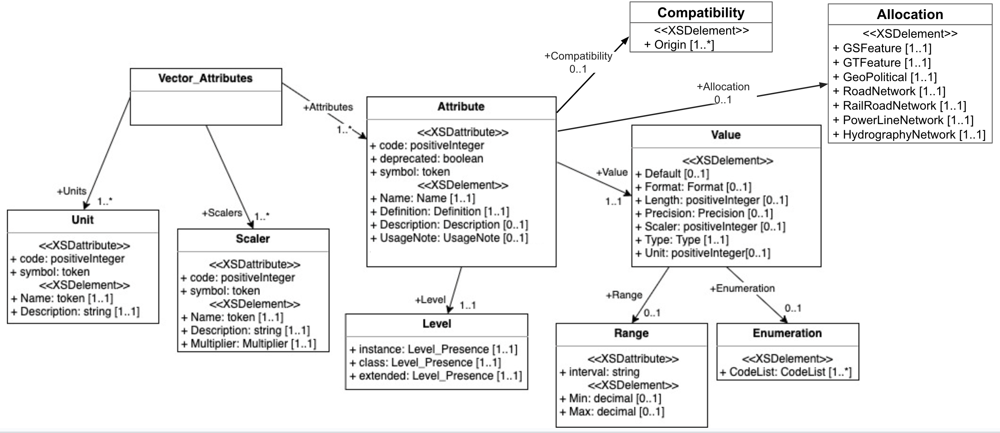

:figure-caption: Figure 10-
:figure-num: 27

[[TiledVectorDatasets]]
=== Tiled Vector Datasets

Tiled vector data differs from their raster counterpart in three important ways. First of all, a tiled vector data internal structure permits a non-uniform distribution of elements within the tile, (i.e., the position of each element within the tile is explicit). Secondly, the tiled vector data internal structure permits a variable number of elements within the tile confines. Finally, it is possible to control the distribution of the element types from a single list.

Conceptually, the LOD of tiled vector data implicitly provides the average density of elements within the tile. The run-time level-of-detail behavior that controls the rendered number of data elements depends on various parameters and on the off-line filtering process.

*NOTE:* The LOD referred to in this section concerns itself with the grouping of cultural features into tiles at specified LODs, and not with the geometric accuracy or detail of the modeled representation of these features.

include::requirements/requirements_class021.adoc[]

[[IntroductiontoVectorDatasets]]
==== Introduction to Vector Datasets

The term vector data refers to data that represents the spatial configuration of features as a set of directed line segments. Vector geometry is representation of geometry for vector data through the use of constructive geometric primitives. Commonly known vector geometies are typically called point, line, and polygon features. Very specific definitions of these geometry types and many other geometry types that are used in GIS, CAD, and other technologies can be found in https://www.iso.org/standard/66175.html[ISO 19107:2003 Geographic information — Spatial schema] (recently updated).

For the purposes of the CDB standard, a point feature is a geographic entity where its simplest representation resolves to a point with general attributes such as size, position, or material. A lineal feature is a geographic entity that defines a one-dimensional feature such as a road, a canal, or a river. A polygon feature is a geographic entity where its simplest representation resolves to a two-dimension feature such as a lake or soil type boundary. In this context, a geographic entity is always specified by latitude and longitude coordinates; in turn, the geographic entity is conformed onto the terrain by the client-device.

The lineal and polygon feature’s representation abstractly resolves to a one or a two-dimensional feature. Unless otherwise specifically mentioned, lineal and polygon feature’s representations are not used to model a geometrical representation. However, these features may optionally reference an explicitly modeled representation (for example an OpenFlight model) located in the geospecific model or the geotypical model datasets.

Version 1.2 of the CDB standard specifies the use of either OGC GeoPackages or Esri Shapefiles to represent vector data and attributes. In each case, geometry types are supported to represent point, line, and polygon features.

* Refer to Volume 4: OGC CDB Best Practice use of Shapefiles for Vector Data Storage for detailed information and requirements for using Shapefiles for storing vector data in a CDB data store.
* Refer to Volume 13: OGC CDB Optional Extension for Structuring a CDB compliant GeoPackage. for detailed information and requirements for using GeoPackages for storing vector data in a CDB data store.
* Refer to Volume 14: OGC CDB Guidance on Conversion of CDB Shapefiles into CDB GeoPackages on Best Practice guidance of converting CDB structured vector Shapefiles into CDB structured vector GeoPackages.

Geometry data features types used in a CDB data store are as follows <Note - remove??>:

[options="header",]
|===============================================================================================
|*Value* | *GeoPackage geometry type* |*Shapefile Vector type* |*Fields*
|0 |Null |shape |None
|1 |Point | Point |X, Y
|3 |Linestring | Polyline |MBR, Number of parts, Number of points, Parts, Points
|5 |Polygon |Polygon |MBR, Number of parts, Number of points, Parts, Points
|8 |MultiPoint |MultiPoint |MBR, Number of points, Points
|11 |Point | PointZ a| X, Y, Z _Optional_: M
|13 | Linestring | PolylineZ a| _Mandatory_: MBR, Number of parts, Number of points, Parts, Points, Z range, Z array _Optional_: M range, M array
|15 |Polygon | PolygonZ a| _Mandatory_: MBR, Number of parts, Number of points, Parts, Points, Z range, Z array _Optional_: M range, M array
|18 | Multipoint | MultiPointZ a| _Mandatory_: MBR, Number of points, Points, Z range, Z array _Optional_: M range, M array
|21 |Point | PointM |X, Y, M
|23 | Linestring | PolylineM a| _Mandatory_: MBR, Number of parts, Number of points, Parts, Points _Optional_: M range, M array
|25 | Polygon | PolygonM a| _Mandatory_: MBR, Number of parts, Number of points, Parts, Points _Optional_: M range, M array
|28 |MultiPoint | MultiPointM a| _Mandatory_: MBR, Number of points, Points _Optional Fields_: M range, M array
|===============================================================================================
`Note: Geometry type multi-patch (Value 31) was deprecated in version 1.2 of this standard. This geometry is no longer supported. Use at your own risk. This geometry type will remain in the CDB standard until version 2.0.`

include::requirements/REQ107.adoc[]

All of the information that is needed to instance features is organized in accordance to the CDB tile structure. All the tiled Vector dataset files are located in the same directory.The dataset’s second component selector (CS2) is used to differentiate between files with the same extension or with the same Vector features. Table 5-18: Component Selector 2 for Vector Dataset, presents the list of codes that are allocated. Note that Vector datasets do not necessarily use all of the Dataset Component Selector 2 reserved codes. Users of the CDB standard should refer to the appropriate section for an enumeration of the supported File Component Selector 2 codes as well as the ones specific to the Dataset.

The Vector dataset concept and the feature concepts overlap somewhat; some of the Vector datasets are generalizations or specializations of feature codes. Section 1.5 provides a recommended mapping of the feature attributes across the CDB compliant datasets. Note that the same feature _should_ not have two representations.

[#table_ComponentSelector2forVectorDatasets,reftext='{table-caption} {counter:table-num}']
*Table 5-18: Component Selector 2 for Vector Datasets*
[cols=",,",]
|===============================================================================================
|*CS2* |*Dataset Component Name* |*Supported Vector Types*
|001 |Point features |Point, PointZ, PointM, MultiPoint, MultiPointZ, MultiPointM
|002 |Point feature class-level attributes |N/A
|003 |Lineal features |PolyLine, PolyLineZ, PolyLineM
|004 |Lineal feature class-level attributes |N/A
|005 |Polygon features |Polygon, PolygonZ, PolygonM, `Multipatch (see note)`
|006 |Polygon feature class-level attributes |N/A
|007 |Lineal figure point features |Point, PointZ, PointM, MultiPoint, MultiPointZ, MultiPointM
|008 |Lineal figure point feature class-level attributes |N/A
|009 |Polygon figure point features |Point, PointZ, PointM, MultiPoint, MultiPointZ, MultiPointM
|010 |Polygon figure point feature class-level attributes |N/A
|011 |2D relationship tile connections |N/A
|012 |Deprecated |N/A
|013 |Deprecated |N/A
|014 |Deprecated |N/A
|015 |2D relationship dataset connections |N/A
|016 |Point feature extended-level attributes |N/A
|017 |Lineal feature extended-level attributes |N/A
|018 |Polygon feature extended-level attributes |N/A
|019 |Lineal Figure Point extended-level attributes |N/A
|020 |Polygon Figure Point extended-level attributes |N/A
|===============================================================================================

`Note: Geometry type multi-patch was deprecated in version 1.2 of this standard. This geometry is no longer supported. Use at your own risk. This geometry type will remain in the CDB standard until version 2.0.`

[[VectorTypeUsageandConventions]]
===== Vector Type Usage and Conventions

This section establishes conventions globally applicable to the usage of all vector features.

[[Forexplicitlymodeledpointculturalfeatures]]
====== For explicitly modeled point cultural features:

Each point-feature of a CDB dtabase can be optionally associated with a GSModel, a GTModel or MModel. The rendering of GSModels, GTModels or MModels by client-devices requires an associated point-feature. The linkage is made through point-feature attributes which together provide the information needed by client-devices to locate the Model from the appropriate Dataset at the appropriate level-of-detail. The following feature attributes provide the necessary linkage:

* _FeatureCode-FSC_: Feature Code and Subcode
* _MODL_: Model Name
* _MODT_: Model Type
* _MLOD_: Model Level-of-Detail
* _MMDC_: Moving Model DIS Code

include::requirements/REQ108.adoc[]

[[Formodeledlightpoints]]
====== For modeled light points:

It is common practice within the simulation industry to model light points without their associated support structures. In this case, the preferred way to model light points is through the use of point-features within the Airport and Environmental Light-Point Features Datasets of a CDB data store; consequently, there are no Models associated with Airport and Environmental Light-Point Features.

Note however that is entirely permissible to also model lights points with their associated support structures. In this case, the OGC CDB Rules for Encoding Data using OpenFlight (Volume 6) representing the support structure also contains light points as specified in section 6.11, Model Light Points.

The “modeling” of light points is accomplished via the following light-point feature attributes:

* _LTYP_: Light Type
* _LPH_: Light Phase
* _AO1_: Angle of Orientation

include::requirements/REQ109.adoc[]

The elevation angle component of a directional light point is intrinsic to its type (for instance a VASI\TypeT\2.5_Degree\Fly-Up1_light should be used to represent a Type VASI light used for a 2.5 degree glide slope). In the case of vector data types that do not have a Z component value, the light point’s height value is referenced to the underlying terrain; as a result, client-devices are required to elevate the light point’s center with regard to the underlying terrain elevation dataset.

include::requirements/REQ110.adoc[]

[[Forpointlinealandpolygonfeaturesthatarenotmodeled]]
====== For point, lineal and polygon features that are not modeled:

The CDB data model does not make mandatory that all features of the CDB be modeled; as a result, each feature is _optionally_ associated with a GSModel, a GTModel or a MModel.

include::requirements/REQ111.adoc[]

The AHGT attribute, when present, is always ignored when the Z component value does not exist.

The bounding box coordinates Xmin, Ymin, Xmax, Ymax required by some vector data types are expressed using WGS-84 geographic coordinates (in accordance with Volume 8: OGC CDB Spatial Reference System Guidance).

The value of M and Mrange found in some of the vector types (PointM, MultiPointM, PolygonM, and PolyLineM) is ignored by client-devices.

[[CDBAttribution]]
===== CDB Attribution

Attributes are used to describe one or more real or virtual characteristics of a feature. Features can be assigned a variable number of attributes.
The CDB standard provides a flexible means to tag features with attribution data.

include::requirements/requirements_class022.adoc[]

The schema of vector attributes can be found in the `Vector_Attributes.xsd` file stored in the schema folder of the CDB datastore (`\CDB\Metadata\Schema\Vector_Attributes.xsd`) and accessible from the http://schemas.opengis.net/cdb/1.1/Vector_Attributes.xsd[Official Schemas].
The list of CDB attributes is described in the `CDB_Attributes.xml` file stored in the metadata folder of the CDB datastore (`\CDB\Metadata\CDB_Attributes.xml`) and accessible from the http://schemas.opengis.net/cdb/1.3/Metadata/CDB_Attributes.xml[Official Schemas].
The `CDB_Attributes.xml` file is based on XML format which is appropriate for a computer program.

The following diagram shows the UML Model for CDB Attribute schema along with defining different entities and their properties, as well as the relationship between entities.

[#img_UMLdiagramOftheCDBvectorAttribute,reftext='{figure-caption} {counter:figure-num}']
*_{figure-caption}{counter:figure-num}. The UML diagram of the CDB vector attribute Schema_*

The UML diagram was generated based on the `Vector_Attributes.xsd` file and comprised three sections: attributes, units, and scalers. Each attribute has two main properties called Level and Value. Value contains the main properties of the vector attributes i.e. data type, enumeration, length, format, range, usage, units, compatibility.

The following table defines the major components of the above figure.
Please refer to Section 5.1.8 of Volume 1: CDB Attributes Metadata for a detailed definition of UML model components.

[#table_MajorComponentsofUMLmodel,reftext='{table-caption} {counter:table-num}']
*Table 5-??: The major components of UML model definition*
[cols="20e, <80m",width="100%",options="header",align="center"]
|===
|Name | Definition

| Attributes
| Attributes are used to describe one or more real or virtual characteristics of a feature. Attributes have three characteristics: +
  - _Code_: A unique four-digit numeric code associated with each attribute. +
  - _Symbol_ (Identifier): A unique three-character or four-character alphanumeric identifier associated with the attributes that are governed by this standard. +
  - _Deprecated_: States if the attribute is deprecated or not.

| Level
| It provides the schema level of the attribute such as class-level, instance-level and extended-level.

| Value
| Attribute values give quantitative/qualitative meaning to the attribute. This property includes data type, enumeration, length, format, range, usage, units, and compatibility of each attribute.

| Units
| A list of Unit definitions, such as meters and degrees.

| Scalers
| A list of Scaler definitions, such as kilo, with a code and symbol for each Scaler.

|===

[[AttributeUsage]]
====== Attribute Usage

CDB attribution usage falls in the following categories:

a) _Mandatory:_

include::requirements/REQ113.adoc[]

b) _Recommended:_

A recommended attribute is an attribute whose value should be provided for all of the features of a specified dataset. Consumers of CDB compliant data (tools and/or simulator client-devices) can always rely on the availability of recommended attributes since the attribute value is either provided explicitly in the CDB data store/dataset or provided implicitly as a defaulted value in accordance to `\CDB\Metadata\CDB_Attributes.xml`, CDB Attributes. A CDB with defaulted recommended attributes is considered compliant by this standard; however, the performance of one or more of the client-devices (commonly found on simulation devices) may be adversely affected.

c) _Optional:_

An optional attribute is an attribute whose value may (optionally) be provided for all of the features of a specified dataset. Consumers of CDB compliant data (tools and/or simulator client-devices) cannot rely on the availability of optional attributes.

include::requirements/REQ114.adoc[]

d) _Dependent:_

A dependent attribute is an attribute whose value depends on another attribute, be it mandatory, recommended, or optional. The attribute is considered mandatory if the attribute it depends on is mandatory. Likewise, the attribute is considered recommended if the attribute it depends on is recommended. Finally, the attribute is considered optional if the attribute it depends on is optional.

Note that attribute usage information for each of the CDB attributes can be found in `\CDB\Metadata\CDB_Attributes.xml` and in Table 5-27: Allocation of CDB Attributes to Vector Datasets.

[[CDBAttributes_49]]
*CDB Attributes*

CDB attributes are attributes whose semantics, data type, enumeration, length, format, range, usage, units, compatibility and schema are entirely governed by the CDB standard. Most of these attributes are unique to the CDB standard, i.e., these attributes are not found in source data that conforms to various (US) governmental standards and specifications. As a result, this attribution data must be derived via CDB tool automation or provided directly by the user.

[[GeomaticsAttributes]]
*Geomatics Attributes*

Geomatics attributes are attributes whose semantics, data type, length, format, range, usage, and units, are governed by various governmental/industrial specifications and standards. Such attributes are generally found in source data that conforms to such standards and specifications. While the CDB standard itself does not define and govern the usage of these attributes, it nonetheless accommodates their storage within the repository structure of a CDB compliant dataset/data store. Please see section 5.7.1.2.7.3 for more information on extended level schemas and how Geomatics Attributes are used.

[[VendorAttributes]]
*Vendor Attributes*

Vendor attributes are attributes whose semantics, data type, length, format, range, usage, and units are governed by one or more vendors. In general, such attributes cannot be used by other vendors since they are often proprietary. Such attributes exclude the above two types of attributes and are generally unique to each vendor. While the CDB standard itself does not define and govern the usage of these attributes, it nonetheless accommodates their storage within a CDB compliant data store/dataset. Please see section 5.7.1.2.7.3 for more information on extended level schemas and how Vendor Attributes are used.

[[AttributionSchemas]]
====== Attribution Schemas

The CDB standard offers three different attribution schemas. Each of the schemas offers different trade-offs in the manner attribution data is accessed and stored. Each of these schemas is largely motivated by the storage size considerations, and flexibility in the manner attribution data can be assigned to individual features and to groups of features.

The three attribution schemas supported by the CDB standard are:

* Instance-level schema
* Class-level schema
* Extended-level schema

[[InstancelevelSchema]]
*Instance-level Schema*

This is the attribution schema used for features whose attributes and attribute values vary with each instance of a feature in a dataset.

include::requirements/REQ115.adoc[]

The data type, enumeration, length, format, range, usage, and units of the attribution values are specific to each attribute. The interpretation of the attribution data value is governed by metadata that describes the data type, the enumeration, the data format, the allowable range of the data, the numerical precision of the data, the units associated with the data, etc for each attribute.

include::requirements/REQ116.adoc[]

Refer to link:#CDBXMLSchemaDefinitions[Section 1.4.2] of this document for a listing of the attribute metadata schema.

Each row of this instance-level file (or table) contains the instance-level attribute values for a corresponding feature in the *.shp file. The first column of each row within the instance-level *.dbf is always the classname (CNAM). If the classname is not used, its value is set to blank, and all of the classname attributes need to be added to the instance-level file (or table). The number of columns in a Dataset Instance-level file (or table) is different for each dataset. All of the instance-level attributes are CDB attributes.

image::images/image77.jpeg[untitled1,width=514,height=244]
[#img_InstancelevelAttributionSchema,reftext='{figure-caption} {counter:figure-num}']
*_{figure-caption}{counter:figure-num}. Instance-level Attribution Schema_*

[[ClasslevelSchema]]
*Class-level Schema*

This is the preferred attribution schema for features whose attributes and attribute values can be shared by one or more of the instances of a feature in a dataset.

The attributes and their values are logically re-grouped under a classname (CNAM attribute) that stands for the group of attributes specific to that class. Each row of the class-level *.dbf file corresponds to a classname found in the instance-level *.dbf shape file. Each attribute class is characterized by a set of attributes implemented as a row within the class-level *.dbf file. In turn, each attribute is uniquely defined by a name that is a “case-sensitive” character string of 10 characters or less. This 10-character limitation of attribute names is set for backwards compatibility due to use of the dBASE III+ File format structure (see Volume 2: OGC CDB Core Model and Physical Structure: Annexes, Annex E).

The interpretation of the attribution data value is governed by metadata that describes the data type, the data format, the allowable range of the data, the numerical precision of the data, the units associated with the data, etc for each attribute. The CDB_Attributes.xml metadata file is used to describe all the CDB attributes (`\CDB\Metadata\CDB_Attributes.xml`). The CDB_Attributes.xml file must be included in the CDB folder hierarchy under the CDB Metadata directory (refer to link:#MetadataDirectory[Section 3.1.1], Metadata Directory). The CDB_Attributes.xml metadata file is structured in accordance to a *.xsd schema file. Refer to Section 1.4.2 of this document for a description of the attribute metadata schema.

The first column of the file is the classname and acts as the primary key to access table entries; all other rows correspond to the attributes represented by the classname. All of the class-level attributes are CDB attributes. For each dataset, a classname is unique within a geocell.

image::images/image78.jpeg[untitled1,width=580,height=156]
[#img_Class-levelAttributionSchema,reftext='{figure-caption} {counter:figure-num}']
*_{figure-caption}{counter:figure-num}. Class-level Attribution Schema_*

[[ExtendedlevelSchema]]
*Extended-level Schema*

The CDB standard provides an alternate attribution schema that can be used (in many cases) to supplement the instance-level and class-level schemas.

The extended-level schema can be used to represent CDB attributes, Geomatics attributes and Vendor attributes. However, the extended-level schema is the only means by which Geomatics attributes and Vendor attributes can be accessed.

Linkage to the extended-level CDB attribution data is accomplished through the CEAI attribute; CEAI is an index to a link list of CDB attributes stored in the extended-level attribute file (or table) footnote:[Currently a *.dbf file.]. Similarly, the GEAI and VEAI attributes are also indices to link lists of attributes stored in the extended-level attribute file (or table). The extended-level files have the structure described in section 5.7.1.2.7.4, Structure of Extended-level Files.

There is one attribute metadata file (named CDB_Attributes.xml) that describes the CDB attributes, one attribute metadata file (named Geomatics_Attributes.xml) for the Geomatics attributes and one attribute metadata file (named Vendor_Attributes.xml) for the Vendor attributes. All three attribute metadata *.xml files are optional; if provided, they are included in the CDB folder hierarchy under the CDB Metadata directory (refer to link:#MetadataDirectory[Section 3.1.1], Metadata Directory). All three attribute metadata *.xml files share the same schema. The schema that governs the contents of the attribute metadata files is Vector_Attributes.xsd. Refer to Section 1.4.2 of this document for a description of this schema.

[[StructureofExtendedlevelAttributeFilesorTables]]
====== Structure of Extended-level Attribute Files or Tables

Each row of the Extended-Level attribute files (or tables) correspond to an attribute. Each attribute row consists of four columns as follows.

Column 1 – *LNK (Link)*: The first column is a numeric 6-digit index to the next entry of a link list of attributes (a value of 0 marks the end of the list). The LNK field provides a means to organize attributes into link lists of attributes that in turn can be associated with a feature.

Column 2 – *GRP (Group)*: The second column provides an 8-character string that is used to name the group to which the extended attributes belongs to. The actual value of this character string is arbitrary and provides an indication of the source of the attribute. In practice, attributes belongs to one of three (3) groups: CDB, Geomatics, and Vendor. If the extended-level attribute is one of the CDB attributes of section 5.7.1.2.7.5, the group name is “CDB”. If the extended-level attribute belongs to one of the Geomatics standards (such as “DIGEST”, “VMAP”, “SEDRIS”, “DGIWG”, “UHRB”), it is recommended to use the name of the standard as the group name. If the extended-level attribute is a vendor-specific attribute, then the group name should represent the name of the vendor (such as “CAE-M”, “Presagis”, “Thales”, “Rockwell”).

Column 3 – *EAC (Environment Attribute Code)*: The third column provides a unique four-digit numeric code for each attribute type. The codes for the CDB attributes can be found in `\CDB\Metadata\CDB_Attributes.xml`. Note however, that the codes for the Geomatics and Vendor attributes are not specified by this standard. Instead, this standard provides a metadata schema that allows developers to describe these attributes. See section 5.1.7, CDB Attributes Metadata, for details.

Column 4 – *EAV (Environment Attribute Value)*: The fourth column provides a data value for the attribute. The data value is represented by general-purpose 16-character alphanumeric string. In the case where more than 16-characters are needed to represent a data value, the remaining characters are provided by appending consecutive row(s) with the same GRP and EAC values; the value of LNK is incremented for each of the consecutive row(s). The interpretation of the data value is governed by metadata that describes the data type, the data format, the allowable range of the data, the numerical precision of the data, the units associated with the data, etc for each attribute type.

[[Example_48]]
*Example*

The following example illustrates the relation between the vector data and related attribute files where the instance, class, and extended-level attributes are stored. The example focuses on extended-level attributes. Note that it is possible to extend the list of instance and class attributes through the use of the CEAI, GEAI, and VEAI attributes.

The attributes associated with the instance of Shape 2 are extended with CDB attributes because CEAI has the value 4; that is an index into the Extended-level attributes dBase file, it points to record 4. By following the link (LNK) in each record, the complete list of extended attributes contains records 4, 5, and 8. These records add 3 CDB attributes: 5, 54, and 25. These codes respectively correspond to APID, RWID, and GAID. Their respective values are Airport CYUL, Runway 06L, and Gate B23.

The attributes that belong to the “Container” class are also extended with CDB attributes as indicated by the value 6 of the CEAI attribute. Record 6 adds CDB attribute 29, LACC, with a value of 1; record 7 adds CDB attribute 60, SSC, with a value of 84.

The attributes of the “Railroad” class are extended by Geomatics attributes as indicated by GEAI and its value of 1. This adds 3 DIGEST geomatics attributes (numbered 1, 2 and 3) that are defined in Geometics_Attributes.xml.

Finally, the “Highway” class attributes are extended with a single vendor attribute stored in record 9 and 10 (VEAI points to record 9 which points to record 10). The client detects that this is a single attribute (and not two separate attributes) because the two records have identical values for their GRP and EAC attributes. The vendor is identified as “ABC Inc.”; attribute 1, defined in Vendor_Attributes.xml, has the value “1234567890ABCDEFGHIJ.”

image::images/image79.png[image,width=605,height=642]
[#img_RelationbetweenShapesandAttributes,reftext='{figure-caption} {counter:figure-num}']
*_{figure-caption}{counter:figure-num}. Relation between Shapes and Attributes_*

Note that it is possible to simultaneously extend a record (instance and class) with CDB, Geomatics, and vendor attributes. The example does not illustrate this situation to keep it (relatively) simple.

[[CDBAttributes]]
===== CDB Attributes Semantics

Each attribute is associated with a textual description (describing semantic information), which provides a human readable definition of the attribute.
This section provides a list (following table) and definition of the attributes specific to the CDB standard and not from external standards.
A complete list of all CDB attributes can be found in the CDB_Attributes.xml file, (\CDB\Metadata\CDB_Attributes.xml) and accessible from the http://schemas.opengis.net/cdb/1.3/Metadata/CDB_Attributes.xml[Official Schemas].
Note that it is possible to provide attributes other than those listed in the CDB_Attributes.xml by making use of the Geomatics and Vendor Extended-level attribution schema.
CDB Attributes are stored in the XML format which is more appropriate for a computer program.

[#table_CDBAttributesSemantics,reftext='{table-caption} {counter:table-num}']
*Table 5-??: CDB Specific Attributes Semantics*
|===
|Attribute Name | Semantic Definition

| Class Name (CNAM)
| A name that represents the Attribution Class. The class-level attribution schema is described in Section 5.7.1.2.7.2, Class-level Schema. Attributes are referenced via this class name. The class name is used as the primary key to perform searches within the Dataset Class Attribute file. Each row of a class-level database file or table must have a valid CNAM entry; the CNAM must be unique within the file. Each row of an instance-level *.dbf can optionally use the CNAM to refer to class attributes; blank indicates “no class attribute”.

| Feature Sub Code (FSC)
| This code, in conjunction with the feature code is used to distinguish and categorize features within a dataset.

| Bounding Boxes Height (BBH), Width (BBW) and Length (BBL)
| The dimension of the bounding box is intrinsic to the model and identical for all LOD representations.The Height/Width/Length of the Bounding Box of the 3D model associated with a point feature. It is the dimension of the box centered at the model origin and that bounds the portion of the model above its XY plane, including the envelopes of all articulated parts. BBH refers to the height of the box above the XY plane of the model, BBW refers to the width of the box along the X-axis, and BBL refers to the length of the box along the Y-axis. Note that for 3D models used as cultural features, the XY plane of the model corresponds to its ground reference plane. The value of BBH, BBW and BBL should be accounted for by client-devices (in combination with other information) to determine the appropriate distance at which the model should be paged-in, rendered or processed. BBH, BBW and BBL are usually generated through database authoring tool automation.

| Bounding Sphere Radius (BSR)
| The radius of a feature. In the case where a feature references an associated 3D model, it is the radius of the hemisphere centered at the model origin and that bounds the portion of the model above its XY plane, including the envelopes of all articulated parts. Note that for 3D models used as cultural features, the XY plane of the model corresponds to its ground reference plane. The value of BSR should be accounted for by client-devices (in combination with other information) to determine the appropriate distance at which the model should be paged-in, rendered or processed. When the feature does not reference a 3D model, BSR is the radius of the abstract point representing the feature (e.g., a city). The dimension of the bounding sphere is intrinsic to the model and identical for all LOD representations.

| AHGT, HGT, and Z Attributes
| Indicates how to interpret the Z component of a vertex. If AHGT is true, the feature is positioned to the value specified by the Z component (Absolute Terrain Altitude), irrelevant of the terrain elevation dataset. If AHGT is false or not present, the feature is positioned to the value specified by the underlying terrain offset by the Z component value. When the Z coordinate (altitude) of a feature is relative to the ground, the terrain elevation dataset can be updated without the need to recompute the altitude of the feature. CAUTION: When the AHGT flag is set to true, the feature will be at a fixed WGS-84 elevation independently of the terrain LOD selected by the client-device. As a result, there is no guarantee that the feature (and its modeled representation) will remain above the terrain skin across all terrain LODs.

| AO1
| The angular distance measured from true north (0 deg) clockwise to the major (Y) axis of the feature. If the feature is square, the axis 0 through 89.999 deg shall be recorded. If the feature is circular, 360.000 deg shall be recorded. Recommended Usage. CDB readers should default to a value of 0.000 if AO1 is missing. Applicable to Point, Light Point, Moving Model Location and Figure Point features. When used in conjunction with the PowerLine dataset, AO1 corresponds to the orientation of the Y-axis of the modeled pylon. The modeled pylon should be oriented (in its local Cartesian space) so that the wires nominally attach along the Y-axis.

|===

[[ExplicitlyModeledRepresentations]]
===== Explicitly Modeled Representations

[[ReferencedbyPointFeatures]]
====== Referenced by Point Features

A point feature (whose position and attributes are stored in a vector data set) can also refer to an explicitly modeled representation.

A feature can point to an explicitly modeled representation of that feature that is stored in either the GTModel library, the MModel library or alternately embedded inside a CDB tile. In order to specify the modeled representation, the modeler must properly attribute the feature via the MODL, MLOD, MMDC and MODT attributes in the vector dataset that contains the feature. For Point features, the CDB currently supports two types of explicitly modeled representations:

* OpenFlight models (Volume 6)
* RCS models (Volume 5)

Natural vector features (such as trees, bushes) are usually represented by geotypical models. The majority of man-made features can also be geotypical in nature. For instance, power pylons, telephone poles, or residential houses can all be represented with generic models that are typical in appearance to the real-world objects they represent. The modeler need only resort to a geospecific model if the application requires a model with the unique shape, appearance and/or properties of the real-world object.

[[ImplicitlyModeledRepresentations]]
===== Implicitly Modeled Representations

An implicitly modeled representation is one that is defined completely by the supplied attribution of the Dataset in which it is contained. Examples of implicitly modeled features are light-points.

[[HandlingofTopologicalNetworks]]
===== Handling of Topological Networks

The CDB standard provides several interconnected topological networks consisting of multiple datasets. Each network dataset can be made of separate point features and or a series of points connected together using lineal and polygon features. Each lineal feature has a start and end nodes, which correspond to intersections when connected to two or more other lineal features, or connections when connected to a polygon. The other intermediate points are used to accommodate deviation from a straight line. Typically, network datasets, such as roads, streams, and railroads, conform to the ground. Consequently, when the optional AHGT attribute is present, its value is set to false. Each network dataset is stored as a distinct vector dataset Version metadata rule for the vector encoding being used.

[#img_ExampleofaTopologicalNetwork,reftext='{figure-caption} {counter:figure-num}']
*_{figure-caption}{counter:figure-num}. Example of a Topological Network_*

The CDB Topological networks are useful when one needs to determine the shortest path between two arbitrary nodes in the entire network. Alternately, algorithms can use the network topology in combination with a “cost” parameter based on length (in the case of shortest path), traffic speed (in the case of fastest path), or some other criteria that can be derived from the attribution information associated with the network datasets.

The CDB Topological networks are used for the following purposes.

* To determine a route for features such as roads, rivers, railroads.
* To follow a route made of roads, rivers, railroads.
* To avoid an obstacle; for example a tank may not be able to cross a river or be able to go over or under a pipeline.
* To efficiently process a “feature” for devices (such as radar) that do not require a high definition of the geometrical representation or do not need to represent more than one dimension.

The CDB Topological networks are optimized to facilitate road/river/railroad following tasks. They support the notion of directionality such as one-way roads or both ways for two-way roads, rivers. The vertex positions are physically positioned along the center of the feature’s longitudinal axis. For example, a road such as a dual-lane undivided highway, the vertex data lies along the stripes dividing the two lanes.

Features within the same or different network datasets are connected together using the junction identifier attributes <<StartJunctionIDSJID>>SJID, <<EndJunctionIDEJID>>EJID or <<JunctionIDJID>>JID. Two or more features having the same identifier values are considered virtually connected. This junction identifier allows, for instance, a primary road to connect to a secondary road, or a river to connect a lake (in same network datasets), or to connect a road and a river (in different network dataset).

include::requirements/requirements_class023.adoc[]

include::requirements/REQ117.adoc[]

When not specified (i.e., blank), the feature is not connected to any other features. Volume 7: CDB Data Model Guidance (formerly Appendix A) provides guidelines on how to generate the junction identifiers.

Since the junction identifier is associated with a feature's geometry type, the following combinations are supported:

* Any point feature can be connected to any start or end point of a linear feature (point to linear connection), or to any start point of a polygon feature (point to polygon connection), using its JID attribute.
* Any start point of a linear feature can be connected to any point feature (point to lineal connection), or to any start or end point of a linear feature (linear to linear connection), or to any start point of a polygon feature (linear to polygon connection), using its SJID attribute.
* Any end point of a linear feature can be connected to any point feature (point to linear connection), or to any start or end point of a lineal feature (linear to linear connection), or to any start point of a polygon feature (linear to polygon connection), using its EJID attribute.
* Any start point of a polygon feature can be connected to any point feature (point to polygon connection), or to any start or end point of a linear feature (linear to polygon connection), using its JID attribute.

Connection information between two features located in two separate vector datasets  footnote:[Must be of the same vector encoding type.] are explicitly listed in 2D relationship files. This standard currently specifies two types of 2D relationship files: the 2D relationship tile connection file which specifies connections of the same dataset feature between two adjacent tiles, and the 2D relationship dataset connection file which specifies connection of 2 or more different dataset and sub-dataset features within the same tile.

[[TwoDimensionalRelationshipTileConnectionFile]]
====== 2D Relationship Tile Connection File

include::requirements/REQ118.adoc[]

This clipping point potentially exists in several Tile-LODs having a common boundary. In which case, all points representing the same clipping point share the same JID. Doing so ensures that connectivity between geocells and tiles is preserved. A clipping point can be identified by the application by checking the 2D relationship tile connection file. There is a 2D relationship tile connection file per network dataset tile. When the file is missing, it indicates there is no clipping point for the lineals belonging to the tile. The 2D relationship file is a file or table that contains a list of records made of 2 attributes: The Junction ID (JID) that identifies the start or end point of the clipped linear and the Network Component Selector 1 (NCS1) that identifies the network dataset lineal file. The dataset code file is implicit to the network dataset tile directory and the Network Component Selector 2 always represents a linear feature vector features (code 003) thus do not require to be included in the record. The coordinate of the tile adjacent to a clipping point can be determined using the latitude and longitude of that point.

If a connection between two linear features happens to be located exactly at a tile boundary, the lineal is obviously not clipped but a junction ID is allocated and included in the 2D relationship tile connection file.

In a 2D relationship tile connection file, no two records are identical. However, JIDs may appear more than once with different NCS1, indicating a connection between network subdatasets.

[[TwoDimensionalRelationshipDatasetConnectionFile]]
====== 2D Relationship Dataset Connection File

The CDB Topological network is made of several network datasets that in turn are made of several vector files of the same encoding format GeoPackage or Shapefiles). By specifying a junction identifier per feature, any features in any of these several vector files can in theory be connected to any other features located in a separate files of the same encoding format. A connection within a tile, which includes the tile boundaries, can be identified by the application by checking the 2D relationship dataset connection file. There is a 2D relationship dataset connection file per network dataset tile. This file contains all the connections between the sub-datasets of the corresponding network dataset with other network datasets. When the file is missing, it indicates there are no connections within the tile. The 2D relationship file is a database or other file that contains a list of records made of 4 attributes; the Junction ID (JID) that identifies the connected point, lineal or polygon features, the Network Dataset Code (NDSC) that identifies the network dataset the feature belongs to, and the Network Component Selectors (NCS1 and NCS2) that identify the network sub-dataset and the shape type. The tile coordinate and tile LOD is implicit to the Network Dataset tile directory.

All the records in the 2D relationship file are sorted per ascending JID. This has two advantages; it speeds up the search process when looking for a specific JID and it groups all the features that are connected together. In effect, there is always a minimum of two consecutive records with the same JID; the record belonging to the corresponding file dataset (or sub-dataset) and the record identifying the feature it connects to. Note that when a 2D relationship file specifies a connection to a feature belonging to different network dataset, the corresponding LOD file of this dataset may or may not exist. If the corresponding LOD file of the target dataset is missing, the application must look for the feature in the coarser LOD file of the target dataset. If the corresponding LOD file of the target dataset exists, the feature may be missing because it has been removed by the off-line tool decimation process. When this is the case, the application must look for the feature in the finer LOD file of the target dataset.

[[JunctionIdentifierSJIDEJIDandJIDRange]]
====== Junction Identifier (SJID, EJID, and JID) Range

include::requirements/REQ119.adoc[]

With a 64-bit range, it is practically impossible to run out of ID numbers. In the process of creating the unique identifier, special care must be taken by the off-line tool in order to avoid duplicating the identifier at the geocell boundary for the clipping points when the modified or added features overlap two or more geocells.

Table 3-27, CDB LOD versus Feature Density, specifies the maximum number of elements in a tile for vector datasets. This maximum number is not affected by the number of added clipping point in a lineal feature. Although, this appears to lead to an unbounded number of points in a file, it is clamped to the geocell size. In practice, for a relative constant density, the number of clipping points diminishes as the LOD number increases.

[[NetworkVectorPriority]]
====== Network Vector Priority

When generating CDB Tile-LODs for lineal networks, there is also the concept of vector priority. This concept is to accommodate efficient path planning and following, as well as map drawing and other non-visual usages of networked lineals. The assurances implied by this vector priority concept are the following:

* The finest Tile-LOD for a lineal network contains all the features and geometry of that dataset.
* Coarser Tile-LODs contain both simplified lineal features as well as fewer features, such that:
** There is a minimum priority class that exists within the Tile-LOD. Not all the features with this priority class may exist in this Tile-LOD.
** All features in priority classes greater than the minimum must exist, but may be simplified from their full resolution version in the finest Tile-LOD. All topological connections between higher priority classes also exist in this Tile-LOD.
** All features in priority classes less than the minimum do not exist in this Tile-LOD, and can be found in finer Tile-LODs.
** The maximum number of points for each Tile-LOD conforms to Table 3-27.

The default vector priority values can be found in the default Feature Data Dictionary that accompanies the CDB Standard. They cover the Road, Railroad, Powerline, and Hydrography Network datasets. If there are two or more coincident lineal features, use the higher of the Vector Priority value on each feature. For example, if a bridge and a road lineal feature are coincident, use the higher vector priority value when creating the Tile-LODs so that either both exist at the same time or neither exists in the Tile-LOD. CDB Volume 7 (formerly Annex A) Clause 6.14 contains the recommended way to create the Tile-LODs for lineal network datasets.

Areal network datasets are not covered by vector priority. They should be simplified into Tile-LODs using each feature’s significant size and applying spatial significance criteria to each vertex.

[[HandlingofLightPoints]]
===== Handling of Light Points

All of the information that is needed to instantiate the light point features is organized in accordance to the CDB terrain tile structure. Each instance of a light point feature refers to a light type defined by the CDB Standard via its shape attribution (LTYP). As a result, the entire definition of the light (i.e., its location, orientation and attributions) is self-contained within the vector data files.

The CDB standard defines a collection of CDB Light Types that includes airport/runway lighting systems, cultural lights, aircraft refueling systems, etc. The light types currently supported by the CDB standard are listed in Annex J of this standard; they are also listed in Lights.xml as specified in Section 2.3, Light Naming. While the CDB standard provides a rigorous definition for each type of light, its representation is entirely determined by the fidelity and the capabilities of client-devices.

[[AllocationofCDBAttributesToVectorDatasets]]
===== Allocation of CDB Attributes To Vector Datasets

The CDB standard limits the applicability of each of the CDB attributes to certain vector datasets. This approach helps to reduce the number of columns (hence to reduce the size) of the dBase instance and class-level attribution files.

The allocation of CDB attributes to each of the Vector datasets is prescribed by Table 5-27 below.

[#table_AllocationofCDBAttributestoVectorDataset,reftext='{table-caption} {counter:table-num}']
*Table 5-27: Allocation of CDB Attributes to Vector Dataset*

image::images/image82.png[image,width=624,height=558]

[[VectorSignificantSizeandSpatialSignificanceCriteria]]
===== Vector Significant Size and Spatial Significance Criteria

All vector features have an implicit or explicit significant size, which must be used when creating coarser Tile-LODs. In addition, as Tile-LODs are created, individual vertices within the vector also have a spatial significance within the feature itself.

[[VectorSignificantSize]]
====== Vector Significant Size

The significant size for point features is defined by the significant size of the feature or model it represents, as specified in Volume 6 Section 6.8.3. Lineal feature significant size is equivalent to the width of the lineal feature as defined by its WGP attribute.

Areal feature significant size is proportional to the diagonal of the feature’s bounding box. If the feature is a box of equal length and width, its significant size is exactly the bounding box diagonal. As the shape of the feature’s bounding box becomes more rectangular, and as the amount of negative space within the bounding box increases, the feature’s significant size should be proportionally decreased relative to the departure from an equal length sided bounding box. This definition is similar to the one of a 3D model as specified in Section 6.8.3.2 in CDB Volume 6: OpenFlight.

[[LevelsofDetailandSpatialSignificanceCriteria]]
====== Levels of Detail and Spatial Significance Criteria

As coarser Tile-LODs of the lineal and areal datasets are created, the individual vertices of lineal and areal features must conform to the vector spatial significance criteria. Vertices must be moved or removed during coarser Tile-LOD creation such that, no part of the feature can be defined or changed by more than ½ of a raster cell size, as indicated by column 4 (Approximate Grid Spacing) of Table 2-4. For example, when creating the Tile-LOD 1 of a network dataset, all parts of each feature must be within 27 meters of the original feature (54.355 meters per Tile-LOD1 grid / 2 = 27.1775 meters). The spatial significance criterion is relaxed for the finest Tile-LOD, which is only limited by the feature vertex count.

[[TiledNavigationDataset]]
==== Tiled Navigation Dataset

As described in section 5.2, the global navigation dataset is complemented by a tiled-based dataset of basic navigation information that refers to the corresponding geocell. Those are found in the \401_Navigation dataset which is subdivided into several components as listed in the next table.

[#table_TiledNavigationDataset,reftext='{table-caption} {counter:table-num}']
*Table 5-28: Tiled Navigation Dataset*
[cols=",,,,",]
|==============================================================================================================
|*CS1* |*CS2* |*File Extension* |*Component Name* |*Component +
Description*
|Dataset 401, Navigation | | | |
|001-046 |001 |Dependent on format or encoding |Tiled Navigation Dataset |Contains the basic Navigation records
|==============================================================================================================

Refer to Table below, List of Navigation Components, for a complete description of the possible values of CS1.

*List of Navigation Components*

[cols=",,,",]
|=====================================================================================================================================================================================================================================================================================================
|*Component Name* |*CS1* |*Vector Type* |*Component Description*
|Airport |1 |Point |Area or land that is used (or intended for use) for the landing and take-off of aircraft.
|AirRefueling |2 |Point |A specifically designated airspace where air-to-air refueling operations are normally conducted.
|AirRefuelingControl |3 |Point |Information regarding the Air Traffic Control Center that controls the airspace within which the refueling track or anchor is located.
|AirRefuelingFootnote |4 |Point |Supplemental notes defining an Air Refueling component
|AirRefuelingPoint |5 |Point |Single Point from an Air Refueling structure
|AirRefuelingSegment |6 |LineString |Segment from an Air Refueling structure
|AirspaceBoundary |7 |Point |Designated airspace within which some or all aircraft may be subject to air traffic control.
|AirwayRestriction |8 |Point |Altitude and time restrictions for airways, airway segments, or sequences of airway segments
|Approach |9 |LineString |Preplanned instrument flight rule (IFR) for air traffic control approach procedures.
|ArrestingGear |10 |Point |Safety device consisting of engaging or catching devices, and energy absorption devices for the purpose of arresting both tail hook and/or non-tail hook equipped aircraft
|COMMS |11 |Point |Voice, radio communications, and facility call sign and frequencies available for same operations between the airport environment and aircraft.
|ControlAirspace |12 |Multipoint |Sequential listing of vertical and lateral limits, defining airspaces of different classifications, within which air traffic control service is provided
|EnrouteAirway |13 |Point |A specified route designed for channeling the flow of traffic as necessary for the provision of air traffic services
|FirUir |14 |Polygon |Flight Information region - Upper Information Region. Designated airspace within which some or all aircraft may be subject to air traffic control.
|Gate |15 |Point |Passenger gate at an airport
|GLS |16 |Point |GNSS Landing System
|Helipad |17 |Line |Designated area usually with a prepared surface used for take-off and landing of helicopters
|Heliport |18 |Point |Area or land intended to be used for landing and takeoff of helicopters
|HoldingPattern |19 |Point |Flight path maintained by an aircraft that is awaiting permission to land
|ILS |20 |Multipoint |Instrument landing system - Precision instrument approach system normally consisting of electronic components and visual aids
|Marker |21 |Point |Transmitter that radiates vertically a distinctive pattern for providing position information to aircrafts
|MilitaryTrainingRoute |22 |Point |Routes used by the Department of Defense and associated Reserve and Air Guard Units for the purpose of conducting low altitude navigation and tactical training in both IFR and VFR weather conditions below 10,000 feet MSL at airspeeds in excess of 250 KTS IAS.
|MilitaryTrainingRouteAirspace |23 |Point |Special use airspace or military operations area associated with a Military Training Route
|MilitaryTrainingRouteDescription |24 |Point |Supplemental information regarding a Military Training Route
|MilitaryTrainingRouteOverlay |25 |LineString |The width left and right of centerline based on a set of widths at Point Ident and another set of width at the Next Point Ident in one segment record.
|MLS |26 |Multipoint |Microwave Landing System - precision instrument approach system normally consisting of electronic components and visual aids
|MSA |27 |Point |Minimum Safe Altitude - altitude below which it is hazardous to fly owing to presence of high ground or other obstacles
|Navaid |28 |Multipoint |Electronic device on the surface, which provides point-to-point guidance information or position data to aircraft in flight
|OffRouteTerrainClrAltitude |29 |Polygon |Off-Route Terrain Clearance Altitude - Clearance altitudes in non-mountainous and in mountainous areas
|ParachuteJumpArea |30 |Point |An area designated for parachute jumping activities.
|ParachuteJumpAreaBoundary |31 |Polygon |Boundary of a Parachute Jump Area
|PathPoint |32 |Point |
|PreferredRoute |33 |Point |A system of routes designed to minimize route changes during the operational phase of flight and to aid in the efficient management of air traffic.
|PresetSite |34 |Point |Preset Site
|RestrictiveAirspace |35 |Polygon |Airspace of defined dimensions identified by an area on the surface of the earth wherein activities are confined
|Runway |36 |Line |Rectangular area on a land airport prepared for the landing and takeoff runs of aircraft along its length
|SID |37 |Multipoint |Standard Instrument Departure - preplanned instrument flight rule (IFR) for air traffic control departure procedure
|SpecialUse Airspace |38 |Point |Airspace of defined dimensions wherein activities are confined because of their nature and/or wherein limitations may be imposed upon aircraft operations that are not a part of those activities.
|STAR |39 |Multipoint |Standard Terminal Arrival - preplanned instrument flight rule (IFR) air traffic control arrival procedure
|SupplTerminalData |40 |Point |Supplemental terminal data
|TerminalProcClimb |41 |Point |Terminal Procedure Climb - Min or ATC Climb rates
|TerminalProcFeedRoute |42 |LineString |Terminal Procedure Feeder Route - A route depicted on Instrument Approach Procedures to designate routes for aircraft to proceed from the en route structure to the Initial Approach Fix
|TerminalProcMin |43 |Point |Terminal Procedure Minima - Height minima data for Terminal Procedure
|VFRRoute |44 |LineString |Preplanned arrival or departure routes for helicopters or light fixed wing aircraft to specified airports or heliports using/in Visual Flight Rules (VFR
|VFRRouteSegment |45 |LineString |Segment of a VFR Route
|Waypoint |46 |Point |Predetermined geographical position, used for route or instrument approach definition or progress reporting purposes
|=====================================================================================================================================================================================================================================================================================================

[[DefaultReadValue_50]]
===== Default Read Value

Simulator client-devices should assume an empty tile when data is not available.

[[DefaultWriteValue_51]]
===== Default Write Value

The files associated with this dataset for the area covered by the geocell need not be created if the source data is not available.

[[TiledGSFeatureDataset]]
==== Tiled GSFeature Dataset

A GSFeature is a geospecific (point, linear, or polygon footnote:[In previous versions of the CDB standard, the terms Point, Lineal, and Areal were used. These are considered to be equivalent to Point, Linear, and Polygon in this version of the standard.]) feature whose optional modeled representation is also geospecific.

The GSFeature Dataset provides the position, size, orientation (points), shape (linear and polygons), type and attribution of point, lineal, and polygon features. It is subdivided into the following components:

* CS1 = 001: Man-made features
* CS1 = 002: Natural features
* CS1 = 003: Trees features
* CS1 = 004: Airport features
* CS1 = 005: Environmental lights

Table 5-29: Component Selectors for GSFeature Dataset lists all of the components of the dataset. The allocation of CDB attributes to each of the components is prescribed by Table 5-27: Allocation of CDB Attributes to Vector Datasets.

It is customary in many simulation applications to represent street lighting as points of lights; as a result, Airport and Environmental light points can be entirely described by their feature position and attribution information and thus, do not have additional “modeled” data.

The modeling of geospecific trees is permitted when required to represent a specific geographic area; however, it is understood that the majority of the times, geotypical trees will be sufficient.

[#table_ComponentSelectorsforGSFeatureDataset,reftext='{table-caption} {counter:table-num}']
*Table 5-29: Component Selectors for GSFeature Dataset*
[cols=",,",]
|================================================================
|*CS1* |*CS2* |*Component Name*
|001 |001 |Man-made point features
| |002 |Man-made point features class-level attributes
| |016 |Man-made point features extended-level attributes
| |003 |Man-made lineal features
| |004 |Man-made lineal features class-level attributes
| |017 |Man-made lineal features extended-level attributes
| |005 |Man-made polygon features
| |006 |Man-made polygon features class-level attributes
| |018 |Man-made polygon features extended-level attributes
|002 |001 |Natural point features
| |002 |Natural point features class-level attributes
| |016 |Natural point features extended-level attributes
| |003 |Natural lineal features
| |004 |Natural lineal features class-level attributes
| |017 |Natural lineal features extended-level attributes
| |005 |Natural polygon features
| |006 |Natural polygon features class-level attributes
| |018 |Natural polygon features extended-level attributes
|003 |001 |Trees point features
| |002 |Trees point features class-level attributes
| |016 |Trees point features extended-level attributes
|004 |001 |Airport light point features
| |002 |Airport light point features class-level attributes
| |016 |Airport light point features extended-level attributes
| |003 |Airport lineal features
| |004 |Airport lineal features class-level attributes
| |017 |Airport lineal features extended-level attributes
| |005 |Airport polygon features
| |006 |Airport polygon features class-level attributes
| |018 |Airport polygon features extended-level attributes
|005 |001 |Environmental light point features
| |002 |Environmental light point features class-level attributes
| |016 |Environmental light point extended-level attributes
|================================================================

[[DefaultReadValue_52]]
===== Default Read Value

Simulator client-devices should assume an empty tile when data is not available.

[[DefaultWriteValue_53]]
===== Default Write Value

The files associated with this dataset for area covered by tile at a given LOD need not be created if the source data is not available.

[[TiledGTFeatureDataset]]
==== Tiled GTFeature Dataset

A GTFeature is a geotypical (point, lineal, or polygon) feature whose optional modeled representation is also geotypical.

The GTFeature Dataset provides the position, size, orientation (points), shape (lineal and polygons), type and attribution of point, lineal, and polygon features. It is subdivided into the following components:

* CS1 = 001: Man-made features
* CS1 = 002: Trees features
* CS1 = 003: Moving model location features

Table 5-30: Component Selectors for GTFeature Dataset lists all of the components of the dataset. The allocation of CDB attributes to each of the components is prescribed by Table 5-27: Allocation of CDB Attributes to Vector Datasets.

The Moving model location features component is used to permanently position moving models (e.g., position a row of parked tanks or aircrafts on a runway). When referenced and positioned in this manner, these models cannot be moved and articulated during the simulation.

[#table_ComponentSelectorsforGTFeatureDataset,reftext='{table-caption} {counter:table-num}']
*Table 5-30: Component Selectors for GTFeature Dataset*
[cols=",,",]
|===============================================================
|*CS1* |*CS2* |*Component Name*
|001 |001 |Man-made point features
| |002 |Man-made point features class-level attributes
| |016 |Man-made point features extended-level attributes
| |003 |Man-made lineal features
| |004 |Man-made lineal features class-level attributes
| |017 |Man-made lineal features extended-level attributes
| |005 |Man-made polygon features
| |006 |Man-made polygon features class-level attributes
| |018 |Man-made polygon features extended-level attributes
|002 |001 |Tree point features
| |002 |Tree point features class-level attributes
| |016 |Tree point features extended-level attributes
| |003 |Tree lineal features
| |004 |Tree lineal features class-level attributes
| |017 |Tree lineal features extended-level attributes
| |005 |Tree polygon features
| |006 |Tree polygon features class-level attributes
| |018 |Tree polygon features extended-level attributes
|003 |001 |Moving Model location features
| |002 |Moving Model location features class-level attributes
| |016 |Moving Model location features extended-level attributes
|===============================================================

[[DefaultReadValue_54]]
===== Default Read Value

Simulator client-devices should assume an empty tile when data is not available.

[[DefaultWriteValue_55]]
===== Default Write Value

The files associated with this dataset for area covered by tile at a given LOD need not be created if the source data is not available.

[[TiledGeoPoliticalFeatureDataset]]
==== Tiled GeoPolitical Feature Dataset

The GeoPolitical Feature dataset is used to provide information on the location, size and shape of abstract locations, lines and areas with respect to the surface of the earth. Generally speaking, the objects found in this dataset have no real-world physical representation (e.g., no physical characteristics such as mass) and correspond to abstract concepts (such as airspace, country boundary, danger zone).

The GeoPolitical Feature dataset is subdivided into the following components.

[#table_ComponentSelectorsforGeoPoliticalFeatureDataset,reftext='{table-caption} {counter:table-num}']
*Table 5-31: Component Selectors for GeoPolitical Feature Dataset*
[cols=",,",]
|===========================================================
|*CS1* |*CS2* |*Component Name*
|001 |001 |Boundary point features
| |002 |Boundary point features class-level attribute
| |016 |Boundary point features extended-level attribute
| |003 |Boundary lineal features
| |004 |Boundary lineal features class-level attribute
| |017 |Boundary lineal features extended-level attribute
| |005 |Boundary polygon features
| |006 |Boundary polygon features class-level attribute
| |018 |Boundary polygon features extended-level attribute
|002 |001 |Location point features
| |002 |Location point features class-level attribute
| |016 |Location point features extended-level attribute
| |003 |Location lineal features
| |004 |Location lineal features class-level attribute
| |017 |Location lineal features extended-level attribute
| |005 |Location polygon features
| |006 |Location polygon features class-level attribute
| |018 |Location polygon features extended-level attribute
|003 |001 |Constraint point features
| |002 |Constraint point features class-level attribute
| |016 |Constraint point features extended-level attribute
| |003 |Constraint lineal features
| |004 |Constraint lineal features class-level attribute
| |017 |Constraint lineal features extended-level attribute
| |005 |Constraint polygon features
| |006 |Constraint polygon features class-level attribute
| |018 |Constraint polygon features extended-level attribute
|===========================================================

[[BoundaryandLocationFeatures]]
===== Boundary and Location Features

GeoPolitical Polygon features are essentially used for closed surface related attributions whereas GeoPolitical Lineal features are used to model open areas as boundary delineations. When coarse specific locations are stored such as countries or cities, GeoPolitical Point features are used to locate the approximate geometric center of the related feature.

Some less-commonly used features could be 1) GeoPolitical Boundaries stored as Point features, or 2) GeoPolitical Locations stored as Lineals or Polygons. The first case could be used to represent a simple boundary consisting of a single radius as given by the Point feature. The second case could be used to represent a city location with detailed Polygon or Lineal vertices.

Figure 5-33: Example of International Boundaries, Figure 5-34: Example of City Locations, and Figure 5-35: Example of Major Cities and Time Zone Boundaries, all depict some sample cases where the GeoPolitical Feature dataset components can be used for.

image::images/image83.png[image,width=302,height=254]
[#img_ExampleofInternationalBoundaries,reftext='{figure-caption} {counter:figure-num}']
*_{figure-caption}{counter:figure-num}. Example of International Boundaries_*

[#img_ExampleofCityLocations,reftext='{figure-caption} {counter:figure-num}']
*_{figure-caption}{counter:figure-num}. Example of City Locations_*

[#img_ExampleofMajorCityLocationsandTimeZoneBoundaries,reftext='{figure-caption} {counter:figure-num}']
*_{figure-caption}{counter:figure-num}. Example of Major City Locations and Time Zone Boundaries_*

[[ElevationConstraintFeatures]]
===== Elevation Constraint Features

There are many instances where modelers may wish to take advantage of the availability of position and altitude of cultural features in order to locally control the terrain elevation data at a point, along a specified contour line or within a given area. This operation is usually performed off-line by the modeler and requires that the Elevation dataset be edited and re-generated offline.

include::requirements/requirements_class024.adoc[]

In addition to this approach, the CDB standard provides a Constraint Features component to the GeoPolitical Feature dataset, whose vector data is designed to instruct client-devices to _runtime-constrain_ the Elevation dataset to a set of prescribed elevation values (thereby obviating the need to offline re-generate the Elevation dataset).

At runtime, client-devices should apply the elevation constraints to the selected Terrain Elevation component of the Elevation dataset.

The Constraint Features component provides modelers the ability to accurately control terrain elevation profiles even if the Elevation dataset consists in a uniform grid of modest resolution. Each of these features is associated with vertices which define elevation at the supplied geographic coordinates. This approach approximates Terrain Irregular Networks (TINs). The Constraint Features have the following Feature Attribute Codes (feature codes):

* _Elevation Constraint Point (CA099-000):_ In the case of PointZ and MultiPointZ features, the points are used by the client-device to control the terrain elevation.

include::requirements/REQ121.adoc[]

The Data Dictionary of the CDB standard also makes provision for the representation of many hypsography features within the Geopolitical Dataset (e.g., contour lines, ridge lines, valley lines, spot elevation). By virtue of their semantics, these features have no associated modeled representation. The modeler can use these hypsography features to control the generation of the Terrain Elevation grid during the off-line CDB compilation process. This terrain constraining operation can be performed as the CDB is “assembled and compiled” by the SE tools. Note that runtime client-devices are not required to constrain the Terrain Elevation Dataset to hypsography features.

include::requirements/REQ122.adoc[]

include::requirements/REQ123.adoc[]

While hypsography features can be used by the off-line tools to control the terrain skinning process, these features can be instead converted into Constraint Features, thereby deferring the terrain constraining process to runtime client-devices. This provides modelers the ability to accurately control terrain elevation profiles even if the Elevation dataset consists in a uniform grid of modest resolution. In effect, the Constraint Features provides a storage-efficient means of capturing terrain contours without having to revert to high resolution terrain grids.

The application of constraint features to uniform and non-uniform gridded terrain elevation dataset is discussed in Volume 7: CDB Data Model Guidance (formerly Appendix A). See sections 6.6 and 6.7.

[[DefaultReadValue_56]]
===== Default Read Value

Simulator client-devices should assume an empty tile when data is not available.

[[DefaultWriteValue_57]]
===== Default Write Value

The files associated with this dataset for area covered by tile at a given LOD need not be created if the source data is not available.

[[TiledRoadNetworkDataset]]
==== Tiled RoadNetwork Dataset

include::requirements/requirements_class025.adoc[]

include::requirements/REQ124.adoc[]

The points that make up the RoadNetwork lineals are primarily used to establish the road network topology. However, additional points can be used to more accurately define the actual path of the RoadNetwork lineals between each of the junction points of the network; alternately, points can be used to precisely specify the position of features along the RoadNetwork lineal. The altitude of each point is optional and specifies the ground level when present.

It is possible to associate an explicitly modeled representation (via the MODL and MODT attributes) to each RoadNetwork lineal. When provided, client-devices should instantiate the modeled representation for each point along the RoadNetwork lineal. Alternately, it is possible to specify a distinct modeled representation for each point along the RoadNetwork lineal feature by assigning a distinct RoadNetwork Figure Point to each point of the RoadNetwork lineal feature.

Table 5-32: Component Selectors for RoadNetwork Dataset lists all of the RoadNetwork Dataset components. The allocation of CDB attributes to each of the RoadNetwork dataset components is prescribed by Table 5-27: Allocation of CDB Attributes to Vector Datasets.

[#table_ComponentSelectorsforRoadNetworkDataset,reftext='{table-caption} {counter:table-num}']
*Table 5-32: Component Selectors for RoadNetwork Dataset*
[cols=",,",]
|=================================================================
|*CS1* |*CS2* |*Component Name*
|001 |011 |Road/Airport Network Tile Connection 2D relationship
| |015 |Road/Airport Network Dataset Connection 2D relationship
|002 |003 |Road Network lineal features
| |004 |Road Network lineal features class-level attributes
| |017 |Road Network lineal features extended-level attributes
| |007 |Road Network lineal figure point features
| |008 |Road Network lineal figure point class-level attributes
| |019 |Road Network lineal figure point extended-level attributes
|003 |003 |Airport Network lineal features
| |004 |Airport Network lineal features class-level attributes
| |017 |Airport Network lineal features extended-level attributes
| |005 |Airport Network polygon features
| |006 |Airport Network polygon features class-level attributes
| |018 |Airport Network polygon features extended-level attributes
|=================================================================

[[DefaultReadValue_58]]
===== Default Read Value

Simulator client-devices should assume an empty tile when data is not available.

[[DefaultWriteValue_59]]
===== Default Write Value

The files associated with this dataset for area covered by tile at a given LOD need not be created if the source data is not available.

[[TiledRailRoadNetworkDataset]]
==== Tiled RailRoadNetwork Dataset

include::requirements/requirements_class026.adoc[]

include::requirements/REQ125.adoc[]

The points that make up the RailRoadNetwork lineals are primarily used to establish the railroad network topology. However, additional points can be used to more accurately define the actual path of the RailRoadNetwork lineals between each of the junction points of the network; alternately, points can be used to precisely specify the position of features along the RailRoadNetwork lineal. The altitude of each point is optional and specifies the ground level when present.

It is possible to associate an explicitly modeled representation (via the MODL and MODT attributes) to each RailRoadNetwork lineal. When provided, client-devices should instance the modeled representation for each point along the RailRoadNetwork lineal. Alternately, it is possible to specify a distinct modeled representation for each point along the RailRoadNetwork lineal feature by assigning a distinct a RailRoadNetwork Figure Point to each point of the RailRoadNetwork lineal feature.

Table 5-33: Component Selectors for RailRoadNetwork Dataset lists RailRoadNetwork Dataset components. The allocation of CDB attributes to each of the RailRoadNetwork dataset components is prescribed by Table 5-27: Allocation of CDB Attributes to Vector Datasets.

[#table_ComponentSelectorsforRailRoadNetworkDataset,reftext='{table-caption} {counter:table-num}']
*Table 5-33: Component Selectors for RailRoadNetwork Dataset*
[cols=",,",]
|====================================================================
|*CS1* |*CS2* |*Component Name*
|001 |011 |RailRoad Network Tile Connection 2D relationship point
| |015 |RailRoad Network Dataset Connection 2D relationship point
|002 |003 |RailRoad Network lineal features
| |004 |RailRoad Network lineal features class-level attribute
| |017 |RailRoad Network lineal features extended-level attribute
| |007 |RailRoad Network lineal figure point features
| |008 |RailRoad Network lineal figure point class-level attribute
| |019 |RailRoad Network lineal figure point extended-level attribute
|====================================================================

[[DefaultReadValue_60]]
===== Default Read Value

Simulator client-devices should assume an empty tile when data is not available.

[[DefaultWriteValue_61]]
===== Default Write Value

The files associated with this dataset for area covered by tile at a given LOD need not be created if the source data is not available.

[[TiledPowerLineNetworkDataset]]
==== Tiled PowerLineNetwork Dataset

include::requirements/requirements_class027.adoc[]

include::requirements/REQ126.adoc[]

The points that make up the PowerLineNetwork lineals are primarily used to establish the network topology. However, additional points can be used to more accurately define the actual path of the PowerLineNetwork lineals between each of the junction points of the network; alternately, points can be used to precisely specify the position of the poles, pylons, etc. of the PowerLineNetwork lineal. The altitude of each point is optional and specifies the ground level when present.

It is possible to associate an explicitly modeled representation (via the MODL and MODT attribute) to each PowerLineNetwork lineal. When provided, client-devices should instance the modeled representation for each point along the PowerLineNetwork lineal. Alternately, it is possible to specify a distinct modeled representation for each point along the PowerLineNetwork lineal feature by assigning a distinct a PowerLineNetwork Figure Point to each point of the PowerLineNetwork lineal feature. Allowed model representations are as per Section 5.7.1.4, Explicitly Modeled Representations. In that case of wired- or cabled-networks, the model must include the wire Attach Points footnote:[Note that wires are not explicitly modeled in the CDB. As a result, client-devices are required to automatically model them when rendering PowerLineNetwork lineal features. Such modeling can be achieved using a principle known as the catenary, which is the shape of a perfectly flexible chain suspended by its ends and which is characterized solely by the gravity action.]. Note also that client-devices are also required to automatically orient each instance of the modeled representation along the path of the PowerLineNetwork lineal. In the case where the entrance and exit angles are not identical, the orientation should be the average of both.

Table 5-34: Component Selectors for PowerLineNetwork Dataset, lists all of the PowerLineNetwork Dataset components. The allocation of CDB attributes to each of the PowerLineNetwork dataset components is prescribed by Table 5-27: Allocation of CDB Attributes to Vector Datasets.

[#table_ComponentSelectorsforPowerLineNetworkDataset,reftext='{table-caption} {counter:table-num}']
*Table 5-34: Component Selectors for PowerLineNetwork Dataset*
[cols=",,",]
|====================================================================
|*CS1* |*CS2* |*Component Name*
|001 |011 |PowerLineNetwork tile connection 2D relationship point
| |015 |PowerLineNetwork dataset connection 2D relationship point
|002 |003 |PowerLineNetwork lineal features
| |004 |PowerLineNetwork lineal features class-level attribute
| |017 |PowerLineNetwork lineal features extended-level attribute
| |007 |PowerLineNetwork lineal figure point features
| |008 |PowerLineNetwork lineal figure point class-level attribute
| |019 |PowerLineNetwork lineal figure point extended-level attribute
|====================================================================

[[DefaultReadValue_62]]
===== Default Read Value

Simulator client-devices should assume an empty tile when data is not available.

[[DefaultWriteValue_63]]
===== Default Write Value

The files associated with this dataset for area covered by tile at a given LOD need not be created if the source data is not available.

[[TiledHydrographyNetworkDataset]]
==== Tiled HydrographyNetwork Dataset

include::requirements/requirements_class028.adoc[]

include::requirements/REQ127.adoc[]

The points that make up the HydrographyNetwork lineals are primarily used to establish the network topology. However, additional points can be used to more accurately define the actual path of the HydrographyNetwork lineals between each of the junction points of the network; alternately, points can be used to precisely specify the position of models of the HydrographyNetwork lineal. The altitude of each point is optional and specifies the ground level when present.

It is possible to associate an explicitly modeled representation (via the MODL and MODT attributes) to each HydrographyNetwork lineal. When provided, client-devices should instance the modeled representation for each point along the HydrographyNetwork lineal. Alternately, it is possible to specify a distinct modeled representation for each point along the HydrographyNetwork lineal feature by assigning a distinct a HydrographyNetwork Figure Point to each point of the HydrographyNetwork lineal feature. Allowed model representations are as per Section 5.3.1.4, Explicitly Modeled Representations.

Table 5-35: Component Selectors for HydrographyNetwork Dataset lists all of the components of the HydrographyNetwork dataset. The allocation of CDB attributes to each of the HydrographyNetwork dataset components is prescribed by Table 5-27: Allocation of CDB Attributes to Vector Datasets.

[#table_ComponentSelectorsforHydrographyNetworkDataset,reftext='{table-caption} {counter:table-num}']
*Table 5-35: Component Selectors for HydrographyNetwork Dataset*
[cols=",,",]
|=======================================================================
|*CS1* |*CS2* |*Component Name*
|001 |011 |HydrographyNetwork tile connection 2D relationship point
| |015 |HydrographyNetwork dataset connection 2D relationship point
|002 |003 |HydrographyNetwork lineal features
| |004 |HydrographyNetwork lineal features class-level attribute
| |017 |HydrographyNetwork lineal features extended-level attribute
| |005 |HydrographyNetwork polygon features
| |006 |HydrographyNetwork polygon features class-level attribute
| |018 |HydrographyNetwork polygon features extended-level attribute
| |007 |HydrographyNetwork lineal figure point features
| |008 |HydrographyNetwork lineal figure point class-level attribute
| |019 |HydrographyNetwork lineal figure point extended-level attribute
| |009 |HydrographyNetwork polygon figure point features
| |010 |HydrographyNetwork polygon figure point class-level attribute
| |020 |HydrographyNetwork polygon figure point extended-level attribute
|=======================================================================

[[DefaultReadValue_64]]
===== Default Read Value

Simulator client-devices should assume an empty tile when data is not available.

[[DefaultWriteValue_65]]
===== Default Write Value

The files associated with this dataset for area covered by tile at a given LOD need not be created if the source data is not available.

[[TiledVectorCompositeMaterialTableVCMT]]
==== Tiled Vector Composite Material Table (VCMT)

include::requirements/requirements_class029.adoc[]

include::requirements/REQ128.adoc[]

[#table_VectorCompositeMaterialTableComponent,reftext='{table-caption} {counter:table-num}']
*Table 5-36: Vector Composite Material Table Component*
[cols=",,,,",]
|=========================================================================================
|*CS1* |*CS2* |*File Extension* |*Dataset Component Name* |*Dataset Component Description*
|Dataset 200, VectorMaterial | | | |
|001 |001 |*.xml a|
Vector Composite Material Table

(VCMT)

 a|
The VCMT can be referenced by the CMIX attribute of the following datasets:

* 100_GSFeature
* 101_GTFeature
* 102_GeoPolitical
* 201_RoadNetwork
* 202_RailRoadNetwork
* 203_PowerLineNetwork
* 204_HydrographyNetwork

|=========================================================================================

[[DataType_66]]
===== Data Type

The Vector Composite Material Table follows the XML syntax described in Section 2.5.2.2, Composite Material Tables (CMT).

[[DefaultReadValue_67]]
===== Default Read Value

The default values for the Vector Composite Material Table (Default_Material_Layer) can be found in \CDB\Metadata\Defaults.xml and can be provided to the client-devices on demand. If the default information cannot be found within the \CDB\Metadata\Defaults.xml file, the CDB Specification recommends defaulting to single substrate composite material whose base material is Default_Base_Material (BM_LAND-MOOR).

[[DefaultWriteValue_68]]
===== Default Write Value

The files associated with the Vector Composite Material Table for the area covered by a tile at a given LOD need not be created if the source data is not available. Tiles partially populated with data are not permitted.

[[TiledModelDatasets]]
=== Tiled Model Datasets

[[TiledGSModelDatasets]]
==== Tiled GSModel Datasets

Table 5-37, Component Selectors for GSModel Datasets, provides the dataset codes, the file extension types and associated component selector values of GSModels geometry, GSModelInteriors geometry and their associated Composite Material Tables (CMT).

[#table_ComponentSelectorsforGSModelDatasets,reftext='{table-caption} {counter:table-num}']
*Table 5-37: Component Selectors for GSModel Datasets*
[cols=",,,,",]
|=========================================================================================================================================================================================================================================================
|*CS1* |*CS2* |*File +
Extension* |*Component +
Name* |*Component +
Description*
a|
Dataset 300, GSModelGeometry

Dateset 305, GSModelInteriorGeometry

 | | | |
|001 |001..999 |*.flt |Individual Geometry |One model containing the geometry of the shell or multiple files to represent the interior of a GSModel as described in Chapter 6.
|001 |001 |*.zip |Geometry Archive |One archive regrouping individual model geometry model files of a Tile-LOD.
a|
Dataset 303, GSModelDescriptor

Dataset 307, GSModelInteriorDescriptor

 | | | |
|001 |001 |.xml |Individual Descriptor a|
Provides the metadata associated with individual GSModels. See section 6.14, Metadata, for a description of the content.

NOTE: A model descriptor includes a Composite Material Table for the exclusive use by its corresponding model geometry datasets above. This CMT is not to be confused with the GSModelCMT dataset below.

|001 |001 |.zip |Descriptor Archive |An archive of all model descriptors of a Tile-LOD.
a|
Dataset 301, GSModelTexture

Dataset 306, GSModelInteriorTexture

 | | | |
|- |- |*.rgb |Individual Texture |Individual base and subordinate textures applied on individual or tiled models of a Tile-LOD, see the complete list in section 5.3, CDB Model Textures.
|001 |001 |*.zip |Texture Archive |An archive of all base and subordinate textures of a Tile-LOD.
a|
Dataset 304, GSModelMaterial

Dataset 308, GSModelInteriorMaterial

 | | | |
|001 |001..255 |*.tif a|
Composite

Material

Index

 |Each texel is an index into its corresponding GSModelCMT or GSModelInteriorCMT. Component selector 2 is the layer number.
|002 |001..254 |*.tif a|
Composite

Material

Mixture

 |Each texel indicates the proportion (between 0.0 and 1.0) of the composite material found in the corresponding material layer. Component Selector 2 is the layer number. When the texels are of integral types, they are scaled to the range 0.0 to 1.0.
|001 |001 |*.zip a|
Composite

Material

Archive

 |An archive of all layers of indices and mixtures of a Tile-LOD.
a|
Dataset 309, GSModelCMT

Dataset 311, GSModelInteriorCMT

 | | | |
|001 |001 |*.xml |Composite Material Table |Contains the definition of the composite materials referenced by the model material datasets above. Its format is as specified in section 2.5.2.2, Composite Material Tables (CMT)
|001 |001 |*.zip |CMT Archive |An archive of all CMTs of a Tile-LOD
|=========================================================================================================================================================================================================================================================

[[GSModelArchiveSizeLimit]]
===== GSModel Archive Size Limit

The size of any GSModel archive is limited to 32 MB to permit reading, processing and writing the file at runtime.

[[TiledGSModelDescriptorDatasets]]
==== Tiled GSModelDescriptor Datasets

Since each GSModel can have more than one level of detail, discovery of the associated GSModelDescriptor is needed.  Therefore, there must be one GSModelDescriptor file stored at the same CDB LOD of the corresponding GSModelGeometry file.

include::requirements/requirements_class030.adoc[]

include::requirements/REQ129.adoc[]

[[TiledT2DModelDatasets]]
==== Tiled T2DModel Datasets

Table 5-38 provides the component selectors for the T2DModel datasets.

[#table_ComponentSelectorsforT2DModelDatasets,reftext='{table-caption} {counter:table-num}']
*Table 5-38: Component Selectors for T2DModel Datasets*
|===
|CS1|CS2|File Extension|Component Name|Component Description

|Dataset 310, T2DModelGeometry | | | |
|001 |001 |*.flt |Model Geometry |One model file containing the geometry of the T2DModel of a Tile-LOD. The content of the file is explained in Volume 6 – CDB Rules for Encoding Data.
|Dataset 312, T2DModelCMT | | | |
|001 |001 |*.xml |Composite Material Table |Contains the definition of the composite materials referenced by the model geometry dataset above. Its format is as specified in section 2.5.2.2, Composite Material Tables (CMT)
|===
