:figure-caption: Figure 5-
:figure-num: 0

[[TiledRasterDatasets]]
=== Tiled Raster Datasets

A raster dataset consists of an evenly spaced grid of data elements that are positioned (in geographic units) along the north-south and east-west axis. This concept is consistent with the definitions specified in the http://docs.opengeospatial.org/is/09-146r6/09-146r6.html[OGC Coverage Implementation Schema]. Specifically, a grid of values is a type of a regular gridded coverage that has a grid as their domain set describing the direct positions in multi-dimensional coordinate space, depending on the type of grid. In the class _grid-regular_, simple equidistant grids are established.

This section describes all of the CDB raster datasets.

include::requirements/requirements_class014.adoc[]


Most of the CDB raster datasets are broken down further into components. A component is a specialization of the dataset. For example, bathymetry is a specialization of altimetry data because it is targeted to the representation of submerged terrain surfaces; the bathymetric depth data represents altimetry (e.g., heights) with respect to the Primary Elevation component. Together, the Primary Elevation and Bathymetry components form the Elevation Dataset.

A component can be either 1) “primary”, (i.e., it can be used on a stand-alone basis) or 2) “subordinate”, (i.e., it must be used in conjunction with one or more primary components and one or more subordinate components). Subordinate components depend on information contained within another component. Subordinate components are used to progressively add complexity and/or information to a primary component or to another subordinate component. For instance, the Elevation component is a primary component that contains information to allow a simulator client-device to accurately represent the terrain profile or determine the terrain height. On the other hand, Bathymetry is a subordinate component because it cannot be used stand-alone and that it is implicitly subordinate to the Elevation component. It uses the Elevation component to determine the depth of an ocean.

In addition to the notion of primary and subordinate, the CDB embodies the notion of Component Alternates. A component is said to be an alternate component if it can be used interchangeably with other components.

The two concepts can be used in combination as follows:

* Primary
* Subordinate or
* Primary Alternate
* Subordinate Alternate

A component is Primary if the component is not dependent on another component, i.e., it can be used on a stand-alone basis. Conversely, a component is said to be Subordinate if the dataset is dependent on another component, be it a primary component or another subordinate component. For example, the Bathymetric component is referenced to the CDB Primary terrain elevation component; as a result, it is a subordinate component. The Primary elevation component is a primary component because it does not depend on any other component.

A component is Primary Alternate if a) the component is not dependent on another component, be it a primary component or another subordinate component and b) other primary components can be used interchangeably with the component. For example, the VSTI Q1, Q2, Q3 and Q4 components are all primary alternate components, because they each form the primary layer of terrain imagery, yet they can be used interchangeably.

Finally, a component is Subordinate Alternate if a) if the component is dependent on another component, be it a primary component or another subordinate component and b) other subordinate components can be used interchangeably with the component.

In the case of alternate components, one of them is designated as the default component; in the event that an alternate component is missing in the CDB, the client-devices are required to revert to the default alternate component.

Since subordinate components usually improve the overall fidelity of the dataset, client-devices can revert to the primary component in the event that a subordinate component is missing in the CDB. This behavior allows the CDB standard to meet one important objective which is to allow any simulator client-device with relatively low performance to still be able to run a CDB implementation (scalability).

Conceptually, the raster dataset tile’s internal grid structure uniformly subdivides the tile in both axes. The main characteristic of raster tile is that the number of data elements and the position of every data element are implicit. When processing raster data, the application should derive the data element position from the geodetic tile position.

include::requirements/REQ085.adoc[]

The CDB standard accommodates for data elements that can be aligned either to the centers or to the corners of the internal tile grid structure. In both cases, the number of data elements in the tile is a power of two. Furthermore, data elements can either represent values representative of samples on the earth surface (e.g., altitude at a point) or values representative of a surface area on the earth surface (average altitude over square area).

Figure 5-1: Center Grid Data Elements, illustrates a CDB tile with a grid of “center grid data elements” overlaid onto the tile’s grid structure with the addressing conventions and the alignment of the samples and areas assigned to each of the data elements.

image::images/image41.jpeg[image,width=320,height=300]
[#img_CenterGridDataElements,reftext='{figure-caption} {counter:figure-num}']
*_{figure-caption}{counter:figure-num}. Center Grid Data Elements_*

Figure 5-2: Corner Grid Data Elements, illustrates a CDB tile with a grid of “corner grid data elements” overlaid onto the tile’s grid structure with the addressing conventions and the alignment of the samples and areas corresponding to the data elements.

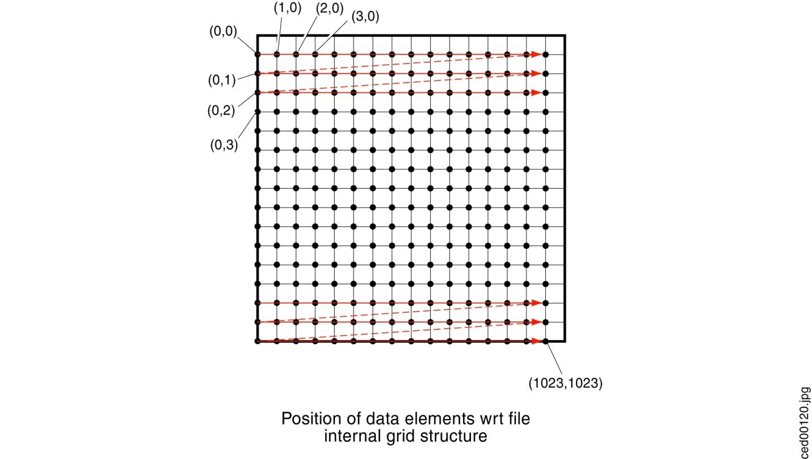
[#img_CornerGridElements,reftext='{figure-caption} {counter:figure-num}']
*_{figure-caption}{counter:figure-num}. Corner Grid Elements_*


Figure 5-3: Center Data Elements as a Function of LODs, illustrates an implementation of center grid data elements with four levels-of-details. Note the shift in position of the data element centers along the x- and y-axis as we shift to progressively coarser levels-of-detail. Note also that the edges of the data elements areas stay aligned with x- and y-axis as we shift to progressively coarser levels-of-detail.

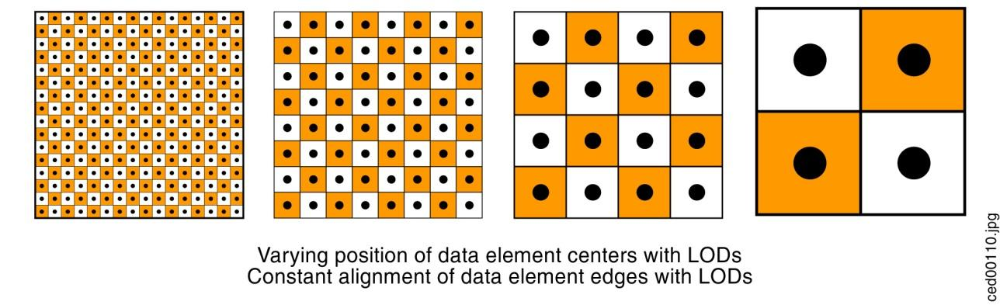
[#img_CenterDataElementsasaFunctionofLODs,reftext='{figure-caption} {counter:figure-num}']
*_{figure-caption}{counter:figure-num}. Center Data Elements as a Function of LODs_*


Figure 5-4: Corner Data Elements as a Function of LODs, illustrates an implementation of corner grid data elements with four levels-of-details. Note the shift in the edge of the data element area along the x- and y-axis as we shift to progressively coarser levels-of-detail. Note also that the position of the data elements areas stay aligned with x- and y-axis as we shift to progressively coarser levels-of-detail.

image::images/image44.jpeg[image,width=529,height=138]
[#img_CornerDataElementsasaFunctionofLODs,reftext='{figure-caption} {counter:figure-num}']
*_{figure-caption}{counter:figure-num}. Corner Data Elements as a Function of LODs_*


Sections 5.6.1, 5.6.2, and 5.6.3 describe all of the raster datasets, namely the Tiled Elevation Dataset, the Tiled Imagery Dataset, and the Tiled Raster Material Dataset; each of these sections describes the associated “corner” versus “center” conventions. This convention is intrinsic to the corresponding dataset and is not parametrical. Any changes to these implicit properties require an additional specific dataset to ensure compatibility with applications.

include::requirements/REQ086.adoc[]

include::requirements/REQ087.adoc[]

[[TiledElevationDataset]]
==== Tiled Elevation Dataset

In a CDB, terrain elevation is depicted by a grid of data elements at regular geographic intervals and at prescribed locations within the tile; each grid element is associated with an elevation value. The resultant is a Digital Elevation Model (DEM) of the earth surface with respect (above or below) to the WGS-84 reference ellipsoid. The Elevation Dataset implicitly follows the corner grid element conventions.

image::images/image47.jpeg[image,width=481,height=153]
[#img_ExampleofDigitalElevationModel(DEM),reftext='{figure-caption} {counter:figure-num}']
*_{figure-caption}{counter:figure-num}. Example of Digital Elevation Model (DEM)_*

The (_x_, _y_) coordinates of each grid element are its longitude and latitude, respectively. The Elevation dataset holds the vertical extent of the terrain. In Figure 5-6: DEM Depicted as a Grid of Elevations at Regular Sample Points, obstacles such as a tower and a building have been overlaid on the terrain grid to demonstrate that obstacle heights are relative to the terrain height.

include::requirements/requirements_class015.adoc[]

image::images/image48.jpeg[image,width=491,height=295]
[#img_DEMDepictedasaGridofElevationsatRegularSamplePoints,reftext='{figure-caption} {counter:figure-num}']
*_{figure-caption}{counter:figure-num}. DEM Depicted as a Grid of Elevations at Regular Sample Points_*

The CDB LOD structure lends itself to variable levels of terrain elevation fidelity, on a per Tile-LOD basis. The selected grid spacing is a function of the height and geographic precision that is desired. Through the use of LODs, one can specify a grid spacing appropriate to the required terrain fidelity requirements. For instance, the accurate depiction of a runway profile (say down to 1 ft height precision) would typically require a relatively fine pitch terrain elevation LOD even if the area is nominally flat. Similarly, the accurate representation of sharp altitude discontinuities (e.g., cliffs) also requires increasingly finer elevation grids to capture the cliff profile correctly.

Negative elevation values do not imply that the elevation point is submerged; rather, a negative value merely indicates that its altitude is below the WGS-84 reference ellipsoid.

The CDB standard defines a number of subordinate elevation components that are used in combination with the primary component of the Elevation Dataset.

[[TerrainMeshTypes]]
===== Terrain Mesh Types

The CDB standard defines two mesh types to connect each grid post to its neighbors. The purpose of the mesh type is to minimize the error in the representation of the Terrain Profile built from the components of the Elevation dataset. Figure 5-7 below illustrates the supported CDB Mesh Types.

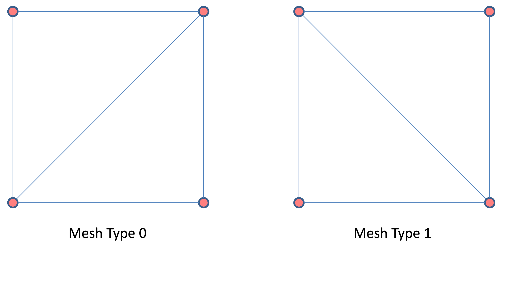
[#img_CDBMeshTypes,reftext='{figure-caption} {counter:figure-num}']
*_{figure-caption}{counter:figure-num}. CDB Mesh Types_*


Mesh type 0 connects the southwest grid post to its northeast neighbor while mesh type 1 does the same for the northwest and southeast posts.

[[DataType]]
====== Data Type

The mesh type is represented by an unsigned integer of a size that is large enough to accommodate the range of mesh types. Currently, there are only two values defined; as such, an 8-bit unsigned integer is sufficient and appropriate to store the mesh type.

[[DefaultValue]]
====== Default Value

By default, when the mesh type is not specified or not available, a value of zero is assumed.

[[ListofallElevationDatasetComponents]]
===== List of all Elevation Dataset Components

The Elevation Dataset is comprised of several components listed here and detailed in the subsequent sections.

[#table_ElevationDatasetComponents,reftext='{table-caption} {counter:table-num}']
*Table 5-11: Elevation Dataset Components*
[cols=",,,,",]
|=====================================================================================================================================================================================================================================================================
|*CS1* |*CS2* |*File +
Extension* |*Component +
Name* |*Component +
Description*
5+^|Dataset 001, Elevation
|001 |001 |*.tif |Primary Terrain Elevation |A grid of data representing the Elevation at the surface of the Earth. Stored as a 1 or 2-channel TIFF image. When present, the second channel provides the mesh type of each grid element.
|001 |002 |*.tif |Primary Terrain Elevation Control |Deprecated
|001 |003 |*.tif |Primary Alternate Terrain Elevation |A grid of data representing the Elevation of the surface of the Earth at specified Latitude and Longitude offsets inside each grid element. Stored as a TIFF image.  The elevation, mesh, and offset data are encoded using either a single image with 4 channels, or 3 separate subfiles.  The preferred and most compatible option is to use 3 subfiles within the TIFF file.
|002..099 |001 |*.tif |Subordinate Terrain Elevation |Deprecated
|002..099 |002 |*.tif |Subordinate Terrain Elevation Control |Deprecated
|100 |001 |*.tif |Subordinate Bathymetry |A grid of data representing the Depth of water with respect to the selected Terrain Elevation component. Store as a 1 or 2-channel TIFF image. When present, the second channel provides the mesh type of each grid element.
|100 |002 |*.tif |Subordinate Alternate Bathymetry |A grid of data representing the Depth of water at specified Latitude and Longitude offsets inside each grid element with respect to the selected Terrain Elevation component. Stored as a 4-channel TIFF image.
|101 |001 |*.tif |Subordinate Tide Elevation |A grid of data representing the average height variation of water with respect to the Primary Terrain Elevation Component.
5+^|Dataset 002, MinMaxElevation
|001 |001 |*.tif |Minimum Elevation |Minimum height (on a per tile LOD basis) of the Primary Terrain Elevation Dataset Component (excluding all cultural features).
|001 |002 |*.tif |Maximum Elevation |Maximum height (on a per tile LOD basis) of the Primary Terrain Elevation Dataset Component (excluding all cultural features).
5+^|Dataset 003, MaxCulture
|001 |001 |*.tif |Primary Maximum Culture Elevation |Maximum height (on a per tile LOD basis) of the bounding boxes of all cultural features held in the vector tiled datasets within the geographic footprint of the area represented by the sample value.
|=====================================================================================================================================================================================================================================================================

[[PrimaryTerrainElevationComponent]]
===== Primary Terrain Elevation Component

The Primary Terrain Elevation component of the Elevation dataset represents the surface of the Earth, i.e., the emerged part of the Earth’s crust, the surface of persistent bodies of water (e.g., ocean, lakes, rivers), and the permanent ice-covered parts of the Earth. However, the Primary Terrain Elevation values exclude the heights of natural vegetation and man-made cultural features.

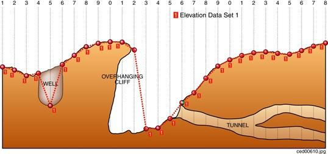
[#img_PrimaryTerrainElevationComponent,reftext='{figure-caption} {counter:figure-num}']
*_{figure-caption}{counter:figure-num}. PrimaryTerrain Elevation Component_*

By definition, the Primary Terrain Elevation component represents a single elevation value at each grid element of the dataset. As a result, each value of the Primary Terrain Elevation component corresponds to the elevation of the highest Earth surface at the specified latitude and longitude coordinate. Consider the example illustrated in Figure 5-8: Primary Terrain Elevation Component. The diagram illustrates a region of Earth with a well, an overhanging cliff, and a network of tunnels. Using solely the Primary Terrain Elevation component, the resulting terrain representation corresponds to the continuous terrain profile represented by the red dotted line; as a result, the underside of the overhanging cliff, the tunnels, and the vertical walls of the well are not represented.

To represent terrain walls, overhanging cliffs, wells, tunnels and mineshafts, modelers are required to supplement the Primary Terrain Elevation component with terrain-conformed 3D models as illustrated in Figure 5-9: Modeling of Wells, Overhanging Cliffs and Tunnels. Embedded within such 3D models are special cutout zones which represent the clipping geometry that is used to cut out the terrain skin.

image::images/image51.jpeg[image,width=539,height=302]
[#img_ModelingofWells,OverhangingCliffsandTunnels,reftext='{figure-caption} {counter:figure-num}']
*_{figure-caption}{counter:figure-num}. Modeling of Wells, Overhanging Cliffs and Tunnels_*

Model cutouts are explained in section 6.5.6.3, Model Cutout Zones and model conforming modes are described in section 6.7, Model Conforming.

[[DataType_2]]
====== Data Type

include::requirements/REQ088.adoc[]

The first channel contains the _Elevation_ of the grid post; the optional second channel indicates the _Mesh Type_ used to connect the four grid posts that are adjacent to the grid element. The elevation is represented by a floating-point or signed integer value expressed in meters and relative to the WGS-84 reference ellipsoid. Integer values for tiles at LOD larger than 0 are scaled according to the following formula:

ifndef::backend-pdf[]
latexmath:[$Elevation = IntValue \times 2^{- LOD}$]
endif::[]
ifdef::backend-pdf[]

endif::[]

include::requirements/REQ089.adoc[]

Integer values can make use of TIFF’s 8-bit, 16-bit, or 32-bit representation.

include::requirements/REQ090.adoc[]

[[DefaultReadValue]]
====== Default Read Value

Simulator client-devices should assume an _Elevation_ value of _Default_Elevation-1_ if the data values of the Primary Terrain Elevation component are not available (files associated with the Primary Terrain Elevation component for the area covered by a tile, at a given LOD or coarser, are either missing or cannot be accessed). The default value is stored in \CDB\Metadata\Defaults.xml. In absence of a default value, the CDB standard states that client-devices use a value of zero.

If the TIFF file has a single channel image, client devices assume a _Mesh Type_ of zero.


[[DefaultWriteValue]]
====== Default Write Value

The files associated with the Primary Terrain Elevation component for area covered by a tile at a given LOD need not be created if the source data is not available. Tiles partially populated with data are not permitted. If the tool generating the Primary Terrain Elevation does not support the optional Mesh Type, the optional second channel of the file need not be created; in which case the TIFF file becomes a single channel image.

[[SupportedCompressionAlgorithm]]
====== Supported Compression Algorithm

The CDB standard supports the LZW compression algorithm for the Primary Terrain Elevation component. Consider compressing the file if its content is not of type floating-point.

[[PrimaryAlternateTerrainElevationComponent]]
===== Primary Alternate Terrain Elevation Component

The accurate delineation of man-made elevation features such as roads, railroads, runways, and natural elevation features such as ridgelines, coastlines requires very high levels-of-detail for the Primary Terrain Elevation component. Such cases typically require an elevation grid pitch of approximately ½ m or better (the equivalent of 8 million triangles per square kilometer) resulting in unnecessary large storage and runtime processing. The Primary Alternate Terrain Elevation component offers an effective solution to handle these use-cases.

The Primary Alternate Terrain Elevation component provides the means to accurately delineate terrain features without having to revert to very fine LODs of the Primary Terrain Elevation component. To do this, the Primary Alternate Terrain Elevation component encodes information that re-positions each elevation sample anywhere within its assigned grid element. In other words, the “phase” of each terrain elevation sample can be specified along the latitude and longitude axes. In effect, the Primary Alternate Terrain Elevation component provides the means to locally increase the altimetric precision of the modeled representation of a terrain profile. While it would be possible for a modeler to manually control the position of individual elevation points, it is expected that the SE tools automate this process by considering elevation constraint points, lineals and polygons (polygons) provided by the modeler.

The Primary Alternate Terrain Elevation dataset is composed of three pieces of data for each grid element: the elevation value, the mesh type code, and the latitude and longitude offset values that locate the elevation point within the grid element.  There are two different Primary Alternate Terrain Elevation encodings, where each store the same data but in different forms.  These encodings are described fully below.

The _Elevation_ value and the _Mesh Type_ are defined in the Primary Elevation dataset.  The offsets are pairs of values that represent latitude and longitude offsets. These values provide positional offsets within the grid spacing for the represented LOD. Note that since the movement of each elevation point is constrained to the inside of its respective grid element, it is impossible to disrupt the (regular grid) topology of the elevation grid. Furthermore, moving elevation points outside the confines of the Tile-LOD is impossible. Figure 5-10 illustrates the valid offset values inside each grid element of a Tile-LOD.

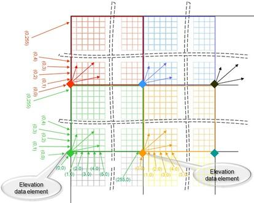
[#img_EncodingofLatLongOffsets,reftext='{figure-caption} {counter:figure-num}']
*_{figure-caption}{counter:figure-num}. Encoding of Lat/Long Offsets (8-bit example)_*

Figure 5-11 illustrates the coverage of grid elements inside a CDB tile. It shows that a grid post is allowed to move inside the area covered by its grid element.

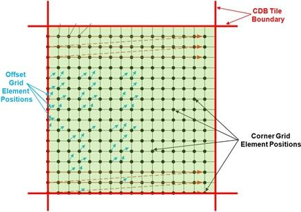
[#img_GridElementCoveragewithinaCDBTile,reftext='{figure-caption} {counter:figure-num}']
*_{figure-caption}{counter:figure-num}. Grid Element Coverage within a CDB Tile_*

The _Latitude Offset_ can be expressed as either an 8, 16 or 32-bit unsigned integer value, or as a 32-bit floating point value ranging from 0.0 to 1.0 (not including 1.0). For the unsigned integer data type, the value is scaled so that each grid element is split into a number of equal parts in the latitude direction, from 0 representing the original latitude to the maximum value of that integer type plus one representing the next grid's latitude. For the floating point data type, the value is scaled so that 0.0 is the original latitude and 1.0 is the next grid latitude. Thus, the elevation point cannot be positioned on the latitude of the next grid element directly north of the current grid element.

The _Longitude Offset_ can be expressed either as an 8, 16, or 32-bit unsigned integer value, or as a 32-bit floating point value ranging from 0.0 to 1.0 (not including 1.0). For the unsigned integer data type, the value is scaled so that each grid element is split into a number of equal parts in the longitude direction, from 0 representing the original longitude to the maximum value of that integer type plus one representing the next grid's longitude. For the floating point data type, the value is scaled so that 0.0 is the original longitude and 1.0 is the next grid longitude. Thus, the elevation point cannot be positioned on the longitude of the next grid element directly east of the current grid element.

NOTE: The highest accuracy offset values for the _Latitude Offset_ and _Longitude Offset_ values are 32-bit unsigned integers.

There are two different encoding methods provided to store the constituents of the Primary Alternate Terrain Elevation.  Both methods store the elevation, mesh type, and the specified latitude and longitude offsets inside each grid element.  However, each method encodes the data in a different manner.

1. The first encoding stores the data elements as a 4-channel TIFF image.  The first channel encodes the _Elevation_ value as either a signed integer or a floating point value as in the Primary Elevation dataset.  The second channel encodes the _Mesh Type_ as an 8-bit unsigned integer value with a 0 or 1 value.  The third and fourth channels encode the _Latitude Offset_ and _Longitude Offset_ as 8-bit unsigned integer values, respectively.
2. The second encoding stores the data elements as a single TIFF image with 3 subfiles with the same dimensions. The first subfile encodes the _Elevation_ value as either a signed integer or a floating point value, using a single channel.  The second subfile encodes the _Mesh Type_ as either an 8-bit unsigned integer or a 1-bit Bilevel image, using a single channel.  The third subfile encodes the _Latitude Offset_ and _Longitude Offset_ values as either 8, 16, or 32-bit unsigned integer or 32-bit floating point values, using two channels respectively.

NOTE: If the Primary Alternate Elevation dataset is used, the subfile data encoding is recommended because it has better compatibility with existing image software.

[[DataType_3]]
====== Data Type

The _Elevation_ and _Mesh Type_ components follow Requirements 89 and 90.

include::requirements/REQ130.adoc[]

[[DefaultReadValue_4]]
====== Default Read Value

If the Primary Alternate Terrain Elevation dataset is not available (files associated with the Primary Alternate Terrain Elevation component for the area covered by a tile, at a given LOD or coarser, are either missing or cannot be accessed), a CDB client-device should use the Primary Terrain Elevation dataset.  In the absence of _Mesh Type_, _Latitude Offset_, or _Longitude Offset_ values, they are assumed to be zero.

[[DefaultWriteValue_5]]
====== Default Write Value

The files associated with the Primary Alternate Terrain Elevation component for an area covered by a tile at a given LOD need not be created if the source data is not available. Tiles partially populated with data are not permitted.

[[SupportedCompressionAlgorithm_6]]
====== Supported Compression Algorithm

The CDB standard supports the LZW compression algorithm for the Primary Alternate Terrain Elevation component. Consider compressing the file if its content is not of type floating-point.


[[TerrainConstraints]]
===== Terrain Constraints

There are many instances where modelers may wish to take advantage of the availability of position and altitude of cultural features in order to locally control the terrain elevation data at a point, along a specified contour line or within a given area. This operation is usually performed off-line by the modeler and requires that the Elevation dataset be edited and re-generated offline.

[#table_PartialListofHypsographyFeatureCodesforOfflineTerrainConstraining,reftext='{table-caption} {counter:table-num}']
*Table 5-12: Partial List of Hypsography Feature Codes (for Offline Terrain Constraining)*
[cols="",width="100%"]
|===
a|
image::images/image55.jpeg[untitled1,width=549,height=424]
|===

The Data Dictionary of CDB standard makes provision for the representation of many hypsography features within the Geopolitical Dataset (see Table 5-12: Partial List of Hypsography Feature Codes (for Offline Terrain Constraining). By virtue of their semantics, these features have no associated modeled representation. The modeler can use these hypsography features to control the generation of the Terrain Elevation grid during the off-line CDB compilation process. This terrain constraining operation can be performed by the SE tools as the CDB is “assembled and compiled”. Note that runtime client-devices do not constrain the Terrain Elevation Dataset to hypsography features.

include::requirements/REQ091.adoc[]

While these hypsography features can be used by the off-line SE tools to control the terrain skinning process, these features can be instead converted into Constraint Features, thereby deferring the terrain constraining process to runtime client-devices.

Constraint Features are features that instruct client-devices to runtime-constrain the terrain Elevation Dataset to a set of prescribed elevation values. This provides modelers the ability to accurately control terrain elevation profiles even if the Terrain Elevation Dataset is of modest resolution and is regularly-gridded; furthermore, the original Elevation Dataset remains unaffected. In effect, the Constraint Features provides a storage-efficient means of capturing terrain contours without having to re-generate / reskin the terrain to a higher-resolution.

Note that this operation is performed on Elevation Datasets that are regularly-gridded or irregularly-gridded. This capability is particularly effective when modelers wish to accurately control terrain elevation profiles but only have regularly-gridded source elevation data of modest resolution at their disposal. Each of these features is associated with vertices that define elevation at the supplied lat-long coordinate(s). This approach provides a level-of-control similar to that of Terrain Irregular Networks (TINs).

The following Constraint Features are used for Online Terrain Constraining:

include::requirements/REQ092.adoc[]

[#table_ListofHypsographyFeatureCodesforOnlineTerrainConstraining,reftext='{table-caption} {counter:table-num}']
*Table 5-13: List of Hypsography Feature Codes (for Online Terrain Constraining)*
[cols="",width="100%"]
|===
a|
image::images/image56.png[image,width=538,height=196]
|===

An example of a point-feature is illustrated in Figure 5-12. This picture shows a storage tank located atop a hill. Given the high terrain relief in this area, the modeler is concerned that the terrain may slope significantly in the immediate vicinity of the storage tank, particularly at coarser LODs of the uniform-sampled terrain elevation grid. As a result, he defines a PointZ Constraint Point feature that coincides with the position of the storage tank. AHGT set to True so that the client-device will constrain the Terrain Elevation dataset to the supplied value.

image::images/image57.jpeg[image,width=395,height=235]
[#img_StorageTankPoint-Feature,reftext='{figure-caption} {counter:figure-num}']
*_{figure-caption}{counter:figure-num}. Storage Tank Point-Feature_*

A second example of this principle illustrated in Figure 5-13, this time applied to a road lineal-feature. This picture shows a divided highway running alongside a mountainous area. Given the high terrain relief in this area, the modeler is concerned that the terrain may slope significantly in the immediate vicinity of the road, particularly at the coarser LODs of the uniform-sampled terrain elevation grid. As a result, he defines a PolyLineZ Constraint Lineal feature that coincides with the centerline of the road; AHGT set to True so that the client-device will constrain the Terrain Elevation dataset to the supplied coordinates of the lineal feature.

The CDB standard has well over 50 feature codes whose semantics are related to abstract elevation-related features (such as CA010 Contour line; CA020 Ridge line; CA025 Valley line; CA026 Breakline …) With the exception of VG018, all of them have semantics that imply a single elevation value. The Feature “Variable Displacement Line”, feature code VG018, is an exception; it allows for a (relative) elevation value for each of the vertices of the “Variable Displacement Line.”

image::images/image58.jpeg[image,width=551,height=275]
[#img_RoadLinealFeature,reftext='{figure-caption} {counter:figure-num}']
*_{figure-caption}{counter:figure-num}. Road Lineal Feature_*

include::requirements/REQ093.adoc[]

The <<LayerPriorityNumberLPN>>LPN attribute is a number in the 0-32767. Low numeric values correspond to low priority. The LPN attribute is used to control the order in which the features are applied to (e.g. rendered into) the Elevation dataset. Features are applied in succession in low-to-high priority order into the Terrain Elevation dataset.

[[MinElevationandMaxElevationComponents]]
===== MinElevation and MaxElevation Components

The MinElevation and MaxElevation components are part of the MinMaxElevation dataset whose purpose is to provide a CDB conformant data store with the necessary data and structure to achieve a high level of determinism in computing line-of-sight intersections with the terrain. The values of each component are with respect to WGS-84 reference ellipsoid. Since both the MinElevation and the MaxElevation values are provided by this standard, any line-of-sight algorithm can rapidly assess an intersection status of the line-of-sight vector with the terrain. An overview of the algorithm governing the line-of-sight computations can be found in Section 8 of Volume 0: OGC CDB Primer (Formerly in Appendix A).

The MinElevation and MaxElevation values follow the “center grid data element” convention of the CDB standard.

The generation of the MinMaxElevation dataset is quite simple. In essence, each center grid element in the MinElevation component represents the lowest altitude for the area represented by that grid element. Likewise, each center grid element in the MaxElevation component represents the highest altitude for the area represented by that grid element.

The MinMaxElevation dataset components are derived from the Primary Terrain Elevation and Primary Alternate Terrain Elevation components. As a result, the MinMaxElevation dataset cannot have more LODs than the Terrain Elevation component it is based on.

[[LevelofDetails]]
====== Level of Details

As can be seen in Figure 5-14: LOD Structure of Raster Datasets, the MinMaxElevation dataset LODs share the same structure as the Elevation dataset.

image::images/image59.png[image,width=338,height=349]
[#img_LODStructureofRasterDatasets,reftext='{figure-caption} {counter:figure-num}']
*_{figure-caption}{counter:figure-num}. LOD Structure of Raster Datasets_*

The generation of each successive LOD of the MinElevation and MaxElevation components is illustrated in Figure 5-15: Generation of LODs for the MinMaxElevation Dataset (1D) and again in more detail in Figure 5-16: Generation of LODs for the MinMaxElevation Dataset (2D).

The detailed algorithm for the generation of the MinMaxElevation dataset is as follows:

1.  For a geocell, determine the finest available LOD of the Primary Terrain Elevation and Primary Alternate Terrain Elevation components, (call it LOD = _n_).
+
For each tile at LOD = _n_, the MinElevation (and MaxElevation) grid elements are generated by taking the corresponding minimum (and maximum) of the surrounding four “corner grid data elements” of LOD = _n_ of the Primary Terrain Elevation component (illustrated as red dots in Figure 5-15: Generation of LODs for the MinMaxElevation Dataset (1D)). If the Primary Alternate Terrain Elevation component exists at LOD = _n_, the value of the Elevation needs to be taken into account because it provides a better estimate of the minimum or maximum elevation of the grid element. In other words, each MinElevation sample value represents the minimum for the area formed by the surrounding four “corner grid data elements” of the Primary Terrain Elevation plus the contribution of the Primary Alternate Terrain Elevation for the grid element. Likewise, each MaxElevation sample represents the maximum of the area formed by the surrounding four “corner grid data elements” of the Primary Terrain Elevation plus the contribution of the Primary Alternate Terrain Elevation for the grid element, illustrated as green dots in Figure 5-15: Generation of LODs for the MinMaxElevation Dataset (1D).

Note that the generation of the rightmost (column) and topmost (row) of values of a tile requires access to the adjacent tiles of the Primary Terrain Elevation. Note however that the availability of Primary Elevation Data at LOD = _n_ within the entire CDB geocell cannot be guaranteed since the CDB permits the generation of the Terrain Elevation Dataset at different resolutions for each geographic area as illustrated in Figure 5-18: Availability of LODs for Elevation and MinMaxElevation Datasets.

As a result, a slight adjustment to the above algorithm is needed in order to cater to the case where Elevation data is missing in adjacent tiles. There are two cases to consider.

1.  If Elevation data in the adjacent tiles (above and/or to the right) is not available at _n_ ≥ LOD ≥ −10 , then one or more of the 4 corner grid elements samples will be missing, hence will not be available to “participate” in the min() or max() function. In other words, the min() and max() functions should be designed to cater to a variable number of inputs depending on the availability of valid corner grid elements.
2.  If Elevation data in adjacent tile(s) is not available at LOD = _n_ but is available at a coarser LOD (call it LOD = _m_, where _m_ ≥ −10), then the corner grid Elevation values of the LOD = _m_ should be propagated to finer LOD = _n_ so that they can participate in the min() or max() functions. This principle is illustrated in Figure 5-17: Generation of LODs for the MinMaxElevation Dataset (1D) – Special Case.

Each grid element value of the next coarser level-of-detail (LOD = _n-1_) of the MinElevation (and MaxElevation) dataset is generated by taking the minimum (and maximum) of four surrounding values of LOD = _n_ of the MinElevation (and MaxElevation) dataset, illustrated as red dots in Figure 5-15: Generation of LODs for the MinMaxElevation Dataset (1D).
+
Repeat steps 2 and 3 for levels of detail LOD = _n-2_, _n-3_, until LOD −10 is reached.
+
Perform step 4, but this time with LOD = _m,_ (_m_ ≥ −10)_._ Note that if Primary Elevation data in adjacent tile(s) is not available at LOD = _m_ but is available at a coarser LOD (call it LOD = _p_, where _p_ ≥ −10), then the corner grid Elevation values of the LOD = _p_ must be propagated to finer LOD = _m_ so that they can participate in the min() or max() functions.
+
Repeat until all LODs have been processed. Note that the MaxElevation tiles at LOD = −10 contain a single value which represents the highest elevation point for the entire geocell. Likewise, each of the MaxElevation tiles at LOD = −9 contains four values which correspond to the highest elevation points in each of the four quadrants of the corresponding geocell.

image::images/image60.jpeg[image,width=544,height=457]
[#img_GenerationofLODsfortheMinMaxElevationDataset(1D),reftext='{figure-caption} {counter:figure-num}']
*_{figure-caption}{counter:figure-num}. Generation of LODs for the MinMaxElevation Dataset (1D)_*

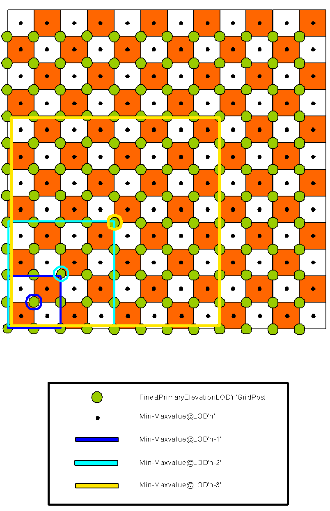
[#img_GenerationofLODsfortheMinMaxElevationDataset(2D),reftext='{figure-caption} {counter:figure-num}']
*_{figure-caption}{counter:figure-num}. Generation of LODs for the MinMaxElevation Dataset (2D)_*

image::images/image62.jpeg[untitled3,width=557,height=461]
[#img_GenerationofLODsfortheMinMaxElevationDataset(1D)–SpecialCase,reftext='{figure-caption} {counter:figure-num}']
*_{figure-caption}{counter:figure-num}. Generation of LODs for the MinMaxElevation Dataset (1D) – Special Case_*

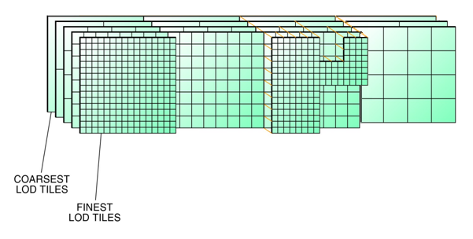
[#img_AvailabilityofLODsforElevationandMinMaxElevationDatasets,reftext='{figure-caption} {counter:figure-num}']
*_{figure-caption}{counter:figure-num}. Availability of LODs for Elevation and MinMaxElevation Datasets_*

The CDB standard does not require that the entire LOD hierarchy be stored for the MinMaxElevation dataset. In fact, it is possible to omit some of the finest levels-of-detail from the hierarchy. The CDB Standard recommends that the MinElevation and MaxElevation need only be stored to LOD = _n_ - 4 and coarser (where _n_ is the finest available LOD of the Primary Terrain Elevation component in a geocell). For example, if Primary Terrain Elevation data is available for LOD = 15, then the MinMaxElevation hierarchy need only be provided for LOD = -10 to LOD = 11. Note, that LOD = -10 to LOD = 0 are always required subject to the availability of Primary Terrain Elevation data (these guidelines are explained in more detail in section 5.6.1.6.4, Default Write Value).

Note that the presence of the MinMaxElevation dataset has a negligible effect on the size of the CDB. In fact, the dataset adds only 1% of additional storage over and above that required by the Primary Terrain Elevation component. This is a small price to pay in order to provide the means to significantly speed-up line-of-sight computations in applications requiring the utmost in determinism and real-time.

[[DataType_7]]
====== Data Type

include::requirements/REQ094.adoc[]

[[DefaultReadValue_8]]
====== Default Read Value

The Line-of-Sight algorithm is described in Section 8 Volume 0 - CDB Primer (Formerly Appendix A). Note that the algorithm starts with the coarsest LOD of the MinMaxElevation dataset; the algorithm recursively executes with progressively finer level-of-detail versions of the MinMaxElevation dataset until the algorithm decides it no longer needs to access finer levels or until the algorithm no longer finds finer levels of the MinMaxElevation dataset.

If none of the LODs of the MinMaxElevation dataset are provided, then simulator client-devices _SHOULD_ assume default MinElevation and MaxElevation values. The default values for these datasets can be found in \CDB\Metadata\Defaults.xml and can be provided to the client-devices on demand. Handling of defaults falls under the following two cases.

* CASE I: In the case where the tile-LOD for the MinElevation and the Primary Terrain Elevation components are both missing, the CDB Specification recommends a default setting of Default_MinElevation_CaseI = Default_Elevation-1. Similarly, where a tile-LOD for MaxElevation and the Primary Terrain Elevation components are both missing, the CDB standard recommends a default setting of Default_MaxElevation_CaseI = Default_Elevation-1.
* CASE II: In the case where the tile-LOD for the MinElevation is missing and the Primary Terrain Elevation is not missing, the CDB standard recommends a default setting of Default_MinElevation_CaseII = as supplied in Defaults.xml. In the event where this default value is not supplied, the CDB standard recommends that client-devices use a default value of -400 m (corresponding to the shore of the Dead Sea) for MinElevation.

Similarly, when MaxElevation is missing and the Primary Terrain Elevation is not missing, the CDB standard recommends a default setting of Default_MaxElevation_CaseII = as supplied in Defaults.xml. In the event this default value is not supplied, the CDB standard recommends that client-devices use a default value of 8846 m (corresponding to the peak of Mount Everest) for MaxElevation.

[[DefaultWriteValue_9]]
====== Default Write Value

The files associated with the MinElevation and MaxElevation components for the area covered by a tile at a given LOD should not be created if the Primary Terrain Elevation data is not available.

The CDB standard recommends that the MinElevation and MaxElevation components be generated in accordance to the following guidelines.

* If the finest LOD of the Primary Terrain Elevation component is available at LOD ≥ 4, then all LODs ranging from -10 ≤ LOD ≤ (_n_ – 4) of the MinElevation and MaxElevation components should be generated (where _n_ is the finest available LOD of the Primary Terrain Elevation component). The technique illustrated in Figure 5-15: Generation of LODs for the MinMaxElevation Dataset (1D) should be used to populate the LOD hierarchy. Gaps (i.e., missing levels) in the MIP-MAP hierarchy are not permitted. It is not permitted to generate MinElevation and MaxElevation components tiles that are partially populated with data.
* If the finest available LOD of the Primary Terrain Elevation component is available at LOD ≤ 3, then all LODs ranging from -10 ≤ LOD ≤ 0 of the MinElevation and MaxElevation components should be generated. The technique illustrated in Figure 5-15: Generation of LODs for the MinMaxElevation Dataset (1D) should be used to populate the LOD hierarchy. Gaps (i.e., missing levels) in the MIP-MAP hierarchy are not permitted. It is not permitted to generate MinElevation and MaxElevation components tiles that are partially populated with data.

In the event where parts of a MinElevation tile cannot be determined due to missing primary elevation tiles, the CDB standard recommends to use a default value of Default_MinElevation_CaseIII, -400 m (corresponding to the shore of the Dead Sea) for MinElevation. Similarly, in the event where parts of a MaxElevation tile cannot be determined due to missing primary elevation tiles, the CDB Specification recommends to use a default value of Default_MaxElevation_CaseIII, 8846 m (corresponding to the peak of Mount Everest) for MaxElevation. Figure 5-19: Missing MinMaxElevation Datasets shows this case:

image::images/image64.png[image,width=551,height=508]
[#img_MissingMinMaxElevationDatasets,reftext='{figure-caption} {counter:figure-num}']
*_{figure-caption}{counter:figure-num}. Missing MinMaxElevation Datasets_*

[[SupportedCompressionAlgorithm_10]]
====== Supported Compression Algorithm

The CDB standard supports the LZW compression algorithm for both the MinElevation and MaxElevation components. Consider compressing the file if its content is not of type floating-point.


[[MaxCultureComponent]]
===== MaxCulture Component

The purpose of the MaxCulture component is to provide the necessary data and structure for an optimal level of determinism in the computation of line-of-sight, path finding and obstacle avoidance algorithms with the cultural features. The values of this component are based on the heights of culture features with respect to the corresponding LOD of the culture, be it its bounding sphere, its bounding box or its modeled representation (if supplied). In this context, the cultural features of the CDB are those represented by all vector tiled datasets excluding those related to NAV.

Since MinElevation, MaxElevation and MaxCulture components are defined, any line-of-sight algorithm can rapidly assess an intersection status of the line-of-sight vector with the terrain and/or with the cultural features of the CDB. Furthermore, since the MaxCulture component follows the same conventions as the MinElevation and MaxElevation components, it is easy for the LOS algorithm to combine the values to determine the highest/lowest point (with or without cultural features) in a given geographic area. The culture-variant of the LOS algorithm is virtually identical to the terrain-only case. Before undertaking its computations, the LOS algorithm must add the values of MaxCulture to the MaxElevation values, once adjusted for LOD, and then perform the first LOS determination based on this. If an intersection is detected with MaxCulture, the final determination of intersection is conducted at first with the bounding box of the cultural feature, then with the actual geometry of the cultural feature (if available).

Note that the geographic areas where MaxCulture is zero can be used to quickly identify the absence of any obstacles that can potentially affect the route of an entity.

The MaxCulture component also follows the “center grid data element” convention of the CDB Specification. In the case where a cultural feature has no modeled representation, the MaxCulture component must be generated from the feature’s bounding volume that overlaps each MaxCulture grid data element. If the feature has an associated modeled representation, the grid data of the MaxCulture component must be generated from the model geometry.


[[LevelofDetails_11]]
====== Level of Details

The coarser LODs of the MaxCulture component are iteratively derived from the finest generated LOD.

Since the MaxCulture component is intended to be used in conjunction with the MaxElevation component, it is recommended that the number of LODs for the MaxCulture component be equal or greater than the MaxElevation component.

[[DataType_12]]
====== Data Type

include::requirements/REQ095.adoc[]

[[DefaultReadValue_13]]
====== Default Read Value

If none of the LODs of the MaxCulture dataset are provided, then simulator client-devices should assume default MaxCulture values. The default values for these datasets can be found in \CDB\Metadata\Defaults.xml and can be provided to the client-devices on demand. Handling of defaults fall under the following two cases.

* CASE I: In the case where the MaxCulture component is missing, but there is at least one vector dataset; client-devices should assume a default MaxCulture value of Default_MaxCulture_CaseI. In the event this default value is not supplied, the CDB standard recommends that client-devices use a value of 600 m (corresponding to the tip of World’s tallest tower plus a margin of 47 m).
* CASE II: In the case where the MaxCulture component is missing, but there is not a single vector dataset; client-devices should assume a default MaxCulture value of Default_MaxCulture_CaseII. In the event this default value is not supplied, the CDB standard recommends that client-devices use a value of 0 m.

[[DefaultWriteValue_14]]
====== Default Write Value

The files associated with the MaxCulture components for the area covered by a tile at a given LOD _should not_ be created if the Primary Terrain Elevation data is not available.

The CDB standard strongly recommends that the MaxCulture dataset be generated in accordance to the following guidelines.

1.  If the finest LOD of any vector tiled datasets is available at LOD ≥ 6, then all LODs ranging from -10 ≤ LOD ≤ (_n_ – 6) of the MaxCulture dataset should be generated (where _n_ is the finest available LOD of any vector tiled datasets). The technique illustrated in Figure 5-15: Generation of LODs for the MinMaxElevation Dataset (1D) should be used to populate the LOD hierarchy. Gaps (i.e., missing levels) in the MIP-MAP hierarchy are not permitted. It is not permitted to generate MaxCulture dataset tiles that are partially populated with data.
+
If the finest LOD of any vector tiled datasets is available at LOD ≤ 5, then all LODs ranging from -10 ≤ LOD ≤ 0 of the MaxCulture dataset should be generated (where _n_ is the finest available LOD of any vector tiled datasets). The technique illustrated in Figure 5-15: Generation of LODs for the MinMaxElevation Dataset (1D) should be used to populate the LOD hierarchy. Gaps (i.e., missing levels) in the MIP-MAP hierarchy are not permitted. MaxCulture dataset tiles that are partially populated with data should not be used.

[[SupportedCompressionAlgorithm_15]]
====== Supported Compression Algorithm

The CDB standard supports the LZW compression algorithm for the MaxCulture component. Consider compressing the file if its content is not of type floating-point.

[[SubordinateBathymetryComponent]]
===== Subordinate Bathymetry Component

The Subordinate Bathymetry component consists of a grid of data values that represent the depth of water (be it of fresh water bodies or of the ocean) with respect to the corresponding data values of the Terrain Elevation (be it the Primary Terrain Elevation or Primary Alternate Terrain Elevation components). The Subordinate Bathymetry component follows the corner grid element conventions.

The generation of Bathymetry values is best explained by the illustration found in Figure 5-20: Primary Terrain Elevation and Subordinate Bathymetry Components. In areas where Primary Terrain Elevation values correspond to the surface of a body of water, each Bathymetry value represents the height difference between the corresponding Primary Terrain Elevation value (the reference) and the Earth’s Crust. In all other areas, the Bathymetry values represent No Data footnote:[No Data is defined by a tag in the TIFF header; default is zero.]. Section 6.8 of Volume 7: OGC CDB Data Model Guidance (formerly Appendix A) provides the mandated behavior of client-devices when reading a LOD of a primary component and combining it with another LOD of a subordinate component such as the Bathymetry.

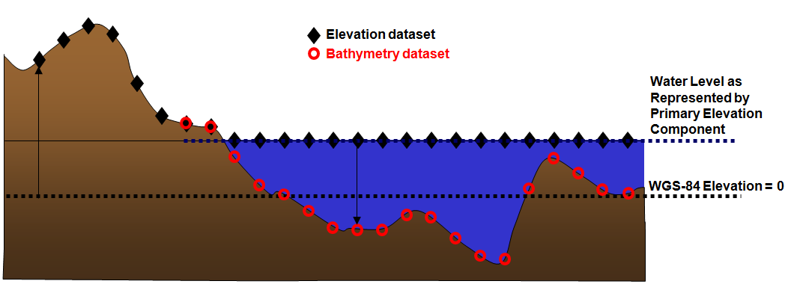
[#img_PrimaryTerrainElevationandSubordinateBathymetryComponents,reftext='{figure-caption} {counter:figure-num}']
*_{figure-caption}{counter:figure-num}. Primary Terrain Elevation and Subordinate Bathymetry Components_*


Positive (depth) values of Bathymetry indicate that the corresponding grid element is submerged, i.e., the Earth’s Crust is below the elevation values in the Primary Terrain Elevation component. Other values of Bathymetry (zero or negative) indicate that the corresponding grid element is not submerged.

In areas that are submerged, the Primary Terrain Elevation component represents the surface of the water, not the elevation of the Earth’s Crust. The height of any point of the Earth’s Crust with respect to the WGS-84 reference ellipsoid can be determined using Equation (eq. 5-3).

[cols=",,",]
|==================================
| |_E~e~ = E – max(0,B)_ |(eq. 5-3)
|==================================

Where _E_ = Terrain Elevation component

_B_ = Bathymetry component

_E~e~_ = Earth’s Crust Elevation

The resulting profile of the Earth’s Crust is shown in Figure 5-21: Derived Earth Elevation Values.

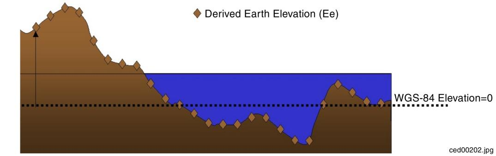
[#img_DerivedEarthElevationValues,reftext='{figure-caption} {counter:figure-num}']
*_{figure-caption}{counter:figure-num}. Derived Earth Elevation Values_*

The Bathymetry component needs to be provided only in areas on the Earth’s surface where water is present. Below is another example of the relations between the Primary Elevation component and the Subordinate Bathymetry component.

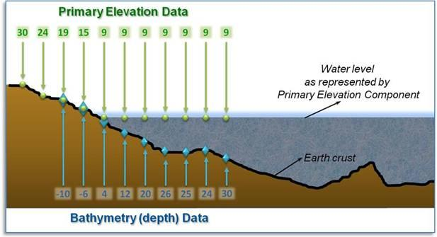
[#img_ExampleofPrimaryTerrainElevationandBathymetryComponents,reftext='{figure-caption} {counter:figure-num}']
*_{figure-caption}{counter:figure-num}. Example of Primary Terrain Elevation and Bathymetry Components_*

include::requirements/requirements_class016.adoc[]

[[DataType_16]]
====== Data Type

include::requirements/REQ096.adoc[]

[[DefaultReadValue_17]]
====== Default Read Value

Simulator client-devices should assume a _Depth_ value of _Default_Bathymetry_ if the data values are not available. The default value can be found in \CDB\Metadata\Defaults.xml. In the case where the default value cannot be found, the CDB standard states that client-devices use a value of zero. The default _Mesh Type_ is zero.

[[DefaultWriteValue_18]]
====== Default Write Value

The files associated with the Subordinate Bathymetry component for area covered by a tile at a given LOD need not be created if the source data is not available. Tiles partially populated with data are not permitted. If the tool generating the Subordinate Bathymetry component does not support the optional Mesh Type, the optional second channel of the file need not be created; in which case the TIFF file becomes a single channel image.

[[SupportedCompressionAlgorithm_19]]
====== Supported Compression Algorithm

The CDB standard supports the LZW compression algorithm for the Subordinate Bathymetry component. Consider compressing the file if its content is not of type floating-point.

[[SubordinateAlternateBathymetryComponent]]
===== Subordinate Alternate Bathymetry Component

The Subordinate Alternate Bathymetry component is similar to the Primary Alternate Terrain Elevation component: it provides a better delineation of the shoreline and bottom of water bodies such as oceans, lakes, and rivers. To do this, the Subordinate Alternate Bathymetry component encodes information that re-positions each depth samples anywhere within its assigned grid element. In other words, the “phase” of each bathymetry depth sample can be specified along the latitude and longitude axes. In effect, the Subordinate Alternate Bathymetry component provides the means to locally increase the precision of the modeled representation of the floor of water bodies. Again, it is expected that the SE tools produce the Subordinate Alternate Bathymetry component by considering constraint points, lineals and polygons provided by the modeler.

The constituents of the Subordinate Alternate Bathymetry are the depth and mesh type at the specified latitude and longitude offsets inside each grid element. These four constituents are represented as 4 channels of a TIFF image.

[[DataType_20]]
====== Data Type

include::requirements/REQ097.adoc[]

[[DefaultReadValue_21]]
====== Default Read Value

Simulator client-devices should assume a _Depth_ of zero (as well as a _Latitude_ and _Longitude Offsets_ of zero and a _Mesh Type_ of zero) when the Subordinate Alternate Bathymetry component is not available.


[[DefaultWriteValue_22]]
====== Default Write Value

The files associated with the Subordinate Alternate Bathymetry component for an area covered by a tile at a given LOD need not be created if the source data is not available. Tiles partially populated with data are not permitted.


[[SupportedCompressionAlgorithm_23]]
====== Supported Compression Algorithm

The CDB standard supports the LZW compression algorithm for the Subordinate Alternate Bathymetry component. *Consider compressing the file if its content is not of type floating-point.*

[[SubordinateTideComponent]]
===== Subordinate Tide Component

The Tide component represents the height variation of water (be it of fresh water bodies of water or of the ocean) with respect to the Primary Elevation component. The Tide component implicitly follows the corner grid element conventions. Each value in the Tide component must be matched to the available LOD elevation values of the Primary Elevation component.

The Tide component needs only to be provided in areas on the Earth’s surface that are in the vicinity of water bodies. The information held in the Terrain Elevation and Tide components permits a means for client-devices to accurately determine the shoreline profile as a function of the tide level. When provided, the Tide component permits client devices to compute the elevation (with respect to the WGS-84 reference ellipsoid) in areas permanently or potentially submerged. The Tide component need not be limited to oceans; it can also be used to specify the variation of height of any body of water (rivers, lakes, gulfs, etc.).

The Tide component also permits simulation of tides that varies with location. In order to determine the shoreline profile at a given location, the simulator client-devices must first determine the height of (say) the ocean in the immediate vicinity of that location. The sophistication of this calculation can vary greatly with simulation fidelity. A discussion of possible alternatives regarding the fidelity of simulation Tide simulation models can be found in Section 6.9 of Volume 7: CDB Data Model Guidance (formerly Appendix A).

With the CDB Tide component, simulator client-devices can readily determine the height of the ocean (or any water surface whose height varies) at any point and as a result can derive the geometry of the shoreline footnote:[While a stored vector shoreline representation might have provided a more straightforward means of representing the shoreline geometry for some client-devices, that representation was rejected because it would not lend itself to determining the variation of the shoreline geometry with varying tides.]. While a stored vector shoreline representation might provide a more straightforward means of representing the shoreline geometry for some client-devices, that representation would not lend itself to determining the variation of the shoreline geometry with varying tides. Furthermore, a vector representation of the shoreline geometry would essentially be a single-level of detail of the shoreline geometry; as a result, it would need to be generated at a resolution designed to match the highest LOD Terrain Elevation data. Coarser shoreline LODs would essentially be samples of the shoreline vector geometry at progressively greater spatial intervals.

The CDB Tide component represents the height variation of water surfaces anywhere on the Earth’s surface. The variation need not be limited to the effect of tides footnote:[For instance, it could represent the nominal seasonal variations of water level of lakes and rivers.]. The Tide component represents the height variation of the water surface above and below the mean water surface level.

image::images/image70.jpeg[image,width=540,height=223][[h.4hae2tp]]
[#img_TerrainElevationBathymetryandTideComponents,reftext='{figure-caption} {counter:figure-num}']
*_{figure-caption}{counter:figure-num}. Terrain Elevation, Bathymetry and Tide Components_*

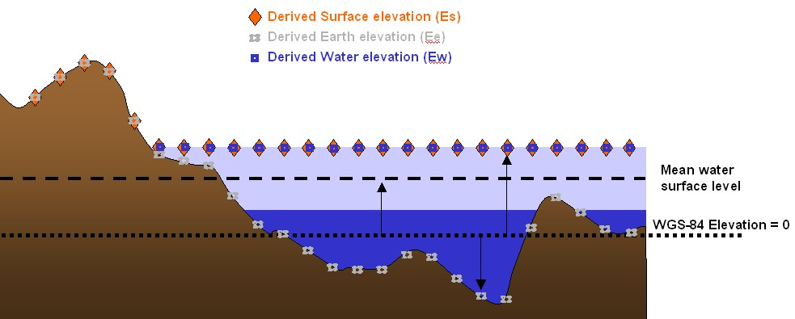
[#img_DerivedEarthElevation,WaterElevationandSurfaceElevationValues,reftext='{figure-caption} {counter:figure-num}']
*_{figure-caption}{counter:figure-num}. Derived Earth Elevation, Water Elevation and Surface Elevation Values_*

From the above components, simulation client devices can compute a) the elevation of the water Ew, b) the elevation of the earth’s surface Ee (be it submerged or potentially submerged), and c) the surface elevation of the earth / water Es. These computations can be performed in all areas where the Bathymetry and Tide components are available (e.g., areas submerged or potentially submerged). The values for E~w~, E~e~, and E~s~ are referenced to the WGS-84 mean sea-level reference level. Equation (eq. 5-4) though (eq. 5-6) can be used to compute Ew, Ee and Es:

[cols=",,",]
|======================================
| |_E~w~ = E + min(0,B) + T_ |(eq. 5-4)
| |_E~e~ = E – max(0,B)_ |(eq. 5-5)
| |_E~s~ = max(E~e~, E~w~)_ |(eq. 5-6)
|======================================

Where _E_ = Terrain Elevation component

_B_ = Bathymetry component

_T_ = Tide component

_E~w~_ = Derived water elevation value

_E~e~_ = Derived earth elevation value

_E~s~_ = Derived surface elevation

Client devices interested in computing the height of the ownship over terrain or water can use equation (eq. 5-7).

[cols=",,",]
|=============================
| |_HAT = O - E~s~_ |(eq. 5-7)
|=============================

Where _O_ = Ownship Altitude

Finally, client devices interested in determining the depth of water _D_, can use equation (eq. 5-8).

[cols=",,",]
|======================================
| |_D = min(0, E~w~ - E~e~)_ |(eq. 5-8)
|======================================

*NOTE:* A computed value of _D_ of 0 means the point is above water.


[[DataType_24]]
====== Data Type

include::requirements/REQ098.adoc[]

[[DefaultReadValue_25]]
====== Default Read Value

Simulator client-devices should assume default Tide values if the data values are not available (files associated with the Tide component for the area covered by a tile, at a given LOD or coarser, are either missing or cannot be accessed). The default value can be provided to the client-devices on demand. The CDB standard recommends a default tide value of 2.5m (published average magnitude of tides worldwide).

Simulator client-devices should assume a default Tide value of Default_Tide if the data values are not available (files associated with the Tide component for the area covered by a tile, at a given LOD or coarser, are either missing or cannot be accessed). The default value can be found in \CDB\Metadata\Defaults.xml and can be provided to the client-devices on demand. In the case where the default value cannot be found, the CDB standard recommends that client-devices use a default tide value of 2.5m (average magnitude of tides worldwide).

[[DefaultWriteValue_26]]
====== Default Write Value

The files associated with the Tide component for area covered by a tile at a given LOD need not be created if the source data is not available. Tiles partially populated with data are not permitted.

[[SupportedCompressionAlgorithm_27]]
====== Supported Compression Algorithm

The CDB standard supports the LZW compression algorithm for the Tide component. Consider compressing the file if its content is not of type floating-point.

[[TiledImageryDataset]]
==== Tiled Imagery Dataset

In a CDB compliant data store, the terrain imagery is depicted on a grid at regular geographic intervals. Each of the components of the Imagery Dataset corresponds to the raster imagery draped over the terrain skin derived from the Primary Terrain Elevation Dataset. The Raster Imagery Dataset implicitly follows the center grid element conventions.

The CDB standard defines a set of alternate terrain imagery representations corresponding to the visible spectrum terrain imagery at different periods of the year. Together, these representations are stored in a set of Visible Spectrum Terrain Imagery (VSTI) components. Each of these representations can be either monochrome or color.

In addition, the CDB standard defines a subordinate light map representation that can be applied to the selected VSTI component for a night-time representation of lighting patterns created by the projection of light-sources onto the terrain surface. The light-map can be either monochrome or color.

[[RasterBasedImageryFileStorageExtensionNaming]]
===== Raster-Based Imagery File Storage Extension Naming

As briefly mentioned earlier in Section 1.4.10, the CDB standard introduces the notion of support for JPEG 2000 raster-based storage format for raster imagery files. Since the CDB standard enforces a unique filename for each dataset file, a different file extension is required for such a dataset file format to distinguish it from TIFF for other raster-based datasets, thus any raster imagery dataset shall be stored under the “.jp2” file extension.

[[JPEG2000Metadata]]
====== JPEG 2000 Metadata

In addition to the compressed image data, the JPEG 2000 files may contain metadata to hold additional data boxes. They are the Intellectual Property box, XML box, URL box and UUID box. Among them, the XML box is perfectly suited to store formatted metadata concerning the source of this data, or the security attributes associated with the file usage. Below is the XML format description of such metadata to be supported as part of a CDB implementation. It is to be noted that the existence of this XML metadata box does not contain any information necessary for decoding the image portion, and the correct interpretation of the XML data will not change the visual appearance of the image. This metadata is divided in two distinct elements, namely ORIGIN and SECURITY.

include::requirements/requirements_class017.adoc[]

[[Originofdata]]
====== Origin of data

include::requirements/REQ099.adoc[]

[[Security]]
====== Security

include::requirements/REQ100.adoc[]

[[JPEG2000XMLExample]]
====== JPEG 2000 XML Example

[#table_XMLTagsfortheJPEG 2000Metadata,reftext='{table-caption} {counter:table-num}']
*Table 5-14: XML Tags for the JPEG 2000 Metadata*


```
<?xml version="1.0" encoding="UTF-8"?>
<JP2METADATA name="JPEG2000XML"
             xmlns:xsi="http://www.w3.org/2001/XMLSchema-instance"
             xsi:noNamespaceSchemaLocation="JP2MetaData.xsd">
	<ORIGIN>
		<datetime>			</datetime>
		<originatingstationid>		</originatingstationid>
		<originatorname>		</originatorname>
		<originatorphone>		</originatorphone>
		<originatororganization>	</originatororganization>
		<originatoraddress>		</originatoraddress>
		<originatoremail>		</originatoremail>
		<originatorwebsite>		</originatorwebsite>
		<originatorremark>		</originatorremark>
	</ORIGIN>
	<SECURITY>
		<classificationlevel>		</classificationlevel>
		<system>			</system>
		<codewords>			</codewords>
		<controlhandling>		</controlhandling>
		<releaseinstructions>		</releaseinstructions>
		<declassificationtype>		</declassificationtype>
		<declassificationdate>		</declassificationdate>
		<declassificationexemption>	</declassificationexemption>
		<filedowngrade>		</filedowngrade>
		<filedowngradedate>		</filedowngradedate>
		<classificationtext>		</classificationtext>
		<classificationauthoritytype>	</classificationauthoritytype>
		<classificationauthority>	</classificationauthority>
		<classificationreason>		</classificationreason>
		<securitysourcedate>		</securitysourcedate>
		<controlnumber>		</controlnumber>
		<filecopynumber>		</filecopynumber>
		<numberofcopies>		</numberofcopies>
	</SECURITY>
</JP2METADATA>
```

[[ListofallImageryDatasetComponents]]
===== List of all Imagery Dataset Components

The Imagery Dataset is comprised of several components listed here and detailed in the subsequent sections.

[#table_ImageryDatasetComponents,reftext='{table-caption} {counter:table-num}']
*Table 5-15: Imagery Dataset Components*
[cols=",,,,",]
|===============================================================================================================================================================================================================================================================================================================================================================================================================================================================================
|*CS1* |*CS2* |*File +
Extension* |*Component +
Name* |*Component +
Description*
|Dataset 004, Imagery | | | |
|001 |001 |*.jp2 |Yearly VSTI Representation |Corresponds to the terrain imagery draped (orthographically) over the terrain skin derived from the Primary Terrain Elevation Dataset. This is the preferred Dataset Component for year-round representative terrain imagery. It may be single-channel monochrome or 3-channel color image. This Dataset Component follows the center grid conventions. Can be used interchangeably with all other Alternate VSTI representations.
|002 |001..004 |*.jp2 |Seasonal VSTI Representations |Deprecated – Replaced with Quarterly VSTI Representations below
|003 |001..012 |*.jp2 |Monthly VSTI Representations |Monthly equivalent of Yearly VSTI representation, i.e., this is the preferred Dataset Component for month-based representative terrain imagery. Can be used interchangeably with all other Alternate VSTI representations.
|004 |001..004 |*.jp2 |Quarterly VSTI Representations |Equivalent to Yearly VSTI representation but for the selected quarter of the year. Can be used interchangeably with all other Alternate VSTI representations.
|005 |001 |*.jp2 |Subordinate VSTLM |Corresponds to the terrain light maps draped (orthographically) over the terrain skin derived from the Primary Terrain Elevation Dataset. It may be single-channel monochrome or 3-channel color image. This Dataset Component follows the center grid conventions.
|===============================================================================================================================================================================================================================================================================================================================================================================================================================================================================

[[VisibleSpectrumTerrainImageryVSTIComponents]]
===== Visible Spectrum Terrain Imagery (VSTI) Components

The VSTI component provides the visible spectrum imagery that is geographically draped (and usually ortho-rectified) over the geometric representation of the terrain skin that is stored in the Primary Terrain Elevation Dataset. The CDB standard provides the means to (optionally) store alternate representations of the terrain imagery in order to provide the simulation client-devices terrain representations that best represent the time-of-year being simulated. There are three alternate approaches to the generation and storage of the VSTI Imagery Dataset and they are organized as follows:

* *Yearly:* The first approach requires a single, year-round representation of the terrain imagery;
* *Quarterly:* The second approach requires four variants of the terrain imagery, one per calendar-year quarter footnote:[Each quarter corresponds to specific months of the year. This concept of calendar-year quarters is distinct from the concept of seasons whereby the later depends on whether the user is in the northern or the southern hemisphere of Earth.]; and
* *Monthly:* The third approach requires monthly-variants of the terrain imagery, one per month.

The VSTI Imagery Datasets can be provided and stored in any combination, be it yearly, quarterly and/or monthly.

The VSTI dataset implicitly follows the center grid element conventions.

image::images/image73.jpeg[image,width=430,height=299]
[#img_ProjectionofTerrainImageryDatasetontoTerrainElevationDataset,reftext='{figure-caption} {counter:figure-num}']
*_{figure-caption}{counter:figure-num}. Projection of Terrain Imagery Dataset onto Terrain Elevation Dataset_*

The CDB grid representation of this raster imagery assumes a gamma of 1.0 (see Volume 0: OGC CDB Companion Primer for the CDB standard: Model and Physical Database Structure, Section 9) and a color space model in conformance with https://answers.microsoft.com/en-us/windows/forum/all/is-the-srgb-mode-still-the-only-one-that-windows/5abf7c11-8f71-4f6d-801e-2096816f409f[Windows sRGB] or YUV Color Space Profile. sRGB is the default color space in Windows, based on the IEC 61966-2-1 Standard. CDB terrain imagery can optionally be compressed into JPEG 2000 with varying degrees of quantization (quality) levels. However, if using a quantization level different than 0, lossy image results in possible image degradation and artifact addition.

include::requirements/requirements_class018.adoc[]

[[DataType_28]]
====== Data Type

include::requirements/REQ101.adoc[]

[[DefaultReadValue_29]]
====== Default Read Value

Simulator client-devices _should_ default the VSTI values if the data values are not available (files associated with the VSTI dataset for the area covered by a tile, at a given LOD or coarser, are either missing or cannot be accessed). The default value can be found in \CDB\Metadata\Defaults.xml and can be provided to the client-devices on demand. In the case where the default value cannot be found, the CDB standard recommends that client-devices use a default value of half-intensity (0.5). Note that the default values are expressed as floating-point numbers ranging from 0.0 to 1.0. This ensures that the default is interpreted in a consistent manner independently of the data representation in the *.jp2 file.

The following is implementation guidance for CDB enabled clients. Simulation client-devices _should_ select the VSTI texture that best represents the simulation date. The retrieval of VSTI textures by the client-devices _should_ follow the following conventions.

* The simulation date _should_ be converted to a month of the year.
* If the monthly VSTI representation for that month number is absent, then the client-device _should_ determine which quarter of the year it is and search for the quarterly representation of the VSTI.
* If a quarterly representation is absent, then the client-device _should_ search for a yearly representation of the VSTI.
* If the yearly representation is absent, then the client-device _should_ default to the Yearly default values found in \CDB\Metadata\Defaults.xml as follows:
a.  Default_VSTI_Y_Mono
b.  Default_VSTI_Y_Red
c.  Default_VSTI_Y_Green
d.  Default_VSTI_Y_Blue

The above conventions are summarized in Table 5-16.

[#table_VSTIDefaultReadValues,reftext='{table-caption} {counter:table-num}']
*Table 5-16: VSTI Default Read Values*
[cols=",,,,",]
|=============================================
|*Monthly* |*Quarterly* |*Yearly* |*Default* |
|January |001 |001 |001 |Default_VSTI_Y_Mono +
Default_VSTI_Y_Red +
Default_VSTI_Y_Green +
Default_VSTI_Y_Blue
|February |002 | | |
|March |003 | | |
|April |004 |002 | |
|May |005 | | |
|June |006 | | |
|July |007 |003 | |
|August |008 | | |
|September |009 | | |
|October |010 |004 | |
|November |011 | | |
|December |012 | | |
|=============================================


[[DefaultGammaCorrection]]
====== Default Gamma Correction

The default gamma correction is defined by Default_Imagery_Gamma found in the Defaults.xml metadata file. If Default_Imagery_Gamma is not found in Defaults.xml, or if Defaults.xml is not found in the metadata directory, assume a default gamma correction of 1.0.

[[DefaultWriteValue_30]]
====== Default Write Value

The files associated with the VSTI component for area covered by a tile at a given LOD need not be created if the source data is not available. Tiles partially populated with data are not permitted.

[[SupportedCompressionAlgorithm_31]]
====== Supported Compression Algorithm

The CDB standard supports a compressed form using the JPEG 2000 format.

[[VisibleSpectrumTerrainLightMapVSTLMComponent]]
===== Visible Spectrum Terrain Light Map (VSTLM) Component

The VSTLM component provides the visible spectrum terrain light maps that are orthographically draped over the terrain skin (e.g., Primary Terrain Elevation Dataset) and onto T2DModels. In addition, client-devices can also use the VSTLM component to orthographically project the light map onto GTModels, GSModels and statically-positioned MModels.

Light maps fall under the category of subordinate textures. The light maps are used in low illumination conditions (dusk, dawn, night) to represent the combined illumination effect of man-made light sources (primarily lamp-posts) on the terrain. The technique provides a convenient means to produce interesting and entirely predictable lighting effects without resorting to computationally intensive local light sources.

The light map adds to the lighting levels provided by the simulated ambient light level; the combined ambient lighting and the light map together modulate the underlying VSTI. Light maps can be created in a number of ways, either manually with a tool such as Photoshop, from night-time imagery or finally from an off-line rendering process that simulates the illumination effect of the urban lighting sources onto the terrain.

include::requirements/requirements_class019.adoc[]

[[DataType_32]]
====== Data Type

include::requirements/REQ103.adoc[]

[[DefaultReadValue_33]]
====== Default Read Value

Simulator client-devices _should_ default the VSTLM values if the data values are not available (files associated with the VSTLM dataset for the area covered by a tile, at a given LOD or coarser, are either missing or cannot be accessed). The default value can be found in \CDB\Metadata\Defaults.xml and can be provided to the client-devices on demand. In the case where the default value cannot be found, the CDB standard recommends that client-devices use a default value of zero-intensity (0.0). Note that the default values are expressed as floating-point numbers ranging from 0.0 to 1.0. This ensures that the default is interpreted in a consistent manner independently of its representation in the *.jp2 file. The default values are:

*
Default_VSTLM_Mono

* _
Default_VSTLM_Red
_
* _
Default_VSTLM_Green
_
*
Default_VSTLM_Blue

[[DefaultGammaCorrection_34]]
====== Default Gamma Correction

The default gamma correction is defined by Default_Imagery_Gamma found in the Defaults.xml metadata file. If Default_Imagery_Gamma is not found in Defaults.xml, or if Defaults.xml is not found in the metadata directory, assume a default gamma correction of 1.0.

[[DefaultWriteValue_35]]
====== Default Write Value

The files associated with the VSTLM component for area covered by a tile at a given LOD need not be created if the source data is not available. Tiles partially populated with data are not permitted.

[[SupportedCompressionAlgorithm_36]]
====== Supported Compression Algorithm

The CDB standard supports compressed form using the JPEG 2000 format.

[[TiledRasterMaterialDataset]]
==== Tiled Raster Material Dataset

Historically, Digital Feature Analysis (DFAD) and VPF (Vector Product Format) data have been used to provide the terrain and cultural content information used by the real-time sensors, the computer generated forces and the visual systems. The vectorized outlines of areas tagged with attribution data had a cartoon-like appearance because they did not capture the richly varying mixture of materials. Each geometric shape would be represented as a single material type resulting in simplistic sensor scenes. Sometimes, a locally applied texture pattern would be applied to add some realism to the single material type. While it is still possible to build a CDB compliant data store in this manner, the preferred approach involves the use of the Raster Material Dataset described here. The Raster Material Dataset can be readily derived from the (image) classification of mono, color or multispectral imagery. This Dataset is a material-coded image. It is independent of wavelength (visible, infrared, etc.) and is designed to support geospecific, multi-spectral scene simulation across any computing platform. The Raster Material Dataset is typically generated from material classification and mixturing analysis (see Figure 5-26: Image Classification Example). It can be developed directly from geospecific imagery, (e.g., SPOT, Landsat) and have a one-to-one correspondence with the image data. The Raster Material Dataset results in a smoothly varying simulation data store free of hard edges characteristically found in vectorized DFAD outlines.

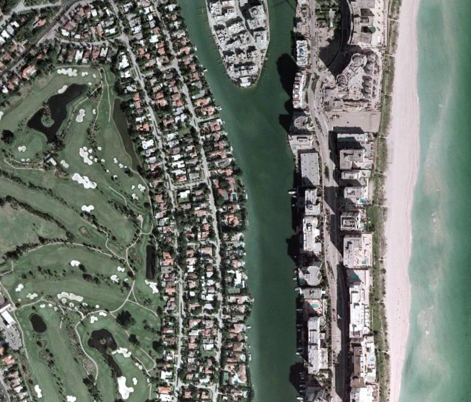
image::images/image75.jpeg[image,width=250,height=213]
[#img_ImageClassificationExample,reftext='{figure-caption} {counter:figure-num}']
*_{figure-caption}{counter:figure-num}. Image Classification Example_*

The Raster Material Dataset provides the means to store the types of materials and the area coverage of each material within each pixel of the dataset. In all other aspects, it follows conventions similar to the VSTI dataset.

A Raster Material Dataset consists of a set or stack of “_n_” Material Layers. This stacking arrangement permits the modeler to assign up to “_n_” materials to the area covered by each pixel of the Raster Material Dataset. The Raster Material Dataset also consists of a stack of “_n-1_” mixture layers; the mixture layers define the proportions of materials at each pixel. The CDB standard makes provision for up to 255 materials, (i.e., any pixel within the Raster Material Dataset can be assigned up to 255 materials).

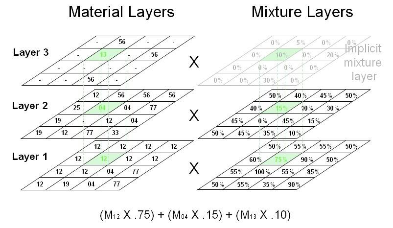
[#img_ExampleofaRasterMaterialDataset,reftext='{figure-caption} {counter:figure-num}']
*_{figure-caption}{counter:figure-num}. Example of a Raster Material Dataset_*

Figure 5-23: Terrain Elevation, Bathymetry and Tide Components, provides an example of a Raster Material Dataset consisting of 3 material layers and two associated mixture layers. The first Material Layer (i.e., layer 1) consists of a regular grid of pixels; each pixel contains a code that represents the (composite) material with largest area coverage. Likewise, the second Material Layer consists of a grid of pixels whose code represents the (composite) material with second-highest area coverage. Additional layers are added until the area corresponding to the combined area of all (composite) materials at each pixel sums to 100%. Note that in layer 2, the material layer value of some pixels can be ignored (shown as “-“ in the illustration) because layer 1 had a material mixture value of 100%. Similarly, the material layer value of some pixels in layer 3 can also be ignored because the mixture layers 1 and 2 add to 100%. In these cases, the CDB Standard recommends that the layer value be assigned a Default_Material_Layer value of 0.

NOTE: The numeric value for Default_Material_Layer is zero (“0”) and is reserved by the CDB standard.

Mixture Layers represent the percentage area coverage of each material within each pixel of each mixture. Since all layers must add to 100%, it is possible to represent “_n_” Material Layers with a set of “_n-1_” Mixture Layers. The last layer is implicit, and it is set to (100% - Sum of areas from previous layers). In the case where there is a single Material Layer, there is no need to store the (implicit) Mixture Layer. When there are two or more Material Layers, the Mixture Layer(s) should be generated.

[[ListofallRasterMaterialDatasetComponents]]
===== List of all Raster Material Dataset Components

The Raster Material Dataset is comprised of several components listed here and detailed in the subsequent sections.

[#table_RasterMaterialDatasetComponents,reftext='{table-caption} {counter:table-num}']
*Table 5-17: Raster Material Dataset Components*
[cols=",,,,",]
|===
|*CS1* |*CS2* |*File +
Extension* |*Component +
Name* |*Component +
Description*
|Dataset 005, RMTexture | | | |
|001 |001..255 |*.tif |Composite Material Index |Each texel is an index into the Composite Material Table (dataset 006). CS2 is the layer number. Corresponds to a 2D grid of composite material indices draped (orthographically) over the terrain skin derived from the Primary Terrain Elevation Dataset.
|002 |001..254 |*.tif |Composite Material Mixture |Each texel indicates the proportion (between 0.0 and 1.0) of the composite material found in the corresponding material layer. CS2 is the layer number. Corresponds to a 2D grid draped (orthographically) over the terrain skin derived from the Primary Terrain Elevation Dataset. This Dataset component follows the center grid conventions.
|Dataset 006, RMDescriptor | | | |
|001 |001 |*.xml |Composite Material Table |The Composite Material Table is referenced by the Composite Material Index component and contains the definitions of the composite materials of a Tile-LOD.
|===

[[CompositeMaterialIndexComponent]]
===== Composite Material Index Component

As mentioned earlier, the CDB standard allows pixels of the Raster Material Dataset to consist of several (up to 255) composite materials. To accomplish this, it uses a layering concept that permits the assignment of several composite materials for each pixel in the Material Dataset. As a result, the chosen representation for the Raster Material Dataset consists of a set or stacks of “_n_” Material Layers, where “_n_” is the maximum number of composite materials encountered in any pixel of the CDB tile at the specified LOD.

The code assigned to each pixel of each Material Layer is the index of a Composite Material found in the Terrain Composite Material Table (TCMT) defined in 5.6.3.4.

Each pixel of the first Material Layer (e.g., layer “1”) consists of a code that represents the composite material with largest area coverage for that pixel. Likewise, each pixel of the second Material Layer consists of a code that represents the composite material with second-highest area coverage for that pixel. Additional layers are added until the area corresponding to the combined area of all composite materials at each pixel sums to 100%.

include::requirements/requirements_class020.adoc[]

[[DataType_37]]
====== Data Type

include::requirements/REQ104.adoc[]

[[DefaultReadValue_38]]
====== Default Read Value

If none of the Material Layer components are available (files associated with the Material Layer dataset for the area covered by a tile, at a given LOD or coarser, are either missing or cannot be accessed), simulator client-devices should default to a single Material Layer component whose content defaults to a single default Composite Material. The default Composite Material can be found in \CDB\Metadata\Defaults.xml and can be provided to the client-devices on demand. The default value is:

* Default_Material_Layer (0)

In the case where the default value cannot be found, the CDB Specification recommends that client-devices default to single substrate composite material whose base material is:

* Default_Base_Material (BM_LAND-MOOR)

[[DefaultWriteValue_39]]
====== Default Write Value

The files associated with the Material Layer components for the area covered by a tile at a given LOD need not be created if the source data is not available. Tiles partially populated with data are not permitted.


[[SupportedCompressionAlgorithm_40]]
====== Supported Compression Algorithm

The LZW compression algorithm is applicable to Composite Material Index component in the TIFF file format.

[[CompositeMaterialMixtureComponent]]
===== Composite Material Mixture Component

A Mixture Layer accompanies each Material Layer; its dimensions are identical to those of the Material Layer. The pixel values of the Mixture Layer “_n_” represent the area coverage of Material Layer “_n_”. Since all layers must add to 100%, it is possible to represent “_n_” Material Layers with a set of “_n-1_” Mixture Layers. As a result, the last layer is implicit, and it is set to (100% - Sum of areas from previous layers). In the case where there is a single Material Layer, there is no need to store the (implicit) Mixture Layer. When there are two or more Material Layers, the Mixture Layer(s) must be generated.

[[DataType_41]]
====== Data Type

include::requirements/REQ105.adoc[]

[[DefaultReadValue_42]]
====== Default Read Value

If none of the Material Mixture components are available (files associated with the Material Mixture dataset for the area covered by a tile, at a given LOD or coarser, are either missing or cannot be accessed), simulator client-devices should assume equal mixturing for all available Material Layers.

[[DefaultWriteValue_43]]
====== Default Write Value

The files associated with the Material Mixture components for the area covered by a tile at a given LOD need not be created if the source data is not available. Tiles partially populated with data are not permitted.

[[SupportedCompressionAlgorithm_44]]
====== Supported Compression Algorithm

The LZW compression algorithm is applicable to Material Mixture components in the TIFF file format. Consider compressing the file if its content is not of type floating-point.

[[CompositeMaterialTableComponent]]
===== Composite Material Table Component

This Composite Material Table is called the Terrain CMT, or just TCMT; it provides a list of the Composite Materials shared by the Material Layers of the Material Dataset. There is one TCMT for each CDB tile.

[[DataType_45]]
====== Data Type

include::requirements/REQ106.adoc[]

[[DefaultReadValue_46]]
====== Default Read Value

Simulator client-devices should default the Terrain Composite Material Table if file associated with the Terrain Composite Material Table for the area covered by a tile, at a given LOD, is either missing or cannot be accessed. The default values for the Terrain Composite Material Table can be found in \CDB\Metadata\Defaults.xml and can be provided to the client-devices on demand. The default value is a single Composite Material and is named: Default_Material_Layer (0).

If the default information cannot be found within the \CDB\Metadata\Defaults.xml file, the CDB standard recommends defaulting to single substrate composite material whose base material is named: Default_Base_Material (BM_LAND-MOOR).

If an index is not found in the Terrain Composite Material Table, use the same defaulting mechanism.

[[DefaultWriteValue_47]]
====== Default Write Value

The files associated with the Terrain Composite Material Table for the area covered by a tile at a given LOD need not be created if the source data is not available. Tiles partially populated with data are not permitted.
