:figure-caption: Figure 2-
:figure-num: 0

[[CDBConcepts]]
== CDB Concepts


This chapter presents basic CDB data store model concepts. These concepts are either reused by other concepts or used repeatedly throughout the Standard.

The CDB core data model may be viewed as an instance of a Discrete Global Grid System as defined in OGC 15-104. Please note however that the CDB data model and structure predates the OGC DGGS activity by over a decade and as such should not be deemed compliant with the OGC DGGS Abstract Specification (AS). From the DGGS AS:

_A DGGS is a spatial reference system that uses a hierarchical tessellation of cells to partition and address the globe. DGGS are characterized by the properties of their cell structure, geo-encoding, quantization strategy and associated mathematical functions._

The following sections detail the CDB tiling storage model.

include::requirements/requirements_class003.adoc[]

[[CharacteristicsoftheCDBtilingstoragemodel]]
=== Characteristics of the CDB tiling storage model

For performance, a CDB data store is tiled. Both raster and vector-based data sets are tiled. The CDB tiling approach has the following characteristics.

[start=1]
.  The earth model is divided (in latitude) into slices.
.  The slice’s x-axis is aligned to WGS-84 lines of latitude.
.  The slice’s y-axis is aligned to WGS-84 lines of longitude.
.  The number of units along the slice’s y-axis for a given level of detail is the same for all slices. The earth surface geodetic dimension in arc-seconds of y-axis units within an earth slice is exactly the same, regardless of latitude.
.  The geodetic dimension of an x-axis unit in arc-seconds is constant within a zone, but is re-defined at pre-selected latitudes to achieve a greater level of spatial sampling uniformity in all tiles; this overcomes the narrowing effect of increased latitudes on longitudinal distances footnote:[Note: The definition of zones in the CDB is the same as those in DTED (with the exception of the poles).].
.  The number of units along the slice’s x-axis for a given level of detail is the same within each zone.
.  The number of units along the slice’s y-axis is constrained to a multiple of 2n in all slices.
.  The number of units along the slice’s x-axis will vary depending on which zone the latitude of the slice belongs. For instance, in latitude zone 5, which goes from –50° to 50° of latitude, a CDB Geocell is 1° × 1°, in zone 4 and 6 which goes from latitude 50° to 70° the cell size is 1° × 2°. The main reason to introduce this concept is to maintain a reasonable eccentricity between the sides by trying to keep them as close to a square as possible. Variable CDB Geocell size reduces the simulator client-device processing overheads associated with the switching from one zone to another (due to small number of zones across the earth), reduces the variation of longitudinal dimensions (in meters) to a maximum of 50% and improves storage efficiency. Two requirements as defined below are used to define the size of a CDB Geocell

[[Geocellextent]]
*Geocell extent*

include::requirements/REQ011.adoc[]

[[Geocelllength]]
*Geocell length*

include::requirements/REQ012.adoc[]

[[DetailsoftheTilingSystemintheCDBcoremodel]]
==== Details of the Tiling System in the CDB core model

The CDB storage model represents the earth as a fixed number of slices divided equally along a latitude axis as illustrated in Figure 2-1: CDB Earth Slice Representation.

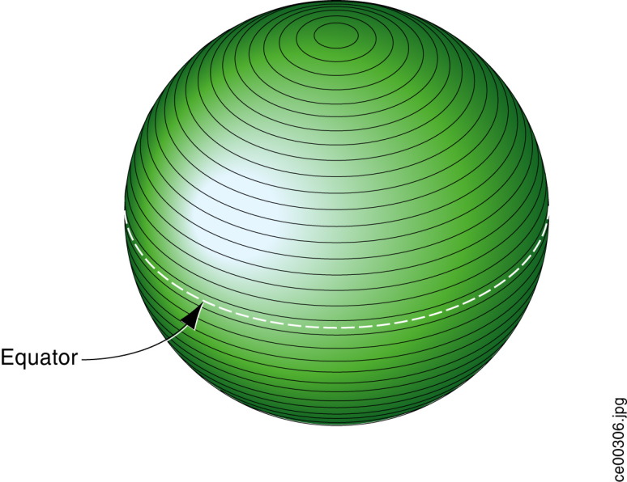
[#img_CDBEarthSliceRepresentation,reftext='{figure-caption} {counter:figure-num}']
*_{figure-caption}{counter:figure-num}. CDB Earth Slice Representation_*

The earth surface coordinate system conventions used for each slice consists of a regular two-dimensional grid where the _x_-axis is always pointing east, aligned to WGS-84 lines of latitude and where the _y_-axis is always pointing north, aligned with WGS-84 lines of longitude. The earth surface origin, reference point (lat:0, long:0) on the CDB earth representation, is defined by the intersection of the WGS-84 equator and the WGS-84 international 0° meridian footnote:[Specifically, the WGS 84 meridian of zero longitude is the IERS Reference Meridian, 5.31 arc seconds or 102.5 metres (336.3 ft) east of the Greenwich meridian at the latitude of the Royal Observatory.]. The __x__=0 and y=0 reference is at (lat:0, long:0) _x_ is positive going East and negative going West; _y_ is positive North of the equator and negative South.

Every _x_ and _y_ unit corresponds to a fixed increment of longitude and latitude in arc-seconds. The _x_-axis and _y_-axis fixed increment units are hereafter referred to as _XUnit_ and _YUnit_. Since the _y_-axis of the slices is aligned with WGS-84 lines of longitude, _y_-axis coordinate units are uniformly distributed between the equator and the poles in both geodetic system terms (arc-second) and in Cartesian system terms (meters). This property naturally leads to defining the same number of YUnit per slice. This however is not the case with the x-axis. As illustrated in Figure 2-2: Variation of Longitudinal Dimensions versus Latitude, the Cartesian space distance between such x-axis values diminishes as we move towards the poles. In order to maintain size constancy, the CDB standard provides a piecewise solution similar to that used by NGA DTED data. The world is divided into eleven zones. All CDB Geocells within a slice are one degree of latitude high (the height of a slice) and of varying width in longitude depending on the zone to which they belong.

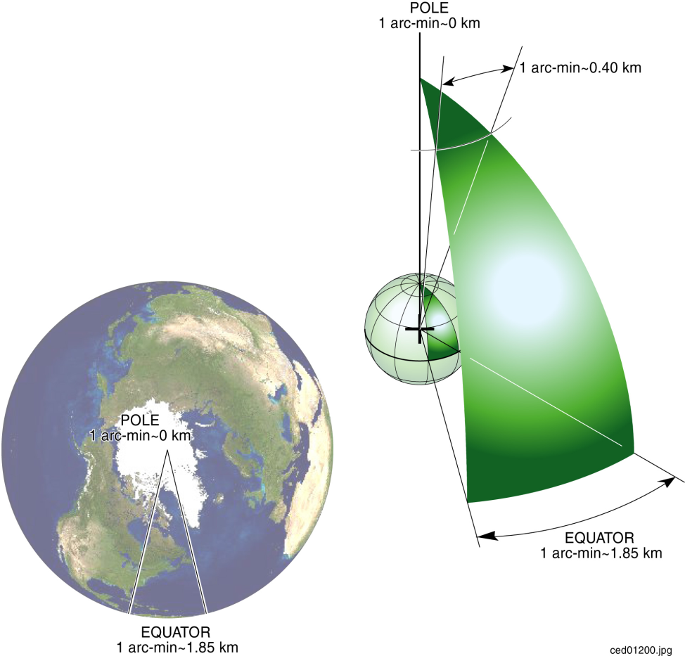
[#img_VariationofLongitudinalDimensionsversionLatitude,reftext='{figure-caption} {counter:figure-num}']
*_{figure-caption}{counter:figure-num}. Variation of Longitudinal Dimensions version Latitude_*

In order to meet one of the previously mentioned real-time considerations, the number of y-axis units for one Geocell, _NbYUnitInCDBGeocell_, is set to a power of two. This has been chosen as 1024 to give a north-south grid post spacing of approximately 109 meters at the default Level of Detail (LOD 0); this spacing is the same for all earth slices.


_NbYUnitInCDBGeocell=1024_ (2-1)

The CDB standard also imposes an integer number of slices along latitude lines. _NbEarthSlice_ is the number of earth slice from South Pole to North Pole and is equal to 180 since each side is one degree.

_NbEarthSlice = 180_ (2-2)

Furthermore, the number of x-axis units, _NbXUnitInCDBGeocell,_ is also maintained to be the same as that of _NbYUnitInCDBGeocell_ for all CDB Geocells. As previously stated, the cell width in longitude is adjusted at specific latitudes to maintain a reasonable aspect ratio. As a consequence the area defined by the corner coordinates (_x_,_y_), (__x__+1, _y_) (_x_, __y__+1), (__x__+1, __y__+1), decreases when moving toward the poles in the same zone and increases when moving toward the equator.

_NbXUnitInCDBGeocell=NbYUnitInCDBGeocell_ (2-3)


The geodetic dimension of a _YUnit_ is referred to as _ArcSecLatUnitInCDBGeocell_; it is the same for all slices and is determined by Equation (2–4).

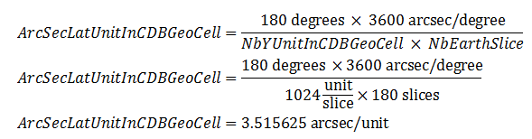
Equation (2-4)

_ArcSecLatUnitInCDBGeocell_ is a constant defined by the CDB earth model and cannot be set to any other value.

Similarly, the geodetic dimension of a _XUnit_ is referred to as _ArcSecLongUnitInCDBGeocell_; it varies at specific latitudes and is shown in Table 2-3: CDB Geocell Unit Size in Arc Seconds. As shown in the table, maintaining the _NbXUnitInCDBGeocell_ constant causes abrupt changes in _ArcSecLongUnitInCDBGeocell_ at specific latitudes. This is done, however, to achieve our objective of maintaining a reasonable aspect ratio across the earth model.

[#table_CDBGeocellUnitSizeinArcSeconds,reftext='{table-caption} {counter:table-num}']
*Table 2-3: CDB Geocell Unit Size in Arc Seconds*
[cols=",,,",]
|================================
|*Zone* a|
*CDB Geocell size*

*(° Lat × ° Lon)*

 a|
*ArcSecLatUnit*

*InCDBGeocell*

 a|
*ArcSecLongUnit*

*InCDBGeocell*

|0 | 1 × 12 |3.515625 |42.187500
|1 |1 × 6 |3.515625 |21.093750
|2 |1 × 4 |3.515625 |14.062500
|3 |1 × 3 |3.515625 |10.546875
|4 |1 × 2 |3.515625 | 7.031250
|5 |1 × 1 |3.515625 | 3.515625
|6 |1 × 2 |3.515625 | 7.031250
|7 |1 × 3 |3.515625 |10.546875
|8 |1 × 4 |3.515625 |14.062500
|9 |1 × 6 |3.515625 |21.093750
|10 | 1 × 12 |3.515625 |42.187500
|================================

[[TileLevelsofDetailTileLoD]]
==== Tile Levels of Detail (Tile LoD)

Since _NbXUnitInCDBGeocell_ and _NbYUnitInCDBGeocell_ are defined as being the same and since _NbYUnitInCDBGeocell_ is constrained to a power of two, the CDB tile representation can readily reference square areas at a specified level-of-detail. These areas are delimited by longitude and latitude extents. By convention, LOD 0 always corresponds to the earth slice size of _NbXUnitInCDBGeocell_ × _NbYUnitInCDBGeocell_ with a Cartesian unit spacing in the range of one hundred meters at the slice’s zones boundaries and at the equator.

Numerically increasing levels of LOD (e.g., 1, 2, 3) correspond to tile datasets with progressively finer resolution (smaller spatial sampling intervals).

The _x_-axis and _y_-axis fixed increment unit per LOD, _XUnit~LOD~_ and _YUnit~LOD~_, are given per Equation (2–5).

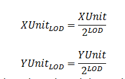
Equation (2–5)

Similarly, the number of units in the x-axis and y-axis and the total number of units in a CDB geocell, respectively defined by _NbXUnitInCDBGeocell~LOD~_, _NbYUnitInCDBGeocell~LOD~_, and _TotalNbUnitInSlice~LOD~_, are computed by Equation (2–6).

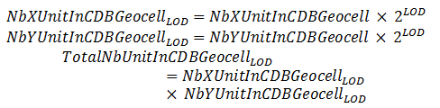
Equation (2–6)

include::requirements/REQ013.adoc[]

Thus, for positive LODs, every tile quadruples its geographic area coverage as the LOD decreases. Since each earth slice is limited to _NbYUnitInCDBGeocell_ (or 111319 m), tiles at LOD 0 have the same height as the height of an earth slice. For negative LODs, the same tile size is maintained. This imposes that the number of units in both x-axes and y-axes are recursively divided by two for every subsequent level until the total number of unit reaches one by one unit. LOD –10 is the coarsest LOD represented by a CDB slice. The finest available LOD number for a CDB structured data store is 23. Table 2-4 presents the complete list of CDB LODs with the corresponding grid size, tile size, and the resulting approximate grid spacing at the equator.

[#table_CDBLODversusTileandGridSize,reftext='{table-caption} {counter:table-num}']
*Table 2-4: CDB LOD versus Tile and Grid Size*
[cols=",,,",]
|==============================================
|*CDB LOD* |*Grid Size +
(n × n)* |*Approximate Tile Edge Size +
(meters)* |*Approximate Grid Spacing +
(meters)*
|-10 |1 |1.11319 × 10^+05^ |1.11319 × 10^+05^
|-9 |2 |1.11319 × 10^+05^ |5.56595 × 10^+04^
|-8 |4 |1.11319 × 10^+05^ |2.78298 × 10^+04^
|-7 |8 |1.11319 × 10^+05^ |1.39149 × 10^+04^
|-6 |16 |1.11319 × 10^+05^ |6.95744 × 10^+03^
|-5 |32 |1.11319 × 10^+05^ |3.47872 × 10^+03^
|-4 |64 |1.11319 × 10^+05^ |1.73936 × 10^+03^
|-3 |128 |1.11319 × 10^+05^ |8.69680 × 10^+02^
|-2 |256 |1.11319 × 10^+05^ |4.34840 × 10^+02^
|-1 |512 |1.11319 × 10^+05^ |2.17420 × 10^+02^
|0 |1024 |1.11319 × 10^+05^ |1.08710 × 10^+02^
|1 |1024 |5.56595 × 10^+04^ |5.43550 × 10^+01^
|2 |1024 |2.78298 × 10^+04^ |2.71775 × 10^+01^
|3 |1024 |1.39149 × 10^+04^ |1.35887 × 10^+01^
|4 |1024 |6.95744 × 10^+03^ |6.79437 × 10^+00^
|5 |1024 |3.47872 × 10^+03^ |3.39719 × 10^+00^
|6 |1024 |1.73936 × 10^+03^ |1.69859 × 10^+00^
|7 |1024 |8.69680 × 10^+02^ |8.49297 × 10^-01^
|8 |1024 |4.34840 × 10^+02^ |4.24648 × 10^-01^
|9 |1024 |2.17420 × 10^+02^ |2.12324 × 10^-01^
|10 |1024 |1.08710 × 10^+02^ |1.06162 × 10^-01^
|11 |1024 |5.43550 × 10^+01^ |5.30810 × 10^-02^
|12 |1024 |2.71775 × 10^+01^ |2.65405 × 10^-02^
|13 |1024 |1.35887 × 10^+01^ |1.32703 × 10^-02^
|14 |1024 |6.79437 × 10^+00^ |6.63513 × 10^-03^
|15 |1024 |3.39719 × 10^+00^ |3.31756 × 10^-03^
|16 |1024 |1.69859 × 10^+00^ |1.65878 × 10^-03^
|17 |1024 |8.49297 × 10^-01^ |8.29391 × 10^-04^
|18 |1024 |4.24648 × 10^-01^ |4.14696 × 10^-04^
|19 |1024 |2.12324 × 10^-01^ |2.07348 × 10^-04^
|20 |1024 |1.06162 × 10^-01^ |1.03674 × 10^-04^
|21 |1024 |5.30810 × 10^-02^ |5.18369 × 10^-05^
|22 |1024 |2.65405 × 10^-02^ |2.59185 × 10^-05^
|23 |1024 |1.32703 × 10^-02^ |1.29592 × 10^-05^
|==============================================

As a result, at LOD −10, a tile covers an area of approximately 111 km × 111 km and is represented by a single grid element. At the opposite end of the table, at LOD 23, a tile covers a minuscule area of 13 mm × 13 mm with a corresponding grid spacing of about 13 μm.

Note the line corresponding to LOD 0; it highlights the point where the grid size stops increasing while the tile size starts decreasing. Figure 2-3 illustrates the hierarchy of CDB Tile LODs.

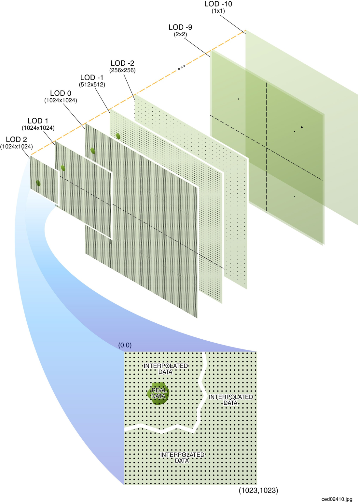
[#img_TileLODHierarchy,reftext='{figure-caption} {counter:figure-num}']
*_{figure-caption}{counter:figure-num}. Tile-LOD Hierarchy_*


[[TileLoDAreaCoverageRules]]
===== Tile LoD Area Coverage Rules

include::requirements/REQ014.adoc[]

Consequently, tiles at a given LOD never overlap with others of the same LOD and are always aligned with at least two of the edges of tiles at the previous LOD.

Figure 2-4 illustrates how different Levels of Detail (LOD’s) can be combined within individual geocells. In the illustration, some CDB Geocells of the pictured earth slice are represented using five LODs, while others have only three or four LODs. Each Geocell included in a CDB data store shall represented by an instance of at least the coarsest tile supported, i.e., one tile at LOD −10. In addition, it is not necessary that the entire geocell be represented at the same level of resolution across the entire cell. However, if a tile is present at LOD _n_, it implies that a courser tile exists at LOD __n__−1 covering the area of the tile at LOD _n_, until LOD −10 is reached.

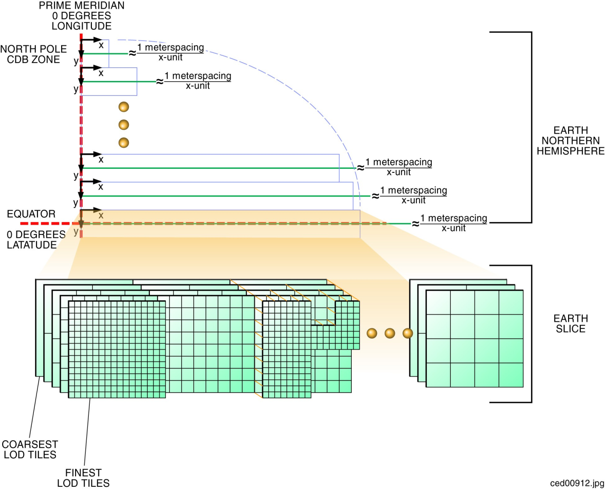
[#img_EarthSliceExample(FiveLevelsofDetail),reftext='{figure-caption} {counter:figure-num}']
*_{figure-caption}{counter:figure-num}. Earth Slice Example (Five Levels of Detail)_*


[[TileLODHierarchyRules]]
==== Tile-LOD Hierarchy Rules

include::requirements/REQ015.adoc[]

[[TileLODReplacementRules]]
==== Tile-LOD Replacement Rules

In general, finer tiles replace coarser tiles. The requirements are:

include::requirements/REQ016.adoc[]

In the case of positive LODs, note that it is not necessary that all 4 tiles from LOD n+1 exist; as long as one of the four tiles is present, the replacement of the tile at LOD n can take place.

For instance, one tile at LOD −1 is replaced by one tile at LOD 0 which is in turn replaced by four tiles at LOD 1. The replacement of coarser tiles with finer tiles stops when no finer tiles exist.


[[HandlingoftheNorthandSouthPole]]
==== Handling of the North and South Pole

Zones 0 and 10 (South and North Pole) are processed differently than the other zones. As per Table 2-2: Size of CDB Geocell per Zone, this corresponds to an earth slice of 1 × 30 CDB Geocells.

As shown in Figure 2-3: Variation of Longitudinal Dimensions versus Latitude, a single CDB Geocell at the poles covers 12 degrees in longitude and 1 degree in latitude within a single slice. As a geographic position gets closer and closer to the poles in terms of latitude, fewer points are required in the data-grid. However the CDB Geocell still has a regular rectangular shape. Therefore, this implies that grid points will be progressively sampled in longitude in order to respect the grid format of the CDB.

In CDB Zone 0, the bottom edges of the 30 geocells of the zone all converge and collapse to a single point, the South Pole. However, the data that belong exactly to the South Pole is found in a single Geocell, the one whose lower left corner is at −90° of latitude and 0° of longitude. The redundant data representing the South Pole found in the other 29 geocells of zone 0 is ignored.

Similarly, in CDB Zone 10, the top edges of the 30 geocells of the zone also converge and collapse to a single point, the North Pole. Again, the data that belong exactly to the North Pole is found in a single Geocell whose lower left corner is at +89° of latitude and 0° of longitude. The redundant data representing the North Pole found in the other 29 geocells of zone 10 is ignored. The case of raster datasets that make use of the corner grid conventions is an exception since the CDB does not provide the means of representing data at precisely the North Pole (+90° of latitude and 0° of longitude). In this case, it is recommended that client-devices use the average of the nearest grid elements in the immediate vicinity of the North Pole.

[[FileSystemRequirements]]
=== File System Requirements

Please refer to Clause 5 in Volume 10: OGC CDB Implementation Guidance (Best Practice).

[[LightNaming]]
=== Light Naming

The CDB standard defines rules that unambiguously tag any modeled light point footnote:[The CDB standard does not distinguish between a light-point and a light-source. In the simulation industry, the term light-point refers to a point source of light that does not illuminate its immediate surroundings. Likewise, the term light-source refers to a point source of light capable of illuminating its immediate surroundings.] with a descriptive name. This provides client-devices with the information necessary to control all light points that have been tagged with a name that conforms to this standard.

The CDB standard provides a comprehensive set of light types, particularly well suited to the needs of Visual simulation. Light types include those found on:

* cultural features including point, lines, polygons footnote:[The original CDB specification as submitted to the OGC used the term “areal” instead of “polygon”. In order to be consistent with OGC/ISO best practice, areal has been replaced with “polygon” throughout the document.], and specialized airport systems
* air, land, and surface platforms
* life forms
* munitions

Each light type defined in this standard corresponds to a real-world light type. The standard provides a definition of each light type, which is representative of the light type’s function rather that its characteristics. The client-devices use the light type name as an index to derive the properties and characteristics of the light. The approach is client-device independent because the (device-specific) client rendering parameters are not stored in the data store and are therefore invisible to the modeler and the data store tools. The modeler/tools need not be concerned with dozens of parameters that describe the light’s properties and characteristics. The client-devices internally build and initialize a table of light properties and characteristics for their respective use. The table is nominally built at CDB data store load time and is built to match the device’s inherent capabilities and level-of-fidelity.

The light point types are structured in a hierarchy that is designed to simplify the modeler’s workload. Increasing levels of specialization are possible if a modeler specifies light names located in deeper levels of the light naming hierarchy, i.e., the more specialized the light, the deeper the level.

An extract from the light naming hierarchy is illustrated in Figure 2-5: Extract from Light Naming Hierarchy as an example. This portion of the light naming hierarchy concerns itself with lights used for “Line-based Cultural” light points (e.g., streets, highways). Immediately below the “Line-Based” level, the modeler can choose from a wide selection of lights such as Fluorescent_Light, Incandescent_Light, or Sodium_Light. A modeler that does not want to concern itself with the particular characteristics of highway lights may choose to tag its lights with a name that is higher up in CDB light name hierarchy. On the other hand, a modeler that has more elaborate source data and has more time at his disposal may choose to differentiate between “Multilane_Divided_Hwy” and “Highway” and/or “Sodium” and “Incandescent” lighting (further down in the CDB light name hierarchy).

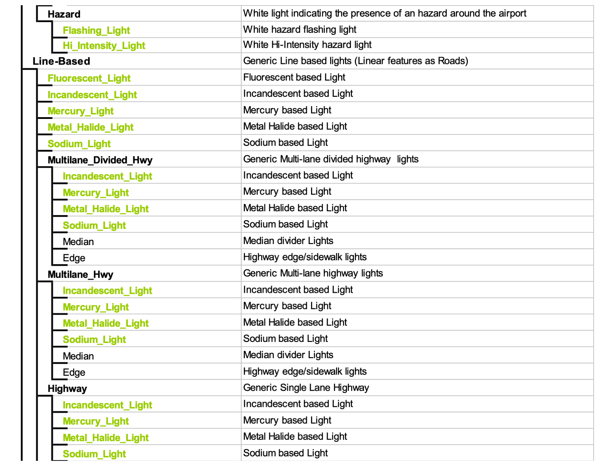
[#img_ExtractfromLightNamingHierarchy,reftext='{figure-caption} {counter:figure-num}']
*_{figure-caption}{counter:figure-num}. Extract from Light Naming Hierarchy_*

include::requirements/REQ017.adoc[]

Here are a few examples:

* \Light\Platform: A light suitable for use on all platforms
* \Light\Platform\Air\Aircraft_Helos\Formation_Light: A formation light for use on aircraft and helicopter platforms
* \Light\Platform\Land\Headlight\High_Beam_Light: A high-beam head-light for use on land vehicles
* \Light\Cultural\Line-based\Highway: A light suitable to depict highway lighting
* \Light\Cultural\Line-based\Highway\Incandescent_Light: A light used to depict incandescent highway lighting

==== Adding Names to the CDB Light Name Hierarchy

The hierarchy permits modelers to reference light types that are not defined by the current version of the CDB standard. This can be achieved by adhering to the following requirements and procedure.

include::requirements/requirements_class004.adoc[]

The modeler or simulator vendor may optionally provide values for Description, Intensity, Color, Frequency, Duty_Cycle… in the Lights_xxx.xml files. If the new entry has no values for Description, Intensity, etc, the new light type will immediately inherit all of the properties and characteristics of CDB-native light types higher up in the light hierarchy. If the new entry requires one or more of the fields stated in Section 2.3.2, Light Type Modeler Tuning, it will be assigned those characteristics.

Note that the level of rendering fidelity is a function of customer requirements and/or the vendor’s capabilities.

The user may also elect to propose his new light name for inclusion into subsequent versions of the CDB standard.

Since the light type codes are global to a CDB structured data store, it is strongly recommended that none of the existing light type codes be modified when adding a new light type. Failure to do this would require a complete recompilation of the data store in order to map light point type name to their newly assigned light point type codes. For this reason, it is recommended that the CDB tools create new light type codes so that light relationships within the data store remain coherent.

[[ModelComponentNaming]]
=== Model Component Naming

The CDB standard provides the means to unambiguously tag any portion of a 3D model (moving model or cultural feature) with a descriptive name. As a result, client-devices have the information necessary to control all of the model components that have been tagged with a name that conforms to this standard.

The CDB standard provides a comprehensive set of model components, particularly well suited to the needs of simulation. Model components include those used on:

[start=1]
.  air platforms
.  buildings
.  land platforms
.  missile and rocket platforms
.  surface (maritime) platforms
.  pylons and posts

Each model component defined by this standard corresponds to a real-world model component. The XML file containing the CDB Model Components footnote:[As of CDB Specification version 3.2, the list of CDB model components is no longer presented as an annex to avoid the risk of miscorrelation between the appendix and the metadata. The list is now exclusively found in the Metadata folder.] is part of the CDB standard distribution package and can be found in the following file: `\CDB\Metadata\Model_Components.xml`.

The client-devices use the name as an index to provide the simulation software the needed control over the component in question.

Examples of model components are Cockpit, Turret, Rudder, Engine, Anchor, Flight_Deck, Tire, Landing_Gear, Chimney, etc.

Volume 6, OGC CDB Rules for Encoding Data using OpenFlight provides details on how to use one of these names to identify a particular model component.


[[AddingNewModelComponents]]
==== Adding New Model Components

The user may propose missing model component names for inclusion into subsequent versions of the CDB standard. In the meantime, the missing name can be used to tag a specific model component and a simulation client-device can use that name to detect and control the new component.


[[Materials]]
=== Materials

This portion of the CDB standard deals with the handling of materials that make up the synthetic environment. The CDB standard provides a flexible means to store and represent materials found in the CDB representation of the synthetic environment.

In general, materials are inputs to production or manufacturing. They are often raw - that is unprocessed, but are sometimes processed before being used in more advanced production processes. A material represents the substance or substances out of which a thing is or can be made.

The CDB standard provides the means to representthe following.

* *Basic* (homogeneous) materials such as steel, aluminum, copper, sand, soil, stone, glass, concrete, wood, water, rubber. CDB materials are chosen for their relevance to simulation, in particular, thermal spectrum simulation.
* *Aggregates* or mixtures of basic materials
* *Composite* materials, i.e., a structured arrangement of basic materials or of aggregates which together represent a composite’s material that has:
** A *Surface Substrate*
** A *Primary Substrate*
** One or more optional *Secondary Substrates*

The complete list of CDB Base Materials is part of the metadata provided with the CDB Schema Distribution Package and can be found in the following file:


`\CDB\Metadata\Materials.xml`


The following is the requirements class for CDB Materials

include::requirements/requirements_class005.adoc[]

include::requirements/REQ022.adoc[]

The task of determining a definitive list of material properties that would accommodate all of the above requirements for the today’s sensor types, vendor implementations and SEMs would be a significant challenge. Instead, the CDB Standard publicly defines a list of materials that can be used in a CDB structured data store. It is the responsibility of vendors to (internally) define the properties (that satisfies the sensor type) for these CDB materials. Vendors are totally free to select material properties that satisfy the fidelity, functionality and precision requirements of the SEM for the sensor type of interest. _See section 6.4.7.1, Volume 10 OGC CDB Implementation Guidance for additional details._


[[BaseMaterials]]
==== Base Materials

A Base Material represents a basic (primitive) material such as water, vegetation, concrete, glass, steel. Each Base Material has a unique name. The components of a Base Material are listed in Table 2-6: Components of a Base Material.

[#table_ComponentsofaBaseMaterial,reftext='{table-caption} {counter:table-num}']
*Table 2-6: Components of a Base Material*
[cols=",",]
|==============================================================================================================================================
|*Component* |*Description*
|*Name* |Name used to represent a Basic Material.
|Description |Describes the essential nature of the basic material represented. A typical example can also be provided in the description field
2+|* Uniquely identifies the Base Material. 
|==============================================================================================================================================

include::requirements/REQ023.adoc[]

The description of a material class gives the essential nature of the basic material represented. `\CDB\Metadata\Materials.xml` presents all of the Base Materials currently defined by the CDB Standard.

=====  Base Material Table (BMT)

A Base Material Table (BMT) is provided for run-time access by client applications. See section 5.1.3, Base Material Table for more details on the file format.

[[CompositeMaterials]]
==== Composite Materials

This section provides additional description and details regarding the layered substrate structure to Base Materials, aka Composite Materials.

Each Composite Material consists of a primary substrate component, an optional surface component and one or more optional secondary substrate components. Each of these components is in turn composed of one or more Base Materials described in the previous section. Components that are composed of two or more Base Materials are aggregates. Each Composite Material has a primary substrate as a minimum. The primary and secondary substrates can be optionally assigned a thickness (in meters). By definition, the surface substrate corresponds to the first micrometer (µm) to millimeter (mm) of a Composite Material. The surface substrate does not change the nature of the primary substrate; its purpose is to differentiate the object's primary substrate from its coating.

Each substrate is defined by a variable-size structure that references one or more Base Materials. Each Base Material is assigned a weight ranging from 1% to 100%. **The sum of the weights assigned to the Base Materials of each component _SHALL_ sum to 100%** footnote:[This is a requirement. The editor missed this requirement in Version 1 of the standard. This sentence will be restated in the next version as an official requirement.]*.* For example, a mixture aggregate of 75% sand and 25% soil, would be constructed as a Composite Material with a primary substrate component with Base Materials BM_SAND (75% weight) and BM_SOIL (25% weight). In this example, there is no surface substrate and no secondary substrates.

[[CompositeMaterialSubstrates]]
===== Composite Material Substrates

A substrate provides a means to describe the material composition of “hidden” materials located beneath (or inside) the surface of a feature. This information is not explicitly modeled using (for instance) polygons; instead it is an essential characteristic of the material that makes up the modeled feature.

Consider a seabed consisting of a silt deposit (Figure 2-6: Seabed Composite Material). Such a deposit might have a thickness of a few centimeters. In our model, it is considered too thick to be considered the surface substrate of the seabed. In fact, below this silt deposit, there can be sand with a thickness of a few dozen centimeters, followed by rock of (essentially) infinite thickness. A sonar device can use the thickness information provided by the Seabed Composite Material, to generate multiple echoes, corresponding to each substrate.


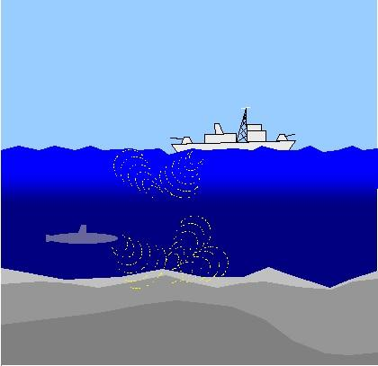
[#img_SeabedCompositeMaterial,reftext='{figure-caption} {counter:figure-num}']
*_{figure-caption}{counter:figure-num}. Seabed Composite Material_*

As a second example, consider a half-filled refinery oil tank (see Figure 2-7: Oil Tank Composite Materials).

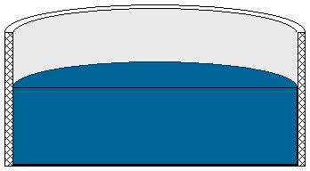
[#img_OilTankCompositeMaterials,reftext='{figure-caption} {counter:figure-num}']
*_{figure-caption}{counter:figure-num}. Oil Tank Composite Materials_*

In order to capture different thermal signatures for the top and bottom portions of the tank, a modeler uses two different Composite Materials:

For the top half of the tank, the modeler uses a Composite Material consisting of paint (surface substrate), metal (primary substrate) and air (secondary substrate).

For the bottom half of the tank, the modeler uses a Composite Material consisting of paint (surface substrate), metal (primary substrate) and oil (secondary substrate).


[cols=",",]
|=====================================================================================
a|image::images/image11a.png[image,width=262,height=252] a|image::images/image11b.png[image,width=262,height=252]
|Thermal Infrared  |Visible
|=====================================================================================

[#img_ThermalSimulationofOilTankCompositeMaterials,reftext='{figure-caption} {counter:figure-num}']
*_{figure-caption}{counter:figure-num}. Thermal Simulation of Oil Tank Composite Materials_*


//do nothing image - it acts as a spacer so that Asciidoc captions the table underneath as an image

Note that since the metal substrate is several centimeters thick, it is not considered to be the surface substrate of the oil. Figure 2-8: Thermal Simulation of Oil Tank Composite Materials, illustrates the different simulation responses for a FLIR and an OTW CDB client device for this particular example.


[[CompositeMaterialTablesCMT]]
===== Composite Material Tables (CMT)

Composite Material Tables provide the means by which Composite Materials can be defined. Each entry within a Composite Material Table defines a structured arrangement of basic materials or of aggregates (i.e., a Composite Material). Each Composite Material entry is assigned a Composite Material Index (and an optional name). CDB datasets can then make use of the index value in order to select Composite Materials.

There are several Composite Material Tables spread across the CDB hierarchy. Note however that all Composite Material Tables follow a common XML notation that describes each Composite Material into its primary substrate, surface and secondary substrate components. Composite Materials Tables can take various forms, either as distinct XML files or embedded XML code within a file.

Here is the XML notation for a Composite Material Table:

```
<Composite_Material_Table>
	<Composite_Material index="...">
		<Name>...</Name>
		<Surface_Substrate>
			<Material>
				<Name>...</Name>
				<Weight>...</Weight>
			</Material>

			<!-- Insert other Material as needed -->

		</Surface_Substrate>

		<Primary_Substrate>
			<Material>
				<Name>...</Name>
				<Weight>...</Weight>
			</Material>

			<!-- Insert other Material as needed -->

			<Thickness>...</Thickness>
		</Primary_Substrate>

		<Secondary_Substrate>
			<Material>
				<Name>...</Name>
				<Weight>...</Weight>
			</Material>

			<!-- Insert other Material as needed -->

			<Thickness>...</Thickness>
		</Secondary_Substrate>

		<!-- Insert other Secondary_Substrate as needed -->

	</Composite_Material>

	<!-- Insert other Composite_Material as needed -->

</Composite_Material_Table>
```

include::requirements/REQ024.adoc[]

The Secondary_Substrate and the Thickness are optional. To specify aggregates (more than one material attribute in the MIT), the Material block is repeated. The Secondary_Substrate is provided (and optionally repeated) to described composite (stratified) materials. They appear in order starting from the Surface_Substrate, if present, followed by the Primary_Substrate (nearest to the surface), and followed by the Secondary Substrate, if present.

include::requirements/REQ025.adoc[]

include::requirements/REQ026.adoc[]

In addition, each composite material can be optionally tagged with a descriptive name. The CDB composite material table mechanism provides the means to tag each CDB composite material with a data store tool-specific or modeler-specific composite material name.

[[Example1]]
===== Example 1

Consider a linear feature in a CDB data store that corresponds to a painted stripe on a runway surface. The linear feature is stored in the Man-Made Lineal dataset; the linear feature references an entry into the Geocell’s Composite Material Table. That reference is the index of the Composite Material for painted asphalt. The entry pointed to describes a Composite Material whose Primary Substrate is 100% BM_ASPHALT and whose Surface Substrate is 100% BM_PAINT-ASPHALT.

[[Example2]]
===== Example 2

Consider a terrain polygon feature in the GSFeature dataset. The polygon feature covers a large wetland area that contains 4 Base Materials, namely BM_SOIL (21%), BM_WATER-FRESH (51%), BM_LAND-LOW_MEADOW (26%) and BM_SAND (2%). The polygon feature references an entry into the Geocell’s Composite Material Table. That reference is the name of the Composite Material for wetlands. The entry describes a Composite Material whose Primary Substrate is composed of four Base Materials, namely water (with 51% weight), low height vegetation (with 26% weight), soil (with 21% weight) and sand (with 2% weight).

[[BringingitallTogether]]
==== Bringing it all Together

Figure 2-9: Flow of Material Attribution Data illustrates the flow of material attribution data from features in the CDB right through to the client-device.

Each of the raster features in a CDB structured data store can (and should) reference a Composite Material. The reference points to an entry into a Composite Material Table. Each CDB tile has a Composite Material Table. The impact of additions, deletions, and modifications to the Composite Material Table are limited to only those features that make up the tile; this reduces the compilation time associated with the production of Composite Material Table data.

Likewise, zones and polygons within a 3d model, such as OpenFlight, can optionally reference one or more Composite Materials. The references each point to entries into a Composite Material Table that is associated with the model. Each model can have an associated Composite Material Table. The impact of additions, deletions, and modifications to the Composite Material Table are limited to only those features that make up the model; this reduces the generation time associated with the production of Composite Material Table data for the model.

In turn, each of the entries in the Material Composite Table has one or more references to Base Materials entries of the Base Materials Table. The Base Materials Table is global to the CDB and its contents are defined and governed by this Standard.

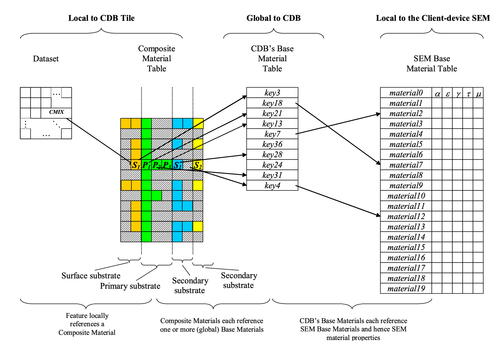
[#img_FlowofMaterialAttributionData,reftext='{figure-caption} {counter:figure-num}']
*_{figure-caption}{counter:figure-num}. Flow of Material Attribution Data_*

[[DeterminationofMaterialPropertiesbySensorEnvironmentalModelSEM]]
==== Determination of Material Properties by Sensor Environmental Model (SEM)

Please refer to implementation guidance in Volume 10 OGC CDB Implementation Guidance, Sections 6.4.7.1 and 6.4.7.2.

include::requirements/REQ027.adoc[]

[[GenerationofMaterialsforInclusioninCDBDatasets]]
==== Generation of Materials for Inclusion in CDB Datasets

In the case of vector data, the generation of the material information typically requires the modeler to apply an image classification process to the terrain raster imagery. Many industry-standard tools offer this classification capability.

Following this step, the resultant material classified raster imagery is vectorized into polygons (polygons) and/or lineals. Note that the quality of the image classification typically improves with the availability of multispectral terrain imagery data. Also note that these two steps can be skipped if the vectorized datasets already exist in digital form.

The classification of the terrain imagery can be done directly against the Base Materials defined by `\CDB\Metadata\Materials.xml`. In this case, the modeler need not be aware of the mandated Base Materials. This can be done because the tools can abstract these Base Materials and provide the modeler with an alternate selection of materials. The selection of materials provided to the modeler is quite arbitrary. This indirect step allows modelers to work with the “materials” they are familiar with. Nonetheless, the tools must, in the end, build the Composite Material Tables required by the CDB standard and resolve all material references into the Base Materials supported by this Standard. In effect, the Composite Material Table is used to map the modeler’s materials into CDB Base Materials.

Alternately, the classification of the terrain imagery can be done against whatever “material classes” modelers are accustomed to use when conducting such classifications. In this case, the SEM specialist can define corresponding Composite Materials for each of these material classes so that they resolve down to the Base Materials supported in the CDB data store.

include::requirements/REQ028.adoc[]
