:figure-caption: Figure 3-
:figure-num: 0

[[CDBStructure]]
== CDB Structure

This chapter defines the CDB data store physical structure, i.e., the name of all directories forming the CDB model hierarchy, as well as the name of all files found in the CDB model hierarchy. An important feature of the CDB Model is the fact that all CDB file names are unique and that the filename alone is sufficient to infer the path to get to the file.

The CDB is composed of several datasets that usually reside in their own directory structure; however some datasets share a common structure. The following sections present the directory structures for all CDB conformant datasets.

[[TopLevelCDBModelStructureDescription]]
=== Top Level CDB Model/Structure Description

The top-level directory structure of the CDB from the root directory is described below. All of the synthetic environment content falls in these directories:

1.  *\CDB\:* +
This is the root directory of the CDB. It does not need to be “\CDB\” and can be any valid path name on any disk device or volume under the target file system it is stored on. In order for the text of this standard to remain readable, all examples referring to the root CDB path name will start with \CDB\. A CDB cannot be stored directly in the root directory of a disk device or volume. A CDB path name cannot be within another CDB or CDB version. The length of the path name leading to the CDB root directory should be small enough such that the platform file system can store all possible file path names stored within a CDB.

include::requirements/requirements_class006.adoc[]

[start=2]
.  *\CDB\Metadata\:* The directory that contains the specific XML metadata files which are global to the CDB. The directory structure and metadata descriptions are defined in Section 3.1.1, Metadata Directory.
.  *\CDB\GTModel\:* This is the entry directory that contains the Geotypical Models Datasets. The directory structure is as defined in Section 3.4, GTModel Library Datasets.
.  *\CDB\MModel\:* This is the entry directory that contains the Moving Models Datasets. The directory structure is defined in Section 3.5, MModel Library Datasets.
.  *\CDB\Tiles\:* This is the entry directory that contains all tiles within the CDB instance. The directory structure is defined in Section 3.6, CDB Tiled Datasets.
.  *\CDB\Navigation\:* This is the entry directory that contains the global Navigation datasets. The directory structure is defined in Section 3.7, Navigation Library Dataset

Most CDB datasets are organized in a tile structure and stored under *\CDB\Tiles\* directory. The tile structure facilitates access to the information in real-time by the runtime client-devices. However, for some datasets such as Moving Models or geotypical models datasets that require minimal storage, there is no significant advantage to be added from such a tile structure. Such datasets are referred to as global datasets: they consist of data elements that are global to the earth, i.e., no structure other than the datasets is provided.

[[MetadataDirectory]]
==== Metadata Directory

There is one directory containing metadata files that are global to the overall CDB structure. `\CDB\Metadata` contains metadata files that define the various sets of naming hierarchies and definitions. File content is described in link:#ControlledVocabulariesandMetadataDatasetsusedbyCDB[Section 5.1], Metadata Datasets. Most metadata files (except one) are optional and CDB users must implement default behaviors as defined in the requirements. The \CDB\Metadata directory contains the following metadata files.

[[Global_SpatialMetadataFile]]
===== Global_Spatial Metadata File

This file contains metadata, including spatial metadata, pertinent to an entire CDB data store. Please refer to Clause 5.1.x for detailed information for guidance on metadata elements should be specified for the global metadata elements. The specification of global metadata is mandatory in CDB version 1.1 or later. Please note that this standard does not specify which metadata standard shall be used. Instead, for flexibility and in recognition that different communities use different metadata standards or profiles of metadata standards, the CDB standard provides a list of allowed metadata standards and profiles of those standards. The reader should reference Clause 5.1.6 and Clause 5.1.12 for how the metadata standard used in a CDB data store is specified as part of the “Version” metadata.

[[LightsDefinitionsMetadatafile]]
===== “Lights” Definitions Metadata file

This file contains the metadata that defines the light points name hierarchy for the CDB. Refer to Section 2.3, Light Naming, for a description of the light type hierarchy. A listing of the CDB light type hierarchy can be found in Annex J. If “Lights.xml” is not found in the metadata directory then use the hierarchy found in Annex J (Volume 2 OGC CDB Core Model and Physical Structure Annexes). Refer to link:#LightDataHierarchyControlledVocabulary[Section 5.1.3] Light Name Hierarchy Metadata for a description of the light point name hierarchy file.

[[Model_ComponentsDefinitionsMetadatafile]]
===== “Model_Components” Definitions Metadata file

This file contains the metadata that defines the CDB model components. Refer to Section 2.4, Model Component Naming, for a description of the model components. The XML file containing the CDB Model Components footnote:[As of CDB Specification version 3.2, the list of CDB model components is no longer presented as an annex to avoid the risk of miscorrelation between the appendix and the metadata. The list is now exclusively found in the Metadata folder.] is part of the CDB standard distribution package and can be found in the following file: `\CDB\Metadata\Model_Components.xml`. Refer to section 5.1.4 of this document - Model Components Definition Metadata - for a description of the model component file.

[[MaterialsDefinitionsMetadatafile]]
===== “Materials” Definitions Metadata file

This file contains the base material names for the CDB. Refer to Section 2.5, Materials, for a description of the CDB materials. A listing of the CDB Base Materials can be found in `\CDB\Metadata\Materials.xml`. Refer to section 5.1.5 Base Material Table for a description of the materials definition file.

[[DefaultsDefinitionsMetadatafile]]
===== “Defaults” Definitions Metadata file

This file contains the default values for each of the CDB datasets. Refer to Chapter 5, CDB Datasets, for a description of the CDB datasets. Annex S of Volume 2”OGC CDB Core: Model and Physical Structure: Informative Annexes” lists the various default values as documented throughout this standard. Defaults values found in Annex S shall be used if the “Defaults.xml” file is not found in the metadata directory. Refer to section 5.1.6 Default Values Definition Metadata for a description of the defaults definition file.

[[VersionMetadatafile]]
===== “Version” Metadata file

This metadata file is mandatory and identifies the content of one CDB Version. The concept is described in section 3.2.1, CDB Version. The content of the file is defined in section 5.1.8, Version Metadata. See Requirement 38.

[[CDB_AttributesMetadatafile]]
===== “CDB_Attributes” Metadata file

This file is used to describe all the CDB attributes that are supported by the CDB standard. A complete listing and description of CDB attributes is provided in section 5.7.1.3, CDB Attributes of this standard. The file is described in section 5.1.9 CDB Attributes Metadata.

[[Geomatics_AttributesMetadatafile]]
===== “Geomatics_Attributes” Metadata file

This optional file is used to describe all Geomatics attributes that may be referenced by this CDB (refer to section 5.7.1.2.6.2, Geomatics Attributes for a description of Geomatics attributes). Note that the usage of Geomatics attribution falls outside of the jurisdiction of the CDB standard. Nonetheless, the CDB standard provides a standardized mechanism to allow users to fully describe each of the Geomatics attributes they wish to insert within the CDB repository structure. The file is described in link:#GeomaticsAttributesMetadata[Section 5.1.10] (this volume), Geomatics Attributes Metadata. The schema that governs the contents of the attribute metadata files is Vector_Attributes.xsd. Refer to link:#CDBXMLSchemaDefinitions[Section 1.4.2] of this document for a description of this schema.

[[Vendor_AttributesMetadatafile]]
===== “Vendor_Attributes” Metadata file

This optional file is used to describe all Vendor attributes that may be referenced by this CDB (refer to section 5.7.1.2.6.3, Vendor Attributes for a description of Vendor attributes). Note that the usage of Vendor attribution falls outside of the jurisdiction of the CDB standard. Nonetheless, the CDB standard provides a standardized mechanism to allow users to fully describe each of the Vendor attributes they wish to insert within the CDB repository structure. The file is described in link:#VendorAttributesMetadata[Section 5.1.11] (this volume), Vendor Attributes Metadata. The schema that governs the contents of the attribute metadata files is Vector_Attributes.xsd. Refer to Section link:#CDBXMLSchemaDefinitions[1.4.2] of this document for a description of this schema.

[[ClientspecificMetadatafiles]]
===== Client-specific Metadata files

These files are limited to “*Lights_xxx.xml*” Definitions Metadata files and offer a complementary approach to modifying the appearance of lights for specific client-devices. The “*xxx*” suffix is a 32-character string placeholder that stands for the client-device name. There can only be one such file per client-device and the files for each client-device are optional. Refer to section 5.1.3.1, Client Specific Lights Definition Metadata for a description of the client specific lights definition file.

[[ConfigurationMetadatafile]]
===== “Configuration” Metadata file

This file provides the means of defining CDB Configurations. The concept is defined in section 3.2.4, CDB Configuration; the content of the file is defined in section 5.1.13, Configuration Metadata.

[[MetadataFileExamples]]
==== Metadata File Examples

include::requirements/REQ033.adoc[]

include::requirements/REQ034.adoc[]

[[CDBDataStoreConfigurationManagement]]
===  CDB Data Store Configuration Management

The CDB Configuration and CDB Version mechanisms allow users to manage the CDB data store. The two mechanisms permit the users to implement Configuration Management (CM) and versioning by offering the following capabilities:

* The CDB can have multiple simultaneous independent CDB Configurations.
* Each CDB Configuration is defined by an ordered list of CDB Versions.
* A CDB Version is either a collection of pure CDB Datasets or a collection of user-defined datasets in which case the CDB Version is called a CDB Extension

==== CDB Data store Version

A CDB Version is a collection of pure CDB Datasets and/or user-defined datasets. A CDB Version contains data belonging to a single version of the standard. A CDB Version may refer to another CDB Version. This is the basis for the CDB File Replacement Mechanism. The concept of a CDB Version is illustrated by the UML diagram below.

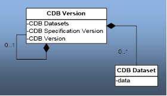
[#img_UMLDiagramofCDBVersionConcept,reftext='{figure-caption} {counter:figure-num}']
*{figure-caption}{counter:figure-num}. UML Diagram of CDB Version Concept*

The diagram shows that a CDB Version contains CDB Datasets; in addition it states which CDB St Number has been used to build the CDB content; finally, the CDB Version has a reference to another CDB Version. This reference allows the creation of a chain of CDB Versions. By chaining two CDB Versions together, the user can replace files in a previous CDB Version with new ones in a newer CDB Version. The figure below illustrates the chaining of CDB Versions belonging to different CDB Standard Number.

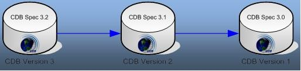
[#img_AValidChainofCDBVersions,reftext='{figure-caption} {counter:figure-num}']
*{figure-caption}{counter:figure-num}. A Valid Chain of CDB Versions*

The figure above shows three (3) CDB Versions, each containing data compliant to a different version of the standard. It shows that CDB Version 3 (on the left) complies with version 3.2 of the Standard and refers (the blue line) to CDB Version 2 (in the middle), a 3.1-compliant data store, which in turn refers to CDB Version 1 (to the right), a 3.0-compliant data store.

Each CDB Version has its own Version.xml file in its Metadata folder. As such, the smallest CDB Version contains a single file: `\CDB\Metadata\Version.xml`.

Since a CDB is made of at least one CDB Version, an empty and valid CDB has exactly one file, Version.xml, and all other datasets assume their default values.

===== CDB Extensions

A CDB Extension is a special CDB Version that is making use of the extension mechanism defined by this Standard to supplement the CDB with user-defined data. The actual way user-defined data is formatted and stored in a CDB Extension falls outside the realm of the Standard and is completely left to the user. The following UML diagram defines the CDB Extension concept.

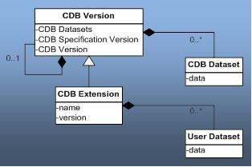
[#img_UMLDiagramofCDBExtensionConcept,reftext='{figure-caption} {counter:figure-num}']
*{figure-caption}{counter:figure-num}. UML Diagram of CDB Extension Concept*

The diagram shows that a CDB Extension inherits all the attributes of a CDB Version and adds its own attributes, a name and a version number (of the extension). A client application checks the name attribute to recognize and process known CDB Extensions; unrecognized CDB Extensions are skipped.

To illustrate the rule, assume that CDB Version 2 from Figure 3-2 above is in fact a CDB Extension whose name is not recognized by the client application; then the client must skip CDB Version 2 and continue its processing with CDB Version 1.

==== CDB Version Directory Structure

The files and the directory structure of CDB Versions are defined in subsequent section of this chapter. There can be an arbitrary number of CDB Versions in the CDB.

include::requirements/requirements_class007.adoc[]

The root of each CDB Version can have any valid path name footnote:[As defined in section 2.2, File System] on any disk device or volume under the target file system it is stored on.

include::requirements/REQ035.adoc[]

include::requirements/REQ036.adoc[]

The length of the path name leading to the CDB Version directory should be small enough such that the platform file system can store all possible file path names stored within a CDB version.

include::requirements/REQ037.adoc[]

==== CDB File Replacement Mechanism

The CDB File Replacement Mechanism allows content to be added, deleted and modified from the CDB. A file is said to exist in two (or more) CDB Versions when its relative path and name are the same in each version. This mechanism describe herein defines how to handle identical files found in multiple CDB Versions. Each CDB Version can contain a set of additions, modifications and deletions with respect to prior CDB Versions.

Figure 3-4 illustrates the case where a modeler has created a CDB Version that contains an additional level-of-detail to a wellhead model. When processed by a client application, the “effective” CDB data store now contains both the AA051_Wellhead_LOD0 and the AA051_Wellhead_LOD1 files.

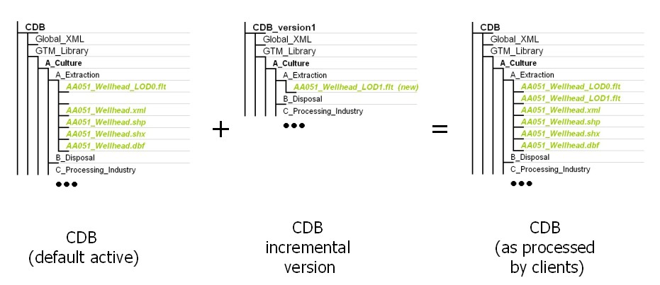
[#img_AddingContenttotheCDBdatastore,reftext='{figure-caption} {counter:figure-num}']
*{figure-caption}{counter:figure-num}. Adding Content to the CDB data store*

The process of modifying files is similar to adding files; any files that have been modified are inserted in a new CDB Version. Figure 3-5: Modifying Content of the CDB data store, illustrates the case where a modeler has modified level-of-detail #1 of a wellhead model. When processed by a client application, the “effective” CDB now contains the modified version of the AA051_Wellhead_LOD1.

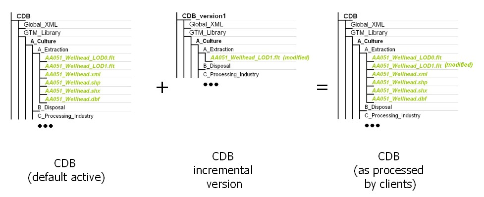
[#img_ModifyingContentoftheCDBDataStore,reftext='{figure-caption} {counter:figure-num}']
*{figure-caption}{counter:figure-num}. Modifying Content of the CDB Data Store*

A CDB Version can be created when content needs to be deleted from a prior CDB Version. The instruction to remove content from the CDB is triggered from the null files (e.g., files that are empty and whose size is zero) that are encountered within a CDB Version. Whenever a client application encounters a null file, it stops searching for it in prior CDB Versions and consider the file absent from the CDB. Figure 3-6: Deleting Content from the CDB, illustrates the case where a modeler has deleted level-of-detail #1 of a wellhead model. When processed by a client application, the “effective” CDB no longer contains the AA051_Wellhead_LOD1 file.

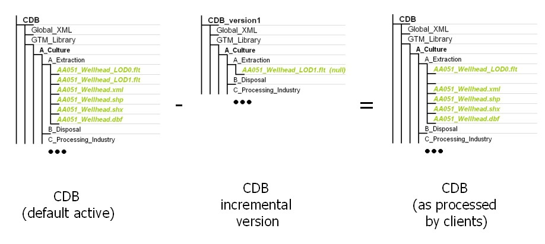
[#img_DeletingContentfromaCDBDataStore,reftext='{figure-caption} {counter:figure-num}']
*{figure-caption}{counter:figure-num}. Deleting Content from a CDB Data Store*

===== How to handle Archives

The CDB File Replacement Mechanism works at the file level, as the name implies. For this reason, in the case of a geospecific 3D model (GSModel) datasets whose files are stored as ZIP files, the replacement is done at the ZIP level; i.e., the content of the current version of the ZIP file completely replaces the previous version.

===== How to handle the metadata directory

The File Replacement Mechanism does not apply to the content of the Metadata directory because the files in a CDB Version must be generated, interpreted and processed with their own metadata. Stated otherwise, the Metadata of a CDB Version belongs solely to the files residing inside that CDB Version. When generating a CDB Version, the content generation tool must also generate the Metadata that will permit a client device to consume and interpret its content. Consequently, when a client device consumes data from a particular CDB Version, the client application should retrieve and use the Metadata of that CDB Version to correctly interpret the data obtained from it.

==== CDB Configuration

A CDB Configuration defines a list of CDB Versions. The following UML diagram presents the CDB Configuration concept.

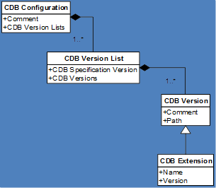
[#img_UMLDiagramofCDBConfigurationConcept,reftext='{figure-caption} {counter:figure-num}']
*{figure-caption}{counter:figure-num}. UML Diagram of CDB Configuration Concept*

The UML diagram tells us that a CDB Configuration is a collection of one to many Lists of CDB Versions. Each list of CDB Versions belongs to a single version of the CDB standard and has a collection of one to many CDB Versions. Note that a CDB Extension is a CDB Version that is making use of the extension mechanism defined by this standard to supplement the CDB with user-defined data.

The Configuration.xml metadata file provides the means of defining a CDB Configuration. The file resides in the Metadata folder of the CDB as follows:

`\CDB\Metadata\Configuration.xml`

When a client application opens a CDB, it searches the Metadata folder for the presence of the Configuration.xml file. If the file is found, the client uses its content to access all CDB Versions that are making up this CDB configuration. Otherwise, the client falls back to the mechanism associated with Version.xml. Note that when the client finds Configuration.xml, it does not need to open any of the Version.xml files associated with the CDB Versions referred to by the CDB Configuration; i.e., the purpose of the Configuration.xml file is to avoid reading multiple Version.xml files scattered all over the CDB.

==== Management of CDB Configurations and Versions

The performance of real-time simulation systems is directly affected by the number of CDB versions in the currently active CDB configuration. Unless the number of versions is bounded, performance guarantees cannot be provided by client-devices.

include::requirements/REQ038.adoc[]

Failure to do this may result in unsuitable delays when performing simulator repositions or may lead to paging artifacts at higher speeds and/or lower-altitudes. Client-device data sheets should specify the criteria under which performance can be guaranteed for the specified training requirements.

In the case where a CDB is solely intended as an off-line (read-write) repository it is permissible to have chains with up to 50 versions. Processing times may increase with chain lengths, commensurate with storage system access times.

[[CDBModelTypes]]
=== CDB Model Types

include::requirements/REQ039.adoc[]

The modeled representation of a feature primarily consists of its geometry and textures, and encompasses its exterior and interior.

In this Standard, the following terms and expressions are used.

* The term *Model* refers to all of the modeled representations of a cultural feature.
* The term *Model-LOD* refers to a specific level of detail of a *Model*.
* The term *2DModel* refers to the modeled representations of a 2D feature, i.e., a feature that has no significant height with respect to the underlying terrain.
* The term *2DModel-LOD* refers to a specific level of detail of a *2DModel*.
* The term *3DModel* refers to the modeled representation of a 3D feature that can be readily distinguished from the underlying terrain. In the case where the 3DModel is unique, it is referred to as a GSModel. In the case where the 3DModel is instanced, it is referred to as a GTModel. A 3DModel that is capable of movement is called a MModel. In the case where a MModel is positioned by the modeler, it is called a statically-positioned MModel.
* The term *3DModel-LOD* refers to a specific level of detail of a *3DModel*.

==== GTModel (Geotypical 3D Model)

A feature is said to have a 3D geotypical modeled representation if it is associated with a 3D Model that is typical of the feature’s shape, size, textures, materials, and attributes. The use of geotypical models is appropriate if the modeler does not wish to fully replicate all of the unique characteristics (e.g., shape, size, texture) of a feature, as they are in the real-world. When a feature is represented by a geotypical model, the modeler is in effect stating that two or more features of the same type (i.e., samefeature code) have the same modeled representation.

[[GSModelGeospecific3DModel]]
==== GSModel (Geospecific 3D Model)

A feature is said to have a 3D geospecific modeled representation if it is associated with a 3D model that is unique in shape, size, texture, materials, and attributes. The use of geospecific models is appropriate if the modeler wishes to fully replicate all of the unique characteristics (e.g., shape, size, texture) of a feature, as they are in the real-world. As a result, a geospecific model usually corresponds to a unique real-world recognizable cultural feature. Real-world features such as the Eiffel Tower, the Pentagon, or the CN Tower, to name a few, are usually modeled as geospecific.

[[T2DModelTiled2DModel]]
==== T2DModel (Tiled 2D Model)

A feature is said to have a 2D modeled representation if it is associated with a modeled representation that has no significant height with respect to the underlying terrain and generally conforms to the terrain profile. It is convenient to think of the 2D Models as a complement and as an extension to the Primary Elevation and (VSTI) Imagery datasets. 2D Models provide the means to represent 2D surface features that are conformed to the underlying terrain:

a.  Modeled representation of geotypical and geospecific 2D lineal-features such as roads, runways and taxiways, stripes.
b.  Modeled representation of geotypical and geospecific 2D polygon-features such as aprons, surface markings, contaminants, land usage (campgrounds, farms, etc.).

2D Models can also be used to model geotypical terrain textures as a mesh of 2D textured polygons overlaying the terrain. This modeling technique replicates approaches used in early Image Generators which had limited ability to page-in geospecific terrain textures.

[[MModelMoving3DModel]]
==== MModel (Moving 3D Model)

A moving model is typically characterized as such if it can move (on its own) or be moved. More specifically within the context of this standard, the model is not required to be attached to a cultural point feature.

During the course of a multi-player simulation footnote:[The players may be virtual (e.g., other simulators), synthetic (e.g., computer-generated simulations) or may be live (real-world players playing alongside virtual or synthetic players).], each client-device is typically solicited to provide a modeled representation of each of the players. The activation of such players requires that the client-device access the appropriate modeled representation for each of players. There are a large number of military simulations where the player types are characterized by their DIS code. To this end, the CDB data store provides a moving model library whose structure provides a convenient categorization of models by their DIS code.

[[UseofGSModelsandGTModels]]
==== Use of GSModels and GTModels

Sections 3.3.1 and 3.3.2 illustrate cases where the choice to represent a feature with either a geotypical (GTModels) or a geospecific model (GSModels) is more clear-cut. This section gives additional insight into the considerations and tradeoffs that go with associating a point-feature with either a geotypical or a geospecific modeled representation. By characterizing a feature as geotypical, the modeler makes a statement as to the expected usage of the feature (and its associated modeled representation) within the CDB.

When a feature is tagged as geotypical…

a.  the modeler is making a statement about his knowledge of the very high probability of repeatedly encountering that model type within the CDB *and…*
b.  the modeler is making a statement that he will likely associate the same modeled representation (same shape, size, texture, materials, or attributes, etc.) for the feature type – as a result, the client-devices can count on the fact that the model will be heavily replicated throughout the CDB. The characterization of a model as geotypical tells the consumers of the CDB that the model is heavily used throughout the CDB and that it may be cached in memory for re-use.

The manner in which geotypical models are stored / accessed differs from their geospecific counterparts. Geotypical models are stored in their own directory structure; this group of models is referred collectively as the GTModel library. The storage structure of the GTModel library provides a convenient categorization of models by their feature codes and their level-of-detail. As a result, geotypical models can be managed as a global library of 3D models that are used to fill the CDB with cultural detail.

The above discussion applies equally to statically-positioned moving models. The manner in which statically-positioned moving model features (and their modeled representations) are stored and accessed is similar to geotypical models; it differs however in the fact that the MModel library provides a categorization of models by their DIS code. The model is fetched from the MModel library regardless of whether it is used as statically-positioned model by the modeler or whether it is dynamically-positioned by the client-device during the simulation.

Conversely, when a feature is tagged as geospecific…

a.  the modeler is making a statement about his knowledge of the very low probability of encountering (typically only once) that feature type within the CDB *or…*
b.  the modeler is making a statement regarding his intention to associate a unique modeled representation (different shape, size, texture, materials, or attributes, etc.) for that feature – as a result, the client-devices can assume that the feature will never share the same modeled representation with other features (e.g., no model replication) within the CDB. Real-world recognizable cultural point features (say the Eiffel Tower, the Pentagon, the CN Tower) are usually modeled as geospecific.

GSModels have a storage organization that is consistent with Tiled datasets. The storage organization of tiled datasets has been optimized to efficiently access CDB content by its lat-long location, its level-of-detail and its dataset component type.

include::requirements/REQ040.adoc[]

See section 6.4.7.2, Volume 10 OGC CDB Implementation Guidance for more implementation guidance on this topic.

[[OrganizingModelsintoLevelsofDetail]]
==== Organizing Models into Levels of Detail

include::requirements/REQ041.adoc[]

The expression of the model resolution depends on the dataset; the resolution of the model geometry is called its Significant Size (SS); the texture resolution is expressed by its Texel Size (TS); and for the radar signature of a model, its resolution is simply its size and is measured by the diameter of its Bounding Sphere (BSD).

The lower bounds (LB) of SS, TS, and BSD for a given LOD can be expressed by the following set of equations.

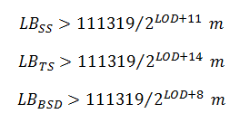

In all three equations, the value 111319 represents the approximate length in meters of an arc of one degree at the equator footnote:[The actual equation to obtain the values of 111319 m is L=a×PI180° where “a” is the length of the major semi-axis of the WGS-84 ellipsoid; “a” is also known as the equatorial radius.].

For convenience, the following table gives the CDB LOD associated with these three measures of the resolution of a model. Note that all values are expressed in meters using a scientific notation with 6 decimals.

[#table_CDBLODvsModelResolution,reftext='{table-caption} {counter:table-num}']
*Table 3-1: CDB LOD vs. Model Resolution*
[cols=",,,",]
|============================================================================
| |*ModelGeometry* |*ModelTexture* |*ModelSignature*
|*CDB LOD* |*Significant Size* |*Texel Size* |*Bounding Sphere*
|-10 |SS > 5.565950 × 10^+4^ |TS > 6.957438 × 10^+3^ |BSD > 4.452760 × 10^+5^
|-9 |SS > 2.782975 × 10^+4^ |TS > 3.478719 × 10^+3^ |BSD > 2.226380 × 10^+5^
|-8 |SS > 1.391488 × 10^+4^ |TS > 1.739359 × 10^+3^ |BSD > 1.113190 × 10^+5^
|-7 |SS > 6.957438 × 10^+3^ |TS > 8.696797 × 10^+2^ |BSD > 5.565950 × 10^+4^
|-6 |SS > 3.478719 × 10^+3^ |TS > 4.348398 × 10^+2^ |BSD > 2.782975 × 10^+4^
|-5 |SS > 1.739359 × 10^+3^ |TS > 2.174199 × 10^+2^ |BSD > 1.391488 × 10^+4^
|-4 |SS > 8.696797 × 10^+2^ |TS > 1.087100 × 10^+2^ |BSD > 6.957438 × 10^+3^
|-3 |SS > 4.348398 × 10^+2^ |TS > 5.435498 × 10^+1^ |BSD > 3.478719 × 10^+3^
|-2 |SS > 2.174199 × 10^+2^ |TS > 2.717749 × 10^+1^ |BSD > 1.739359 × 10^+3^
|-1 |SS > 1.087100 × 10^+2^ |TS > 1.358875 × 10^+1^ |BSD > 8.696797 × 10^+2^
|0 |SS > 5.435498 × 10^+1^ |TS > 6.794373 × 10^+0^ |BSD > 4.348398 × 10^+2^
|1 |SS > 2.717749 × 10^+1^ |TS > 3.397186 × 10^+0^ |BSD > 2.174199 × 10^+2^
|2 |SS > 1.358875 × 10^+1^ |TS > 1.698593 × 10^+0^ |BSD > 1.087100 × 10^+2^
|3 |SS > 6.794373 × 10^+0^ |TS > 8.492966 × 10^−1^ |BSD > 5.435498 × 10^+1^
|4 |SS > 3.397186 × 10^+0^ |TS > 4.246483 × 10^−1^ |BSD > 2.717749 × 10^+1^
|5 |SS > 1.698593 × 10^+0^ |TS > 2.123241 × 10^−1^ |BSD > 1.358875 × 10^+1^
|6 |SS > 8.492966 × 10^−1^ |TS > 1.061621 × 10^−1^ |BSD > 6.794373 × 10^+0^
|7 |SS > 4.246483 × 10^−1^ |TS > 5.308104 × 10^−2^ |BSD > 3.397186 × 10^+0^
|8 |SS > 2.123241 × 10^−1^ |TS > 2.654052 × 10^−2^ |BSD > 1.698593 × 10^+0^
|9 |SS > 1.061621 × 10^−1^ |TS > 1.327026 × 10^−2^ |BSD > 8.492966 × 10^−1^
|10 |SS > 5.308104 × 10^−2^ |TS > 6.635129 × 10^−3^ |BSD > 4.246483 × 10^−1^
|11 |SS > 2.654052 × 10^−2^ |TS > 3.317565 × 10^−3^ |BSD > 2.123241 × 10^−1^
|12 |SS > 1.327026 × 10^−2^ |TS > 1.658782 × 10^−3^ |BSD > 1.061621 × 10^−1^
|13 |SS > 6.635129 × 10^−3^ |TS > 8.293912 × 10^−4^ |BSD > 5.308104 × 10^−2^
|14 |SS > 3.317565 × 10^−3^ |TS > 4.146956 × 10^−4^ |BSD > 2.654052 × 10^−2^
|15 |SS > 1.658782 × 10^−3^ |TS > 2.073478 × 10^−4^ |BSD > 1.327026 × 10^−2^
|16 |SS > 8.293912 × 10^−4^ |TS > 1.036739 × 10^−4^ |BSD > 6.635129 × 10^−3^
|17 |SS > 4.146956 × 10^−4^ |TS > 5.183695 × 10^−5^ |BSD > 3.317565 × 10^−3^
|18 |SS > 2.073478 × 10^−4^ |TS > 2.591847 × 10^−5^ |BSD > 1.658782 × 10^−3^
|19 |SS > 1.036739 × 10^−4^ |TS > 1.295924 × 10^−5^ |BSD > 8.293912 × 10^−4^
|20 |SS > 5.183695 × 10^−5^ |TS > 6.479619 × 10^−6^ |BSD > 4.146956 × 10^−4^
|21 |SS > 2.591847 × 10^−5^ |TS > 3.239809 × 10^−6^ |BSD > 2.073478 × 10^−4^
|22 |SS > 1.295924 × 10^−5^ |TS > 1.629905 × 10^−6^ |BSD > 1.036739 × 10^−4^
|23 |SS > 0 |TS > 0 |BSD > 0
|============================================================================

When using the table to perform a lookup, first compute the value of SS, TS, or BSD, then scan through the lines of the table starting at the top with LOD −10; when the computed value is larger than the lower bound of the LOD, select that LOD. Since the values of SS, TS, and BSD are, by definition, always positive, the search for a LOD will always be successful; in the worst case, the search will end with the last line of the table.

[[OrganizingModelsintoDatasets]]
==== Organizing Models into Datasets

GSModel, GTModel, and MModel are organized into multiple datasets representing their exterior shell and interior, and their geometry and texture. The exterior of a model is called its shell and is composed of a set of datasets representing its geometry (ModelGeometry and ModelDescriptor) and its textures (ModelTexture, ModelMaterial, and ModelCMT). Similarly, the interior of a model is divided into geometry (ModelInteriorGeometry and ModelInteriorDescriptor) and textures (ModelInteriorTexture, ModelInteriorMaterial, and ModelInteriorCMT) datasets.

The following is the requirements class for naming Models.

include::requirements/requirements_class008.adoc[]

[[TermsandExpressions]]
==== Terms and Expressions

When referring to 3D Models, this standard makes use of a number of terms and expressions that are frequently mentioned throughout the text; these terms and expressions are defined below.

[[FeatureClassification]]
===== Feature Classification

The CDB standard has an important Feature Data Dictionary (FDD) whose origins are traceable to the DIGEST v2.1 Specification. However, the current FDD is a consolidation of the DIGEST, DGIWG footnote:[Defence Geographic Information Working Group], SEDRIS footnote:[http://www.sedris.org/], and UHRB footnote:[Ultra High Resolution Building] dictionaries. The CDB FDD makes use of feature codes footnote:[In CDB Version 1, Feature Codes were orginally based on the FACC (see section 3.3.8.1.1). Future versions of CDB will enhance and extend the capability to allow use of other feature code vocabularies.] (FC) to classify features. To provide an even better classification of features, the CDB standard defines an additional attribute called the feature sub-code (FSC). By extending the feature code hierarchy structure in this manner, it is possible to define a broader set of model types. The sub-code value and its significance depend on the primary feature code. Refer to /CDB/Metadata/Feature_Data_Dictionary.xml for the complete list of feature codes and subcodes.

Sections 5.7.1.3.24 and 5.7.1.3.25 respectively provide additional information on feature attributes.

One of the uses of feature codes is to create a hierarchy of subdirectories by taking advantage of the manner in which a Feature Data Dictionary is built. In CDB, a feature code is a 5-character code where the first character represents a category of features, the second represents a subcategory of the current category, and the last three characters represent a specific type in the subcategory. The CDB standard uses these three parts to compose the following hierarchy of folders:

__
\A_Category\B_Subcategory\999_Type\
__

Where A is the first character of the feature code, Category is the category name, B is the second character of the feature code, Subcategory is the subcategory name, 999 are the 3^rd^, 4^th^, and 5^th^ characters of the feature code, and Type feature type as per /CDB/Metadata/Feature_Data_Dictionary.xml.

[[AnoteonFeatureCodes]]
===== A note on Feature Codes

Feature codes provide a means for encoding real-world entities or objects and concepts, including those which are not necessarily visible or have a tangible physical form (e.g., airspace). Featuture codes allow a standardized way to describe the world in terms of features, attributes and attribute values. Feature codes do not specify the delineation or geometry of features. Attributes are the properties or characteristics associated with features. A standardized dictionary is required to support encoding in order to maximize interoperability and to understand the production, exchange, distribution, and exploitation of digital geographic data.

Feature codes are defined and stored in a dictionary of features, attributes and attribute values organized in a standardized coding system footnote:[The CDB Feature Data Dictionary (FDD) is provided with the CDB Standard in the form of an XML file. An XML Stylesheet is provided to format and display the dictionary inside a standard Web browser. Furthermore, the XML Schema defining the format of the FDD can also be found in the Schema subdirectory of the CDB Standard Distribution Package.]. Feature codes have not been developed to satisfy the requirements of any single application, product, or data store. Feature codes are intended to be independent from level of resolution (scale), representation, or portrayal. The appropriate selection of features codes and attributes are intended to be implemented as part of the overall solution for an application, by means of a database (supported by a data schema or model), a product, or dataset (defined according to a format specification and a data model).

Users of feature codes are advised that, as with any dictionary, there may be more than one way to encode geographic entities, either by offering a choice of features or a combination of features and attributes. A heliport is listed as feature GB035 (Heliport), but could also be encoded as feature code GB006 (Airfield) associated with the attribute APT (Airfield type) containing a coded value of 009 (Heliport). Another example would be AK090 (Fairgrounds) and AK091 (Exhibition Grounds), which could be interchanged depending on the user's own interpretation.

[[ModelName]]
===== Model Name

When a feature is represented by a 3D model, the model itself is given a name that is used to better describe or differentiate two features having the same feature and FSC codes. Even though the model name is left to the discretion of the modeler, the CDB standard recommends the use of the feature code based name as the model name. See the /CDB/Metadata/Feature_Data_Dictionary.xml for the complete list of feature codes. In the case of Moving Models, the model name is the human-readable version of its DIS Entity Type.

The model name corresponds to the MODL attribute defined in section 5.7.1.3.41.

[[DISEntityType]]
===== DIS Entity Type

CDB Moving Models make use of the DIS standard (see reference [7]) to create the directory structures where MModel datasets are stored. The DIS standard uses a structure called the DIS Entity Type to identify a “moving model”; this structure is made of seven fields named:

1.  Kind
2.  Domain
3.  Country
4.  Category
5.  Subcategory
6.  Specific
7.  Extra

The first four fields (kind, domain, country and category) are used to create four subdirectories in the moving model datasets hierarchy. Each of the directory names is composed of the field’s value (1 to 3 digits), followed by an underscore “_”, and concatenated with the field’s name as per Annex M (Volume 2 CDB Core: Model and Physical Structure Annexes).

Another directory name is created by concatenating all fields with the underscore character. This character string also forms the Moving Model DIS Code (MMDC) attribute later defined in section 5.7.1.3.40.

Together, these five directories classify CDB Moving Models into a DIS-like structure that looks like this:

`.\1_Kind\2_Domain\3_Country\4_Category\1_2_3_4_5_6_7\`

The above directory structure is used, for instance, by the MModelGeometry dataset later defined in section 3.5.1.

[[TextureName]]
===== Texture Name

include::requirements/REQ042.adoc[]

Examples of valid texture names are Brick, M1A2, house, City_Hall, etc. A name such as C-130 is invalid because the second character (“-“) is not alphanumeric.

include::requirements/REQ043.adoc[]

The directory represented by \A corresponds to the first character of TNAM in uppercase. The second directory, \B, corresponds to the second character of TNAM in uppercase. As a result, a texture named “house” will be stored in a directory tree with the following structure:

`\H\O\house\`

[[LevelofDetail]]
===== Level of Detail

The terms “Level of Detail” and its acronym “LOD” are generally well known to the intended audience of this standard.

include::requirements/REQ044.adoc[]

This standard specifies a numeric scale to classify a LOD between 34 levels numbered from −10 to +23. The details will be provided later in the document. At this point, it is sufficient to define the convention used throughout the standard to designate a particular LOD.

The standard designates a LOD by appending its level to the uppercase letter L. When the level is negative, the uppercase letter C is used in lieu of the minus sign. The numeric values of all levels are represented by 2-digit numbers. As a result, LODs are designated as LC10 for level −10, L00 for level 0, or L23 for level 23.

[[GTModelLibraryDatasets_69]]
=== GTModel Library Datasets

include::requirements/REQ045.adoc[]

These datasets are stored in five (5) different directory structures described in the subsections below.

[[GTModelDirectoryStructure1:GeometryandDescriptor]]
==== GTModel Directory Structure 1: Geometry and Descriptor

This directory structure holds the geometry-related datasets of the GTModel Library; they are:

1.  Dataset 500, GTModelGeometry Entry File
2.  Dataset 510, GTModelGeometry Level of Detail
3.  Dataset 503, GTModelDescriptor

The directory structure has 5 levels and is based on the feature code of the model (see section 3.3.8.1).

[#table_GTModelGeometryDirectoryStructure,reftext='{table-caption} {counter:table-num}']
*Table 3-2: GTModelGeometry Directory Structure*
[cols=",,",]
|===================================================================================================================================================================================================================================================================================================
|*Directory +
Level* |*Directory +
Name* |*Description*
|Level 1 |500_GTModelGeometry |The name of the directory is composed of the dataset code followed by an underscore and the dataset name.
|Level 2 |A_Category |The first character of the feature code is called the “Feature Category”. The name of the directory is composed of the first character (denoted A) of the category name followed by an underscore and the category name (denoted Category) as per Section 1.5.
|Level 3 |B_Subcategory |The second character of the feature code is called the “Feature Subcategory”. The name of the directory is composed of the first character (denoted B) of the subcategory name followed by an underscore and the subcategory name (denoted Subcategory) as per Section 1.5.
|Level 4 |999_Type |The 3^rd^, 4^th^, and 5^th^ characters of the feature code are called the “Feature Type”. The name of the directory is composed of the feature type (denoted 999) followed by an underscore and the name (denoted Type) associated with the feature type as per Section 1.5.
|Level 5 |LOD |Character L followed by the LOD number corresponding to the Significant Size for positive levels of detail. Characters LC followed by the LOD number corresponding to the Significant Size for negative levels of detail.
|===================================================================================================================================================================================================================================================================================================

[[GTModelGeometryEntryFileNamingConvention]]
===== GTModelGeometry Entry File Naming Convention

include::requirements/REQ046.adoc[]

The following table defines each field of the file name and Table 5-9 provides the values of the Component Selectors to complete the name.

[#table_GTModelGeometryEntryFileNamingConvention,reftext='{table-caption} {counter:table-num}']
*Table 3-3: GTModelGeometry Entry File Naming Convention*
[cols=",",]
|==========================================================================================
|*Field* |*Description*
|D500 |Character D followed by the 3-digit code assigned to the dataset
|Snnn |Character S followed by the 3-digit Component Selector 1
|Tnnn |Character T followed by the 3-digit Component Selector 2
|FeatureCode |Five-character feature code as defined in Section 1.5
|FSC |Three-digit integer representing the feature sub-code (FSC) as defined in Section 1.5
|MODL |32-character Model Name String
|ext |The file type associated with the dataset (For an OpenFlight file this is “.flt”)
|==========================================================================================

[[GTModelGeometryLevelofDetailNamingConvention]]
===== GTModelGeometry Level of Detail Naming Convention

include::requirements/REQ047.adoc[]

The following table defines each field of the file name and Table 5-9 provides the values of the Component Selectors to complete the name.

[#table_GTModelGeometryLevelofDetailNamingConvention,reftext='{table-caption} {counter:table-num}']
*Table 3-4: GTModelGeometry Level of Detail Naming Convention*
[cols=",",]
|=================================================================================================
|*Field* |*Description*
|D510 |Character D followed by the 3-digit code assigned to the dataset
|Snnn |Character S followed by the 3-digit Component Selector 1
|Tnnn |Character T followed by the 3-digit Component Selector 2
|LOD |This field is identical to the name of the LOD directory (level 5) where the file is stored.
|FeatureCode |Five-character feature code as defined in Section 1.5
|FSC |Three-digit integer representing the feature sub-code (FSC) as defined in Section 1.5
|MODL |32-character Model Name String
|ext |The file type associated with the dataset (For an OpenFlight file this is “.flt”)
|=================================================================================================

[[GTModelDescriptorNamingConvention]]
===== GTModelDescriptor Naming Convention

include::requirements/REQ048.adoc[]

The following table defines each field of the file name and Table 5-9 provides the values of the Component Selectors to complete the name.

[#table_GTModelDescriptorNamingConvention,reftext='{table-caption} {counter:table-num}']
*Table 3-5: GTModelDescriptor Naming Convention*
[cols=",",]
|==========================================================================================
|*Field* |*Description*
|D503 |Character D followed by the 3-digit code assigned to the dataset
|Snnn |Character S followed by the 3-digit Component Selector 1
|Tnnn |Character T followed by the 3-digit Component Selector 2
|FeatureCode |Five-character feature code as defined in Section 1.5
|FSC |Three-digit integer representing the feature sub-code (FSC) as defined in Section 1.5
|MODL |32-character Model Name String
|xml |The file type associated with the dataset
|==========================================================================================

[[Examples]]
===== Examples

The following example illustrates the directory structure that would store the entry file of all geotypical buildings with a feature code of AL015:

`\CDB\GTModel\500_GTModelGeometry\A_Culture\L_Misc_Feature\015_Building\`

Where \CDB\GTModel is the root of all geotypical model datasets, \500_GTModelGeometry is the directory containing all feature code categories, \A_Culture is the directory containing all feature code subcategories of category A (named Culture), \L_Misc_Feature is the directory containing all feature types of category A and subcategory L (named Misc_Feature), \015_Building is the directory containing all OpenFlight files representing geotypical buildings whose feature types are 015 (named Building).

Assuming the use of OpenFlight, examples of files found in the above directory are:

`.\D500_S001_T001_AL015_004_Castle.flt`

`.\D500_S001_T001_AL015_015_School.flt`

`.\D500_S001_T001_AL015_021_Garage.flt`

`.\D500_S001_T001_AL015_037_Fire_Station.flt`

`.\D500_S001_T001_AL015_050_Church.flt`

Note that all filenames start with a common portion (D500_S001_T001_AL015) and that only their FSC and MODL portions vary.

If the castle above (AL015_004_Castle) is represented with 3 levels of details, say LOD 3, 5 and 8, they would be stored in .\L03\, .\L05\, and .\L08\ giving file names such as these:

`.\L03\D510_S001_T001_L03_AL015_004_Castle.flt`

`.\L05\D510_S001_T001_L05_AL015_004_Castle.flt`

`.\L08\D510_S001_T001_L08_AL015_004_Castle.flt`

Again, the descriptor associated with the same castle (AL015_004_Castle) would be found in this file:

`.\D503_S001_T001_AL015_004_Castle.xml`

[[GTModelDirectoryStructure2:Texture,Material,andCMT]]
==== GTModel Directory Structure 2: Texture, Material, and CMT

This directory structure holds the texture-related datasets of the GTModel Libray; they are:

[start=1]
.  Dataset 501, GTModelTexture (Deprecated)
.  Dataset 511, GTModelTexture
.  Dataset 504, GTModelMaterial
.  Dataset 505, GTModelCMT

The directory structure has 4 levels and is based on the texture name.

[#table_GTModelTextureDirectoryStructure,reftext='{table-caption} {counter:table-num}']
*Table 3-6: GTModelTexture Directory Structure*
[cols=",,",]
|======================================================================================================================================
|*Directory +
Level* |*Directory +
Name* |*Description*
|Level 1 |501_GTModelTexture |The name of the directory is composed of the dataset code followed by an underscore and the dataset name.
|Level 2 |A |The name of the directory corresponds to the first character of texture name (TNAM), in uppercase.
|Level 3 |B |The name of the directory corresponds to the second character of texture name (TNAM), in uppercase.
|Level 4 |TNAM |The texture name is between 2 and 32 characters in length. The first two characters are alphanumeric.
|======================================================================================================================================

[[GTModelTextureNamingConvention]]
===== GTModelTexture Naming Convention

include::requirements/REQ049.adoc[]

The following table defines each field of the file name and Table 5-8 provides the values of the Component Selectors to complete the name.

[#table_GTModelTextureNamingConvention,reftext='{table-caption} {counter:table-num}']
*Table 3-7: GTModelTexture Naming Convention*
[cols=",",]
|=================================================================================================================
|*Field* |*Description*
|D511 |Character D followed by the 3-digit code assigned to the dataset.
|Snnn |Character S followed by the 3-digit Component Selector 1
|Tnnn |Character T followed by the 3-digit Component Selector 2
|LOD |The Level of Detail corresponding to the Texel Size of the texture as explained in section 3.3.8.5.
|TNAM |The texture name; identical to the folder name where the texture resides.
|ext |The file type associated with the dataset (For CDB Version 1.0 this is a SGI Image with file extension rgb.)
|=================================================================================================================

[[GTModelMaterialNamingConvention]]
===== GTModelMaterial Naming Convention

include::requirements/REQ050.adoc[]

The following table defines each field of the file name and Table 5-9 provides the values of the Component Selectors to complete the name.

[#table_GTModelMaterialNamingConvention,reftext='{table-caption} {counter:table-num}']
*Table 3-8: GTModelMaterial Naming Convention*
[cols=",",]
|========================================================================================================
|*Field* |*Description*
|D504 |Character D followed by the 3-digit code assigned to the dataset.
|Snnn |Character S followed by the 3-digit Component Selector 1
|Tnnn |Character T followed by the 3-digit Component Selector 2
|LOD |The Level of Detail corresponding to the Texel Size of the texture as explained in section 3.3.8.5.
|TNAM |The material texture name; identical to the folder name where the material texture resides.
|ext |The file type associated with the dataset (In CDB Version 1 specified as a TIFF file <.tif>)
|========================================================================================================

[[GTModelCMTNamingConvention]]
===== GTModelCMT Naming Convention

include::requirements/REQ050B.adoc[]

The following table defines each field of the file name and Table 5-9 provides the values of the Component Selectors to complete the name.

[#table_GTModelCMTNamingConvention,reftext='{table-caption} {counter:table-num}']
*Table 3-9: GTModelMaterial Naming Convention*
[cols=",",]
|=================================================================================================
|*Field* |*Description*
|D505 |Character D followed by the 3-digit code assigned to the dataset.
|Snnn |Character S followed by the 3-digit Component Selector 1
|Tnnn |Character T followed by the 3-digit Component Selector 2
|TNAM |The material texture name; identical to the folder name where the material texture resides.
|xml |The file type associated with the dataset
|=================================================================================================

[[Examples_70]]
===== Examples

The following example illustrates the directory structure that would store all files associated with a texture named ‘Brick’:

`\CDB\GTModel\501_GTModelTexture\B\R\Brick\`

Where \CDB\GTModel is the root of all geotypical model datasets, \501_GTModelTexture is the directory containing all geotypical textures, \B is the directory containing all textures whose name start with the letter ‘B’ or ‘b’, \R is the directory containing all textures whose name have the letter ‘R’ or ‘r’ in the second position, and \Brick is the directory containing all texture-related files whose name is ‘Brick’. Note that the second letter of the texture name is a lowercase ‘r’ but the corresponding directory name is an uppercase ‘R.’

If the Brick texture has a resolution of 1 cm and a dimension of 256 x 256 pixels, Table 3-1 tells us that the finest LOD will be 10 (TS = 0.01 m) and the coarsest will be 2 (TS = 2.56 m), and assuming SGI rgb based textures, and the following files would be found in the above directory:

`.\D511_S001_T001_L02_Brick.rgb`

`.\D511_S001_T001_L03_Brick.rgb`

`.\D511_S001_T001_L04_Brick.rgb`

`.\D511_S001_T001_L05_Brick.rgb`

`.\D511_S001_T001_L06_Brick.rgb`

`.\D511_S001_T001_L07_Brick.rgb`

`.\D511_S001_T001_L08_Brick.rgb`

`.\D511_S001_T001_L09_Brick.rgb`

`.\D511_S001_T001_L10_Brick.rgb`

The metadata (if provided) associated with the above material textures would reside in the same directory and be named:

`.\D511_S001_T001_Church-Gothic_mtd.xml`

The following example illustrates the directory structure that would store all LODs of a material texture whose name is Church-Gothic:

`\CDB\GTModel\501_GTModelTexture\C\U\Church-Gothic\`

Again, note that the second letter of the material texture name is a lowercase ‘u’ but the corresponding directory name is an uppercase ‘U.’

If the material texture has a resolution of 15 cm and a dimension of 256 x 256 pixels, the finest LOD will be 6 and the coarsest will be −2, and assuming images as TIFF files, the following files would be found in the above directory:

.\D504_Snnn_Tnnn_LC02_Church-Gothic.tif

.\D504_Snnn_Tnnn_LC01_Church-Gothic.tif

.\D504_Snnn_Tnnn_L00_Church-Gothic.tif

.\D504_Snnn_Tnnn_L01_Church-Gothic.tif

.\D504_Snnn_Tnnn_L02_Church-Gothic.tif

.\D504_Snnn_Tnnn_L03_Church-Gothic.tif

.\D504_Snnn_Tnnn_L04_Church-Gothic.tif

.\D504_Snnn_Tnnn_L05_Church-Gothic.tif

.\D504_Snnn_Tnnn_L06_Church-Gothic.tif

The composite material table associated with the above material textures would reside in the same directory and be named:

.\D505_Snnn_Tnnn_Church-Gothic.xml

The metadata (if provided) associated with the above material textures would reside in the same directory and be named:

.\D505_Snnn_Tnnn_Church-Gothic_mtd.xml

[[GTModelDirectoryStructure3:InteriorGeometryandDescriptor]]
==== GTModel Directory Structure 3: Interior Geometry and Descriptor

This directory structure holds the datasets related to the geometry of the interior of a GTModel; they are:

1.  Dataset 506, GTModelInteriorGeometry
2.  Dataset 508, GTModelInteriorDescriptor

The directory structure has 5 levels and is based on the feature code of the model (see section 3.3.8.1).

[#table_GTModelInteriorGeometryDirectoryStructure,reftext='{table-caption} {counter:table-num}']
*Table 3-10: GTModelInteriorGeometry Directory Structure*
[cols=",,",]
|==================================================================================================================================================================================================================================
|*Directory +
Level* |*Directory +
Name* |*Description*
|Level 1 |506_GTModelInteriorGeometry |The name of the directory is composed of the dataset code followed by an underscore and the dataset name.
|Level 2 |A_Category |The first character of the feature code (denoted A), called the “Feature Category”, followed by an underscore and the category name (denoted Category) as per Section 1.5.
|Level 3 |B_Subcategory |The second character of the feature code (denoted B), called the “Feature Subcategory”, followed by an underscore and the subcategory name (denoted Subcategory) as per Section 1.5.
|Level 4 |999_Type |The 3^rd^, 4^th^, and 5^th^ characters of the feature code (denoted 999), called the “Feature Type”, followed by an underscore and the name (denoted Type) associated with the feature type as per Section 1.5.
|Level 5 |LOD |The Level of Detail corresponding to the Significant Size of the model as explained in section 3.3.8.5.
|==================================================================================================================================================================================================================================

[[GTModelInteriorGeometryNamingConvention]]
===== GTModelInteriorGeometry Naming Convention

include::requirements/REQ052.adoc[]

The following table defines each field of the file name and Table 5-9 provides the values of the Component Selectors to complete the name.

[#table_GTModelInteriorGeometryNamingConvention,reftext='{table-caption} {counter:table-num}']
*Table 3-11: GTModelInteriorGeometry Naming Convention*
[cols=",",]
|=================================================================================================
|*Field* |*Description*
|D506 |Character D followed by the 3-digit code assigned to the dataset
|Snnn |Character S followed by the 3-digit Component Selector 1
|Tnnn |Character T followed by the 3-digit Component Selector 2
|LOD |This field is identical to the name of the LOD directory (level 5) where the file is stored.
|FeatureCode |Five-character feature code as defined in Section 1.5
|FSC |Three-digit integer representing the feature sub-code (FSC) as defined in Section 1.5
|MODL |32-character Model Name String
|ext |The file type associated with the dataset (For an OpenFlight file the extension is “.flt”)
|=================================================================================================

[[GTModelInteriorDescriptorNamingConvention]]
===== GTModelInteriorDescriptor Naming Convention

include::requirements/REQ053.adoc[]

The following table defines each field of the file name and Table 5-9 provides the values of the Component Selectors to complete the name.

[#table_GTModelInteriorDescriptorNamingConvention,reftext='{table-caption} {counter:table-num}']
*Table 3-12: GTModelInteriorDescriptor Naming Convention*
[cols=",",]
|==========================================================================================
|*Field* |*Description*
|D508 |Character D followed by the 3-digit code assigned to the dataset
|Snnn |Character S followed by the 3-digit Component Selector 1
|Tnnn |Character T followed by the 3-digit Component Selector 2
|FeatureCode |Five-character feature code as defined in Section 1.5
|FSC |Three-digit integer representing the feature sub-code (FSC) as defined in Section 1.5
|MODL |32-character Model Name String
|xml |The file type associated with the dataset.
|==========================================================================================

[[Examples_71]]
===== Examples

The following example illustrates the directory structure that would store the interior of all geotypical buildings represented at LOD 3 and whose feature code is AL015:

\CDB\GTModel\506_GTModelInteriorGeometry\A_Culture\ +
L_Misc_Feature\015_Building\L03\

Where \CDB\GTModel is the root of all geotypical model datasets, \505_GTModelInteriorGeometry is the directory containing all feature categories, \A_Culture is the directory containing all feature subcategories of category A (named Culture), \L_Misc_Feature is the directory containing all feature types of category A and subcategory L (named Misc_Feature), \015_Building is the directory containing all level of details representing geotypical buildings whose feature types are 015 (named Building), and \L03 is the directory containing the model files footnote:[Currently OpenFlight] representing LOD 3 of these buildings.

Assuming the use of OpenFlight, examples of files found in the above directory are:

* .\D506_S001_T001_L03_AL015_004_Castle.flt
* .\D506_S001_T001_L03_AL015_015_School.flt
* .\D506_S001_T001_L03_AL015_021_Garage.flt
* .\D506_S001_T001_L03_AL015_037_Fire_Station.flt
* .\D506_S001_T001_L03_AL015_050_Church.flt

Note that all filenames start with a common portion (D506_S001_T001_L03_AL015) and that only their FSC and MODL portions vary.

The descriptors associated with the interior of these models would be found in level 4 of the directory structure in the following files:

__
\CDB\GTModel\506_GTModelInteriorGeometry\A_Culture\ +
L_Misc_Feature\015_Building\ +
.\D508_S001_T001_AL015_004_Castle.xml +
.\D508_S001_T001_AL015_015_School.xml +
.\D508_S001_T001_AL015_021_Garage.xml +
.\D508_S001_T001_AL015_037_Fire_Station.xml +
.\D508_S001_T001_AL015_050_Church.xml
__

If there is also additional metadata for the interior of these models, they would also be found in level 4 of the directory structure in the following files:

__
\CDB\GTModel\506_GTModelInteriorGeometry\A_Culture\ +
L_Misc_Feature\015_Building\ +
.\D508_S001_T001_AL015_004_Castle_mtd.xml +
.\D508_S001_T001_AL015_015_School_mtd.xml +
.\D508_S001_T001_AL015_021_Garage_mts.xml +
.\D508_S001_T001_AL015_037_Fire_Station_mtd.xml +
.\D508_S001_T001_AL015_050_Church_mtd.xml
__

Note that any one of the models may have additional metadata or all may have additional metadata.

[[GTModelDirectoryStructure4:InteriorTexture,Material,andCMT]]
==== GTModel Directory Structure 4: Interior Texture, Material, and CMT

This directory structure holds the datasets related to the textures of the interior of a GTModel; they are:

[start=1]
.  Dataset 507, GTModelInteriorTexture
.  Dataset 509, GTModelInteriorMaterial
.  Dataset 513, GTModelInteriorCMT

The directory structure has 4 levels and is based on the texture name.

[#table_GTModelInteriorTextureDirectoryStructure,reftext='{table-caption} {counter:table-num}']
*Table 3-13: GTModelInteriorTexture Directory Structure*
[cols=",,",]
|==============================================================================================================================================
|*Directory +
Level* |*Directory +
Name* |*Description*
|Level 1 |507_GTModelInteriorTexture |The name of the directory is composed of the dataset code followed by an underscore and the dataset name.
|Level 2 |A |The name of the directory corresponds to the first character of texture name (TNAM), in uppercase.
|Level 3 |B |The name of the directory corresponds to the second character of texture name (TNAM), in uppercase.
|Level 4 |TNAM |The texture name has from 2 to 32 characters. The first two characters are alphanumeric.
|==============================================================================================================================================

[[GTModelInteriorTextureNamingConvention]]
===== GTModelInteriorTexture Naming Convention

include::requirements/REQ054.adoc[]

The following table defines each field of the file name and Table 5-8 provides the values of the Component Selectors to complete the name.

[#table_GTModelInteriorTextureNamingConvention,reftext='{table-caption} {counter:table-num}']
*Table 3-14: GTModelInteriorTexture Naming Convention*
[cols=",",]
|====================================================================================================================
|*Field* |*Description*
|D507 |Character D followed by the 3-digit code assigned to the dataset
|Snnn |Character S followed by the 3-digit Component Selector 1
|Tnnn |Character T followed by the 3-digit Component Selector 2
|LOD |The Level of Detail corresponding to the Texel Size of the texture as explained in section 3.3.8.5.
|TNAM |The texture name; identical to the folder name where the texture resides.
|<ext> |The file type associated with the dataset (In CDB version 1.0 this is an SGI Image with a rgb file extension)
|====================================================================================================================

[[GTModelInteriorMaterialNamingConvention]]
===== GTModelInteriorMaterial Naming Convention

include::requirements/REQ055.adoc[]

The following table defines each field of the file name and Table 5-9 provides the values of the Component Selectors to complete the name.

[#table_GTModelInteriorMaterialNamingConvention,reftext='{table-caption} {counter:table-num}']
*Table 3-15: GTModelInteriorMaterial Naming Convention*
[cols=",",]
|========================================================================================================
|*Field* |*Description*
|D509 |Character D followed by the 3-digit code assigned to the dataset
|Snnn |Character S followed by the 3-digit Component Selector 1
|Tnnn |Character T followed by the 3-digit Component Selector 2
|LOD |The Level of Detail corresponding to the Texel Size of the texture as explained in section 3.3.8.5.
|TNAM |The material texture name; identical to the folder name where the material texture resides.
|ext |The file type associated with the dataset (In CDB Version 1.0 specified as a TIFF file - tif)
|========================================================================================================

[[Example1_72]]
===== Example 1

The following example illustrates the directory structure that would store all LODs of a texture whose name is BeigeGypseWall:

`\CDB\GTModel\507_GTModelInteriorTexture\B\E\BeigeGypseWall\`

Where \CDB\GTModel is the root of all geotypical model datasets, \507_GTModelInteriorTexture is the directory containing all geotypical interior textures, \B is the directory containing all textures whose name start with the letter B, \R is the directory containing all textures whose name start the letter ‘B’ followed by the letter ‘E’, and \BeigeGypseWall is the directory containing all LODs of the texture representing a beige gypse wall. Note that the second letter of the texture name is a lowercase ‘e’ but the corresponding directory name is an uppercase ‘E.’

If the texture has a resolution of 1 cm and a dimension of 256 x 256 pixels, the finest LOD will be 10 and the coarsest will be 2, and the SGI RGB image file format is used, the following files would be found in the above directory:

* D507_S001_T001_L02_BeigeGypseWall.rgb
* D507_S001_T001_L03_BeigeGypseWall.rgb
* D507_S001_T001_L04_BeigeGypseWall.rgb
* D507_S001_T001_L05_BeigeGypseWall.rgb
* D507_S001_T001_L06_BeigeGypseWall.rgb
* D507_S001_T001_L07_BeigeGypseWall.rgb
* D507_S001_T001_L08_BeigeGypseWall.rgb
* D507_S001_T001_L09_BeigeGypseWall.rgb
* D507_S001_T001_L10_BeigeGypseWall.rgb

[[Example2_73]]
===== Example 2

The following example illustrates the directory structure that would store all LODs of a material texture associated with the interior of a gothic church and whose name is Church-Gothic:

`\CDB\GTModel\507_GTModelInteriorTexture\C\H\Church-Gothic\`

Where \CDB\GTModel is the root of all geotypical model datasets, \507_GTModelInteriorTexture is the directory containing all geotypical interior material textures, \C is the directory containing all textures whose name start with the letter C, \H is the directory containing all textures whose name start the letter ‘C’ followed by the letter ‘H’, and \Church-Gothic is the directory containing all LODs of the material texture called Church-Gothic. Note that the second letter of the material texture name is a lowercase ‘h’ but the corresponding directory name is an uppercase ‘H.’

If the material texture has a resolution of 1 cm and a dimension of 256 x 256 pixels, the finest LOD will be 10 and the coarsest will be 2, and the following files would be found in the above directory:

D509_Snnn_Tnnn_L02_Church-Gothic.tif

D509_Snnn_Tnnn_L03_Church-Gothic.tif

D509_Snnn_Tnnn_L04_Church-Gothic.tif

D509_Snnn_Tnnn_L05_Church-Gothic.tif

D509_Snnn_Tnnn_L06_Church-Gothic.tif

D509_Snnn_Tnnn_L07_Church-Gothic.tif

D509_Snnn_Tnnn_L08_Church-Gothic.tif

D509_Snnn_Tnnn_L09_Church-Gothic.tif

D509_Snnn_Tnnn_L10_Church-Gothic.tif

The metadata (if provided) associated with the above material textures would reside in the same directory and be named:

`.\D509_Snnn_Tnnn_Church-Gothic_mtd.xml`

[[GTModelDirectoryStructure5:Signature]]
==== GTModel Directory Structure 5: Signature

This directory structure holds the datasets related to the radar signature of a GTModel; they are:

[start=1]
.  Dataset 502, GTModelSignature (Deprecated)
.  Dataset 512, GTModelSignature

The directory structure has 5 levels and is based on the feature code of the model (see section 3.3.8.1).

[#table_GTModelSignatureDirectoryStructure,reftext='{table-caption} {counter:table-num}']
*Table 3-16: GTModelSignature Directory Structure*
[cols=",,",]
|===================================================================================================================================================================================================================================================================================================
|*Directory +
Level* |*Directory +
Name* |*Description*
|Level 1 |502_GTModelSignature |The name of the directory is composed of the dataset code followed by an underscore and the dataset name.
|Level 2 |A_Category |The first character of the feature code is called the “Feature Category”. The name of the directory is composed of the first character (denoted A) of the category name followed by an underscore and the category name (denoted Category) as per Section 1.5.
|Level 3 |B_Subcategory |The second character of the feature code is called the “Feature Subcategory”. The name of the directory is composed of the first character (denoted B) of the subcategory name followed by an underscore and the subcategory name (denoted Subcategory) as per Section 1.5.
|Level 4 |999_Type |The 3^rd^, 4^th^, and 5^th^ characters of the feature code are called the “Feature Type”. The name of the directory is composed of the feature type (denoted 999) followed by an underscore and the name (denoted Type) associated with the feature type as per Section 1.5.
|Level 5 |LOD |Character L followed by the LOD number corresponding to the Significant Size for positive levels of detail. Characters LC followed by the LOD number corresponding to the Significant Size for negative levels of detail.
|===================================================================================================================================================================================================================================================================================================

Note that for compatibility with version 3.0 of the standard, the name of the directory at level 1 is kept to 502_GTModelSignature even though dataset 502 has been deprecated and replaced with dataset 512 in version 3.1 of the standard.

[[GTModelSignatureNamingConvention]]
===== GTModelSignature Naming Convention

include::requirements/REQ056.adoc[]

The following table defines each field of the file name and Table 5-9 provides the values of the Component Selectors to complete the name.

[#table_GTModelSignatureNamingConvention,reftext='{table-caption} {counter:table-num}']
*Table 3-17: GTModelSignature Naming Convention*
[cols=",",]
|=================================================================================================================================================================
|*Field* |*Description*
|D512 |Character D followed by the 3-digit code assigned to the dataset
|Snnn |Character S followed by the 3-digit Component Selector 1
|Tnnn |Character T followed by the 3-digit Component Selector 2
|LOD |This field is identical to the name of the LOD directory (level 5) where the file is stored.
|FeatureCode |Five-character feature code as defined in Section 1.5
|FSC |Three-digit integer representing the feature sub-code (FSC) as defined in Section 1.5
|MODL |32-character Model Name String
|ext |The file type associated with the dataset. This is designated by the file extension: e.g. .tif for TIFF, .flt for OpenFlight, .shp for ShapeFiles and so on.
|=================================================================================================================================================================

[[Examples_74]]
===== Examples

The following example illustrates the directory structure that would store the signature of all geotypical buildings represented at LOD 3 and whose feature code is AL015:

`\CDB\GTModel\502_GTModelSignature\A_Culture\L_Misc_Feature\015_Building\L03\`

Where \CDB\GTModel is the root of all geotypical model datasets, \502_GTModelSignature is the directory containing all feature categories, \A_Culture is the directory containing all feature subcategories of category A (named Culture), \L_Misc_Feature is the directory containing all feature types of category A and subcategory L (named Misc_Feature), \015_Building is the directory containing all level of details representing the signature of geotypical buildings whose feature types are 015 (named Building), and \L03 is the directory containing the vector data sets representing LOD 3 of these buildings footnote:[Currently encoded as ShapeFiles but additional formats will be defined in a future CDB version.].

Examples of files that could be found in the above directory are:

* .\D512_S001_T001_L03_AL015_004_Castle.shp
* .\D512_S001_T001_L03_AL015_004_Castle.shx
* .\D512_S001_T001_L03_AL015_004_Castle.dbf
* .\D512_S001_T017_L03_AL015_004_Castle.dbf

If there is metadata for this file and the metadata is encoded in XML, the above directory would also include:

.\D512_S001_T017_L03_AL015_004_Castle_mtd.xml

[[GTModelCompleteExamples]]
==== GTModel Complete Examples

Assuming the use of ShapeFiles, OpenFlight, rgb texture files, and TIFF the following examples illustrate the locations and names of all files of the GTModel Library.

\CDB\GTModel\500_GTModelGeometry\A_Culture\L_Misc_Feature\ +
015_Building\ +
D500_S001_T001_AL015_004_Castle.flt (Entry File) +
D503_S001_T001_AL015_004_Castle.xml (Descriptor) +
Lnn\D510_S001_T001_Lnn_AL015_004_Castle.flt (LOD)

\CDB\GTModel\501_GTModelTexture\C\A\Castle\ +
D511_Snnn_Tnnn_Lnn_Castle.rgb (Texture) +
D504_Snnn_Tnnn_Lnn_Castle.tif (Material) +
D505_Snnn_Tnnn_Castle.xml (CMT)

\CDB\GTModel\502_GTModelSignature\A_Culture\L_Misc_Feature\ +
015_Building\Lnn\ +
D512_Snnn_Tnnn_Lnn_AL015_004_Castle.shp (Signature) +
D512_Snnn_Tnnn_Lnn_AL015_004_Castle.shx +
D512_Snnn_Tnnn_Lnn_AL015_004_Castle.dbf +
D512_Snnn_Tnnn_Lnn_AL015_004_Castle.dbt

\CDB\GTModel\506_GTModelInteriorGeometry\A_Culture\ +
L_Misc_Feature\015_Building\ +
D508_S001_T001_AL015_004_Castle.xml (Descriptor) +
Lnn\D506_S001_T001_Lnn_AL015_004_Castle.flt (LOD)

\CDB\GTModel\507_GTModelInteriorTexture\C\A\Castle\ +
D507_Snnn_Tnnn_Lnn_Castle.rgb (Texture) +
D509_Snnn_Tnnn_Lnn_Castle.tif (Material) +
D513_Snnn_Tnnn_Castle.xml (CMT)

[[MModelLibraryDatasets_75]]
=== MModel Library Datasets

The following is the requirements class for MModel Library datasets.

include::requirements/requirements_class009.adoc[]

include::requirements/REQ057.adoc[]

These datasets are stored in three (3) different directory structures described in the subsections below.

[[MModelDirectoryStructure1:GeometryandDescriptor]]
==== MModel Directory Structure 1: Geometry and Descriptor

This directory structure is owned by the MModelGeometry dataset that is assigned dataset code 600. The structure has 6 levels and is based on the DIS Entity Type (see section 3.3.8.3). The same directory structure is used to store the files of the MModelDescriptor dataset.

[#table_MModelGeometryDirectoryStructure,reftext='{table-caption} {counter:table-num}']
*Table 3-18: MModelGeometry Directory Structure*
[cols=",,",]
|===================================================================================================================================================================================================================
|*Directory +
Level* |*Directory +
Name* |*Description*
|Level 1 |600_MModelGeometry |The name of the directory is composed of the dataset code followed by an underscore and the dataset name.
|Level 2 |9_Kind |The numeric code assigned to the DIS Entity Kind followed by an underscore and the name of this kind as per Annex M footnote:[Volume 2 CDB Core Model and Physical Structure: Informative Annexes].
|Level 3 |9_Domain |The numeric code assigned to the DIS Domain followed by an underscore and the name of the domain as per Annex M.
|Level 4 |9_Country |The numeric code assigned to the DIS Country followed by an underscore and the name of this country as per Annex M.
|Level 5 |9_Category |The numeric code assigned to the DIS Catagory followed by an underscore and the name of this category as per Annex M.
|Level 6 |9_9_9_9_9_9_9 |All 7 fields of the DIS Entity type concatenated and separated by an underscore.
|===================================================================================================================================================================================================================

[[MModelGeometryNamingConvention]]
===== MModelGeometry Naming Convention

include::requirements/REQ058.adoc[]

The following table defines each field of the file names and Table 5-10 provides the values of the Component Selectors to complete the name.

[#table_MModelGeometryNamingConvention,reftext='{table-caption} {counter:table-num}']
*Table 3-19: MModelGeometry Naming Convention*
[cols=",",]
|=====================================================================================================================
|*Field* |*Description*
|D600 |Character D followed by the 3-digit code assigned to the dataset.
|Snnn |Character S followed by the 3-digit value of Component Selector 1
|Tnnn |Character T followed by the 3-digit value of Component Selector 2
|MMDC |The Moving Model DIS Code is the same as directory level 6 above
|ext |The file type associated with the dataset (In Version 1 this was anOpenFlight file with the extension is “.flt”)
|=====================================================================================================================

[[MModelDescriptorNamingConvention]]
===== MModelDescriptor Naming Convention

include::requirements/REQ059.adoc[]

The following table defines each field of the file names and Table 5-10 provides the values of the Component Selectors to complete the name.

[#table_MModelDescriptorNamingConvention,reftext='{table-caption} {counter:table-num}']
*Table 3-20: MModelDescriptor Naming Convention*
[cols=",",]
|=======================================================================
|*Field* |*Description*
|D603 |Character D followed by the 3-digit code assigned to the dataset.
|S001 |Character S followed by the 3-digit value of Component Selector 1
|T001 |Character T followed by the 3-digit value of Component Selector 2
|MMDC |The Moving Model DIS Code is the same as directory level 6 above
|xml |The file type associated with the dataset (XML File)
|=======================================================================

[[Examples_76]]
===== Examples

The following example illustrates the directory structure that would store the M1A2 SEP version of the M1 Abrams tank.

`\CDB\MModel\600_MModelGeometry\1_Platform\1_Land\225_United_States\1_Tank\1_1_225_1_1_8_0\`

Where \CDB\MModel is the root of all moving model datasets, \600_MModelGeometry is the directory containing the geometry and descriptor of all moving models, \1_Platform is the directory containing all DIS Entity of Kind 1 (named Platform), \1_Land is the directory containing all DIS platforms of Domain 1 (named Land), \225_United_States is the directory containing all DIS land platforms of Country 225 (called United_States), \1_Tank is the directory containing all DIS land platforms of Category 1 (named Tank), and \1_1_225_1_1_8_0 is the directory containing all geometry and descriptor files of the M1A2 SEP Abrams tank.

Examples of files found in the above directory are:

* D600_S001_T001_1_1_225_1_1_8_0.flt
* D603_S001_T001_1_1_225_1_1_8_0.xml

[[MModelDirectoryStructure2:TextureMaterialandCMT]]
==== MModel Directory Structure 2: Texture, Material, and CMT

This directory structure is owned by the MModelTexture dataset that is assigned dataset code 601. The structure has 4 levels and is based on the texture name (see section 3.3.8.4). The same directory structure is used to store the files of the MModelMaterial and MModelCMT datasets.

[#table_MModelTextureDirectoryStructure,reftext='{table-caption} {counter:table-num}']
*Table 3-21: MModelTexture Directory Structure*
[cols=",,",]
|=====================================================================================================================================
|*Directory +
Level* |*Directory +
Name* |*Description*
|Level 1 |601_MModelTexture |The name of the directory is composed of the dataset code followed by an underscore and the dataset name.
|Level 2 |A |The name of the directory corresponds to the first character of the texture name (TNAM), in uppercase.
|Level 3 |B |The name of the directory corresponds to the second character of the texture name (TNAM), in uppercase.
|Level 4 |TNAM |The texture name is from 2 to 32 characters in length. The first two characters are alphanumeric.
|=====================================================================================================================================

[[MModelTextureNamingConvention]]
===== MModelTexture Naming Convention

include::requirements/REQ060.adoc[]

The following table defines each field of the file names and Table 5-8 provides the values of the Component Selectors to complete the name.

[#table_MModelTextureNamingConvention,reftext='{table-caption} {counter:table-num}']
*Table 3-22: MModelTexture Naming Convention*
[cols=",",]
|===========================================================================================================================
|*Field* |*Description*
|D601 |Character D followed by the 3-digit code assigned to the dataset.
|Snnn |Character S followed by the 3-digit value of Component Selector 1
|Tnnn |Character T followed by the 3-digit value of Component Selector 2
|Wnn |Character W followed by the 2-digit Texture Size Code
|TNAM |The texture name; identical to directory level 4 above
|<ext> |The file type associated with the dataset (For CDB Version 1.0 these are defined as a SGI Image with .rgb extension)
|===========================================================================================================================

[[MModelMaterialNamingConvention]]
===== MModelMaterial Naming Convention

include::requirements/REQ061.adoc[]

The following table defines each field of the file names and Table 5-10 provides the values of the Component Selectors to complete the name.

[#table_MModelMaterialNamingConvention,reftext='{table-caption} {counter:table-num}']
*Table 3-23: MModelMaterial Naming Convention*
[cols=",",]
|========================================================================================================
|*Field* |*Description*
|D604 |Character D followed by the 3-digit code assigned to the dataset.
|Snnn |Character S followed by the 3-digit value of Component Selector 1
|Tnnn |Character T followed by the 3-digit value of Component Selector 2
|Wnn |Character W followed by the 2-digit Texture Size Code
|TNAM |The texture name; identical to directory level 4 above
|ext |The file type associated with the dataset (In CDB Version 1.0 this is defined as a TIFF File - tif)
|========================================================================================================

[[MModelCMTNamingConvention]]
===== MModelCMT Naming Convention

include::requirements/REQ062.adoc[]

The following table defines each field of the file names and Table 5-10 provides the values of the Component Selectors to complete the name.

[#table_MModelCMTNamingConvention,reftext='{table-caption} {counter:table-num}']
*Table 3-24: MModelMaterial Naming Convention*
[cols=",",]
|=======================================================================
|*Field* |*Description*
|D605 |Character D followed by the 3-digit code assigned to the dataset
|S001 |Character S followed by the 3-digit value of Component Selector 1
|T001 |Character T followed by the 3-digit value of Component Selector 2
|TNAM |The texture name; identical to directory level 4 above
|xml |The file type associated with the dataset
|=======================================================================

[[Examples_77]]
===== Examples

Assuming that the textures, materials, and CMT of the M1A2 SEP are called M1A2_SEP, the following directory structure would store them.

`\CDB\MModel\601_MModelTexture\M\1\M1A2_SEP\`

Where \CDB\MModel is the root of all moving model datasets, \601_MModelTexture is the directory containing the textures, material textures, and CMTs of all moving models, \M is the directory containing all files whose TNAM field starts with the letter ‘m’ or ‘M’, \1 is the directory containing all files whose TNAM field starts with ‘m1’ or ‘M1’, and \M1A2_SEP is the directory containing all texture-related files whose TNAM is M1A2_SEP.

Examples of files found in the above directory are:

* D601_S005_T001_W10_M1A2_SEP.rgb
* D604_S001_T001_W09_M1A2_SEP.tif
* D605_S001_T001_M1A2_SEP.xml

[[MModelDirectoryStructure3:Signature]]
==== MModel Directory Structure 3: Signature

This directory structure is dedicated to the MModelSignature dataset that is assigned dataset code 606. The structure has 7 levels and is based on the DIS Entity Type (see section 3.3.8.3).

[#table_MModelSignatureDirectoryStructure,reftext='{table-caption} {counter:table-num}']
*Table 3-25: MModelSignature Directory Structure*
[cols=",,",]
|=======================================================================================================================================================================================================================================
|*Directory +
Level* |*Directory +
Name* |*Description*
|Level 1 |606_MModelSignature |The name of the directory is composed of the dataset code followed by an underscore and the dataset name.
|Level 2 |9_Kind |The numeric code assigned to the DIS Entity Kind followed by an underscore and the name of this kind as per Annex M footnote:[Volume 2 CDB Core: Model and Physical Structure: Informative Annexes].
|Level 3 |9_Domain |The numeric code assigned to the DIS Domain followed by an underscore and the name of the domain as per Annex M.
|Level 4 |9_Country |The numeric code assigned to the DIS Country followed by an underscore and the name of this country as per Annex M.
|Level 5 |9_Category |The numeric code assigned to the DIS Category followed by an underscore and the name of this category as per Annex M.
|Level 6 |9_9_9_9_9_9_9 |All 7 fields of the DIS Entity type concatenated and separated by an underscore.
|Level 7 |LOD |Character L followed by the LOD number corresponding to the Significant Size for positive levels of detail. Characters LC followed by the LOD number corresponding to the Significant Size for negative levels of detail.
|=======================================================================================================================================================================================================================================

[[NamingConvention]]
===== Naming Convention

include::requirements/REQ063.adoc[]

The following table defines each field of the file names and Table 5-10 provides the values of the Component Selectors to complete the name.

[#table_MModelSignatureNamingConvention,reftext='{table-caption} {counter:table-num}']
*Table 3-26: MModelSignature Naming Convention*
[cols=",",]
|=========================================================================================================================================================================================================================================================================================================================
|*Field* |*Description*
|D606 |Character D followed by the 3-digit code assigned to the dataset.
|Snnn |Character S followed by the 3-digit value of Component Selector 1
|Tnnn |Character T followed by the 3-digit value of Component Selector 2
|LOD |This field is identical to the name of the LOD directory (level 7) where the file is stored.
|MMDC |The Moving Model DIS Code is the same as directory level 6
|ext |‘ext’ is any necessary extension to uniquely identify the table or file. In the case in which multiple tables or files are necessary to store the model signature content, then the same base name _SHALL_ be used and the necessary name extensions applied as required by the database or file storage technology.
|=========================================================================================================================================================================================================================================================================================================================

[[Examples_78]]
===== Examples

The following example illustrates the directory structure that would store LOD 4 of the RCS Signature of the M1A2 SEP Abrams tank.

`\CDB\MModel\606_MModelSignature\1_Platform\1_Land\225_United_States\1_Tank\1_1_225_1_1_8_0\L04`

Where \CDB\MModel is the root of all moving model datasets, \606_MModelGeometry is the directory containing the RCS signature of all moving models, \1_Platform is the directory containing all DIS Entity of Kind 1 (named Platform), \1_Land is the directory containing all DIS platforms of Domain 1 (named Land), \225_United_States is the directory containing all DIS land platforms of Country 225 (called United_States), \1_Tank is the directory containing all DIS land platforms of Category 1 (named Tank), \1_1_225_1_1_8_0 is the directory containing all levels of detail of the RCS signature of the M1A2 SEP Abrams tank, and \L04 is the directory containing the files representing LOD 4 of RCS signature of the tank.

For ShapeFiles an example of files found in the above directory are:

__
D606_Snnn_Tnnn_L04_1_1_225_1_1_8_0.shp

D606_Snnn_Tnnn_L04_1_1_225_1_1_8_0.shx

D606_Snnn_Tnnn_L04_1_1_225_1_1_8_0.dbf

D606_Snnn_Tnnn_L04_1_1_225_1_1_8_0.dbt
__

[[MModelCompleteExamples]]
==== MModel Complete Examples

Assuming the use of ShapeFiles, SGI rgb files, and OpenFlight, the following examples, based on the M1A2 SEP, illustrate the naming conventions of all MModel datasets.

\CDB\MModel\600_MModelGeometry\1_Platform\1_Land +
\225_United_States\1_Tank\1_1_225_1_1_8_0\ +
D600_Snnn_Tnnn_1_1_225_1_1_8_0.flt (Geometry) +
D603_S001_T001_1_1_225_1_1_8_0.xml (Descriptor)

\CDB\MModel\601_MModelTexture\M\1\M1A2_SEP\ +
D601_Snnn_Tnnn_Wnn_M1A2_SEP.rgb (Texture) +
D604_Snnn_Tnnn_Wnn_M1A2_SEP.tif (Material) +
D605_S001_T001_M1A2_SEP.xml (CMT)

\CDB\MModel\606_MModelSignature\1_Platform\1_Land +
\225_United_States\1_Tank\1_1_225_1_1_8_0\Lnn\ +
D606_Snnn_Tnnn_Lnn_1_1_225_1_1_8_0.shp (Signature) +
D606_Snnn_Tnnn_Lnn_1_1_225_1_1_8_0.shx +
D606_Snnn_Tnnn_Lnn_1_1_225_1_1_8_0.dbf +
D606_Snnn_Tnnn_Lnn_1_1_225_1_1_8_0.dbt

[[CDBTiledDatasets]]
=== CDB Tiled Datasets

The *\CDB\Tiles\* folder is the root directory of all tiled datasets. They all share a similar directory structure described below. All tiled datasets implement the CDB tiling scheme described in Section 2.1, Partitioning the Earth into Tiles.

include::requirements/requirements_class010.adoc[]

[[TiledDatasetTypes]]
==== Tiled Dataset Types

There are three principal types of tiled datasets:

1.  Raster Datasets
2.  Vector Datasets
3.  Model Datasets

[[RasterDatasets]]
===== Raster Datasets

Data elements within a tile are organized into a regular grid where data elements are evenly positioned at every _XUnit~LOD~_ and _YUnit~LOD~_ as described in Section 2.1.2, Tile Levels-of-Detail (Tile-LODs). This type of organization is referred to as a Raster Dataset. Raster Datasets always have a fixed number of elements corresponding to the number of units shown in Table 2-4: CDB LOD versus Tile and Grid Size. An example of a raster dataset is terrain imagery.

*Note:* Partially-filled Tile-LODs are not permitted in a compliant the CDB data store. In the case where data at the Tile-LOD’s resolution does not fully cover the Tile-LOD’s geographic footprint, the modeler (or the tools) should fill the remainder area of the Tile-LOD with the “best available” data. There are two cases to consider:

*Case I:* In the case where coarser LODm data exists for the remainder area of the Tile- LODn, the LODm data should be interpolated to LODn.

*Case II:* In the case where coarser LODm does not exist for the remainder area of the Tile-LODn, then the remainder area of Tile-LODn should be filled with the default value for this dataset.

[[VectorDatasets]]
===== Vector Datasets

The point features, the lineal features, and the polygon features of the CDB are organized into several Vector Datasets and into levels of details.

The level-of-detail organization of the Vector Datasets mimics the concept of map scaling commonly found in cartography (for example a 1:50,000 map). If we pursue the analogy with cartography, increasing the LOD number (increasingly finer detail) of a dataset is equivalent to decreasing the map’s scaling (*1:n* map scaling where *n* is decreasing). As is the case with cartography, the Tile-LOD number provides a clear indication of both the positional accuracy and of the density of features. Consequently, the CDB specifies an average value for the density of features for each LOD of the Vector Dataset hierarchy. Table 3-27 below defines these values. For each CDB LOD, the table provides the maximum number of points allowed per Tile-LOD and the resulting average Feature Density.

[#table_CDBLODversusFeatureDensity,reftext='{table-caption} {counter:table-num}']
*Table 3-27: CDB LOD versus Feature Density*
[cols=",,,",]
|============================================================================================================================
|*CDB LOD* |*Maximum Number of Points per Tile* |*Approximate Tile Edge Size (meters)* |*Average Point Density (points/m^2^)*
|-10 |1 |1.11319 × 10^+05^ |8.06977 × 10^-11^
|-9 |1 |1.11319 × 10^+05^ |8.06977 × 10^-11^
|-8 |1 |1.11319 × 10^+05^ |8.06977 × 10^-11^
|-7 |1 |1.11319 × 10^+05^ |8.06977 × 10^-11^
|-6 |4 |1.11319 × 10^+05^ |3.22791 × 10^-10^
|-5 |16 |1.11319 × 10^+05^ |1.29116 × 10^-09^
|-4 |64 |1.11319 × 10^+05^ |5.16466 × 10^-09^
|-3 |256 |1.11319 × 10^+05^ |2.06586 × 10^-08^
|-2 |1024 |1.11319 × 10^+05^ |8.26345 × 10^-08^
|-1 |4096 |1.11319 × 10^+05^ |3.30538 × 10^-07^
|0 |16384 |1.11319 × 10^+05^ |1.32215 × 10^-06^
|1 |16384 |5.56595 × 10^+04^ |5.28861 × 10^-06^
|2 |16384 |2.78298 × 10^+04^ |2.11544 × 10^-05^
|3 |16384 |1.39149 × 10^+04^ |8.46177 × 10^-05^
|4 |16384 |6.95744 × 10^+03^ |3.38471 × 10^-04^
|5 |16384 |3.47872 × 10^+03^ |1.35388 × 10^-03^
|6 |16384 |1.73936 × 10^+03^ |5.41553 × 10^-03^
|7 |16384 |8.69680 × 10^+02^ |2.16621 × 10^-02^
|8 |16384 |4.34840 × 10^+02^ |8.66485 × 10^-02^
|9 |16384 |2.17420 × 10^+02^ |3.46594 × 10^-01^
|10 |16384 |1.08710 × 10^+02^ |1.38638 × 10^+00^
|11 |16384 |5.43550 × 10^+01^ |5.54551 × 10^+00^
|12 |16384 |2.71775 × 10^+01^ |2.21820 × 10^+01^
|13 |16384 |1.35887 × 10^+01^ |8.87281 × 10^+01^
|14 |16384 |6.79437 × 10^+00^ |3.54912 × 10^+02^
|15 |16384 |3.39719 × 10^+00^ |1.41965 × 10^+03^
|16 |16384 |1.69859 × 10^+00^ |5.67860 × 10^+03^
|17 |16384 |8.49297 × 10^-01^ |2.27144 × 10^+04^
|18 |16384 |4.24648 × 10^-01^ |9.08576 × 10^+04^
|19 |16384 |2.12324 × 10^-01^ |3.63430 × 10^+05^
|20 |16384 |1.06162 × 10^-01^ |1.45372 × 10^+06^
|21 |16384 |5.30810 × 10^-02^ |5.81489 × 10^+06^
|22 |16384 |2.65405 × 10^-02^ |2.32595 × 10^+07^
|23 |16384 |1.32703 × 10^-02^ |9.30382 × 10^+07^
|============================================================================================================================

include::requirements/REQ064.adoc[]

[[ModelDatasets]]
===== Model Datasets

The last type of tiled datasets is used to store 2D and 3D Models and will be later described in their own sections.

[[TiledDatasetDirectoryStructure]]
==== Tiled Dataset Directory Structure

The vast majority of CDB datasets are tiled; the complete list follows.

[start=1]
. Elevation
. MinMaxElevation
. MaxCulture
. Imagery
. RMTexture
. RMDescriptor
. GSFeature
. GTFeature
. GeoPolitical
. VectorMaterial
. RoadNetwork
. RailRoadNetwork
. PowerLineNetwork
. HydrographyNetwork
. GSModelGeometry
. GSModelTexture
. GSModelSignature
. GSModelDescriptor
. GSModelMaterial
. GSModelCMT
. GSModelInteriorGeometry
. GSModelInteriorTexture
. GSModelInteriorDescriptor
. GSModelInteriorMaterial
. GSModelInteriorCMT
. T2DModelGeometry
. T2DModelCMT
. Navigation

All these datasets share the same 5-level directory structure defined below.

[#table_TiledDatasetDirectoryStructure,reftext='{table-caption} {counter:table-num}']
*Table 3-28: Tiled Dataset Directory Structure*
[cols=",,",]
|===================================================================================================================================================================================================================================================================================
|*Directory +
Level* |*Directory +
Name* |*Description*
|Level 1 |Lat |Geocell Latitude – This directory level divides the CDB along lines of latitude aligned to Geocells. By convention the name of the directory is based on the latitude of the south edge of the Geocell.
|Level 2 |Lon |Geocell Longitude – This directory level divides the CDB along lines of longitude aligned to Geocells. By convention the name of the directory is based on the longitude of the west edge of the Geocell.
|Level 3 |nnn_DatasetName |Tiled Dataset Name – The name of the directory is composed of the 3-digit dataset code (denoted nnn) followed by an underscore and the dataset name. Dataset codes are listed in Annex Q OGC CDB Core: Model and Physical Structure: Informative Annexes.
|Level 4 |LOD |This directory level divides each of the tiled datasets of the Geocell into its Level of Details
|Level 5 |UREF |This directory level divides a particular level of details into rows of tiles. UREF is a reference to the Up Index of a tile.
|===================================================================================================================================================================================================================================================================================

The above directory structure results in the following path to all files of the tiled datasets.

`\CDB\Tiles\Lat\Lon\nnn_DatasetName\LOD\UREF\`

Directory levels are further described below.

[[DirectoryLevel1LatitudeDirectory]]
===== Directory Level 1 (Latitude Directory)

This section provides the algorithm to determine the name of the directory at level 1 of the Tiles hierarchy.

include::requirements/REQ065.adoc[]

The CDB standard specifies _DlatCell_ to be 1 degree anywhere on earth, which gives 180 earth slices (_NbSliceID_ = 180) and a _SliceID_ ranging from 0 to 179. Note that the latitude range of the CDB standard Earth Model Tiled Datasets is –90 ≤ _lat_ < 90; Refer to Section 2.1.3, Handling of the North and South Pole for the handling of the latitude of +90.

Note that the directory name corresponds to the latitude of the southwest corner of the CDB Geocell. Moreover, future releases of the CDB Specification shall retain the same value of _DlatCell_. Note that a modification of the value of _DlatCell_ would entail substantial changes to the resulting CDB directory and file naming thus requiring a re-compilation of existing CDBs.

[[Examples_79]]
====== Examples

Data elements located at latitude −5.2° will be found under the directory named:

`\CDB\Tiles\S06`

Data elements located at latitude +62.3° will be found under the directory named:

`\CDB\Tiles\N62`

[[DirectoryLevel2LongitudeDirectory]]
===== Directory Level 2 (Longitude Directory)

This section provides the algorithm to determine the name of the directory at level 2 of the Tiles hierarchy.

include::requirements/REQ066.adoc[]

Note that _SliceIDIndex_ and _NbSliceIDIndex_ are a function of both latitude and longitude; however, _NbSliceIDIndexEq_ is the number of _SliceIDIndex_ at the equator. First, the longitude size of the CDB Geocell (_DLonCell_) is determined:

where…

_DLonCellBasic_ is the width of a CDB Geocell in degrees at the equator

_DLonZone_(_lat_) is the number of _DLonCellBasic_ in a given zone as per Table 3-29: NbSliceIDIndex for every CDB Zones. _DLonZone_(_lat_) is a function of the latitude.

The CDB standard sets _DLonCellBasic_ to 1 degree, which gives 360 CDB Geocells (__NbSliceIDIndexEq__=360) at the equator. Table 3-29: NbSliceIDIndex for every CDB Zones, provides the values for _NbSliceIDIndex_ at given latitudes. _SliceIDIndex_ ranges from 0 to _NbSliceIDIndexEq_-1 at all latitudes. Note that the longitude range of the CDB Earth Model Tiled Datasets is –180 ≤ _lon_ < 180 which implies that an application needs to convert a longitude of 180 to –180 before computing _SliceIDIndex_.

Since _DLonCellBasic_ is set to 1 degree, the index _SliceIDIndex_ will increment by _DLonZone(lat)_; therefore, the directory name corresponds to the longitude of the southwest corner of the CDB Geocell. Moreover, future release of the CDB standard should retain the same value of _DLonCellBasic_. Doing otherwise will cause substantial modifications to the repository file naming convention and tile content thus requiring a conversion of the CDB instance.

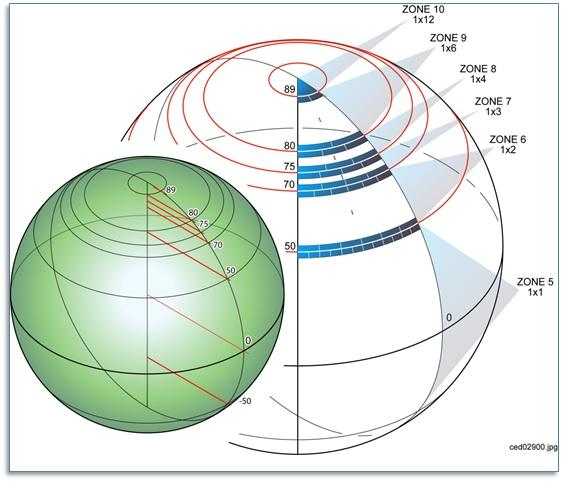
[#img_AllocationofCDBGeocellswithIncreasingLatitude,reftext='{figure-caption} {counter:figure-num}']
*{figure-caption}{counter:figure-num}. Allocation of CDB Geocells with Increasing Latitude*

[#table_NbSliceIDIndexforeveryCDBZones,reftext='{table-caption} {counter:table-num}']
*Table 3-29: NbSliceIDIndex for every CDB Zones*
[cols=",,",]
|=============================================
|*Latitude* |*DLonZone(lat)* |*NbSliceIDIndex*
|+89 ≤ lat < +90 |12 |30
|+80 ≤ lat < +89 |6 |60
|+75 ≤ lat < +80 |4 |90
|+70 ≤ lat < +75 |3 |120
|+50 ≤ lat < +70 |2 |180
|–50 ≤ lat < +50 |1 |360
|–70 ≤ lat < –50 |2 |180
|–75 ≤ lat < –70 |3 |120
|–80 ≤ lat < –75 |4 |90
|–89 ≤ lat < –80 |6 |60
|–90 ≤ lat < –89 |12 |30
|=============================================

[[Examples_80]]
====== Examples

Data elements located at latitude −5.2° and longitude +45.2° will be found under the directory named:

`\CDB\Tiles\S06\E045`

Data elements located at latitude +62.3° and longitude –160.4° will be found under the directory named:

`\CDB\Tiles\N62\W162`

The reason for “W162” instead of “W161” is that at latitudes between 50° and 70°, the CDB Geocells have a width of 2 degrees as indicated in Table 3-29: NbSliceIDIndex for every CDB Zones. “W162” corresponds to the southwest corner of the corresponding CDB Geocell.

[[DirectoryLevel3DatasetDirectory]]
===== Directory Level 3 (Dataset Directory)

The name of the directory at level 3 is composed of the dataset code and dataset name. The complete list is provided in Annex Q of the OGC CDB Core: Model and Physical Structure: Informative Annexes. Examples are provided below.

[[Examples_81]]
====== Examples

The elevation and the imagery of the geocell located at a latitude of −6° and a longitude of +45° will be found under the directories named:

`\CDB\Tiles\S06\E045\001_Elevation`

`\CDB\Tiles\S06\E045\004_Imagery`

The list of geospecific features of the geocell located at latitude +62° and longitude –160° will be found under the directory named:

`\CDB\Tiles\N62\W160\100_GSFeature`

The network of roads covering the geocell located at latitude +62° and longitude –160° will be found under the directory named:

`\CDB\Tiles\N62\W160\201_RoadNetwork`

The geometry and textures of a geospecific 3D model located at latitude −5.2° and longitude +45.2° will be found under the directories named:

\CDB\Tiles\S06\E045\300_GSModelGeometry`

`\CDB\Tiles\S06\E045\301_GSModelTexture`

The geometry of tiled 2D models covering the geocell located at latitude −5° and longitude +45° will be found under the directories named:

`\CDB\Tiles\S05\E045\310_T2DModelGeometry`

To complete these examples, the files associated with the Navigation dataset and covering the geocell located at latitude +36° and longitude −88° will be found under the directory named:

`\CDB\Tiles\N36\W088\401_Navigation`

[[DirectoryLevel4LODDirectory]]
===== Directory Level 4 (LOD Directory)

This directory level contains all of the Level of Details directories supported by the corresponding datasets.

All coarse LOD tiles, ranging from LOD –10 to LOD –1, are stored in a single directory uniquely named \LC. The remaining finer LODs (i.e., LOD 0 to LOD 23) have their own corresponding directories, named \Lxx where xx is the 2-digit LOD number.

[[Examples_82]]
====== Examples

LOD 2 of the terrain elevation of the geocell located at latitude −6° and longitude +45° will be found under the directory named:

`\CDB\Tiles\S06\E045\001_Elevation\L02`

LOD −6 of the same dataset for the same geocell will be found in:

`\CDB\Tiles\S06\E045\001_Elevation\LC`

[[DirectoryLevel5UREFDirectory]]
===== Directory Level 5 (UREF Directory)

The UREF directory level subdivides a geocell into a number of rows to limit the number of entries in a directory.

The number of files at a given LOD is proportional to 2^2×LOD^. For instance, LOD 10 represents about one million files. The introduction of the UREF directory level reduces the number of files per directory to the order of 2^LOD^.

The name of the directory is composed of the character U (Up direction) followed by the Up index (or the row number) of the tile, as described in this section.

The number of rows in a CDB Geocell at a given LOD is given by the following equation:

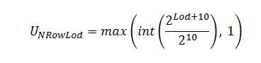

…which simplifies to:

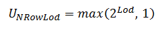

The index of a row ranges from 0 for the bottom row to __U~NRowLod~__−1 for the upper row. For any given latitude _lat_, its Up Index _U~Ref~_ is determined by first computing _DLat_:

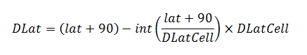

…which simplifies to the following for computer language that support modulo:

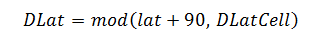

Then the index of the UREF can be evaluated as follows:

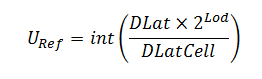

Knowing that the value of _DLatCell_ is 1° for the whole CDB, the resulting formulas become:

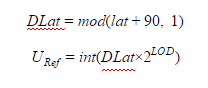

[[Examples_83]]
====== Examples

At latitude −5.2° and at LOD 2, the UREF index computed from the above formulas will be:

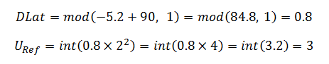

Assuming longitude +45.2°, the elevation data corresponding to this coordinate will be found under the directory named:

`\CDB\Tiles\S06\E045\001_Elevation\L02\U3`

A geospecific feature whose significant size qualifies it for LOD 7 and positioned at latitude +62.3° will produce the following UREF index:

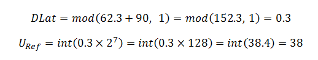

Assuming longitude –160.4°, the data will be found under the directory named:

`\CDB\Tiles\N62\W162\100_GSFeature\L07\U38`

[[TiledDatasetFileNamingConventions]]
==== Tiled Dataset File Naming Conventions

There are two sets of naming conventions for tiled datasets. The first one corresponds to the name of files located in the leaf directories of the *\CDB\Tiles* hierarchy. The second set of names applies to files found inside ZIP archives.

[[FileNamingConventionforFilesinLeafDirectoriesUREFDirectory]]
===== File Naming Convention for Files in Leaf Directories (UREF Directory)

include::requirements/REQ067.adoc[]

The following table defines each field of the file name and chapter 5, CDB Datasets, provides the dataset codes and the component selectors to complete the name.

[#table_TiledDatasetFileNamingConvention1,reftext='{table-caption} {counter:table-num}']
*Table 3-30: Tiled Dataset File Naming Convention 1*
[cols=",",]
|==============================================================================================================================================
|*Field* |*Description*
|Lat |Geocell Latitude – Identical to the name of the directory defined in section 3.6.2.1, Directory Level 1 (Latitude Directory).
|Lon |Geocell Longitude – Identical to the name of the directory defined in section 3.6.2.2, Directory Level 2 (Longitude Directory).
|Dnnn |Character D followed by the 3-digit code assigned to the dataset.
|Snnn |Character S followed by the 3-digit value of Component Selector 1.
|Tnnn |Character T followed by the 3-digit value of Component Selector 2.
|LOD |Level of Detail – As defined in section 3.3.8.5, Level of Detail.
|Un |UREF – Identical to the name of the directory as defined in section 3.6.2.5, Directory Level 5 (UREF Directory).
|Rn |RREF – A reference to the Right Index of a tile. Character R (Right direction) followed by the column number as described in this section.
|ext |File extension as per file type.
|==============================================================================================================================================

The RREF token divides a particular level of details into columns of tiles. The number of columns in a CDB Geocell at a given LOD is given by the following equation:

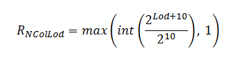

…which simplifies to:

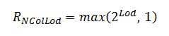

The index of a column ranges from 0 for the leftmost column to __R~NColLod~__−1 for the rightmost column. For any given _lat_/_lon_ coordinate, its Right Index _R~Ref~_ is determined by first computing _DLon_:

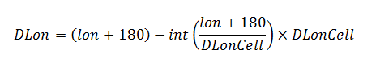

…which simplifies to the following for computer language that support modulo:

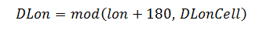

Then the Right Index _R~Ref~_ can be evaluated as follows:

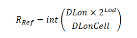

By substituing _DLonCell_ that is defined in section 3.6.2.2, Directory Level 2 (Longitude Directory), we obtain the following set of equations:

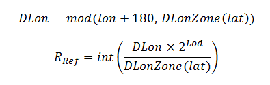

The value of _DLonZone_ is provided by Table 3-29: NbSliceIDIndex for every CDB Zones.

[[Examples_84]]
====== Examples

Continuing from the examples in section 3.6.2.5.1, at latitude −5.2° and longitude +45.2° and at LOD 2, the RREF index computed from the above formulas will be:

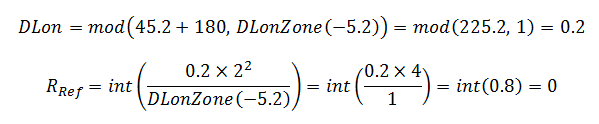

The primary elevation data corresponding to this coordinate will be found in the file named:

S06E045_D001_S001_T001_L02_U3_R0.tif

A man-made point feature whose significant size qualifies it for LOD 7, positioned at latitude +62.3° and longitude -160.4° will produce the following RREF index:

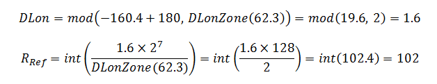

If ShapeFiles are being used, this approach results in the following file names:

N62W162_D100_S001_T001_L07_U38_R102.shp

N62W162_D100_S001_T001_L07_U38_R102.shx

N62W162_D100_S001_T001_L07_U38_R102.dbf

N62W162_D100_S001_T001_L07_U38_R102.dbt

[[FileNamingConventionforFilesinZIPArchives]]
===== File Naming Convention for Files in ZIP Archives

The following GSModel datasets reside inside ZIP archives.

[start=1]
.  GSModelGeometry
.  GSModelTexture
.  GSModelMaterial
.  GSModelDescriptor
.  GSModelCMT
.  GSModelInteriorGeometry
.  GSModelInteriorTexture
.  GSModelInteriorMaterial
.  GSModelInteriorDescriptor
. GSModelInteriorCMT
. GSModelMetadata

include::requirements/requirements_class011.adoc[]

include::requirements/REQ068.adoc[]

The extra tokens are described in the next sections.

[[GSModelGeometryFileNamingConventions]]
====== GSModel Geometry File Naming Conventions

include::requirements/REQ069.adoc[]

The FeatureCode, FSC, and MODL tokens are as defined in section 3.3.8.1, Feature Classification, and section 3.3.8.2, Model Name.

[[GSModelTextureFileNamingConventions]]
====== GSModel Texture File Naming Conventions

include::requirements/REQ070.adoc[]

The TNAM token is as defined in section 3.3.8.4, Texture Name.

[[GSModelMaterialFileNamingConventions]]
====== GSModel Material File Naming Conventions

include::requirements/REQ071.adoc[]

The TNAM token is as defined in section 3.3.8.4, Texture Name.

[[GSModelDescriptorFileNamingConventions]]
====== GSModel Descriptor File Naming Conventions

include::requirements/REQ072.adoc[]

The FeatureCode, FSC, and MODL tokens are as defined in section 3.3.8.1, Feature Classification, and section 3.3.8.2, Model Name.

[[GSModelCMTFileNamingConventions]]
====== GSModel CMT File Naming Conventions

The files from the GSModelCMT and GSModelInteriorCMT datasets have the following naming convention:

_
LatLon_Dnnn_Snnn_Tnnn_LOD_Un_Rn_TNAM.xml
_

The TNAM token is as defined in section 3.3.8.4, Texture Name

[[Examples_85]]
====== Examples

All archives at LOD 7 that are located at latitude +62.3° and longitude -160.4° will be named:

N62W162_Dnnn_S001_T001_L07_U38_R102.zip

For each model dataset that uses an archive, the name of the archive will be:

_
N62W162_D300_S001_T001_L07_U38_R102.zip (Geometry)

N62W162_D301_S001_T001_L07_U38_R102.zip (Texture)

N62W162_D302_S001_T001_L07_U38_R102.zip (Signature)

N62W162_D303_S001_T001_L07_U38_R102.zip (Descriptor)

N62W162_D304_S001_T001_L07_U38_R102.zip (Material)

N62W162_D309_S001_T001_L07_U38_R102.zip (CMT)

N62W162_D305_S001_T001_L07_U38_R102.zip (Interior Geometry)

N62W162_D306_S001_T001_L07_U38_R102.zip (Interior Texture)

N62W162_D307_S001_T001_L07_U38_R102.zip (Interior Descriptor)

N62W162_D308_S001_T001_L07_U38_R102.zip (Interior Material)

N62W162_D311_S001_T001_L07_U38_R102.zip (Interior CMT)
_

Assuming the use of ShapeFiles, SGI rgb files and OpenFlight, examples of files found inside the above archives could be:

_
N62W162_D300_S001_T001_L07_U38_R102_AL015_116_AcmeFactory.flt

N62W162_D301_Snnn_Tnnn_L07_U38_R102_AcmeFactory.rgb

N62W162_D302_Snnn_Tnnn_L07_U38_R102_AL015_116_AcmeFactory.shp

N62W162_D302_Snnn_Tnnn_L07_U38_R102_AL015_116_AcmeFactory.shx

N62W162_D302_Snnn_Tnnn_L07_U38_R102_AL015_116_AcmeFactory.dbf

N62W162_D303_S001_T001_L07_U38_R102_AL015_116_AcmeFactory.xml

N62W162_D304_Snnn_Tnnn_L07_U38_R102_AcmeFactory.tif

N62W162_D305_S001_T001_L07_U38_R102_AL015_116_AcmeFactory.flt

N62W162_D306_S001_T001_L07_U38_R102_AcmeFactoryWall.rgb

N62W162_D306_S001_T001_L07_U38_R102_AcmeFactoryFloor.rgb

N62W162_D306_S001_T001_L07_U38_R102_AcmeFactoryCeiling.rgb

N62W162_D307_S001_T001_L07_U38_R102_AL015_116_AcmeFactory.xml

N62W162_D308_Snnn_Tnnn_L07_U38_R102_AcmeFactory.tif
_

To complete the example, the name of the GSModel Composite Material Table (GSModelCMT) that is associated with the above geocell is:

N62W162_D309_S001_T001_L00_U0_R0.xml

Note that this file is located at LOD 0, hence the value 0 for UREF and RREF. This will be explained later in chapter 5.

Finally, if using OpenFlight the geometry of the tiled 2D model corresponding to the above tile will be named:

N62W162_D310_S001_T001_L07_U38_R102.flt

[[NavigationLibraryDataset]]
=== Navigation Library Dataset

The *\CDB\Navigation\* folder is the root directory of the Navigation library which is composed of a single dataset: NavData.

The purpose of the Navigation library is to include all of the information which is either not geographically located, or has a global geographical coverage and can be used as a lookup to the Navigation Tile-LODs.

[[NavdataStructure]]
==== Navdata Structure

The NavData dataset is assigned dataset code 400 and has a single level directory structure.

[#table_GTModelGeometryEntryFileDirectoryStructure,reftext='{table-caption} {counter:table-num}']
*Table 3-31: GTModelGeometry Entry File Directory Structure*
[cols=",,",]
|===============================================================================================================================
|*Directory +
Level* |*Directory +
Name* |*Description*
|Level 1 |400_NavData |The name of the directory is composed of the dataset code followed by an underscore and the dataset name.
|===============================================================================================================================

[[NavigationDataNamingConvention]]
==== Navigation Data Naming Convention

include::requirements/REQ073.adoc[]

The following table defines each field of the file name and section 5.2 provides the values of the Component Selectors to complete the name.

[#table_NavDataNamingConvention,reftext='{table-caption} {counter:table-num}']
*Table 3-32: NavData Naming Convention*
[cols=",",]
|===========================================================================================================================
|*Field* |*Description*
|D400 |Character D followed by the 3-digit code assigned to the dataset.
|Snnn |Character S followed by the 3-digit Component Selector 1
|Tnnn |Character T followed by the 3-digit Component Selector 2
|ext |The file type associated with the dataset. (In CDB Version 1.0 this is for a dBASE III+ file or database table - .dbf)
|===========================================================================================================================

[[Examples_86]]
===== Examples

The Schema file (T002) of the Airport component (S001) of the NavData dataset stored in a dBASE file:

_
\CDB\Navigation\400_NavData\D400_S001_T002.dbf
_
