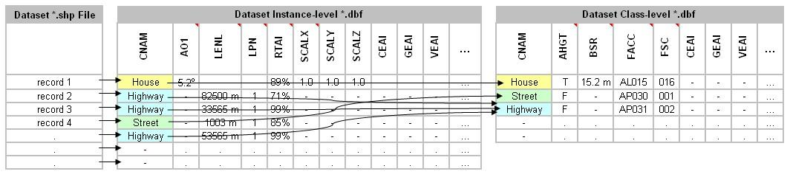
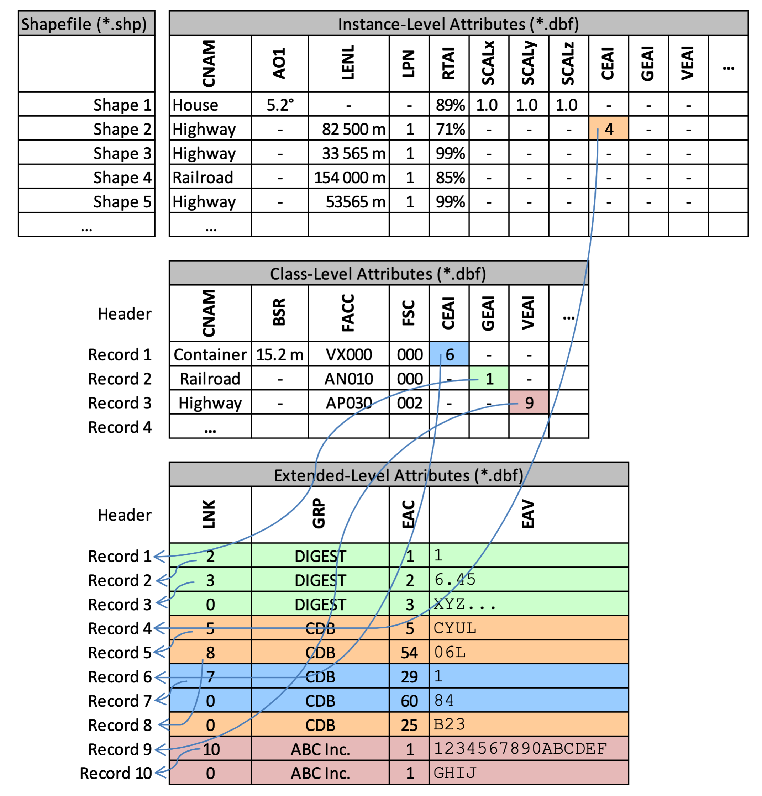

= Volume 15: OGC CDB Attribution for Tiled Vector Dataset

[[CDBAttributionSummary]]
== Summary

This document defines CDB attribution, CDB attributes, and allocation of CDB attributes.
The CDB attributes and their normative requirements are described in the OGC CDB Volume 1, section 5.7.1.3 CDB Attributes.
The metadata for these attributes is stored in the `\CDB\Metadata\CDB_Attributes.xml` file.
The schema file can be found in `\CDB\Metadata\Schema\Vector_Attributes.xsd`.

[[CDBAttributesOverview]]
== CDB Attributes Overview

Attributes are used to describe one or more real or virtual characteristics of a feature.
Features can be assigned a variable number of attributes.

Three categories of attributes are defined for the CDB standard. However, this document focuses only on CDB attributes.

*CDB Attributes*

CDB attributes are attributes whose semantics, data type, length, format, ranges, usage, unit and compatibility are entirely governed by the OGC CDB standard.
Most of these attributes are unique to the CDB standard, i.e., these attributes are not found in source data that conforms to various (US) governmental standards and specifications.
As a result, this attribution data must be derived via CDB tool automation or provided directly by the user.

The CDB attributes and their normative requirements are described in the OGC CDB Volume 1, section 5.7.1.3 CDB Attributes.
The metadata of these attributes is stored in the `\CDB\Metadata\CDB_Attributes.xml` file.

*Geomatics Attributes*

Geomatics attributes are attributes whose semantics, data type, length, format, range, usage, and unit, are governed by various governmental/industrial specifications and standards.
Such attributes are generally found in source data that conform to such standards and specifications.
While the CDB standard itself does not define and govern the usage of these attributes, it nonetheless accommodates their storage within the repository structure of a CDB compliant dataset/data store.
Please see section <<Extendedlevel>> for more information on extended level schemas and how Geomatics attributes are used.

*Vendor Attributes*

Vendor attributes are attributes whose semantics, data type, length, format, range, usage, and unit are governed by one or more vendors.
In general, such attributes cannot be used by other vendors since they are often proprietary.
Such attributes exclude the above two types of attributes and are generally unique to each vendor.
While the CDB standard itself does not define and govern the usage of these attributes, it nonetheless accommodates their storage within the repository structure of a CDB compliant dataset/data store.
Please see section <<Extendedlevel>> for more information on extended level schemas and how Vendor attributes are used.

[[CDBAttributionSchema]]
== CDB Attribution Schema (CDB Vector Attribute Schema)

The following UML diagram, <<img_UMLdiagramOftheCDBvectorAttribute>>, indicates the schema of the CDB attributes.
The UML diagram is generated based on the CDB vector attribute schema which can be found in the `\CDB\Metadata\Schema\Vector_Attributes.xsd` file.
The CDB attributes metadata file generates based on the CDB vector attribute schema.
In essence, the CDB attributes metadata file is the transposition of the CDB attributes into a format more appropriate for a computer program.

image::images/image92.jpg[untitled1,width=1200,height=600]
[#img_UMLdiagramOftheCDBvectorAttribute,reftext='{figure-caption} {counter:figure-num}']
*_{figure-caption} {counter:figure-num}. The UML diagram of the CDB Vector Attribute Schema_*

The UML diagram is composed of three majors sections: attributes, units and scalers.
The most important section is the attributes section.
The schema file has a list of the attributes, followed by two lists of units and scalers that are referenced by an individual attribute.
The components of the UML diagram are defined in <<table_cdb_schema>>.

[#table_cdb_schema,reftext='{table-caption} {counter:table-num}']
*_{table-caption} {counter:table-num}: The Description of the Elements of the CDB Vector Attribute Schema._*
[cols="15e, <30m,<10m",width="100%",options="header",align="center"]
|===
|Name | Definition | Multiplicity

| Vector-Attributes
| ???
| 1

| Vector-Attributes/Attributes
| Contains a list of attributes.
| 1

| Attributes/Attribute
| It includes the assigned attribute's code, symbol, and it states if the attribute is deprecated or not.
| 1..*

| Attribute/Code
| A unique four-digit numeric code is associated with each attribute. For example, the CDB attribute “Angle of Orientation” has an attribute code of “0003”.
| 1

| Attribute/Symbol (Identifier)
| A unique three-character or four-character alphanumeric identifier is associated with the attributes that are governed by this standard.
Attributes other than those governed by the OGC CDB standard may not have an assigned identifier. For example, the CDB attribute “Length’’ has the “LEN” identifier.
The identifier is a case-sensitive string of up to 10 characters.
In the case of instance-level and class-level attributes, the identifier is used as the base name for a column name, such as `counties.dbf`, in a vector attribute encoding.
| 1

| Attribute/Name
| The long form of the symbol.
| 1

| Attribute/Definition
| Defines each attribute.
Each attribute is associated with a textual description (describing semantic information), which provides a human-readable definition of the attribute.
| 1

| Attribute/Description
| A free-form text that describes the attribute.
| 0..1

| Attribute/UsageNote
| CDB attribution usage note falls in the following categories:

  - _Recommended:_
A recommended attribute is an attribute whose value should be provided for all of the features of a specified dataset.
Consumers of CDB compliant data (tools and/or simulator client-devices) can always rely on the availability of recommended attributes since the attribute value is either provided explicitly in the CDB dataset/data store or provided implicitly as a defaulted value.
A CDB with defaulted recommended attributes are considered compliant by this standard; however, the performance of one or more of the client devices (commonly found on simulation devices) may be adversely affected.

  - _Optional:_
An optional attribute is an attribute whose value may (optionally) be provided for all of the features of a specified dataset.
Consumers of CDB compliant data (tools and/or simulator client-devices) cannot rely on the availability of optional attributes.

  - _Dependent:_
A dependent attribute is an attribute whose value depends on another attribute, be it mandatory, recommended, or optional.
The attribute is considered mandatory if the attribute it depends on is mandatory.
Likewise, the attribute is considered recommended if the attribute it depends on is recommended.
Finally, the attribute is considered optional if the attribute it depends on is optional.

Note: The attribute usage information for each of the CDB attributes can be found in <<table_CDBattributes>>, CDB Attributes and in <<table_AllocationofCDBAttributestoVectorDataset>>, Allocation of CDB Attributes to Vector Datasets.
| 0..1

| Attribute/Compatibility
| Shows the attribute's source or origin and the version of the CDB standard that the attribute is compatible with.
The CDB standard provides the means to attribute features with attribution data with varied origins.
The CDB standard accommodates the vast majority of attribution data that is in use today and available through formats and products supported by the NGA and other US governmental agencies.
| 0..1

| Attribute/Level
| Provides a means to state if the attribute is Preferred, Supported, Deprecated, or Not Supported for each of the schema levels. It also provides the schema level of the attribute.
| 1

| Level/Instance
| Used for features whose attributes and attribute values vary with each instance of a feature in a dataset.
| 1

| Level/Extended
| The extended-level schema is used to access Geomatics attributes and Vendor attributes.
| 1

| Level/Class
| The preferred attribution schema for features whose attributes and attribute values can be shared by one or more of the instances of a feature in a dataset.
| 1

| Attribute/Value
| Attribute values give quantitative/qualitative meaning to the attribute.
It provides the information required to interpret (parse) the value assigned to this attribute.
A value can be assigned to each attribute including data type, length, format, range, usage, units, and compatibility.
| 1

| Value/Type
| The type of the attribute value. NOTE: accepted types are: Text, Enumeration (Enum), Numeric, or Boolean.
| 1

| Value/Enumeration
| Provides a reference to a value code. NOTE: valid only for Enumeration (Enum) data type.
| 0..1

| Value/Format
| The format of the value. NOTE: valid only for the numeric data type. Accepted formats are Floating-Point, Integer.
| 0..1

| Value/Precision
| Provides the number of digits before and after the decimal point. NOTE: valid only for Floating-Point format.
| 0..1

| Value/Range
| Provides the minimum and maximum values. NOTE: valid only for the numeric data type.
| 0..1

| Value/Length
| Provides the length of value (character). NOTE: valid only for the text data type.
| 0..1

| Value/Default
| Represents the default value of the attribute.
| 0..1

| Value/Unit
| Provides a reference to a unit code.
| 0..1

| Value/Scaler
| A reference to a scaler code.
| 0..1

| Vector-Attributes/Units
| A list of Unit definitions.
| 1

| Units/Unit
| A list of unit codes with assigned code and symbol. The code is a positive integer used as a key when a value references a unit. The symbol is the character string that is commonly recognized as the unit identifier.
| 1..*

| Unit/Name
| The long form of the unit symbol.
| 1

| Unit/Description
| A free-form text describing the unit.
| 1

| Vector-Attributes/Scalers
| A list of Scaler definitions, such as kilo. Scaler has a code and symbol. The code is a positive integer used as a key when a Value references a scaler. The symbol is the character string that is commonly recognized as the scaler identifier.
| 1

| Scalers/Scaler
| A list of scaler codes.
| 1..*

| Scaler/Name
| The long form of the scaler symbol.
| 1

| Scaler/Description
| A free-form text describing the scaler.
| 1

| Scaler/Multiplier
| The numerical multiplier applied to the base unit.
| 1

|===

[[CDBAttributesMetadata]]
== CDB Attributes Metadata

The CDB attributes are listed and described in the `\CDB\Metadata\CDB_Attributes.xml` file.
It is stored in the metadata folder of the CDB data store and accessible from http://schemas.opengis.net/cdb/1.3/Metadata/CDB_Attributes.xml[Official Schemas].
The CDB vector attribute schema file can be found in the `CDB\Metadata\Schema\Vector_Attributes.xsd` file.
It is stored in the CDB data store and accessible from http://schemas.opengis.net/cdb/1.1/Vector_Attributes.xsd[Official Schemas].

The `CDB_Attributes.xml` file is based on XML format, which is appropriate for a computer program.
Based on the CDB vector attribute schema, the CDB attributes metadata file contents are organized as follows:

```xml
<Vector_Attributes>
  <Attributes>
    <Attribute>...</Attribute>
    ...
    <Attribute>...</Attribute>
  </Attributes>
  <Units>
    <Unit>...</Unit>
    ...
    <Unit>...</Unit>
  </Units>
  <Scalers>
    <Scaler>...</Scaler>
    ...
    <Scaler>...</Scaler>
  </Scalers>
</Vector_Attributes>
```

The file is composed of three majors sections, the first one being the most important.
The file has a list of attributes, followed by two lists of units and scalers that are referenced by an individual attribute.


[[DefinitionoftheAttributeElement]]
=== Definition of the <Attribute> Element

The <Attributes> section is a list of <Attribute> definitions.
The <Attribute> element has three attributes.
The code is the integer value assigned to each attribute and listed in the `\CDB\Metadata\CDB_Attributes.xml` file.
The symbol is the unique character string identifying the attribute.
The deprecated defines either the attribute are deprecated or not.


[#img_AttributeElementSchema,reftext='{figure-caption} {counter:figure-num}']
*_{figure-caption} {counter:figure-num}. Attribute Element Schema_*

The <Attribute> element schema is illustrated in <<img_AttributeElementSchema>>.
The solid line shows the mandatory elements such as name and value.
The dashed line depicts optional elements like enumeration and range.
In general, attribute element is defined as follows:


```xml
<Attribute code="..." symbol="..." deprecated="...">
  <Name>...</Name>
  <Definition>...</Definition>
  <Description>...</Description>
  <UsageNote>...</UsageNote>
  <Compatibility>...</Compatibility>
  <Level>...</Level>
  <Value>...</Value>
</Attribute>
```

The <Name> is the long form of the symbol.

The <Definition> and the <Description> are free-form text defining and describing the attribute, respectively.

The <UsageNote> element contains notes related to how to apply the attribute in the CDB data store.

The <Compatibility> shows the attribute's source or origin and the version of the CDB that the attribute is compatible with.

The <Level> is defined below and provides the schema level of the attribute.

The <Value> element provides the information required to interpret (parse) the value assigned to this attribute. Each <Value> is defined as follows:

```xml
<Value>
  <Type>...</Type>
  <Enumeration>...</Enumeration>
  <Format>...</Format>
  <Precision>...</Precision>
  <Range>...</Range>
  <Length>...</Length>
  <Default>...</Default>
  <Unit>...</Unit>
  <Scaler>...</Scaler>
</Value>
```

The <Type> is one of the _Text_, _Enum_, _Numeric_, or _Boolean_ types.

The <Enumeration> provides a list of all possible values (codes) of the attribute and a respective description, in case the <Type> is _Enum_.

The <Format> indicates either _Floating-Point_ or _Integer_ type, while the <Type> is _Numeric_.

The <Precision> provides the number of digits before and after the decimal point for the _Floating-Point_ type.

The <Range> provides the minimum and maximum values for the _Numeric_ type.
The schema explains the use of the interval attribute of the <Range> element.

The <Length> element provides the length of value for _Text_ type.

The <Default> element provides the default value of the attribute.

The <Unit> is a reference to a unit code; and the <Scaler> is a reference to a scaler code; both codes being respectively defined in subsequent <Units> and <Scalers> sections.

[[DefinitionoftheUnitElement]]
=== Definition of the <Unit> Element

The <Units> section is a list of <Unit> definitions as follow:

```xml
<Unit code="..." symbol="...">
  <Name>...</Name>
  <Description>...</Description>
</Unit>
```

[[DefinitionoftheScalerElement]]
=== Definition of the <Scaler> Element

The <Scalers> section is a list of <Scaler> definitions as follow:

```xml
<Scaler code="..." symbol="...">
  <Name>...</Name>
  <Description>...</Description>
  <Multiplier>...</Multiplier>
</Scaler>
```

The code is a positive integer used as a key when a <Value> references a scaler.
The symbol is the character string that is commonly recognized as the scaler identifier.
The <Name> is the long form of the scaler symbol, and <Description> is a free-form text describing this scaler.
Finally, <Multiplier> is the numerical multiplier applied to the base unit.

[[Example_1]]
=== Example of `CDB_Attributes.xml`

The following example illustrates how to define an attribute that <Type> of <Value> is _Numeric_:

```xml
<Vector_Attributes>
  <Attributes>
    <Attribute code="3" symbol="AO1">
      <Name>Angle of Orientation with greater than 1 degree resolution</Name>
      <Definition>
        The angular distance measured from true north (0 deg) clockwise to the major Y-axis of the feature.
      </Definition>
      <Description>
        If the feature is square, the axis 0 through 89.999 deg shall be recorded.
        If the feature is circular, 360.000 deg shall be recorded.
      </Description>
      <UsageNote>
        Recommended.
        Applicable to point, Light point, Moving Model Location, and Figure point features.
        DEFAULT: CDB readers should default to a value of 0.000 if AO1 is missing.
        When used in conjunction with the PowerLineNetwork dataset, AO1 corresponds to the orientation of the Y-axis of the modeled pylon.
        The modeled pylon should be oriented (in its local Cartesian space) so that the wires nominally attach along the Y-axis.
        Refer to Section 6.1 Volume 7: CDB Data Model Guidance (formerly Appendix A) – “Creating a 3D Model for a Powerline Pylon” for additional usage guidelines.
      </UsageNote>
      <Compatibility>OGC CDB 1.0, DIGEST v2.1</Compatibility>
      <Level>
        <Instance>Preferred</Instance>
        <Class>Not Supported</Class>
        <Extended>Supported</Extended>
      </Level>
      <Value>
        <Type>Numeric</Type>
        <Format>Floating-Point</Format>
        <Precision>3.3</Precision>
        <Range interval="Right-Open">
          <Min>0</Min>
          <Max>360</Max>
        </Range>
        <Default>0.000</Default>
        <Unit>2</Unit>
      </Value>
    </Attribute>
  </Attributes>
  <Units>
    <Unit code="2" symbol="deg">
      <Name>degree</Name>
      <Description>To measure an angle</Description>
    </Unit>
  </Units>
  <Scalers>
    <Scaler code="2" symbol="k">
      <Name>kilo</Name>
      <Description>A multiplier: thousand</Description>
      <Multiplier>1000</Multiplier>
    </Scaler>
  </Scalers>
</Vector_Attributes>
```

The following example illustrates how to define an attribute which <Type> of <Value> is _Enum_:

```xml
  <Attribute code="41" symbol="MODT">
    <Name>Model Type</Name>
    <Definition>
      A flag indicating whether the modeled feature is geo-typical, geo-specific or a Moving Model.
    </Definition>
    <Description>
      MODT indicates whether a feature is represented using a geotypical, geospecific or moving model.
      Together, the MODT, FeatureCode, FSC, and MODL model name or the MMDC produce a unique path to a
      directory within the CDB hierarchy and a unique filename within that directory identifies a unique model into the CDB.
    </Description>
    <UsageNote>
      Needed for features that are modeled using a CDB specified format.
      "T" for geo-typical, "S" for geo-specific, "M" for Moving Model.
      DEFAULT: "S" when not present.
    </UsageNote>
    <Compatibility>OGC CDB 1.0</Compatibility>
    <Level>
      <Instance>Preferred</Instance>
      <Class>Supported</Class>
      <Extended>Supported</Extended>
    </Level>
    <Value>
      <Type>Enum</Type>
      <Enumeration>
        <CodeList>
          <Code>T</Code>
          <Description>geotypical</Description>
        </CodeList>
        <CodeList>
          <Code>S</Code>
          <Description>geospecific</Description>
        </CodeList>
      </Enumeration>
      <Length>1</Length>
      <Default>"S"</Default>
    </Value>
  </Attribute>
```

[[GeomaticsAndVendorAttributesMetadata]]
== Geomatics and Vendor Attributes Metadata

`Geomatics_Attributes.xml` and `Vendor_Attributes.xml` files are optional metadata files.
These files are necessary only if Geomatics or Vendor attributes are used to create Extended Attributes (see section <<Extendedlevel>>).
The two files define the attributes that are referenced by the Environment Attribute Code (EAC) and provide the data necessary to interpret the Environment Attribute Values (EAV).
The two files are controlled by the `CDB\Metadata\Schema\Vector_Attributes.xsd` schema file.

[[Attribution]]
== Attribution Level

The CDB standard offers three different attribution level schemas.
Each of the schemas offers different trade-offs in the manner attribution data is accessed and stored.
Each of these schemas is largely motivated by the storage size considerations, and flexibility in the manner attribution data can be assigned to individual features and to groups of features.

The three attribution schemas supported by the CDB standard are:

* Instance-level schema
* Class-level schema
* Extended-level schema

[[Instancelevel]]
=== Instance-level

This is the attribution schema used for features whose attributes and attribute values vary with each instance of a feature in a dataset.
The data type, length, format, range, usage, and units of the attribution values are specific to each attribute.
The interpretation of the attribution data value is governed by metadata that describes the data type, the data format, the allowable range of the data, the numerical precision of the data, the units associated with the data, etc for each attribute.

Each row of this instance-level file (or table) contains the instance-level attribute values for a corresponding feature in the *.shp file (<<img_InstancelevelAttribution>>).
The first column of each row within the instance-level *.dbf is always the class name (CNAM).
If the class name is not used, its value is set to blank, and all of the class name attributes need to be added to the instance-level file (or table).
The number of columns in a Dataset Instance-level file (or table) is different for each dataset.
All of the instance-level attributes are CDB attributes.

image::images/image77.jpeg[untitled1,width=514,height=244]
[#img_InstancelevelAttribution,reftext='{figure-caption} {counter:figure-num}']
*_{figure-caption} {counter:figure-num}. Instance-level Attribution Schema_*

[[Classlevel]]
=== Class-level

This is the preferred attribution schema for features whose attributes and attribute values can be shared by one or more of the instances of a feature in a dataset.

The attributes and their values are logically re-grouped under a class name (CNAM attribute) that stands for the group of attributes specific to that class.
Each row of the class-level *.dbf file corresponds to a class name found in the instance-level *.dbf shapefile.
Each attribute class is characterized by a set of attributes implemented as a row within the class-level *.dbf file (<<img_Class-levelAttributionSchema>>).
In turn, each attribute is uniquely defined by a name that is a “case-sensitive” character string of 10 characters or less.
This 10-character limitation of attribute names is set for backwards compatibility due to the use of the dBASE III+ File format structure (see Volume 2: OGC CDB Core Model and Physical Structure: Annexes, Annex E).

The interpretation of the attribution data value is governed by metadata that describes the data type, the data format, the allowable range of the data, the numerical precision of the data, the units associated with the data, etc for each attribute.
The `CDB_Attributes.xml` metadata file is used to describe all the CDB attributes listed in <<CDBAttributes>>.
The `CDB_Attributes.xml` file must be included in the CDB folder hierarchy under the CDB Metadata directory (refer to link:#MetadataDirectory[Metadata Directory] in the OCD CDB Volume 1).
The `CDB_Attributes.xml` metadata file is structured in accordance with the `\CDB\Metadata\Schema\Vector_Attributes.xsd` schema file.

The first column of the file is the class name and acts as the primary key to access table entries; all other rows correspond to the attributes represented by the class name.
All of the class-level attributes are CDB attributes.
For each dataset, a class name is unique within a geocell.


[#img_Class-levelAttributionSchema,reftext='{figure-caption} {counter:figure-num}']
*_{figure-caption} {counter:figure-num}. Class-level Attribution Schema_*

[[Extendedlevel]]
=== Extended-level

The CDB standard provides an alternate attribution schema that can be used (in many cases) to supplement the instance-level and class-level schemas.

The extended-level schema can be used to represent CDB attributes, Geomatics attributes and Vendor attributes.
However, the extended-level schema is the only means by which Geomatics attributes and Vendor attributes can be accessed.

Linkage to the extended-level CDB attribution data is accomplished through the CEAI attribute; CEAI is an index to a link list of CDB attributes stored in the extended-level attribute file (or table) footnote:[Currently a *.dbf file.].
Similarly, the GEAI and VEAI attributes are also indices to link lists of attributes stored in the extended-level attribute file (or table).
The extended-level files have the structure described in the following section, <<StructureofExtendedlevelAttributeFilesorTables>>.

There is one attribute metadata file (named `CDB_Attributes.xml`) that describes the CDB attributes of section <<CDBAttributes>>, one attribute metadata file (named Geomatics_Attributes.xml) for the Geomatics attributes and one attribute metadata file (named Vendor_Attributes.xml) for the Vendor attributes.
All three attribute metadata *.xml files are optional; if provided, they are included in the CDB folder hierarchy under the CDB Metadata directory (refer to link:#MetadataDirectory[Metadata Directory Section] of the OGC CDB Volume 1).
All three attribute metadata *.xml files share the same schema.
The schema that governs the contents of the attribute metadata files is the `\CDB\Metadata\Schema\Vector_Attributes.xsd` file.
Refer to <<#CDBAttributionSchema>>, section of this document for a description of this schema.


[[StructureofExtendedlevelAttributeFilesorTables]]
==== Structure of Extended-level Attribute Files or Tables

Each row of the Extended-Level attribute files (or tables) corresponds to an attribute. Each attribute row consists of four columns as follows.

Column 1 – *LNK (Link)*: The first column is a numeric 6-digit index to the next entry of a link list of attributes (a value of 0 marks the end of the list). The LNK field provides a means to organize attributes into link lists of attributes that in turn can be associated with a feature.

Column 2 – *GRP (Group)*: The second column provides an 8-character string that is used to name the group to which the extended attributes belong. The actual value of this character string is arbitrary and provides an indication of the source of the attribute. In practice, attributes belong to one of three (3) groups: CDB, Geomatics, and Vendor. If the extended-level attribute is one of the CDB attributes of section 5.7.1.2.7.5, the group name is “CDB”. If the extended-level attribute belongs to one of the Geomatics standards (such as “DIGEST”, “VMAP”, “SEDRIS”, “DGIWG”, “UHRB”), it is recommended to use the name of the standard as the group name. If the extended-level attribute is a vendor-specific attribute, then the group name should represent the name of the vendor (such as “CAE-M”, “Presagis”, “Thales”, “Rockwell”).

Column 3 – *EAC (Environment Attribute Code)*: The third column provides a unique four-digit numeric code for each attribute type. The codes for the CDB attributes can be found in section 5.7.1.3, CDB Attributes. Note, however, that the codes for the Geomatics and Vendor attributes are not specified by this standard. Instead, this standard provides a metadata schema that allows developers to describe these attributes. See section 5.1.7, CDB Attributes Metadata, for details.

Column 4 – *EAV (Environment Attribute Value)*: The fourth column provides a data value for the attribute. The data value is represented by a general-purpose 16-character alphanumeric string. In the case where more than 16-characters are needed to represent a data value, the remaining characters are provided by appending consecutive row(s) with the same GRP and EAC values; the value of LNK is incremented for each of the consecutive row(s). The interpretation of the data value is governed by metadata that describes the data type, the data format, the allowable range of the data, the numerical precision of the data, the units associated with the data, etc for each attribute type.

[[Example_2]]
*Example*

The following example (<<img_RelationbetweenShapesandAttributes>>) illustrates the relation between the vector data and related attribute files where the instance, class, and extended-level attributes are stored. The example focuses on extended-level attributes. Note that it is possible to extend the list of instance and class attributes through the use of the CEAI, GEAI, and VEAI attributes.

The attributes associated with the instance of Shape 2 are extended with CDB attributes because CEAI has the value 4; that is an index into the Extended-level attributes dBase file, it points to record 4. By following the link (LNK) in each record, the complete list of extended attributes contains records 4, 5, and 8. These records add 3 CDB attributes: 5, 54, and 25. These codes respectively correspond to APID, RWID, and GAID. Their respective values are Airport CYUL, Runway 06L, and Gate B23.

The attributes that belong to the “Container” class are also extended with CDB attributes as indicated by the value 6 of the CEAI attribute. Record 6 adds CDB attribute 29, LACC, with a value of 1; record 7 adds CDB attribute 60, SSC, with a value of 84.

The attributes of the “Railroad” class are extended by Geomatics attributes as indicated by GEAI and its value of 1. This adds 3 DIGEST Geomatics attributes (numbered 1, 2 and 3) that are defined in Geometics_Attributes.xml.

Finally, the “Highway” class attributes are extended with a single vendor attribute stored in record 9 and 10 (VEAI points to record 9 which points to record 10). The client detects that this is a single attribute (and not two separate attributes) because the two records have identical values for their GRP and EAC attributes. The vendor is identified as “ABC Inc.”; attribute 1, defined in Vendor_Attributes.xml, has the value “1234567890ABCDEFGHIJ.”


[#img_RelationbetweenShapesandAttributes,reftext='{figure-caption} {counter:figure-num}']
*_{figure-caption} {counter:figure-num}. Relation between Shapes and Attributes_*

Note that it is possible to simultaneously extend a record (instance and class) with CDB, Geomatics, and vendor attributes. The example does not illustrate this situation to keep it (relatively) simple.

[[CDBAttributes]]
== CDB Attributes

This section provides a list and description of the attributes that are governed by the CDB standard.
The attributes element which contains the attribute elements is the most important section of the CDB attributes metadata file.
The CDB attributes metadata file can be found in the CDB datastore metadata folder (`\CDB\Metadata\CDB_Attributes.xml`).
The CDB attributes metadata file schema defines under <<CDB Attributes Metadata>>.

<<table_CDBattributes>> embraces a list of CDB Attributes and their description.
It is followed by a list of units (<<table_CDBunits>>), and a list of scalers (<<table_CDBscalers>>).

[NOTE]
====
It is possible to provide attributes other than those listed here by making use of the Geomatics and Vendor Extended-level attribution schema.
====


[#table_CDBattributes,reftext='{table-caption} {counter:table-num}']
*_{table-caption} {counter:table-num}: CDB Attributes_*
[frame=none,grid=none]
|===
|===
++++
include::cdb_attributes.html[]
++++

[#table_CDBunits,reftext='{table-caption} {counter:table-num}']
*_{table-caption} {counter:table-num}: CDB Units_*
[frame=none,grid=none]
|===
|===
++++
include::cdb_units.html[]
++++

[#table_CDBscalers,reftext='{table-caption} {counter:table-num}']
*_{table-caption} {counter:table-num}: CDB Scalers_*
[frame=none,grid=none]
|===
|===
++++
include::cdb_scalers.html[]
++++

[[AllocationOfCDBAttributesToVectorDatasets]]
== Allocation of CDB Attributes To Vector Datasets

The CDB standard limits the applicability of each of the CDB attributes to certain vector datasets.
This approach helps to reduce the number of columns (hence reducing the size) of the dBase instance and class-level attribution files.

The allocation of CDB attributes to each of the Vector datasets is prescribed by <<table_AllocationofCDBAttributestoVectorDataset>>.

[#table_AllocationofCDBAttributestoVectorDataset,reftext='{table-caption} {counter:table-num}']
*_{table-caption} {counter:table-num}: Allocation of CDB Attributes to Vector Dataset_*
[frame=none,grid=none]
|===
|===
image::images/image82.png[image,width=1224,height=1058]
